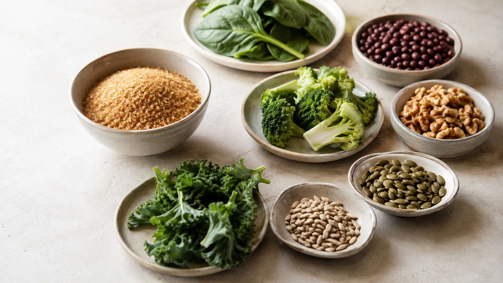
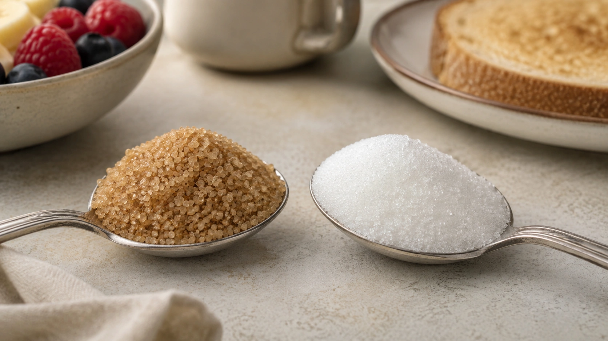

Brown sugar often carries a healthier image. Its darker color, molasses-like flavor, and association with less processing can make it seem nutritionally far superior to ordinary white sugar.

The difference is much smaller than that image suggests.

**Brown sugar can contain more minerals than white sugar, but it remains a concentrated source of sugar.** At the amounts normally used to sweeten foods or drinks, the extra micronutrients are too small to turn it into a substantially healthier choice. ([TBCA](https://www.tbca.net.br/base-dados/int_composicao_estatistica.php?n0REd3kv7e86D%2BViXWYUnQ%3D%3D=4wpXogwA4ZDyIQG%2B%2BEdEMQ%3D%3D 'TBCA Composição Química (Informação Estatística)'))

For health, the total amount of added or free sugar consumed generally matters far more than whether the crystals are white or brown. ([WHO](https://www.who.int/tools/elena/interventions/free-sugars-adults-ncds 'Reducing free sugars intake in adults to reduce the risk of noncommunicable diseases'))

## What is the difference between brown and white sugar?

The exact meaning of “brown sugar” varies among markets. For the nutrient comparison in this article, the Brazilian composition data refer to **açúcar mascavo**, a brown cane sugar commonly sold in Brazil.

The Brazilian Food Composition Table lists refined sugar as approximately **99 g of available carbohydrate per 100 g**. ([TBCA](https://www.tbca.net.br/base-dados/int_composicao_alimentos.php?n0REd3kv7e86D%2BViXWYUnQ%3D%3D=cwAya2y9UBmnF2fOnOsS%2Fg%3D%3D 'TBCA - Composição de Alimentos (Em Medidas Caseiras)'))

Brazilian brown cane sugar contains about **94.5 g of available carbohydrate per 100 g**, along with more moisture and minerals. ([TBCA](https://www.tbca.net.br/base-dados/int_composicao_estatistica.php?n0REd3kv7e86D%2BViXWYUnQ%3D%3D=4wpXogwA4ZDyIQG%2B%2BEdEMQ%3D%3D 'TBCA Composição Química (Informação Estatística)'))

That difference is real, but it does not make brown sugar a nutrient-dense food.

## Does brown sugar actually contain more minerals?

Yes.

According to the Brazilian Food Composition Table:

| Component              | Brown cane sugar | Refined white sugar |
| ---------------------- | ---------------: | ------------------: |
| Energy                 |         381 kcal |            397 kcal |
| Available carbohydrate |           94.5 g |              99.0 g |
| Calcium                |           126 mg |              3.5 mg |
| Iron                   |           8.3 mg |             0.11 mg |
| Magnesium              |          79.9 mg |             0.55 mg |
| Potassium              |           521 mg |             6.35 mg |
| Fiber                  |              0 g |                 0 g |
| Added sugar            |            100 g |               100 g |

The brown sugar clearly contains more minerals. Yet the same database also identifies both products as added sugar. ([TBCA](https://www.tbca.net.br/base-dados/int_composicao_estatistica.php?n0REd3kv7e86D%2BViXWYUnQ%3D%3D=4wpXogwA4ZDyIQG%2B%2BEdEMQ%3D%3D 'TBCA Composição Química (Informação Estatística)'))

### Why the 100-gram comparison can be misleading

Nutrient databases typically use 100 g to make foods easy to compare.

But eating 100 g of sugar to obtain calcium, magnesium, or iron would provide approximately 381 calories from brown sugar and almost no fiber. ([TBCA](https://www.tbca.net.br/base-dados/int_composicao_estatistica.php?n0REd3kv7e86D%2BViXWYUnQ%3D%3D=4wpXogwA4ZDyIQG%2B%2BEdEMQ%3D%3D 'TBCA Composição Química (Informação Estatística)'))

A level teaspoon of the Brazilian brown sugar in the TBCA database is approximately 2.5 g. At that amount, it provides roughly:

- **3.2 mg calcium**;
- **0.21 mg iron**;
- **2 mg magnesium**;
- **13 mg potassium**;
- about **9.5 calories**;
- about **2.4 g available carbohydrate**. ([TBCA](https://www.tbca.net.br/base-dados/int_composicao_alimentos.php?n0REd3kv7e86D%2BViXWYUnQ%3D%3D=4wpXogwA4ZDyIQG%2B%2BEdEMQ%3D%3D 'TBCA - Composição de Alimentos (Em Medidas Caseiras)'))

Those minerals are real, but they do not make a small serving of sugar a significant micronutrient source.

## Does brown sugar have fewer calories?

Slightly, according to the Brazilian composition data.

Brown cane sugar contains about **381 kcal per 100 g**, while refined sugar contains approximately **397 kcal**. ([TBCA](https://www.tbca.net.br/base-dados/int_composicao_estatistica.php?n0REd3kv7e86D%2BViXWYUnQ%3D%3D=4wpXogwA4ZDyIQG%2B%2BEdEMQ%3D%3D 'TBCA Composição Química (Informação Estatística)'))

That difference is relatively small and becomes even less meaningful at normal serving sizes.

Brown sugar is therefore not a low-calorie alternative to white sugar.

## Does brown sugar have a lower effect on blood glucose?

This is one of the most common reasons people make the switch, but the expected advantage is often overstated.

Brown and white sugar are both largely sucrose. A 2026 review from the European Food Information Council concludes that their effects on blood glucose are very similar. ([EUFIC](https://www.eufic.org/en/misinformation/article/is-brown-sugar-healthier-than-white-sugar 'Is brown sugar healthier than white sugar?'))

Harvard also notes that the body metabolizes caloric added sugars such as brown sugar, molasses, and honey in broadly similar ways and warns against assuming that a different name or appearance makes an added sugar nutritionally harmless. ([Harvard T.H. Chan](https://nutritionsource.hsph.harvard.edu/carbohydrates/added-sugar-in-the-diet/ 'Added Sugar'))

Replacing a spoonful of white sugar with an equivalent amount of brown sugar is therefore **not a reliable strategy for preventing blood glucose rises**.

## What about people with diabetes?

The darker color does not remove the available carbohydrate.

Brazilian composition data list 94.5 g of available carbohydrate per 100 g of brown cane sugar and 99 g per 100 g of refined sugar. ([TBCA](https://www.tbca.net.br/base-dados/int_composicao_estatistica.php?n0REd3kv7e86D%2BViXWYUnQ%3D%3D=4wpXogwA4ZDyIQG%2B%2BEdEMQ%3D%3D 'TBCA Composição Química (Informação Estatística)'))

Brown sugar should therefore not be treated as an unrestricted sweetener for people with diabetes.

Any use needs to fit within total carbohydrate intake and the person's individualized nutrition and medication plan.

## Does “less processed” automatically mean healthier?

No.

The degree of processing can matter in nutrition, but it is not a universal shortcut for determining whether a food is healthy.

Brown sugar retains more mineral-containing components, which explains its nutritional differences. It is still predominantly sugar. ([TBCA](https://www.tbca.net.br/base-dados/int_composicao_estatistica.php?n0REd3kv7e86D%2BViXWYUnQ%3D%3D=4wpXogwA4ZDyIQG%2B%2BEdEMQ%3D%3D 'TBCA Composição Química (Informação Estatística)'))

The same issue comes up with honey, syrups, molasses, and other sweeteners marketed as more natural.

WHO's definition of free sugars includes sugars added by the manufacturer, cook, or consumer, as well as sugars naturally present in honey and syrups. ([WHO](https://www.who.int/tools/elena/interventions/free-sugars-adults-ncds 'Reducing free sugars intake in adults to reduce the risk of noncommunicable diseases'))

“Natural” therefore does not mean “unlimited.”

## Does the body distinguish between white and brown sugar?

Their compositions are not perfectly identical, but the metabolic difference is much smaller than their appearances imply.

Harvard notes that the body does not make a health-relevant distinction between different caloric added sugars simply because one is called brown sugar, molasses, or honey. ([Harvard T.H. Chan](https://nutritionsource.hsph.harvard.edu/carbohydrates/added-sugar-in-the-diet/ 'Added Sugar'))

This does **not** mean all foods containing sugars are metabolically identical.

Whole fruit, for example, should not be equated with table sugar simply because both contain sugars. Water, fiber, cellular structure, volume, and other nutrients change the dietary context.

The relevant comparison here is between **concentrated caloric sweeteners**.

## How much free sugar does WHO recommend?

WHO recommends reducing free sugar intake throughout the life course.

For adults and children, free sugars should provide **less than 10% of total energy intake**, with a further reduction to **below 5%** suggested for additional benefits. ([WHO](https://www.who.int/tools/elena/interventions/free-sugars-adults-ncds 'Reducing free sugars intake in adults to reduce the risk of noncommunicable diseases'))

On a 2,000-calorie diet, 10% of energy corresponds to roughly **50 g of sugar**, while 5% corresponds to about **25 g**.

These are limits for total free sugar intake, not targets that need to be reached.

Switching from white to brown sugar does not remove those grams from the total.

## Can brown sugar contribute to tooth decay?

Yes.

WHO reports a clear relationship between free sugar consumption and dental caries. Oral bacteria metabolize sugars and produce acids that can progressively damage tooth structure. ([WHO](https://www.who.int/news-room/fact-sheets/detail/sugars-and-dental-caries 'Sugars and dental caries'))

Brown sugar does not receive a dental health exemption because it contains more minerals.

Total exposure to free sugars, frequency of consumption, oral hygiene, and adequate fluoride exposure remain important factors. ([WHO](https://www.who.int/news-room/fact-sheets/detail/sugars-and-dental-caries 'Sugars and dental caries'))

## Is brown sugar worth choosing?

It can be — for the right reason.

If you prefer its deeper flavor, aroma, texture, or culinary properties, brown sugar may be the better ingredient for a particular recipe.

It also genuinely contains more minerals than refined white sugar. ([TBCA](https://www.tbca.net.br/base-dados/int_composicao_estatistica.php?n0REd3kv7e86D%2BViXWYUnQ%3D%3D=4wpXogwA4ZDyIQG%2B%2BEdEMQ%3D%3D 'TBCA Composição Química (Informação Estatística)'))

What the evidence does not support is treating that difference as permission to consume substantially more sugar.

| Question                           | Brown sugar | White sugar |
| ---------------------------------- | ----------- | ----------- |
| High in sugar?                     | Yes         | Yes         |
| Counts as added sugar?             | Yes         | Yes         |
| Contains minerals?                 | More        | Very little |
| Contains fiber?                    | No          | No          |
| Low in calories?                   | No          | No          |
| Raises blood glucose?              | Yes         | Yes         |
| Should overall intake be limited?  | Yes         | Yes         |
| Can taste and culinary use differ? | Yes         | Yes         |

The practical differences are therefore greater in **flavor, color, texture, and cooking characteristics** than in health outcomes. ([TBCA](https://www.tbca.net.br/base-dados/int_composicao_estatistica.php?n0REd3kv7e86D%2BViXWYUnQ%3D%3D=4wpXogwA4ZDyIQG%2B%2BEdEMQ%3D%3D 'TBCA Composição Química (Informação Estatística)'))

## Is it better to switch sugars or simply use less?

For most people, **reducing total added sugar is a more meaningful nutritional change than replacing white sugar with brown sugar**.

If someone puts two teaspoons of sugar in coffee, switching those two teaspoons to brown sugar adds small amounts of minerals but leaves nearly all of the sugar exposure in place.

Gradually reducing the amount actually reduces free sugar intake.

Harvard notes that taste preferences can adapt to lower sweetness over time and recommends practical strategies for reducing added sugars. ([Harvard T.H. Chan](https://nutritionsource.hsph.harvard.edu/carbohydrates/added-sugar-in-the-diet/ 'Added Sugar'))

## What about other “natural” sugars?

Honey, molasses, coconut sugar, demerara sugar, and syrups are not nutritionally identical. Their flavors, compositions, and micronutrient levels can differ.

But endlessly replacing one caloric sweetener with another can distract from the more important issue: **total free sugar intake**.

WHO includes both added sugars and sugars naturally present in honey and syrups within its free sugar definition. ([WHO](https://www.who.int/tools/elena/interventions/free-sugars-adults-ncds 'Reducing free sugars intake in adults to reduce the risk of noncommunicable diseases'))

A natural origin is therefore not a reason for unlimited consumption.

If the plan was to replace sugar with a sweetener, this article continues the discussion:

[Are Sweeteners Bad for You? What We Know About Safety](/en/articles/are-sweeteners-bad-for-you-safety-health/)

## Conclusion

**Brown sugar has a small nutritional advantage over white sugar, but that does not make it substantially healthier.**

It contains more calcium, iron, magnesium, and potassium than refined sugar. That difference is real. ([TBCA](https://www.tbca.net.br/base-dados/int_composicao_estatistica.php?n0REd3kv7e86D%2BViXWYUnQ%3D%3D=4wpXogwA4ZDyIQG%2B%2BEdEMQ%3D%3D 'TBCA Composição Química (Informação Estatística)'))

The serving size changes the interpretation, however. At the amounts in which sugar should normally be used, the micronutrient contribution remains modest. Eating more brown sugar to obtain those nutrients would mainly increase sugar and calorie intake.

Both are added sugars, contain similar amounts of energy, and produce similar effects on blood glucose. ([EUFIC](https://www.eufic.org/en/misinformation/article/is-brown-sugar-healthier-than-white-sugar 'Is brown sugar healthier than white sugar?'))

If you prefer brown sugar, choose it for its flavor or culinary qualities. From a health perspective, however, **the more useful goal is not finding the perfect sugar — it is keeping total free sugar intake moderate.** ([WHO](https://www.who.int/tools/elena/interventions/free-sugars-adults-ncds 'Reducing free sugars intake in adults to reduce the risk of noncommunicable diseases'))

---
