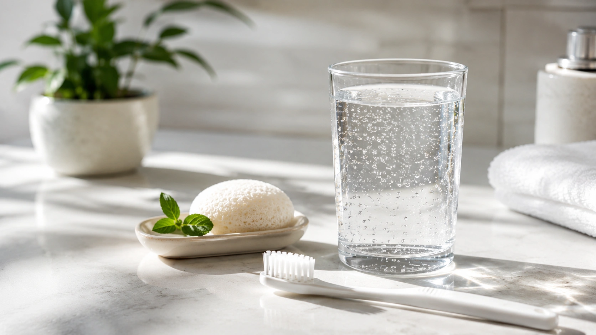
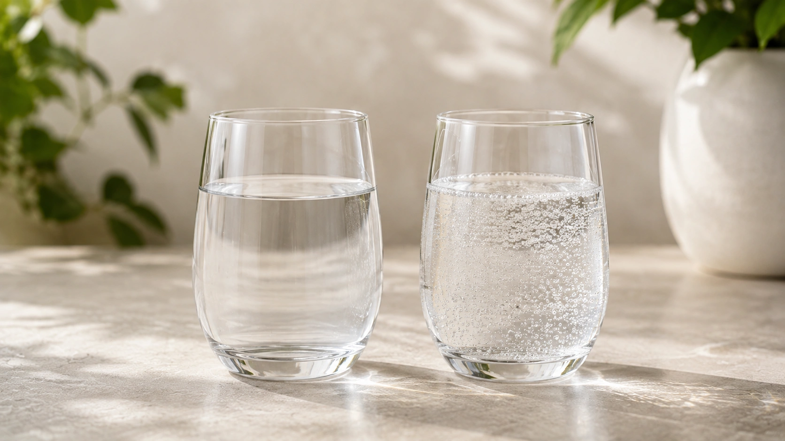

The bubbles, slight acidity and sharp mouthfeel of sparkling water make it feel very different from ordinary still water. That difference has also generated plenty of health claims: **does carbonation damage your teeth, cause reflux, bloat your stomach or weaken your bones?**

For most people, the evidence is reassuring. **Plain sparkling water can be part of a healthy diet and contributes to daily hydration.** Adding carbon dioxide does not turn water into soda. ([NHS](https://www.nhs.uk/live-well/eat-well/food-guidelines-and-food-labels/water-drinks-nutrition/ 'Water, drinks and hydration'))

However, not every fizzy beverage is simply carbonated water, and understanding that distinction is essential.

## What is sparkling water?

Sparkling water contains **dissolved carbon dioxide (CO₂)**. The gas may occur naturally at the source or be added during production.

When carbon dioxide dissolves in water, some carbonic acid forms, giving the beverage its characteristic mild acidity and fizzy sensation.

That is very different from a conventional soft drink, which may also contain sugars or sweeteners, additional acids, flavorings, caffeine and other ingredients.

Flavored and nutrient-added water beverages may also contain ingredients beyond water and carbonation, making the label important when evaluating a specific product. ([FDA](https://www.fda.gov/food/buy-store-serve-safe-food/fda-regulates-safety-bottled-water-beverages-including-flavored-water-and-nutrient-added-water 'FDA Regulates the Safety of Bottled Water Beverages Including Flavored Water and Nutrient-Added Water Beverages'))

## Does sparkling water hydrate you?

**Yes.**

Carbonation does not prevent water from contributing to hydration.

The NHS lists sparkling water as an option for people who do not enjoy the taste of still water, alongside other fluids that contribute to daily intake. ([NHS](https://www.nhs.uk/live-well/eat-well/food-guidelines-and-food-labels/water-drinks-nutrition/ 'Water, drinks and hydration'))

For everyday hydration, choosing still water, sparkling water or a mixture of the two can therefore come down largely to personal preference.

Situations involving substantial fluid and electrolyte losses are different and may require specific rehydration strategies.

## Does sparkling water contain calories?

Plain carbonated water does not contain calories simply because carbon dioxide has been added.

Carbonation creates bubbles; it does not add sugar, fat or meaningful food energy.

This distinction makes plain sparkling water very different from sugar-sweetened sodas.

Still, checking the product matters. Flavored or nutrient-added beverages may contain sugars, carbohydrates, sodium or other ingredients, and regulatory guidance requires these additions to be reflected in ingredient and nutrition information. ([FDA](https://www.fda.gov/food/buy-store-serve-safe-food/fda-regulates-safety-bottled-water-beverages-including-flavored-water-and-nutrient-added-water 'FDA Regulates the Safety of Bottled Water Beverages Including Flavored Water and Nutrient-Added Water Beverages'))

## Is sparkling water bad for your teeth?

This is one concern where there is some scientific basis — but also considerable exaggeration.

Carbonated water is more acidic than ordinary still water because dissolved carbon dioxide forms carbonic acid.

Acid exposure can contribute to **dental erosion**, which is the chemical loss of mineral from the tooth surface.

Plain sparkling water, however, should not automatically be grouped with soda.

### Sparkling water is not the same as soda

A laboratory study tested still and sparkling mineral waters alongside soft drinks using extracted human teeth and hydroxyapatite.

Sparkling mineral waters caused slightly more dissolution than still waters, but the levels remained very low and were roughly **one hundred times lower than those caused by the comparator soft drinks**. ([PubMed](https://pubmed.ncbi.nlm.nih.gov/11556958/ 'Investigation of mineral waters and soft drinks in relation to dental erosion'))

This is an _in vitro_ result and does not perfectly simulate real-world drinking, but it provides useful perspective.

### Flavored sparkling waters can be different

Additional acids matter.

Research on flavored sparkling waters has found much greater acidity and erosive potential in certain products, particularly those containing acidic flavoring ingredients. ([PubMed](https://pubmed.ncbi.nlm.nih.gov/17263857/ 'The erosive potential of flavoured sparkling water drinks'))

The American Dental Association also notes that prolonged sipping exposes teeth to acidity repeatedly and may increase erosion risk. ([ADA News](https://adanews.ada.org/huddles/sparkling-water-habits-to-protect-teeth/ 'Sparkling water habits to protect teeth'))

For people concerned about tooth erosion, practical measures include choosing unflavored sparkling water, avoiding continuous sipping for hours, drinking it with meals and maintaining good fluoride-based oral hygiene. ([ADA News](https://adanews.ada.org/huddles/sparkling-water-habits-to-protect-teeth/ 'Sparkling water habits to protect teeth'))

## Does sparkling water cause acid reflux?

The available evidence does not support a simple yes.

A systematic review examined carbonated beverages in relation to esophageal pH, motility, lower esophageal sphincter function, GERD symptoms and complications.

Carbonated drinks produced some short-lived physiological changes, but the review found **no direct evidence that they consistently cause esophageal damage or promote or exacerbate GERD**. ([PubMed](https://pubmed.ncbi.nlm.nih.gov/20055784/ 'Systematic review: the effects of carbonated beverages on gastro-oesophageal reflux disease'))

Individual experience can still differ.

Someone who consistently notices heartburn or regurgitation after sparkling water may find still water more comfortable.

## Can sparkling water cause bloating?

It can in some people.

Carbon dioxide enters the digestive tract when a carbonated beverage is swallowed. This can temporarily increase stomach distension and contribute to belching, pressure or fullness.

Reviews of carbonation and gastrointestinal function describe these mechanical effects but also emphasize that responses vary and many commonly repeated digestive claims remain inconsistent. ([PubMed](https://pubmed.ncbi.nlm.nih.gov/19502016/ 'Carbonated beverages and gastrointestinal system: between myth and reality'))

People who are sensitive can experiment with smaller servings, slower drinking or alternating sparkling and still water.

## Does sparkling water cause gastritis?

There is not good evidence that carbonation itself is an established cause of gastritis.

Temporary bloating, belching or burning after a beverage should not automatically be interpreted as inflammation of the stomach lining.

Research into carbonated beverages and gastrointestinal function has found a range of physiological effects but does not support treating plain sparkling water as a universal cause of stomach disease. ([PubMed](https://pubmed.ncbi.nlm.nih.gov/19502016/ 'Carbonated beverages and gastrointestinal system: between myth and reality'))

People with an existing gastrointestinal condition should judge intake according to their individual tolerance and medical guidance.

## Does sparkling water weaken bones?

The idea that carbonation “pulls calcium from your bones” is not supported by strong evidence.

In the Framingham Osteoporosis Study, cola consumption was associated with lower bone mineral density at several sites in women, whereas **non-cola carbonated beverages were not associated in the same way**. ([PubMed](https://pubmed.ncbi.nlm.nih.gov/17023723/ 'Colas, but not other carbonated beverages, are associated with low bone mineral density in older women: The Framingham Osteoporosis Study'))

The study was observational, so it cannot prove that cola itself caused lower bone density.

More importantly, the result does not support the idea that the carbon dioxide in plain sparkling water damages bones.

## Is sparkling water bad for your kidneys?

There is not sufficient evidence to identify **carbonation itself** as a cause of kidney damage in otherwise healthy people.

A separate issue is mineral content.

Research comparing commercial sparkling waters has shown substantial differences in sodium, bicarbonate, calcium and other minerals between products. ([PubMed](https://pubmed.ncbi.nlm.nih.gov/33976919/ 'Variations in the mineral content of bottled ’carbonated or sparkling’ water across Europe'))

People with kidney disease, a history of kidney stones or specific electrolyte restrictions may receive individualized advice regarding fluid and mineral intake.

## Is sparkling water high in sodium?

**Not automatically.**

Sodium content depends on the water source and mineral composition rather than simply on whether bubbles are present.

Analyses of bottled sparkling mineral waters have found considerable variation in sodium and other minerals. ([PubMed](https://pubmed.ncbi.nlm.nih.gov/33976919/ 'Variations in the mineral content of bottled ’carbonated or sparkling’ water across Europe'))

Anyone who has been specifically advised to restrict sodium should therefore check the label of their usual brand instead of avoiding every type of sparkling water.

## Does sparkling water raise blood pressure?

There is no good basis for saying that **carbonation itself** chronically raises blood pressure.

For people under strict sodium restriction, however, the mineral profile of a particular bottled water may be relevant because sodium concentrations vary considerably between products. ([PubMed](https://pubmed.ncbi.nlm.nih.gov/33976919/ 'Variations in the mineral content of bottled ’carbonated or sparkling’ water across Europe'))

That is a reason to read the label, not a reason to assume all sparkling water is high in sodium.

## Does sparkling water make your stomach bigger or cause weight gain?

Carbonation can temporarily make the abdomen feel fuller because of gas in the digestive tract. That is **bloating, not body-fat gain**. ([PubMed](https://pubmed.ncbi.nlm.nih.gov/19502016/ 'Carbonated beverages and gastrointestinal system: between myth and reality'))

Plain sparkling water also does not provide calories simply because it is carbonated.

Sweetened fizzy drinks are different. Products with sugars or other caloric ingredients should be evaluated according to their actual ingredient list and nutrition label. ([FDA](https://www.fda.gov/food/buy-store-serve-safe-food/fda-regulates-safety-bottled-water-beverages-including-flavored-water-and-nutrient-added-water 'FDA Regulates the Safety of Bottled Water Beverages Including Flavored Water and Nutrient-Added Water Beverages'))

## Sparkling or still water: which is healthier?

For most people, neither needs to be declared the winner.

| Feature                    | Still water       | Plain sparkling water                         |
| -------------------------- | ----------------- | --------------------------------------------- |
| Contributes to hydration   | Yes               | Yes                                           |
| Sugar added by carbonation | No                | No                                            |
| Calories from carbonation  | No                | No                                            |
| Acidity                    | Lower             | Higher                                        |
| May cause bloating         | Less likely       | Possible                                      |
| Dental concern             | Very low          | Low for plain versions, depending on exposure |
| May contain minerals       | Yes               | Yes                                           |
| Sodium level               | Depends on source | Depends on source                             |

Still water may be preferable for people who experience gastrointestinal discomfort from bubbles or who need to minimize acidic exposure to their teeth.

Sparkling water can be useful for people who simply enjoy it more and therefore drink more fluid. The NHS specifically suggests sparkling water as an alternative when plain water is unappealing. ([NHS](https://www.nhs.uk/live-well/eat-well/food-guidelines-and-food-labels/water-drinks-nutrition/ 'Water, drinks and hydration'))

## How to choose sparkling water

If you want straightforward carbonated water, check the label and consider:

1. a short ingredient list, primarily water and carbonation;
2. no added sugar;
3. fewer additional acids or acidic flavorings if dental erosion is a concern;
4. a sodium level compatible with your individual needs;
5. an appropriately regulated and safely stored product.

Flavored and fortified water beverages can contain additional ingredients, so the product name on the front of the bottle does not tell the entire nutritional story. ([FDA](https://www.fda.gov/food/buy-store-serve-safe-food/fda-regulates-safety-bottled-water-beverages-including-flavored-water-and-nutrient-added-water 'FDA Regulates the Safety of Bottled Water Beverages Including Flavored Water and Nutrient-Added Water Beverages'))

## Can you drink sparkling water every day?

For a healthy person who tolerates it well, **plain sparkling water can be part of everyday fluid intake**. ([NHS](https://www.nhs.uk/live-well/eat-well/food-guidelines-and-food-labels/water-drinks-nutrition/ 'Water, drinks and hydration'))

If it is unflavored, causes no digestive discomfort and is consumed alongside appropriate oral care, there is no evidence-based reason to fear it simply because it contains bubbles.

People who spend the entire day sipping highly acidic flavored versions, experience significant bloating or repeatedly notice worsening reflux may benefit from changing the type, amount or frequency they drink. ([ADA News](https://adanews.ada.org/huddles/sparkling-water-habits-to-protect-teeth/ 'Sparkling water habits to protect teeth'))

Another drink surrounded by promises worth checking against the same standard:

[Does Lemon Water Have Any Special Health Benefits?](/en/articles/lemon-water-health-benefits-myths/)

## Conclusion

**Plain sparkling water is not harmful for most people when consumed as part of normal hydration.**

It contributes to fluid intake, carbonation itself does not add calories, and good evidence does not support the claim that the bubbles weaken bones. ([NHS](https://www.nhs.uk/live-well/eat-well/food-guidelines-and-food-labels/water-drinks-nutrition/ 'Water, drinks and hydration'))

The relevant caveats are more specific: acidity can matter for dental health, particularly in flavored products; carbonation may cause temporary bloating or belching; individual reflux tolerance varies; and mineral content, including sodium, differs between brands. ([ADA News](https://adanews.ada.org/huddles/sparkling-water-habits-to-protect-teeth/ 'Sparkling water habits to protect teeth'))

In other words, **the bubbles themselves are usually not the problem**. For most people, plain sparkling water is a perfectly reasonable way to stay hydrated.

---
