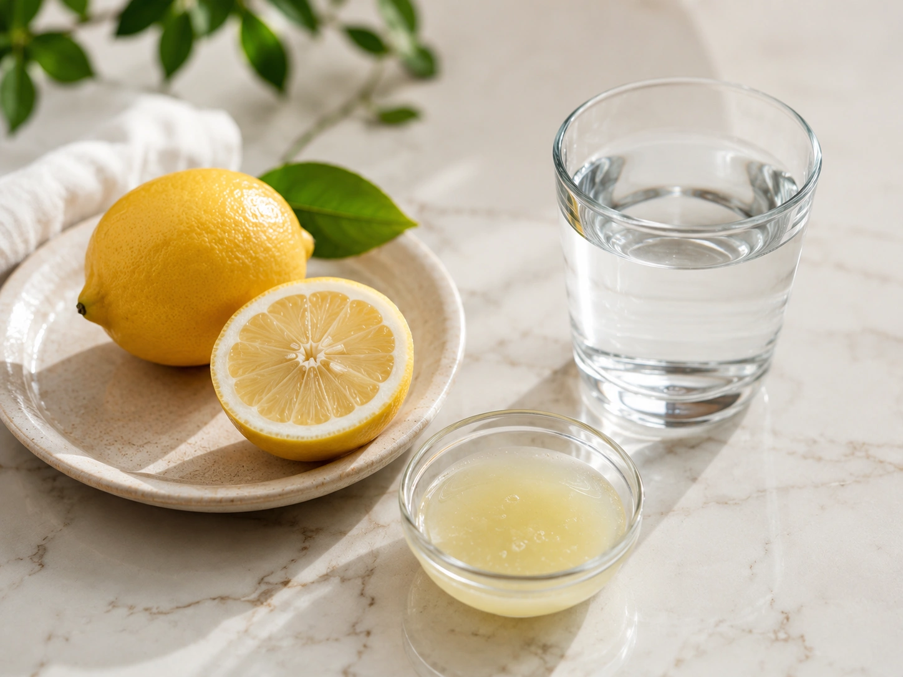
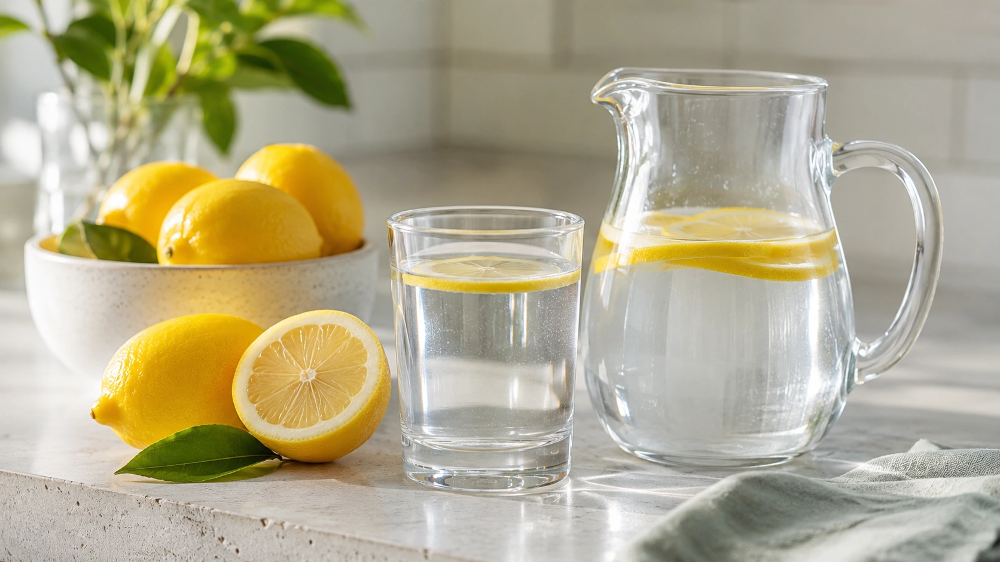
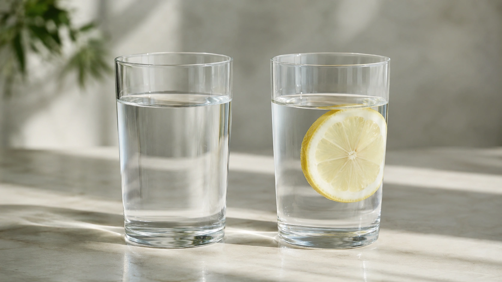

A glass of water, some freshly squeezed lemon and an impressive list of promises: detoxification, faster metabolism, fat burning, better digestion, liver cleansing and an “alkaline body.”

Few simple drinks have accumulated as many health claims as lemon water.

The evidence is considerably less dramatic.

**Lemon water hydrates, contributes a small amount of vitamin C and provides citrate.** In selected people, citrate from citrus beverages may be relevant to kidney-stone prevention. What research does not establish is that adding lemon turns water into a special detox drink, fat-burning therapy or meaningful way to alter blood pH. ([NIH ODS](https://ods.od.nih.gov/factsheets/VitaminC-HealthProfessional/ 'Vitamin C — Fact Sheet for Health Professionals'))

## Its main benefit still comes from the water

Most of a glass of lemon water is simply water.

That matters because many benefits attributed to lemon water actually overlap with benefits studied for increased water intake.

A 2024 systematic review of randomized trials found a limited number of clinical studies examining increased water intake. Some reported potentially favorable results for outcomes such as weight management and kidney-stone prevention, although the evidence base remains limited for many health claims. ([PubMed](https://pubmed.ncbi.nlm.nih.gov/39585691/ 'Outcomes in Randomized Clinical Trials Testing Changes in Daily Water Intake'))

Those findings do not show that lemon is necessary.

If lemon flavor makes plain water more enjoyable and someone consequently prefers it, that is a perfectly reasonable practical advantage. It does not require a unique physiological effect.

## How much vitamin C does lemon water provide?

Lemon is a genuine source of vitamin C.

Food-composition data indicate that **raw lemon juice contains about 38.7 mg of vitamin C per 100 g**. ([USDA FoodData Central](https://fdc.nal.usda.gov/ 'FoodData Central — Lemon juice, raw (FDC 167747)'))

NIH recommendations for adults are approximately:

| Group       | Recommended vitamin C per day |
| ----------- | ----------------------------: |
| Adult men   |                         90 mg |
| Adult women |                         75 mg |
| Pregnancy   |                         85 mg |
| Lactation   |                        120 mg |

People who smoke require an additional 35 mg per day according to these reference values. ([NIH ODS](https://ods.od.nih.gov/factsheets/VitaminC-HealthProfessional/ 'Vitamin C — Fact Sheet for Health Professionals'))

This puts a squeeze of lemon into perspective.

A small amount of juice added to water supplies only a fraction of the vitamin C present in 100 g of juice. **Lemon water contributes vitamin C, but a typical glass is not an unusually concentrated source of the nutrient.**

A varied intake of fruits and vegetables remains a much broader way to obtain vitamin C. ([NIH ODS](https://ods.od.nih.gov/factsheets/VitaminC-HealthProfessional/ 'Vitamin C — Fact Sheet for Health Professionals'))

## Does lemon water detox your body?

This is one of its most popular claims and one of the least convincing scientifically.

“Detox” is often used without a clear physiological definition. Depending on the source, it may refer to removing toxins, cleaning the liver, cleansing the intestines or purifying the bloodstream.

There is no evidence that lemon water performs these processes in a special way.

The U.S. National Center for Complementary and Integrative Health notes that research on commercial detox and cleanse programs is limited and does not provide firm support for many of the claims surrounding them. ([NCCIH](https://www.nccih.nih.gov/health/detoxes-and-cleanses-what-you-need-to-know '“Detoxes” and “Cleanses”: What You Need To Know'))

## Does it “cleanse” the liver?

There is also no evidence that lemon water acts as a liver cleanse.

The liver has its own complex enzyme systems for processing substances, while the kidneys and other organs participate in eliminating metabolic products.

Healthy dietary and lifestyle patterns matter for long-term organ health. A single beverage should not be presented as a substitute for those patterns or as treatment for liver disease.

## Does lemon water make the body alkaline?

This claim usually confuses urine chemistry with blood chemistry.

Although dietary components can influence urinary acid-base characteristics, the **blood** is kept within a very narrow physiological pH range.

Normal blood pH is approximately 7.35 to 7.45. Buffer systems, the lungs and the kidneys work continuously to maintain this balance. ([PMC](https://pmc.ncbi.nlm.nih.gov/articles/PMC4670772/ 'Acid-Base Homeostasis'))

It is much easier for diet to change urine pH than blood pH.

Changing urine chemistry does not mean lemon water has “deacidified” the bloodstream.

## Does lemon water help with weight loss?

There is no convincing evidence that adding lemon to water creates a special fat-burning effect.

There are studies on **water intake** and weight management.

For example, a randomized trial in middle-aged and older adults with overweight or obesity found greater weight loss when premeal water was added to an energy-restricted diet compared with the diet alone. Other studies have explored similar approaches. ([PubMed](https://pubmed.ncbi.nlm.nih.gov/19661958/ 'Water consumption increases weight loss during a ... - PubMed'))

That evidence concerns water rather than lemon.

If someone replaces a sugary soft drink with unsweetened lemon water, total calorie intake may fall. In that scenario, the benefit comes mainly from **replacing a calorie-containing beverage with a very low-calorie drink**, not because lemon directly burns body fat.

## What about drinking it first thing in the morning?

There is no established metabolic advantage to consuming lemon water on an empty stomach.

It can be a convenient way to drink some fluid after waking.

But the fasting state has not been shown to activate a unique property in lemon that meaningfully speeds metabolism, detoxifies the body or increases fat burning throughout the day.

## Does lemon water boost metabolism?

There is no strong clinical evidence that a normal serving of lemon in water meaningfully raises resting metabolic rate.

This claim often merges several unrelated concepts: hydration, vitamin C, digestion and weight loss are treated as if they all mean “faster metabolism.”

They do not.

A drink can be perfectly healthy without increasing metabolic rate.

## Citrate is one of lemon's more interesting properties

This is an area where lemon does have a potentially relevant characteristic beyond flavor.

**Lemon and lime juices are rich sources of citric acid.** ([PMC](https://pmc.ncbi.nlm.nih.gov/articles/PMC2637791/))

Citrate in urine can bind calcium and interfere with processes involved in the formation of certain crystals.

For that reason, NIDDK notes that citrus beverages such as lemonade and orange juice may help with kidney-stone prevention. Adequate fluid consumption, however, remains one of the most important measures for preventing most types of stones. ([NIDDK](https://www.niddk.nih.gov/health-information/urologic-diseases/kidney-stones/treatment 'Treatment for Kidney Stones'))

## Can lemon water actually prevent kidney stones?

A reasonable answer is: **it may contribute in selected people, but it is not a universal preventive treatment**.

A review of citrus beverages found small prospective studies in which lemon, orange and grapefruit juices increased urinary citrate. However, the evidence is not strong enough to claim that any glass of lemon water prevents stones. ([PubMed](https://pubmed.ncbi.nlm.nih.gov/34836376/ 'Role of Citrus Fruit Juices in Prevention of Kidney Stone Disease: A Narrative Review'))

Earlier studies of lemonade therapy also reported increased urinary citrate in some stone-forming patients, although prescription potassium citrate is a different and more controlled medical intervention. ([PubMed](https://pubmed.ncbi.nlm.nih.gov/17382731/))

Kidney stones also have different compositions and causes.

People with recurrent stones should ideally know the type of stone they form and follow individualized recommendations.

## Are a few drops of lemon enough?

We do not know.

Kidney-stone studies often use specific amounts of lemon juice or citrus beverages.

Those interventions cannot automatically be equated with adding one slice or a few drops of lemon to a large glass of water.

This is an important example of how a real physiological effect can become exaggerated when translated into wellness advice.

## Does lemon water improve digestion?

There is no convincing evidence that lemon water universally improves digestion.

Some people simply enjoy an acidic drink with or before food.

That subjective experience should not be confused with evidence that lemon “activates digestive enzymes,” cleans the gut or fixes digestive problems.

For some people, acidic citrus drinks may actually make symptoms worse.

## What if you have acid reflux?

Individual tolerance matters.

NIDDK lists acidic foods, including citrus fruits, among foods and drinks commonly associated with worsening gastroesophageal reflux symptoms in some people. ([NIDDK](https://www.niddk.nih.gov/health-information/digestive-diseases/acid-reflux-ger-gerd-adults/eating-diet-nutrition 'Eating, Diet, & Nutrition for GER & GERD'))

Not everyone with reflux needs to avoid lemon.

However, if lemon water consistently triggers heartburn, regurgitation or discomfort, there is no unique health benefit that makes continuing it necessary.

## What about dental enamel?

This is one of the more practical downsides of drinking lemon water frequently.

Citric acid makes the beverage acidic.

The American Dental Association notes that frequent exposure to low-pH drinks, including acidic fruit beverages, can contribute to **erosive tooth wear** — gradual chemical loss of mineralized dental tissue. ([ADA](https://www.ada.org/resources/ada-library/oral-health-topics/dental-erosion 'Dental Erosion'))

Risk depends on factors such as exposure frequency, duration, saliva and the overall diet.

### How can you reduce acid exposure?

If you enjoy lemon water:

- avoid sipping it continuously for many hours;
- consume it within a more defined period;
- avoid intentionally holding it in your mouth;
- plain water afterward can reduce lingering acidic exposure;
- see a dentist if you already have tooth sensitivity or signs of erosion.

The point is not to make lemon seem dangerous. It is simply to recognize that a “healthy” drink can still be acidic.

## Is warm lemon water better?

There is no convincing evidence that warm lemon water has unique health effects compared with cold or room-temperature lemon water.

Temperature is mostly a matter of comfort and preference.

If someone enjoys a warm drink in the morning, that is a valid routine. It does not mean the warmth activates detoxification or causes a meaningful metabolic boost.

## Could lemon juice affect the glucose response to a meal?

A small experimental study found that lemon juice consumed with a bread meal reduced the post-meal glycemic response compared with water. The researchers suggested that the acidity of the meal might slow aspects of starch digestion. ([PubMed](https://pubmed.ncbi.nlm.nih.gov/32201919/))

The finding is interesting, but it should not be turned into a diabetes treatment claim.

It involved a specific experimental meal and does not demonstrate that daily lemon water improves long-term glucose control.

## Do you need lemon water every day?

No.

There is no physiological requirement to drink lemon water daily.

Vitamin C can be obtained from many fruits and vegetables, and plain water is fully capable of meeting hydration needs.

People who enjoy lemon water can continue to drink it if it is well tolerated. People who prefer plain water are not missing an essential health ritual.

## Lemon water versus plain water

| Claim                                                   | What the evidence suggests                    |
| ------------------------------------------------------- | --------------------------------------------- |
| Hydrates                                                | Yes, primarily because it contains water      |
| Provides vitamin C                                      | Yes, proportional to the amount of lemon used |
| Detoxifies the body                                     | Not demonstrated                              |
| Alkalizes the blood                                     | No                                            |
| Burns fat                                               | Not demonstrated                              |
| Boosts metabolism                                       | Not meaningfully demonstrated                 |
| May provide urinary citrate                             | Yes                                           |
| Cures kidney stones                                     | No                                            |
| Instantly boosts immunity                               | No                                            |
| Can contribute to dental erosion with frequent exposure | Yes                                           |
| Works better on an empty stomach                        | Not demonstrated                              |
| Works better when warm                                  | Not demonstrated                              |

## Is lemon water worth drinking?

It can be, as long as expectations remain realistic.

If lemon makes water more enjoyable, it can be an easy, low-calorie way to vary fluid intake.

It also contributes some vitamin C and citric acid.

For selected people at risk of specific kidney stones, citrus beverages may even play a role in a professionally guided prevention strategy. ([NIDDK](https://www.niddk.nih.gov/health-information/urologic-diseases/kidney-stones/treatment 'Treatment for Kidney Stones'))

Problems begin when a simple beverage is promoted as a treatment for conditions that require far more than lemon.

If vitamin C is the goal, it helps to see what other fruits deliver per serving:

[Vitamin C-Rich Fruits: 8 Options and How Much They Provide](/en/articles/vitamin-c-rich-fruits/)

## Conclusion

**Lemon water has a few real benefits, but they are much more modest than popular claims suggest.**

It hydrates because it contains water. Lemon contributes some vitamin C and citrate, and citrate may be useful in strategies for selected types of kidney stones. ([NIH ODS](https://ods.od.nih.gov/factsheets/VitaminC-HealthProfessional/ 'Vitamin C — Fact Sheet for Health Professionals'))

There is no good evidence, however, that lemon water detoxifies the body, cleanses the liver, meaningfully alkalizes the blood, boosts metabolism or burns body fat.

There is also no scientific reason that it must be consumed warm or on an empty stomach.

If you enjoy it, drink it.

If you prefer plain water, **you are not missing a hidden health benefit**.

And if you sip lemon water throughout the day, its acidity is worth considering because frequent acid exposure can contribute to dental erosion. ([ADA](https://www.ada.org/resources/ada-library/oral-health-topics/dental-erosion 'Dental Erosion'))

---
