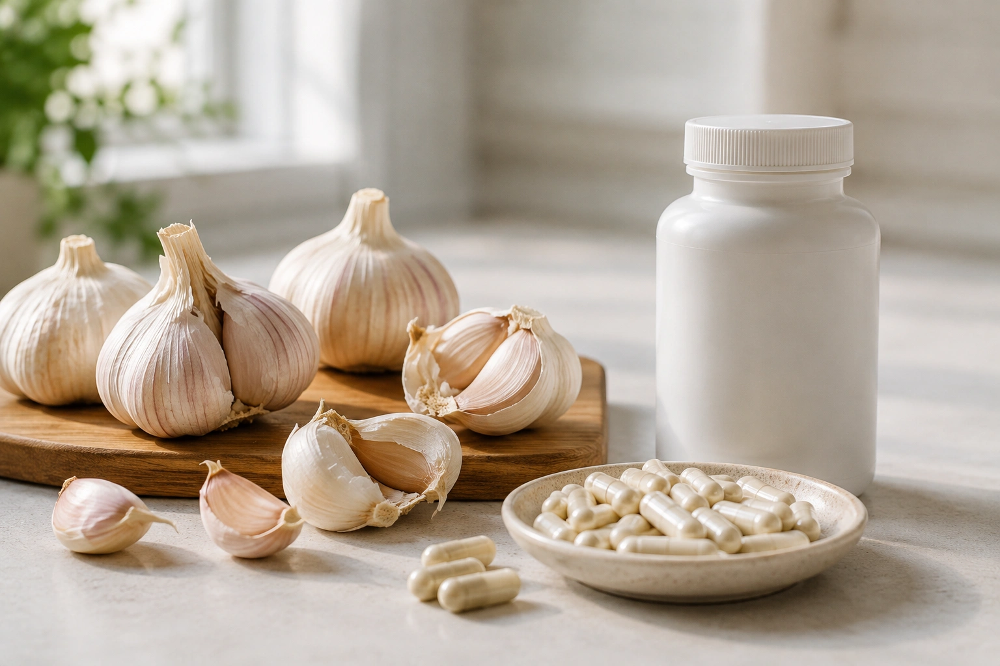
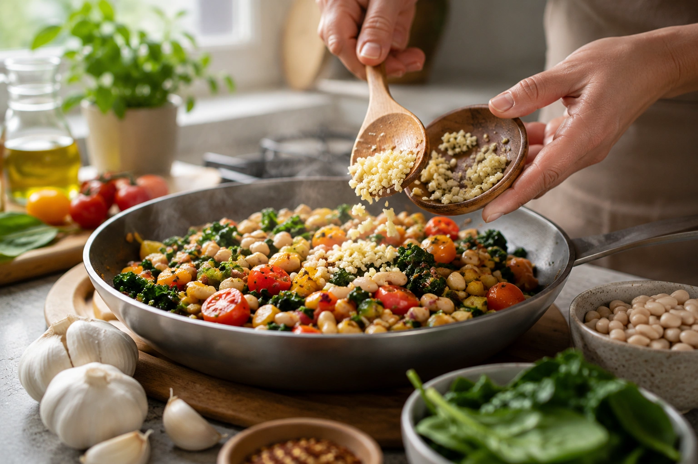

Garlic has long been promoted as a heart-healthy food, and the idea is not entirely unfounded. Randomized trials suggest that garlic interventions can produce small improvements in blood pressure, LDL cholesterol, and several other cardiovascular risk markers. ([PubMed](https://pubmed.ncbi.nlm.nih.gov/40580481/ 'Effects of Garlic Supplementation on Cardiovascular Risk Factors in Adults: A Comprehensive Updated Systematic Review and Meta-Analysis of Randomized Controlled Trials'))

What the evidence does **not** show nearly as clearly is that eating garlic itself prevents heart attacks, strokes, or cardiovascular death. Improving a risk marker and demonstrating fewer cardiovascular events are two different scientific claims. ([Cochrane](https://www.cochrane.org/evidence/CD007653_garlic-hypertension 'Garlic for Hypertension'))

The most accurate conclusion is therefore more nuanced: garlic can be a useful part of a healthy diet, and certain garlic preparations have demonstrated modest cardiometabolic effects, but it should not be treated as a natural substitute for cardiovascular treatment.

## What do the latest studies show?

A comprehensive meta-analysis published in _Nutrition Reviews_ in 2026 pooled **108 randomized controlled trials involving 7,137 adults**. Researchers examined the effects of garlic interventions on several cardiovascular risk factors. ([PubMed](https://pubmed.ncbi.nlm.nih.gov/40580481/ 'Effects of Garlic Supplementation on Cardiovascular Risk Factors in Adults: A Comprehensive Updated Systematic Review and Meta-Analysis of Randomized Controlled Trials'))

The pooled results included:

| Marker                   | Average change |
| ------------------------ | -------------: |
| Systolic blood pressure  |     -3.71 mmHg |
| Diastolic blood pressure |     -1.97 mmHg |
| Total cholesterol        |   -10.21 mg/dL |
| LDL cholesterol          |    -5.90 mg/dL |
| Triglycerides            |    -5.82 mg/dL |
| HDL cholesterol          |    +2.18 mg/dL |

These numbers are averages across many studies and should not be interpreted as the effect any individual will experience after adding garlic to their meals. Effects varied according to dose, intervention type, treatment duration, health status, and baseline cardiovascular risk. ([PubMed](https://pubmed.ncbi.nlm.nih.gov/40580481/ 'Effects of Garlic Supplementation on Cardiovascular Risk Factors in Adults: A Comprehensive Updated Systematic Review and Meta-Analysis of Randomized Controlled Trials'))

The authors found that benefits tended to be more apparent among adults who started with unfavorable risk factors. They also emphasized the need for larger, longer, and methodologically stronger trials. ([PubMed](https://pubmed.ncbi.nlm.nih.gov/40580481/ 'Effects of Garlic Supplementation on Cardiovascular Risk Factors in Adults: A Comprehensive Updated Systematic Review and Meta-Analysis of Randomized Controlled Trials'))

## Can garlic lower blood pressure?

The evidence suggests a **small blood-pressure-lowering effect**, particularly in people whose blood pressure is already elevated. ([NCCIH](https://www.nccih.nih.gov/health/garlic 'Garlic: Usefulness and Safety'))

The 2026 meta-analysis reported an average reduction of about 3.7 mmHg in systolic blood pressure and 2.0 mmHg in diastolic pressure. ([PubMed](https://pubmed.ncbi.nlm.nih.gov/40580481/ 'Effects of Garlic Supplementation on Cardiovascular Risk Factors in Adults: A Comprehensive Updated Systematic Review and Meta-Analysis of Randomized Controlled Trials'))

A 2025 systematic review focusing specifically on aged garlic included 19 trials and found a **2.49 mmHg reduction in systolic blood pressure**. Its overall analysis did not find a statistically significant effect on diastolic pressure. ([PubMed](https://pubmed.ncbi.nlm.nih.gov/40628369/ 'The Effect of Aged Garlic Supplementation on Blood Pressure and Lipid Profile: A Dose-Response Grade-Assessed Systematic Review and Meta-Analysis of Randomized Controlled Trials'))

Taken together, these findings suggest a real but generally modest effect. The NCCIH likewise characterizes the evidence for blood-pressure reduction in people with hypertension as limited. ([NCCIH](https://www.nccih.nih.gov/health/garlic 'Garlic: Usefulness and Safety'))

## What about cholesterol?

There is evidence for a modest effect here as well.

The 2026 review found average reductions of approximately **10.2 mg/dL in total cholesterol and 5.9 mg/dL in LDL cholesterol**. ([PubMed](https://pubmed.ncbi.nlm.nih.gov/40580481/ 'Effects of Garlic Supplementation on Cardiovascular Risk Factors in Adults: A Comprehensive Updated Systematic Review and Meta-Analysis of Randomized Controlled Trials'))

In the 2025 aged-garlic analysis, LDL fell by an average of **4.41 mg/dL**, while the pooled reduction in total cholesterol narrowly missed statistical significance. ([PubMed](https://pubmed.ncbi.nlm.nih.gov/40628369/ 'The Effect of Aged Garlic Supplementation on Blood Pressure and Lipid Profile: A Dose-Response Grade-Assessed Systematic Review and Meta-Analysis of Randomized Controlled Trials'))

The NCCIH reaches a similar conclusion: garlic supplements may lower total and LDL cholesterol slightly in people with high cholesterol, but their effect is modest compared with cholesterol-lowering medications. ([NCCIH](https://www.nccih.nih.gov/health/providers/digest/high-cholesterol-and-natural-products-science 'High Cholesterol and Natural Products: What the Science Says'))

So while saying that garlic "lowers cholesterol" contains an element of truth, it can be misleading without explaining the size of the effect.

## Does garlic prevent heart attacks or strokes?

This is where claims often go beyond the evidence.

**There is currently insufficient evidence to say that garlic itself prevents heart attacks, strokes, or cardiovascular death.** ([Cochrane](https://www.cochrane.org/evidence/CD007653_garlic-hypertension 'Garlic for Hypertension'))

High blood pressure and LDL cholesterol are important cardiovascular risk factors, so improving them may be favorable. However, establishing cardiovascular prevention generally requires longer studies that track actual clinical outcomes rather than only changes in laboratory values or blood pressure.

A Cochrane review examining garlic in people with hypertension concluded that the available randomized evidence was insufficient to determine whether garlic reduced cardiovascular morbidity or mortality. ([Cochrane](https://www.cochrane.org/evidence/CD007653_garlic-hypertension 'Garlic for Hypertension'))

## Is fresh garlic equivalent to a garlic supplement?

No.

This is an important limitation when interpreting research headlines. Cardiovascular trials have used a variety of interventions, including garlic extracts, powders, aged garlic preparations, and other standardized products. ([PubMed](https://pubmed.ncbi.nlm.nih.gov/40580481/ 'Effects of Garlic Supplementation on Cardiovascular Risk Factors in Adults: A Comprehensive Updated Systematic Review and Meta-Analysis of Randomized Controlled Trials'))

A result obtained with a concentrated preparation cannot automatically be translated into a specific number of fresh garlic cloves.

There is also no universal conversion between milligrams of a garlic supplement and cloves of fresh garlic because preparations can differ substantially in composition and concentration. ([PubMed](https://pubmed.ncbi.nlm.nih.gov/40580481/ 'Effects of Garlic Supplementation on Cardiovascular Risk Factors in Adults: A Comprehensive Updated Systematic Review and Meta-Analysis of Randomized Controlled Trials'))

## Is raw garlic necessary?

Current clinical evidence does not establish that garlic must be eaten raw to benefit cardiovascular health.

Although food preparation can affect garlic compounds, the cardiovascular trials available do not allow us to conclude that choosing raw garlic instead of cooked garlic will produce greater protection against cardiovascular disease. Much of the evidence comes from specialized preparations rather than ordinary servings of raw garlic. ([NCCIH](https://www.nccih.nih.gov/health/garlic 'Garlic: Usefulness and Safety'))

For everyday eating, the more practical approach is to use garlic in whatever preparation makes nutritious meals enjoyable rather than treating one form as a required medicinal dose.

## How much garlic should you eat?

There is no evidence-based recommendation that everyone should eat a specific number of garlic cloves each day to protect the heart.

Clinical studies have used widely different preparations and doses, and findings from concentrated products cannot reliably be converted into servings of fresh garlic. ([PubMed](https://pubmed.ncbi.nlm.nih.gov/40580481/ 'Effects of Garlic Supplementation on Cardiovascular Risk Factors in Adults: A Comprehensive Updated Systematic Review and Meta-Analysis of Randomized Controlled Trials'))

Claims such as "one clove a day prevents a heart attack" therefore go beyond the available evidence.

If you enjoy garlic, it can be used regularly as a culinary ingredient. Its most appropriate role is as part of an overall healthy eating pattern rather than as a self-prescribed cardiovascular treatment.

## Can garlic still be useful in a heart-healthy diet?

Yes, but not because it works as a stand-alone medicine.

Garlic is a versatile flavoring that can be used in beans, vegetables, soups, sauces, and many other home-cooked foods. Its practical value is that it fits naturally into meals built around nutritious ingredients.

That is a more realistic way to view garlic: **as one component of an eating pattern**, rather than an isolated food expected to determine cardiovascular risk on its own.

## Are garlic supplements safe?

They are not risk-free.

According to the NCCIH, oral garlic can cause breath or body odor, abdominal discomfort, gas, and nausea, and allergic reactions are possible. ([NCCIH](https://www.nccih.nih.gov/health/garlic 'Garlic: Usefulness and Safety'))

Garlic supplements deserve particular caution because they may **increase bleeding risk**, especially in people taking medications that also affect clotting, including anticoagulants and aspirin. ([NCCIH](https://www.nccih.nih.gov/health/garlic 'Garlic: Usefulness and Safety'))

The NIH also specifically identifies garlic supplements among products that may increase bleeding during surgery. ([NIH ODS](https://ods.od.nih.gov/HealthInformation/ODS_Frequently_Asked_Questions.aspx 'Frequently Asked Questions (FAQ)'))

## So, is garlic good for your heart?

The best answer is: **garlic may modestly improve certain cardiovascular risk factors, but it is neither a treatment nor a proven stand-alone strategy for preventing heart attacks**.

Recent randomized evidence supports small average improvements in blood pressure, LDL cholesterol, total cholesterol, and triglycerides. Effects may be greater in some people who begin with unfavorable cardiovascular risk factors. ([PubMed](https://pubmed.ncbi.nlm.nih.gov/40580481/ 'Effects of Garlic Supplementation on Cardiovascular Risk Factors in Adults: A Comprehensive Updated Systematic Review and Meta-Analysis of Randomized Controlled Trials'))

At the same time, robust evidence showing that garlic itself prevents heart attacks, strokes, or cardiovascular death remains lacking. ([Cochrane](https://www.cochrane.org/evidence/CD007653_garlic-hypertension 'Garlic for Hypertension'))

## Conclusion

Garlic deserves a place in the kitchen without needing to be promoted as medicine.

Current evidence suggests that garlic preparations can produce **small reductions in blood pressure and some blood lipids**, particularly in people who already have elevated cardiovascular risk factors. ([PubMed](https://pubmed.ncbi.nlm.nih.gov/40580481/ 'Effects of Garlic Supplementation on Cardiovascular Risk Factors in Adults: A Comprehensive Updated Systematic Review and Meta-Analysis of Randomized Controlled Trials'))

That is very different from claiming that garlic "cleans the arteries," prevents heart attacks, or replaces medication. Those stronger claims are not supported by the evidence available today. ([Cochrane](https://www.cochrane.org/evidence/CD007653_garlic-hypertension 'Garlic for Hypertension'))

For heart health, garlic is best viewed as part of a balanced dietary pattern. When supplements or the treatment of hypertension or high cholesterol are involved, decisions should be made with a qualified health professional.

---
