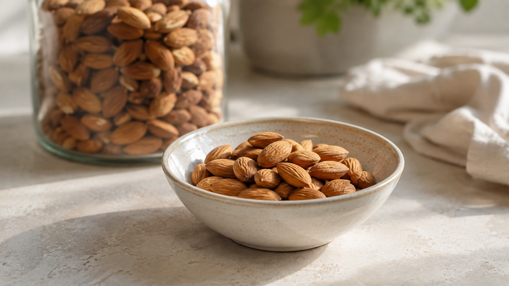
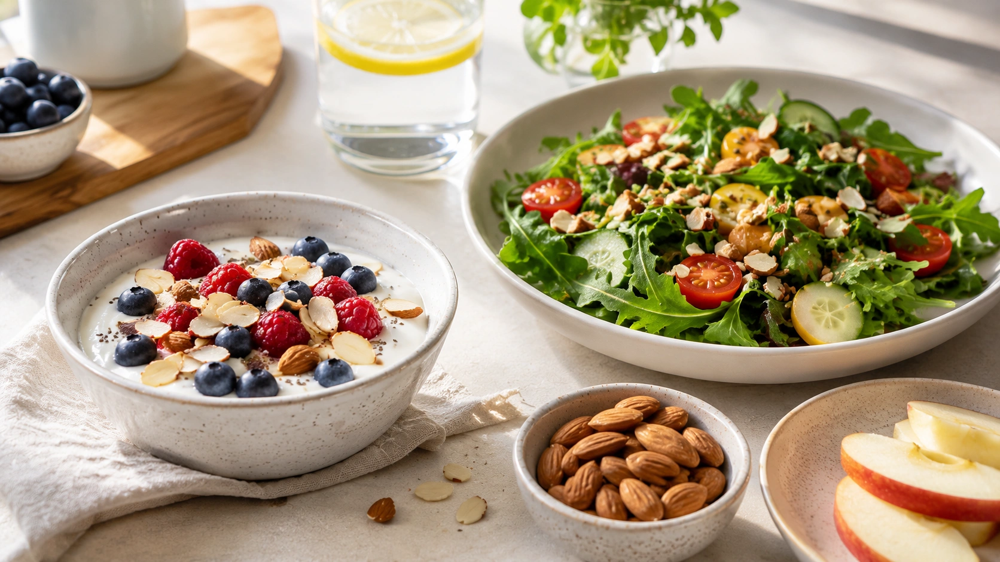

Few foods illustrate the difference between **calorie density** and **nutrient density** as well as almonds.

They pack substantial energy into a small amount of food, yet they also provide predominantly unsaturated fats, fiber, protein, vitamin E, magnesium, and other micronutrients. A typical 1 oz serving — roughly 23 almonds — contains about 165 calories. ([Harvard T.H. Chan](https://nutritionsource.hsph.harvard.edu/food-features/almonds/ 'Almonds'))

The most useful question, therefore, is not simply whether almonds are “fattening” or “healthy.” What matters is **how much you eat, what they replace, and how they fit into your overall dietary pattern**.

## What nutrients do almonds provide?

Almonds are a nutrient-dense food.

According to the Harvard T.H. Chan School of Public Health, they provide vitamin E, monounsaturated fats, fiber, biotin, calcium, phosphorus, magnesium, copper, and plant compounds including flavonoids, plant sterols, and phenolic acids. ([Harvard T.H. Chan](https://nutritionsource.hsph.harvard.edu/food-features/almonds/ 'Almonds'))

A typical serving provides approximately:

| Nutrient           | About 1 oz (28 g) almonds |
| ------------------ | ------------------------: |
| Energy             |                  165 kcal |
| Protein            |                       6 g |
| Total fat          |                      14 g |
| Carbohydrate       |                       6 g |
| Fiber              |                       3 g |
| Approximate number |                23 almonds |

Exact values can vary slightly with variety and processing. ([Harvard T.H. Chan](https://nutritionsource.hsph.harvard.edu/food-features/almonds/ 'Almonds'))

### Most almond fat is unsaturated

Of the approximately 14 g of fat in a serving, most is monounsaturated, with smaller amounts of polyunsaturated fat and relatively little saturated fat. ([Harvard T.H. Chan](https://nutritionsource.hsph.harvard.edu/food-features/almonds/ 'Almonds'))

That distinction matters because dietary fats are best understood in terms of what they replace. Replacing foods rich in saturated fat or refined carbohydrate with sources of unsaturated fat can improve the overall nutritional quality of a diet. ([Harvard T.H. Chan](https://nutritionsource.hsph.harvard.edu/food-features/almonds/ 'Almonds'))

## Are almonds good for heart health?

The strongest almond-specific clinical evidence involves cholesterol and other cardiovascular risk markers.

A meta-analysis of 15 randomized controlled trials found reductions in total and LDL cholesterol with almond consumption. The authors also emphasized that the included trials differed substantially in almond dose and study design. ([PubMed](https://pubmed.ncbi.nlm.nih.gov/31243439/ 'Almond Consumption and Risk Factors for Cardiovascular Disease: A Systematic Review and Meta-analysis of Randomized Controlled Trials'))

A more recent 2025 meta-analysis similarly concluded that almonds improved several lipid measures, including LDL cholesterol, total cholesterol, non-HDL cholesterol, and apolipoprotein B. ([PubMed](https://pubmed.ncbi.nlm.nih.gov/40944180/ 'Blood Lipid Levels in Response to Almond Consumption: A Systematic Review and Meta-Analysis of Randomized Controlled Trials'))

That does not make almonds a cholesterol medication.

Their benefits make the most sense as part of an overall healthy dietary pattern, especially when they **replace** less nutritious foods rather than simply adding extra calories.

## Can almonds help with satiety?

Almonds contain protein, fat, and fiber, giving them several characteristics that can make them a satisfying snack.

The evidence on appetite, however, is nuanced.

One randomized trial found that almonds produced more favorable responses in some appetite-related hormones compared with a carbohydrate-rich snack, but those hormonal differences did not result in lower self-reported appetite or reduced subsequent calorie intake. ([PubMed](https://pubmed.ncbi.nlm.nih.gov/36305961/))

A 2024 meta-analysis found potential improvements in hunger scores and selected body-composition outcomes in some circumstances, while also calling for additional well-designed trials. ([PubMed](https://pubmed.ncbi.nlm.nih.gov/38351580/ 'Almond supplementation on appetite measures, body weight and body composition: a systematic review and meta-analysis of randomized controlled trials'))

Almonds can therefore be a satisfying food, but they should not be viewed as a guaranteed appetite suppressant.

## Do almonds cause weight gain because they are high in calories?

A 1 oz serving contains approximately 165 calories, making almonds an energy-dense food. ([Harvard T.H. Chan](https://nutritionsource.hsph.harvard.edu/food-features/almonds/ 'Almonds'))

Energy density alone, however, does not prove that a food causes weight gain.

Harvard's Nutrition Source notes that studies of nuts do not support a straightforward link between regular nut consumption and increased body weight. Satiety, dietary compensation, and incomplete release of some of the energy contained within intact nuts may all contribute to this observation. ([Harvard T.H. Chan](https://nutritionsource.hsph.harvard.edu/food-features/almonds/ 'Almonds'))

The 2024 almond meta-analysis likewise does not support the idea that including almonds inevitably increases weight and identified favorable outcomes in some analyses. ([PubMed](https://pubmed.ncbi.nlm.nih.gov/38351580/ 'Almond supplementation on appetite measures, body weight and body composition: a systematic review and meta-analysis of randomized controlled trials'))

Portion size still matters.

A small handful is very different from repeatedly eating straight from a large bag without noticing how much has been consumed.

## What is a reasonable serving of almonds?

A particularly useful reference is:

**about 1 oz = 28 g = roughly 23 almonds = approximately ¼ cup.** ([Harvard T.H. Chan](https://nutritionsource.hsph.harvard.edu/food-features/almonds/ 'Almonds'))

This is a practical serving size, not a universal prescription.

### The right amount can vary

A smaller amount may be enough when almonds are used as a topping for:

- yogurt;
- oatmeal;
- salads;
- fruit;
- other nuts and seeds.

A full serving may make more sense when almonds replace another snack.

Larger portions can also fit some dietary plans, provided they are accounted for within individual energy needs.

## Do I need to count exactly 23 almonds?

No.

Twenty-three almonds is simply a visual approximation of a 1 oz serving. Individual almonds vary in size.

People who need tighter calorie control can weigh a serving occasionally to learn what it looks like. For most others, putting a modest amount into a small bowl is easier than eating directly from a large package.

## Can almonds improve blood sugar control?

Claims that almonds “control blood sugar” deserve caution.

A meta-analysis of 24 studies found no significant overall changes in fasting blood glucose, HbA1c, insulin, or HOMA-IR. The authors concluded that there was no convincing evidence for a clear glycemic-control benefit from almond consumption alone. ([PubMed](https://pubmed.ncbi.nlm.nih.gov/34841609/ 'The effect of almond intake on glycemic control: a systematic review and dose-response meta-analysis of randomized controlled trials'))

This does not mean almonds are unsuitable for people with diabetes.

They can fit comfortably into many balanced eating patterns. The important distinction is between **being a nutritious food** and **acting as a treatment for diabetes**.

## Raw or roasted almonds: which are better?

For most people, the difference is small.

Harvard's Nutrition Source considers raw and dry-roasted almonds nutritionally comparable. ([Harvard T.H. Chan](https://nutritionsource.hsph.harvard.edu/food-features/almonds/ 'Almonds'))

Added ingredients usually matter more than roasting itself.

Some products contain substantial amounts of:

- salt;
- sugar;
- honey or syrups;
- chocolate;
- sweet coatings.

For routine use, plain or dry-roasted varieties without excessive salt are simple options.

## Are whole almonds, almond flour, and almond milk equivalent?

No.

Processing changes how the food is used and, in some cases, changes its nutritional profile considerably.

### Whole almonds

They retain the intact food structure and provide naturally occurring fats, protein, and fiber.

### Almond butter

A product made mainly from almonds can have a similar nutrient profile, although the ground texture makes it easy to eat larger quantities quickly.

### Almond flour

Almond flour is made from ground almonds. It remains relatively high in fat and calories and is not nutritionally or calorically interchangeable with an equal volume of wheat flour. ([Harvard T.H. Chan](https://nutritionsource.hsph.harvard.edu/food-features/almonds/ 'Almonds'))

### Almond milk

Commercial almond milk is not nutritionally equivalent to whole almonds. It is produced by grinding almonds with water and filtering out much of the almond pulp. Products may then be fortified with calcium and vitamins, and some contain added sweeteners. ([Harvard T.H. Chan](https://nutritionsource.hsph.harvard.edu/food-features/almonds/ 'Almonds'))

A product being “made from almonds” therefore does not mean it provides the same nutrition as a serving of whole almonds.

## Who needs to be careful with almonds?

The major concern is food allergy.

Almonds are among the tree nuts recognized by the FDA as major food allergens. Reactions can range from skin or gastrointestinal symptoms to potentially life-threatening anaphylaxis. ([FDA](https://www.fda.gov/food/buy-store-serve-safe-food/food-allergies-what-you-need-know 'Food Allergies: What You Need to Know'))

People with a diagnosed allergy should avoid almonds according to their clinical guidance and carefully check ingredient and allergen labels.

Difficulty breathing, throat swelling, severe dizziness, or other signs of a serious allergic reaction require emergency medical care. ([FDA](https://www.fda.gov/food/buy-store-serve-safe-food/food-allergies-what-you-need-know 'Food Allergies: What You Need to Know'))

## Practical ways to eat almonds

Almonds work well both as a snack and as an ingredient.

Options include:

- pairing a small handful with fruit;
- adding chopped almonds to plain yogurt;
- sprinkling them over oatmeal;
- adding them to salads;
- combining them with other nuts and seeds;
- choosing almond butter without excessive added sugar;
- replacing some highly processed snacks with a pre-portioned serving.

The key is not to interpret good nutritional quality as permission for unlimited portions.

Peanuts fill a similar role in the pantry, at a different price and nutrient profile:

[Peanuts: Benefits, Calories, and How Much to Eat](/en/articles/peanuts-benefits-calories-how-much-to-eat/)

## Conclusion

Almonds pack several desirable nutritional characteristics into a small food: **predominantly unsaturated fats, fiber, protein, vitamin E, magnesium, and other micronutrients and plant compounds**. ([Harvard T.H. Chan](https://nutritionsource.hsph.harvard.edu/food-features/almonds/ 'Almonds'))

Clinical evidence is particularly supportive for blood lipids, with meta-analyses showing modest improvements in LDL cholesterol and several related markers when almonds are incorporated into the diet. ([PubMed](https://pubmed.ncbi.nlm.nih.gov/31243439/ 'Almond Consumption and Risk Factors for Cardiovascular Disease: A Systematic Review and Meta-analysis of Randomized Controlled Trials'))

As a practical reference, **about 1 oz (28 g), or roughly 23 almonds**, represents a standard serving. It is not a mandatory daily amount. ([Harvard T.H. Chan](https://nutritionsource.hsph.harvard.edu/food-features/almonds/ 'Almonds'))

Rather than looking for a magic number, focus on context: a modest serving of almonds replacing a less nutritious snack is very different from several additional servings eaten on top of an already adequate diet.

---
