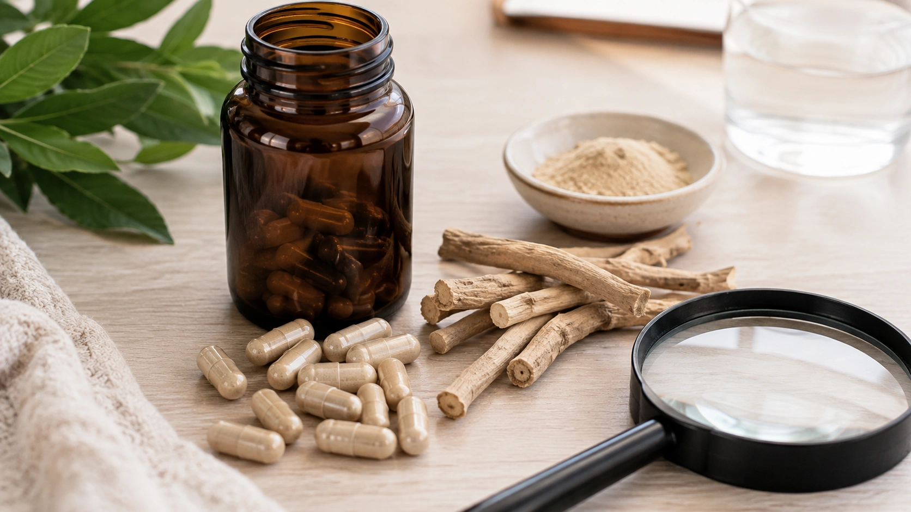

Ashwagandha is now widely promoted for stress, sleep, anxiety, athletic performance, cognition and testosterone. Putting all of those claims on the same supplement bottle, however, can make the evidence look much stronger than it really is.

The short answer to **“Does ashwagandha work?”** is that it **may help with certain outcomes—particularly perceived stress and, to a lesser extent, sleep—but many popular claims remain uncertain**. Natural origin also does not mean a supplement is free of side effects, interactions or contraindications. ([NIH ODS](https://ods.od.nih.gov/factsheets/Ashwagandha-HealthProfessional/ 'Ashwagandha: Is it helpful for stress, anxiety, or sleep?'))

## What is ashwagandha?

Ashwagandha is the common name for _Withania somnifera_, a plant traditionally used in Ayurvedic and Unani medicine. Supplements may contain extracts from the root, leaves, or a combination of both. Their chemical profiles can differ substantially. ([NIH ODS](https://ods.od.nih.gov/factsheets/Ashwagandha-HealthProfessional/ 'Ashwagandha: Is it helpful for stress, anxiety, or sleep?'))

A major group of compounds found in the plant is known as **withanolides**. Supplement labels often list a standardized withanolide concentration, but different extracts cannot automatically be considered interchangeable.

Ashwagandha is also commonly described as an **adaptogen**, a broad term referring to substances proposed to help the body adapt to stressors. The NIH notes that the definition itself is fairly loose. ([NIH ODS](https://ods.od.nih.gov/factsheets/Ashwagandha-HealthProfessional/ 'Ashwagandha: Is it helpful for stress, anxiety, or sleep?'))

## Does ashwagandha reduce stress?

Stress reduction is currently one of the more credible uses of ashwagandha.

Several randomized trials summarized by the NIH found improvements in validated perceived-stress measures, and some reported reductions in cortisol compared with placebo. More recent systematic reviews and meta-analyses have also reported favorable stress outcomes. ([NIH ODS](https://ods.od.nih.gov/factsheets/Ashwagandha-HealthProfessional/ 'Ashwagandha: Is it helpful for stress, anxiety, or sleep?'))

There are important caveats.

Many trials have relatively small samples, short follow-up periods and use specific standardized extracts. A positive study with one formulation does not prove that every ashwagandha supplement will produce the same effect.

## What about anxiety?

Evidence for anxiety is also promising, but less definitive than supplement marketing often suggests.

Clinical trials and systematic reviews have reported improvements in anxiety scores. Meta-analyses published in 2024 and 2026 provide additional evidence of a potential effect. ([PubMed](https://pubmed.ncbi.nlm.nih.gov/39348746/ 'Effects of Ashwagandha (Withania Somnifera) on stress and anxiety: A systematic review and meta-analysis'))

This does not mean ashwagandha should replace evidence-based care for an anxiety disorder.

Occasional anxiety related to everyday stress is also not the same as a clinically diagnosed disorder. Results in one group of participants should not automatically be generalized to all people with anxiety.

## Can ashwagandha improve sleep?

There is a measurable signal of benefit, although the effect appears modest.

A systematic review and meta-analysis of five trials found a small but significant improvement in overall sleep compared with placebo. Benefits appeared more noticeable among participants with insomnia and in some longer interventions. ([NIH ODS](https://ods.od.nih.gov/factsheets/Ashwagandha-HealthProfessional/ 'Ashwagandha: Is it helpful for stress, anxiety, or sleep?'))

Researchers have evaluated outcomes such as:

- sleep quality;
- sleep-onset latency;
- total sleep time;
- sleep efficiency;
- waking after sleep onset.

These findings suggest ashwagandha may be useful for some people, but it is not a proven solution for every type of sleep disorder.

## Does it lower cortisol?

Some clinical trials have reported lower cortisol levels alongside reductions in perceived stress. This supports the possibility that ashwagandha influences physiological systems involved in the stress response. ([NIH ODS](https://ods.od.nih.gov/factsheets/Ashwagandha-HealthProfessional/ 'Ashwagandha: Is it helpful for stress, anxiety, or sleep?'))

However, cortisol should not be framed simply as a harmful hormone that needs to be reduced.

It performs essential physiological functions, and a single cortisol reading does not necessarily measure a person's overall stress burden.

## Does ashwagandha boost testosterone?

This popular claim goes beyond the strength of the current evidence.

NCCIH notes limited evidence suggesting that two to four months of supplementation may increase testosterone levels and improve sperm quality in some men. ([NCCIH](https://www.nccih.nih.gov/health/ashwagandha 'Ashwagandha: Usefulness and Safety'))

That does not make ashwagandha a universal testosterone booster, nor should it replace medical evaluation for symptoms of testosterone deficiency.

## Does it improve strength or muscle growth?

Some individual studies have reported improvements in strength, recovery or body-composition measures when ashwagandha was combined with resistance training.

Even so, NCCIH states that there is not enough evidence to determine whether ashwagandha is beneficial for athletic performance overall. ([NCCIH](https://www.nccih.nih.gov/health/ashwagandha 'Ashwagandha: Usefulness and Safety'))

Training quality, adequate energy and protein intake, recovery and sleep remain far more established factors in building muscle and strength.

## What about memory and focus?

Small studies have reported improvements in selected cognitive tests, and the topic continues to be investigated.

At present, the evidence is not strong enough to say that ashwagandha reliably improves cognition in healthy adults or prevents cognitive decline. NCCIH lists cognitive function among outcomes for which evidence remains insufficient. ([NCCIH](https://www.nccih.nih.gov/health/ashwagandha 'Ashwagandha: Usefulness and Safety'))

## Which benefits have the strongest evidence?

| Claim                           | Current evidence                           |
| ------------------------------- | ------------------------------------------ |
| Reduced perceived stress        | Promising; among the better-supported uses |
| Better sleep                    | Possible small benefit                     |
| Reduced anxiety symptoms        | Promising but still limited                |
| Lower cortisol                  | Observed in some trials                    |
| Increased testosterone          | Limited and population-dependent           |
| Athletic performance            | Preliminary                                |
| Muscle gain                     | Preliminary                                |
| Memory and focus                | Preliminary                                |
| Treatment of medical conditions | Not established for general use            |

The key point is that **not all ashwagandha claims are supported equally**. ([NIH ODS](https://ods.od.nih.gov/factsheets/Ashwagandha-HealthProfessional/ 'Ashwagandha: Is it helpful for stress, anxiety, or sleep?'))

## What doses have been studied?

Research cannot provide one universal ashwagandha dose because formulations differ substantially.

The NIH summary of stress trials includes extract doses ranging from roughly **240 to 1,250 mg per day**, with some trials suggesting greater effects around 500 to 600 mg per day. ([NIH ODS](https://ods.od.nih.gov/factsheets/Ashwagandha-HealthProfessional/ 'Ashwagandha: Is it helpful for stress, anxiety, or sleep?'))

In the sleep meta-analysis, several studies used standardized root extracts at approximately **250 to 600 mg per day**, while another concentrated root-and-leaf extract was used at a much smaller milligram amount. ([NIH ODS](https://ods.od.nih.gov/factsheets/Ashwagandha-HealthProfessional/ 'Ashwagandha: Is it helpful for stress, anxiety, or sleep?'))

These are **research doses, not an individual prescription**.

## How long has it been studied?

Many stress and sleep trials lasted several weeks, often around six to twelve weeks. ([NIH ODS](https://ods.od.nih.gov/factsheets/Ashwagandha-HealthProfessional/ 'Ashwagandha: Is it helpful for stress, anxiety, or sleep?'))

This matters because considerably more is known about short-term supplementation than continuous use over many months or years.

The NIH notes that ashwagandha appears to be reasonably well tolerated for roughly up to three months in available trials, while long-term safety remains uncertain. ([NIH ODS](https://ods.od.nih.gov/factsheets/Ashwagandha-HealthProfessional/ 'Ashwagandha: Is it helpful for stress, anxiety, or sleep?'))

## What are the common side effects?

Reported side effects are generally mild and can include:

- nausea;
- stomach upset;
- loose stools or diarrhea;
- vomiting;
- drowsiness. ([NIH ODS](https://ods.od.nih.gov/factsheets/Ashwagandha-HealthProfessional/ 'Ashwagandha: Is it helpful for stress, anxiety, or sleep?'))

Less common safety concerns deserve more attention.

## Can ashwagandha cause liver injury?

Although apparently rare, **clinically apparent liver injury associated with ashwagandha-containing supplements has been documented**.

LiverTox reports that symptoms have often developed within several weeks of starting supplementation. Jaundice and itching have been common features in reported cases. Most patients recovered after stopping the product, although severe cases have occurred, particularly in people with pre-existing liver disease. ([NCBI Bookshelf](https://www.ncbi.nlm.nih.gov/books/NBK548536/ 'Ashwagandha'))

Causality is sometimes complicated by multi-ingredient supplements, adulteration or inaccurate labeling. Nevertheless, LiverTox classifies ashwagandha as a likely cause of clinically apparent liver injury. ([NCBI Bookshelf](https://www.ncbi.nlm.nih.gov/books/NBK548536/ 'Ashwagandha'))

## Can ashwagandha affect the thyroid?

Possibly.

Small studies have reported changes in TSH, T3 and T4, and cases of thyrotoxicosis have also been described. These data do not show that thyroid problems will occur in every user, but they justify caution. ([NIH ODS](https://ods.od.nih.gov/factsheets/Ashwagandha-HealthProfessional/ 'Ashwagandha: Is it helpful for stress, anxiety, or sleep?'))

People with thyroid disease or those taking thyroid hormone should discuss ashwagandha with their health care professional before using it.

## Which medicines may interact with ashwagandha?

NIH sources identify potential interactions with:

- diabetes medications;
- blood-pressure medications;
- sedatives;
- anticonvulsants;
- immunosuppressants;
- thyroid hormone medications. ([NCCIH](https://www.nccih.nih.gov/health/ashwagandha 'Ashwagandha: Usefulness and Safety'))

A possible interaction does not mean every combination will cause harm, but it does mean the combination deserves individual review.

## Who should avoid ashwagandha?

Particular caution is appropriate for:

- pregnant people;
- people who are breastfeeding;
- people with thyroid disorders;
- people with autoimmune conditions;
- people preparing for surgery;
- people with significant liver disease;
- people taking potentially interacting medicines;
- men with hormone-sensitive prostate cancer. ([NCCIH](https://www.nccih.nih.gov/health/ashwagandha 'Ashwagandha: Usefulness and Safety'))

## So, is ashwagandha worth taking?

That depends on your goal, health status and the product itself.

For an otherwise healthy adult looking for an additional option for stress or mild sleep problems, ashwagandha has enough research behind it to justify an informed discussion about whether it is appropriate.

That is very different from saying everyone needs it or that it will definitely work.

For boosting testosterone, building muscle, dramatically enhancing memory or treating a medical condition, the evidence is considerably less convincing.

Fundamentals such as adequate sleep, regular physical activity, nutrition, stress management and appropriate clinical treatment should not be displaced by a supplement.

The same question — does the supplement solve something your routine does not? — applies to the best-selling one of all:

[Whey Protein: What Is It For and Who Actually Needs It?](/en/articles/whey-protein-what-it-does-who-needs-it/)

## Conclusion

**Ashwagandha may work in some contexts, but its reputation is broader than the evidence.**

The most encouraging research involves perceived stress and modest improvements in sleep. Anxiety outcomes are also promising, whereas claims involving testosterone, athletic performance and cognition remain less established. ([NIH ODS](https://ods.od.nih.gov/factsheets/Ashwagandha-HealthProfessional/ 'Ashwagandha: Is it helpful for stress, anxiety, or sleep?'))

It is also not risk-free. Long-term safety remains uncertain, drug interactions and thyroid effects are possible, and rare cases of liver injury have been reported. ([NIH ODS](https://ods.od.nih.gov/factsheets/Ashwagandha-HealthProfessional/ 'Ashwagandha: Is it helpful for stress, anxiety, or sleep?'))

The decision to use ashwagandha should therefore consider **your goal, medical history, current medications, extract formulation and product quality**, rather than relying on marketing claims alone.

---
