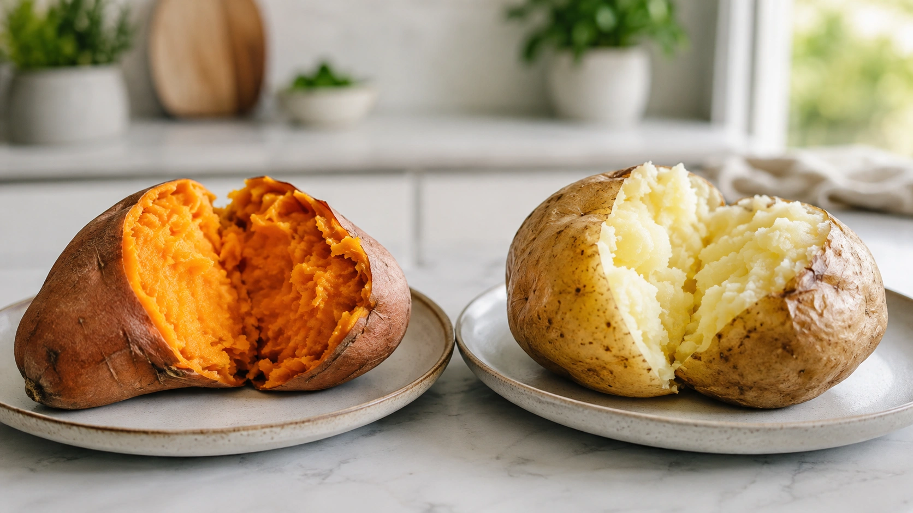
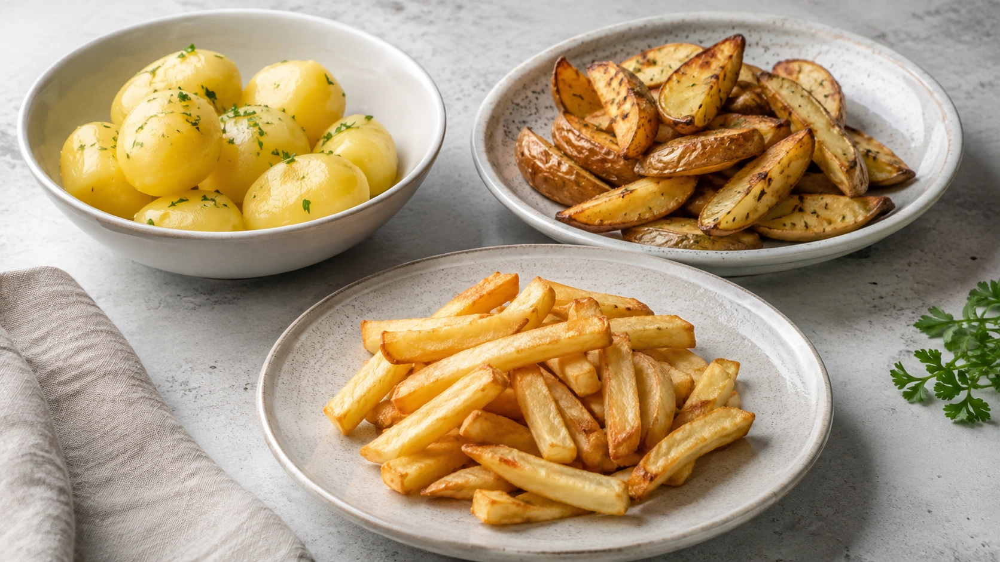
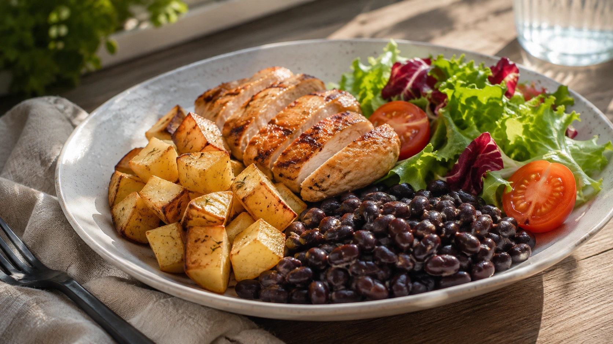

Sweet potatoes have developed a reputation as a “healthier carb,” while ordinary white potatoes are sometimes treated as a nutritionally inferior choice.

The science is more nuanced.

**Sweet potatoes are not universally healthier than white potatoes.** Both can fit into a balanced dietary pattern, and each has nutritional strengths. ([Harvard T.H. Chan](https://nutritionsource.hsph.harvard.edu/food-features/sweet-potatoes/ 'Sweet Potatoes'))

## Sweet potatoes and white potatoes are different plants

Despite their similar names, they belong to different botanical families. Sweet potato (_Ipomoea batatas_) is a storage root, while the common potato (_Solanum tuberosum_) is a tuber. ([Harvard T.H. Chan](https://nutritionsource.hsph.harvard.edu/food-features/sweet-potatoes/ 'Sweet Potatoes'))

Nutritionally, both are commonly used as **starchy carbohydrate foods**, which makes comparing them reasonable from a meal-planning perspective.

Brazil's national dietary guidelines include potatoes, roots, and tubers among unprocessed or minimally processed foods that can contribute to a varied diet. ([Brazilian Ministry of Health](https://www.gov.br/saude/pt-br/assuntos/saude-brasil/publicacoes-para-promocao-a-saude/guia_alimentar_populacao_brasileira_2ed.pdf 'Dietary Guidelines for the Brazilian Population'))

## Which potato has the better nutritional profile?

That depends on which nutrient you care about.

| Feature                    | Sweet potato                                  | White potato                                 |
| -------------------------- | --------------------------------------------- | -------------------------------------------- |
| Major nutritional standout | Beta-carotene in orange varieties             | Potassium                                    |
| Vitamin A                  | Particularly high in orange-fleshed varieties | Not a major source                           |
| Vitamin C                  | Present                                       | Nutritionally relevant source                |
| Vitamin B6                 | Present                                       | Present                                      |
| Fiber                      | Present                                       | Present, with an important share in the skin |
| Main carbohydrate          | Starch                                        | Starch                                       |
| Glycemic effect            | Can range from moderate to high               | Often high, but varies                       |
| Universal winner?          | No                                            | No                                           |

Orange-fleshed sweet potatoes clearly stand out for **beta-carotene**, which can be converted into vitamin A in the body. Purple varieties have a different phytochemical profile and are richer in anthocyanins. ([Harvard T.H. Chan](https://nutritionsource.hsph.harvard.edu/food-features/sweet-potatoes/ 'Sweet Potatoes'))

White potatoes, however, are far from nutritionally empty. Harvard identifies potassium, vitamin C, vitamin B6, and fiber among their notable nutrients. ([Harvard T.H. Chan](https://nutritionsource.hsph.harvard.edu/potatoes/ 'Are Potatoes Healthy?'))

## What about the glycemic index?

This is one of the main reasons sweet potatoes are commonly viewed as superior.

The **glycemic index (GI)** estimates how quickly a carbohydrate-containing food raises blood glucose under standardized conditions. But reducing the nutritional value of an entire food to one GI number can be misleading.

Sweet potatoes may have a slightly lower glycemic load than white potatoes in some comparisons. However, Harvard also notes that sweet potatoes can still have a high glycemic index and glycemic load that approach those of white potatoes. ([Harvard T.H. Chan](https://nutritionsource.hsph.harvard.edu/food-features/sweet-potatoes/ 'Sweet Potatoes'))

The response can vary with factors such as potato variety, portion size, cooking method, starch structure, temperature, and the other foods consumed in the same meal.

For this reason, **“sweet potatoes are low glycemic” should not be treated as a universal rule**.

## Cooking method may matter more than potato color

Consider the difference between a boiled white potato served with beans, vegetables, and a protein source and a large serving of deep-fried sweet potato.

Calling the second meal healthier simply because it contains sweet potato would overlook the bigger nutritional picture.

Preparation method also appears important in long-term observational research. A 2025 study published in _The BMJ_, based on three large U.S. cohorts, found that each additional three weekly servings of French fries was associated with about a 20% higher rate of type 2 diabetes. Combined baked, boiled, or mashed potato intake did not show a statistically significant association of the same kind. ([The BMJ](https://www.bmj.com/content/390/bmj-2024-082121 'Total and specific potato intake and risk of type 2 diabetes: results from three US cohort studies and a substitution meta-analysis of prospective cohorts'))

The distinction is important: this was an **observational study**, so it identifies associations rather than proving that French fries directly cause diabetes.

## Is sweet potato better for weight loss?

Sweet potatoes do not have a unique property that automatically promotes weight loss when substituted for white potatoes.

A more practical approach is to consider portion size, frequency, added fats, and the composition of the entire meal.

Boiled or baked potatoes can be combined with vegetables, legumes, and an appropriate source of protein. Frequent deep-fried preparations represent a very different dietary context. ([Harvard T.H. Chan](https://nutritionsource.hsph.harvard.edu/potatoes/ 'Are Potatoes Healthy?'))

## What if you have diabetes?

The answer is not that sweet potatoes are automatically “allowed” while white potatoes are “forbidden.”

Both contain substantial amounts of starch and can raise blood glucose after eating. Portion size, preparation method, and the other foods in the meal all matter. ([Harvard T.H. Chan](https://nutritionsource.hsph.harvard.edu/food-features/sweet-potatoes/ 'Sweet Potatoes'))

People using insulin, glucose-lowering medications, or specific carbohydrate-counting strategies may need individualized guidance.

## So which potato should you choose?

If you want to increase your intake of carotenoids and vitamin A precursors, **orange-fleshed sweet potato is an especially useful choice**. ([Harvard T.H. Chan](https://nutritionsource.hsph.harvard.edu/food-features/sweet-potatoes/ 'Sweet Potatoes'))

If you enjoy boiled, baked, or lightly prepared white potatoes, there is no reason to eliminate them simply because they have been labeled a “bad carbohydrate.” They provide important nutrients and can fit into a balanced diet. ([Harvard T.H. Chan](https://nutritionsource.hsph.harvard.edu/potatoes/ 'Are Potatoes Healthy?'))

Rather than turning the two foods into nutritional rivals, consider using both for dietary variety.

The same comparison — whole version against refined version — shows up on the plate next to it:

[Is Brown Rice Really Better Than White Rice for You?](/en/articles/brown-rice-vs-white-rice/)

## Conclusion

**Sweet potato is not automatically healthier than white potato.**

Orange-fleshed sweet potatoes have a clear advantage in beta-carotene and vitamin A activity. White potatoes provide potassium, vitamin C, vitamin B6, and fiber and can also be part of a healthy dietary pattern. ([Harvard T.H. Chan](https://nutritionsource.hsph.harvard.edu/food-features/sweet-potatoes/ 'Sweet Potatoes'))

For overall health, **portion size, dietary variety, and preparation method** can matter more than deciding which potato “wins.”

A practical solution is to enjoy both and favor boiled, baked, or otherwise minimally processed preparations most of the time.

---
