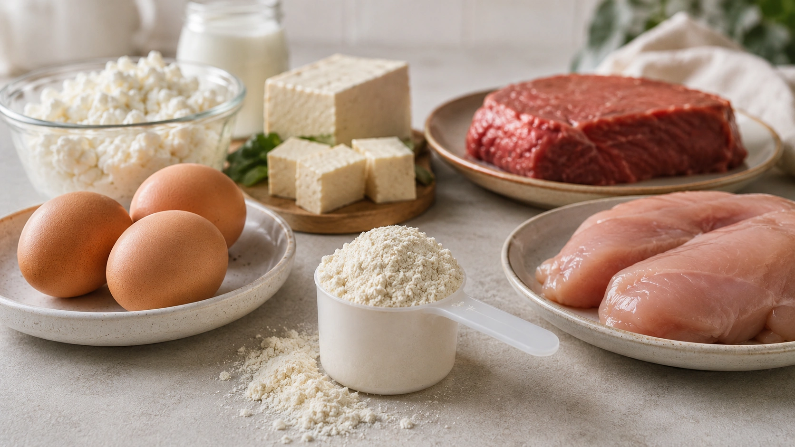
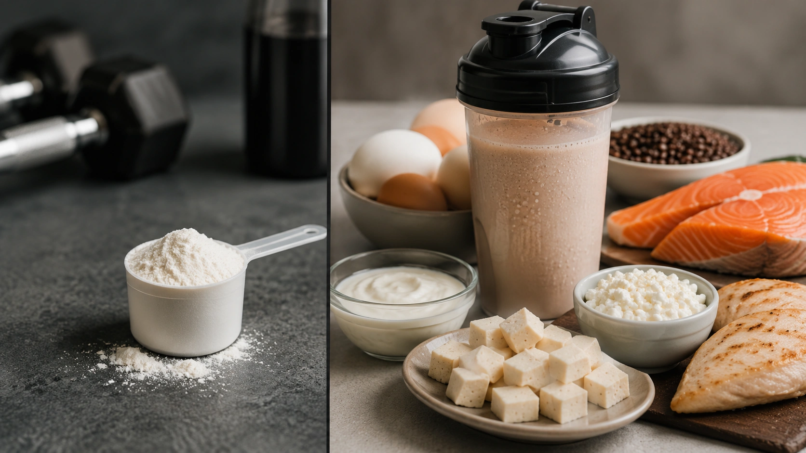

BCAA supplements have been promoted for years as a straightforward way to increase muscle growth. The reasoning sounds convincing: leucine helps activate muscle protein synthesis, so taking concentrated leucine, isoleucine and valine should theoretically lead to more muscle.

There is some truth in the first part of that argument. BCAAs can stimulate an acute anabolic response. What remains poorly supported is the assumption that this necessarily leads to greater long-term hypertrophy when someone already consumes enough high-quality protein. ([PubMed](https://pubmed.ncbi.nlm.nih.gov/28638350/ 'Branched-Chain Amino Acid Ingestion Stimulates Muscle Myofibrillar Protein Synthesis following Resistance Exercise in Humans'))

## What are BCAAs?

BCAA stands for _branched-chain amino acids_. The three BCAAs are:

- leucine;
- isoleucine;
- valine.

All three are essential amino acids, meaning they must come from the diet. They are naturally present in protein-rich foods as well as complete protein supplements. ([NIH ODS](https://ods.od.nih.gov/factsheets/ExerciseAndAthleticPerformance-HealthProfessional/ 'Dietary Supplements for Exercise and Athletic Performance'))

Leucine is particularly relevant because it participates in the molecular signaling that activates muscle protein synthesis. ([PubMed](https://pubmed.ncbi.nlm.nih.gov/37681443/ 'The effects of branched-chain amino acids on muscle protein synthesis, muscle protein breakdown and associated molecular signalling responses in humans: an update'))

## Can BCAAs stimulate muscle protein synthesis?

Yes.

In a human trial, consuming 5.6 g of BCAAs after resistance exercise increased the acute myofibrillar muscle protein synthesis response by about 22% compared with placebo. This confirms that BCAAs have a measurable biological effect. ([PubMed](https://pubmed.ncbi.nlm.nih.gov/28638350/ 'Branched-Chain Amino Acid Ingestion Stimulates Muscle Myofibrillar Protein Synthesis following Resistance Exercise in Humans'))

The important distinction is that an acute rise in muscle protein synthesis is not the same outcome as gaining more muscle over several months.

Muscle hypertrophy results from repeated training and recovery cycles, supported by adequate energy intake and the availability of all the amino acids needed to build muscle tissue.

## Do BCAAs actually increase muscle growth?

Current evidence does not consistently show a meaningful additional hypertrophy benefit from isolated BCAA supplementation in people who already train and consume sufficient protein.

A 2022 systematic review of athletes concluded that although BCAAs can activate anabolic signaling, their effects on body composition were negligible. A newer 2025 systematic review also found a heterogeneous evidence base regarding pure BCAA supplementation and body composition. ([PubMed](https://pubmed.ncbi.nlm.nih.gov/36235655/ 'Oral Branched-Chain Amino Acids Supplementation in Athletes: A Systematic Review'))

This distinction matters: a supplement can alter a metabolic pathway without producing a meaningful change in long-term muscle mass.

## Why does complete protein make more sense?

Building muscle requires both an anabolic signal and the materials required to construct new proteins.

BCAAs provide three essential amino acids. Complete protein provides all of them.

Research in sports nutrition indicates that having sufficient amounts of all essential amino acids is important for sustaining muscle protein synthesis. Increasing leucine or BCAA availability can stimulate signaling, but other essential amino acids may eventually become limiting. ([JISSN](https://jissn.biomedcentral.com/articles/10.1186/s12970-017-0177-8 'International Society of Sports Nutrition Position Stand: protein and exercise'))

### BCAAs vs EAAs vs complete protein

| Option             | What it provides                 | Evidence for hypertrophy                           |
| ------------------ | -------------------------------- | -------------------------------------------------- |
| BCAAs              | Leucine, isoleucine and valine   | Limited evidence of additional benefit             |
| EAAs               | All essential amino acids        | Can effectively stimulate muscle protein synthesis |
| Whey protein       | Complete protein including BCAAs | More consistent evidence within an adequate diet   |
| Protein-rich foods | Protein plus other nutrients     | Primary way to meet daily protein needs            |

Whey protein is not mandatory. People can meet their protein requirements entirely through food. Protein powders are mainly a convenient way to help reach an appropriate intake. ([PubMed](https://pubmed.ncbi.nlm.nih.gov/28698222/ 'A systematic review, meta-analysis and meta-regression of the effect of protein supplementation on resistance training-induced gains in muscle mass and strength in healthy adults'))

## How much protein matters for muscle growth?

Overall protein intake deserves more attention than an isolated BCAA target.

The International Society of Sports Nutrition recommends approximately **1.4–2.0 g of protein per kilogram of body weight per day** for most exercising individuals. Requirements vary with factors such as training, age, energy intake and individual goals. ([JISSN](https://jissn.biomedcentral.com/articles/10.1186/s12970-017-0177-8 'International Society of Sports Nutrition Position Stand: protein and exercise'))

A large meta-analysis examining resistance training and protein supplementation found diminishing average gains beyond approximately **1.6 g/kg/day**. This should not be interpreted as a strict upper limit for every individual. ([PubMed](https://pubmed.ncbi.nlm.nih.gov/28698222/ 'A systematic review, meta-analysis and meta-regression of the effect of protein supplementation on resistance training-induced gains in muscle mass and strength in healthy adults'))

For someone weighing 70 kg, 1.6 g/kg equals approximately 112 g of protein per day.

## What about protein per meal?

The ISSN provides a general guideline of approximately **0.25 g/kg of high-quality protein per serving**, or roughly **20–40 g**, depending on age, body size and training context. ([JISSN](https://jissn.biomedcentral.com/articles/10.1186/s12970-017-0177-8 'International Society of Sports Nutrition Position Stand: protein and exercise'))

Rather than focusing on a specific amount of isolated BCAAs, a more practical strategy is to include adequate protein across the day.

## BCAAs or whey protein?

If the objective is specifically to increase protein intake and support muscle growth, **complete protein generally makes more physiological sense than isolated BCAAs**.

Whey naturally contains BCAAs, including leucine, but also supplies the other essential amino acids required to synthesize muscle proteins.

Whey itself is not essential if your regular diet already provides enough protein. ([JISSN](https://jissn.biomedcentral.com/articles/10.1186/s12970-017-0177-8 'International Society of Sports Nutrition Position Stand: protein and exercise'))

## Can BCAAs help with muscle recovery?

This is where the evidence is somewhat more favorable.

A 2024 systematic review and meta-analysis found that BCAA supplementation could reduce delayed-onset muscle soreness and creatine kinase following exercise-induced muscle damage. Effects varied according to study design, dose, training status and other factors. ([PMC](https://pmc.ncbi.nlm.nih.gov/articles/PMC11021390/ 'A Systematic Review and Meta-analysis with Meta-regression'))

However, **reduced soreness is not the same as increased hypertrophy**.

Someone may feel less sore after training without experiencing a measurable increase in muscle growth.

## Is there an optimal BCAA dose for hypertrophy?

There is currently no established isolated BCAA dose proven to maximize muscle growth.

Studies use different doses and supplementation protocols, and the available evidence has not established a reliable dose-response relationship for long-term hypertrophy. ([PubMed](https://pubmed.ncbi.nlm.nih.gov/41346907/))

The NIH Office of Dietary Supplements notes that an adequate protein-containing diet can naturally provide roughly 10–20 g of BCAAs per day and states that an additional intake of up to 20 g/day from supplements appears safe based on available evidence. This is a safety observation, **not a recommended muscle-building dose**. ([NIH ODS](https://ods.od.nih.gov/factsheets/ExerciseAndAthleticPerformance-Consumer/ 'Dietary Supplements for Exercise and Athletic Performance'))

## What should you prioritize for muscle growth?

Before spending money on isolated BCAAs, prioritize the factors with stronger direct evidence:

1. progressive resistance training;
2. adequate energy intake;
3. sufficient daily protein;
4. high-quality protein sources throughout the day;
5. appropriate recovery and sleep;
6. supplements only when they solve a genuine nutritional or practical need.

Resistance training combined with adequate dietary protein has much stronger evidence for supporting muscle growth than simply adding isolated BCAAs to an already protein-sufficient diet. ([PubMed](https://pubmed.ncbi.nlm.nih.gov/28698222/ 'A systematic review, meta-analysis and meta-regression of the effect of protein supplementation on resistance training-induced gains in muscle mass and strength in healthy adults'))

If the conclusion points to complete protein, the next step is the supplement that delivers it:

[Whey Protein: What Is It For and Who Actually Needs It?](/en/articles/whey-protein-what-it-does-who-needs-it/)

## Conclusion

**BCAAs can stimulate muscle protein synthesis, but current evidence does not consistently show that they produce additional muscle growth when protein intake is already adequate.**

Leucine plays an important role in anabolic signaling, but muscle building requires the full complement of essential amino acids. For people who need help increasing protein intake, protein-rich foods or complete protein supplements therefore have a stronger physiological and scientific rationale. ([PubMed](https://pubmed.ncbi.nlm.nih.gov/37681443/ 'The effects of branched-chain amino acids on muscle protein synthesis, muscle protein breakdown and associated molecular signalling responses in humans: an update'))

BCAAs are not necessarily useless: there is evidence suggesting they may reduce muscle soreness in some situations. For the specific goal of maximizing hypertrophy, however, they should rank below well-designed resistance training and adequate total protein intake. ([PMC](https://pmc.ncbi.nlm.nih.gov/articles/PMC11021390/ 'A Systematic Review and Meta-analysis with Meta-regression'))

---
