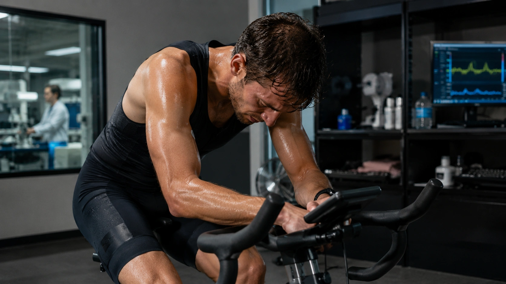
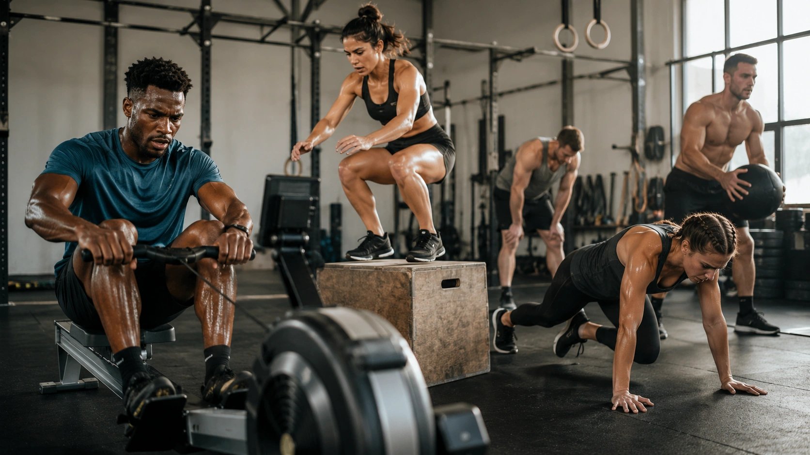
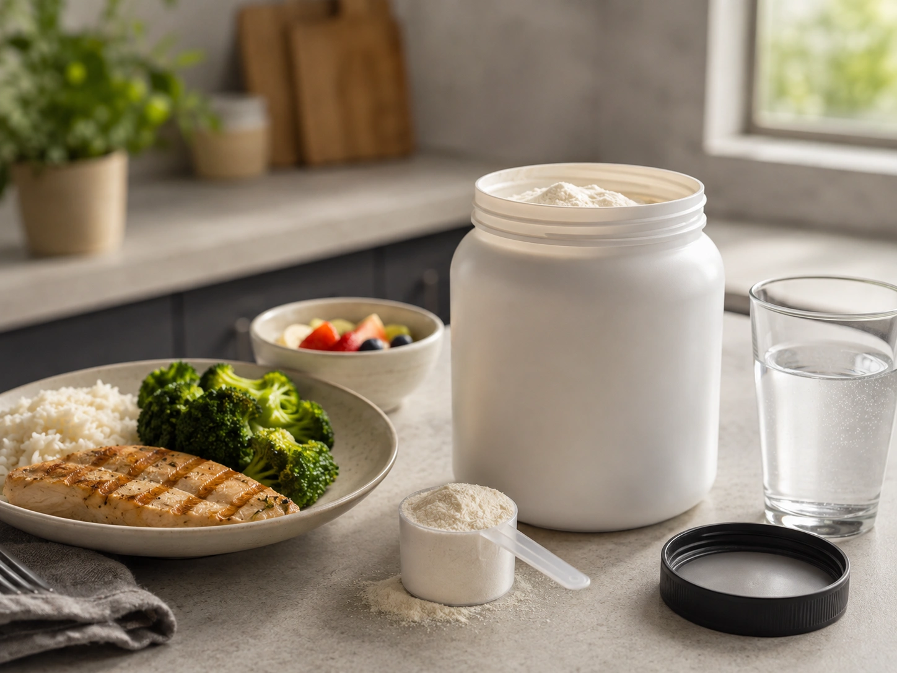

Beta-alanine is often recognized by the tingling sensation associated with many pre-workout products, but that sensation is not why the supplement is used. Its main role in sports nutrition is its ability to **increase muscle carnosine**, which may help support performance during certain forms of intense exercise. ([NIH ODS](https://ods.od.nih.gov/factsheets/ExerciseAndAthleticPerformance-HealthProfessional/ 'Dietary Supplements for Exercise and Athletic Performance — Health Professional Fact Sheet'))

That does not make beta-alanine universally useful. Whether supplementation translates into better performance depends on the duration and intensity of the activity, the supplementation protocol and the performance test being measured. Recent systematic reviews reinforce how task-specific its effects can be. ([Frontiers](https://www.frontiersin.org/journals/nutrition/articles/10.3389/fnut.2026.1818755/full 'No ergogeniceffect of β-alanine on repeated sprint ability'))

## What is beta-alanine?

Beta-alanine is an amino acid, but unlike amino acids that are incorporated into muscle proteins, its sports-nutrition relevance comes from another pathway.

Inside skeletal muscle, beta-alanine combines with histidine to form **carnosine**. Because beta-alanine availability helps limit carnosine synthesis, taking supplemental beta-alanine can increase muscle carnosine concentrations. ([NIH ODS](https://ods.od.nih.gov/factsheets/ExerciseAndAthleticPerformance-HealthProfessional/ 'Dietary Supplements for Exercise and Athletic Performance — Health Professional Fact Sheet'))

During high-intensity exercise, rapid energy turnover creates substantial acid-base stress inside working muscle. Carnosine is one of the intracellular buffers that helps limit changes in pH that can interfere with force production and contribute to fatigue. ([NIH ODS](https://ods.od.nih.gov/factsheets/ExerciseAndAthleticPerformance-HealthProfessional/ 'Dietary Supplements for Exercise and Athletic Performance — Health Professional Fact Sheet'))

In other words, beta-alanine does not directly provide energy. Instead, consistent intake gradually increases a muscle compound that may become useful when buffering capacity is one of the factors limiting performance.

## What is beta-alanine used for?

Its primary evidence-based application is as an ergogenic aid designed to support exercise capacity or performance.

Research has historically suggested a greater likelihood of benefit during intense exercise lasting approximately **one to four minutes**, although broader analyses have reported positive effects in some protocols ranging from roughly 30 seconds to 10 minutes. The average improvements tend to be modest, and not every study produces a benefit. ([NIH ODS](https://ods.od.nih.gov/factsheets/ExerciseAndAthleticPerformance-HealthProfessional/ 'Dietary Supplements for Exercise and Athletic Performance — Health Professional Fact Sheet'))

This helps explain why beta-alanine may be relevant in certain rowing, swimming, cycling, combat-sport, interval-training and metabolically demanding resistance-training settings. It does not mean everyone participating in those activities will respond.

## Which types of exercise are most likely to benefit?

The supplement makes the most physiological sense when intracellular buffering capacity is an important constraint on performance.

| Exercise demand                                      | What the evidence suggests                                                               |
| ---------------------------------------------------- | ---------------------------------------------------------------------------------------- |
| Intense efforts lasting roughly 1–4 minutes          | Among the situations with the strongest historical rationale and evidence                |
| Intense tests lasting about 30 seconds to 10 minutes | Some positive evidence, but substantial variation across protocols                       |
| Very short repeated sprints                          | A 2026 meta-analysis found no clear ergogenic benefit                                    |
| High-volume resistance training with short rest      | Potentially useful in some settings, but strength and power findings remain inconsistent |
| Maximal strength or isolated explosive movements     | Less consistent support                                                                  |
| Long, predominantly aerobic exercise                 | Little or no consistent benefit in many settings                                         |
| Muscle gain or fat loss                              | No consistent direct effect on body composition                                          |

These distinctions are important because “high intensity” alone does not determine whether beta-alanine will help. ([NIH ODS](https://ods.od.nih.gov/factsheets/ExerciseAndAthleticPerformance-HealthProfessional/ 'Dietary Supplements for Exercise and Athletic Performance — Health Professional Fact Sheet'))

### What about repeated sprints?

Beta-alanine is often assumed to be ideal for any sport involving repeated short sprints. Recent evidence makes that conclusion less certain.

A 2026 systematic review and multilevel meta-analysis found no clear improvement in total work capacity, maximal anaerobic power or fatigue resistance during repeated-sprint tests following chronic beta-alanine supplementation. ([Frontiers](https://www.frontiersin.org/journals/nutrition/articles/10.3389/fnut.2026.1818755/full 'No ergogeniceffect of β-alanine on repeated sprint ability'))

Very brief explosive bouts rely heavily on physiological systems other than intracellular buffering, which may help explain why increased carnosine does not consistently translate into improved repeated-sprint performance.

## Who is most likely to benefit?

### Athletes performing sustained high-intensity efforts

Athletes whose events include sustained, near-maximal efforts lasting from roughly one to several minutes are among the more plausible candidates.

However, sport names alone are not enough. Two athletes in the same sport can face very different metabolic demands depending on event length, position, work-to-rest ratios and competition structure.

### People doing metabolically demanding resistance training

In the gym, beta-alanine may be more relevant to fatigue across longer sets and high-volume sessions than to a single maximal lift.

A 2025 systematic review reported more favorable outcomes in some strength- and power-related studies using approximately **4–6.4 g per day**, fragmented dosing and several weeks of supplementation, particularly when the training involved substantial metabolic stress. The literature nevertheless remains inconsistent. ([PubMed](https://pubmed.ncbi.nlm.nih.gov/40995761/ 'Dosing strategies for β-alanine supplementation in strength and power performance: a systematic review'))

### Can women benefit?

Much of the historical sports-supplement literature has been based on male or mixed-sex samples.

A 2026 systematic review and meta-analysis included 11 independent randomized trials involving 312 women. The pooled estimate favored beta-alanine for **time to exhaustion**, but there were no clear pooled effects on peak power, anaerobic performance, VO₂max/VO₂peak or body-fat percentage. Certainty of evidence was rated very low across the outcomes. ([Frontiers](https://www.frontiersin.org/journals/nutrition/articles/10.3389/fnut.2026.1857513/full 'Effects of beta-alanine supplementation on exercise performance and related physiological outcomes in women: a systematic review and meta-analysis'))

This means beta-alanine should not be considered a male-specific supplement, but current female-specific evidence does not justify promises of universal performance improvement either.

### What about beginners?

For someone new to structured training, improvements in programming, technique, nutrition, sleep and recovery typically offer larger opportunities than fine-tuning a supplement with a relatively specific effect.

Beta-alanine becomes more relevant when training is already structured and there is a clear performance demand that matches its mechanism.

## How much beta-alanine is typically studied?

A commonly referenced protocol is around **4–6 g per day for at least 2–4 weeks**. The NIH notes that potential benefits tend to increase after about four weeks as muscle carnosine concentrations continue to rise. ([NIH ODS](https://ods.od.nih.gov/factsheets/ExerciseAndAthleticPerformance-HealthProfessional/ 'Dietary Supplements for Exercise and Athletic Performance — Health Professional Fact Sheet'))

Protocols vary, and recent work examining strength and power has also included daily intakes up to approximately 6.4 g. ([PubMed](https://pubmed.ncbi.nlm.nih.gov/40995761/ 'Dosing strategies for β-alanine supplementation in strength and power performance: a systematic review'))

These figures describe research protocols, not a personalized prescription. Individual decisions should account for goals, tolerance, diet, other supplements and health status.

## Do you need to take it before training?

Not necessarily.

Beta-alanine works primarily by **gradually increasing muscle carnosine over time**, rather than producing its main effect within the hour after ingestion. Consistent daily intake is therefore more relevant than hitting a precise pre-workout timing window. ([NIH ODS](https://ods.od.nih.gov/factsheets/ExerciseAndAthleticPerformance-HealthProfessional/ 'Dietary Supplements for Exercise and Athletic Performance — Health Professional Fact Sheet'))

This also means that feeling an intense tingling sensation immediately before training should not be interpreted as proof of an acute performance boost.

## Why does beta-alanine cause tingling?

The best-known side effect is **paresthesia**, experienced as tingling, prickling, itching or a mild burning sensation.

The NIH notes that individual conventional doses around 800 mg or more can produce paresthesia in some circumstances. The effect is related to dose and delivery rate. Dividing the daily amount into smaller servings or using sustained-release preparations can reduce the sensation. ([NIH ODS](https://ods.od.nih.gov/factsheets/ExerciseAndAthleticPerformance-HealthProfessional/ 'Dietary Supplements for Exercise and Athletic Performance — Health Professional Fact Sheet'))

Importantly, **tingling is not a marker of effectiveness**. A person does not need to experience paresthesia for muscle carnosine to increase.

## Is beta-alanine safe?

Within the amounts and durations studied in healthy adults, beta-alanine has generally shown a favorable safety profile. A systematic risk assessment and meta-analysis found no evidence of harmful effects across the safety measures assessed within the research protocols included. ([PubMed](https://pubmed.ncbi.nlm.nih.gov/30980076/ 'A Systematic Risk Assessment and Meta-Analysis on the Use of Oral β-Alanine Supplementation'))

That does not establish that every dose, formulation or duration of use is safe indefinitely. The NIH notes important gaps in long-term safety data. ([NIH ODS](https://ods.od.nih.gov/factsheets/ExerciseAndAthleticPerformance-HealthProfessional/ 'Dietary Supplements for Exercise and Athletic Performance — Health Professional Fact Sheet'))

Pregnant or breastfeeding people, minors, individuals with medical conditions and those taking medications should seek qualified professional guidance before using sports supplements because these populations are underrepresented in the performance literature.

## Does beta-alanine help with muscle growth?

Not directly, based on the available evidence.

A meta-analysis focused on body composition concluded that beta-alanine supplementation was unlikely to produce consistent improvements in body weight, lean-body measures or body-fat outcomes. ([PubMed](https://pubmed.ncbi.nlm.nih.gov/35813845/ 'Effects of beta-alanine supplementation on body composition: a GRADE-assessed systematic review and meta-analysis'))

There is a reasonable indirect hypothesis: if beta-alanine allows someone to perform more productive work during sessions in which metabolic fatigue is genuinely limiting, it might support the training stimulus. That is not the same as showing that beta-alanine itself produces hypertrophy.

Progressive resistance training, adequate energy and protein intake, and recovery remain much more important drivers of muscle growth.

## Beta-alanine or creatine?

They are not interchangeable.

Creatine increases muscle creatine and phosphocreatine availability and is particularly relevant to rapid ATP regeneration during high-intensity efforts. Beta-alanine increases muscle carnosine and primarily targets intracellular buffering. ([PubMed](https://pubmed.ncbi.nlm.nih.gov/42384726/ 'Effects of combined versus single supplementation of creatine and beta-alanine on aerobic and anaerobic performance: a systematic review and network meta-analysis'))

A 2026 network meta-analysis involving 52 randomized trials in healthy adult athletes found more consistent improvements across several performance outcomes with creatine. Beta-alanine produced more task-dependent findings, and combining the two did not provide a clear synergistic advantage over creatine alone across the assessed outcomes. ([PubMed](https://pubmed.ncbi.nlm.nih.gov/42384726/ 'Effects of combined versus single supplementation of creatine and beta-alanine on aerobic and anaerobic performance: a systematic review and network meta-analysis'))

That does not mean the supplements cannot be used together. It means beta-alanine is most rational when the athlete's actual training or competitive demands make increased buffering capacity relevant.

## How can you decide whether beta-alanine is worth considering?

Before adding it to a supplement routine, ask:

1. Does your training contain intense efforts where metabolic fatigue clearly limits performance?
2. Are those efforts long enough for muscle buffering capacity to matter?
3. Can you follow a consistent daily protocol for several weeks?
4. Are training, nutrition, sleep and hydration already well managed?
5. Do you have an objective performance marker that can help determine whether the strategy is useful?

If most of those answers are no, other priorities are likely to provide more value.

The supplement it gets compared to most has a much larger evidence base:

[Creatine: what does the science really say?](/en/articles/creatine-what-science-says/)

## Conclusion

Beta-alanine has a well-established physiological action: **it increases muscle carnosine, which contributes to intracellular buffering**. The harder question is whether that physiological change improves actual performance, because the answer depends heavily on the exercise being performed. ([NIH ODS](https://ods.od.nih.gov/factsheets/ExerciseAndAthleticPerformance-HealthProfessional/ 'Dietary Supplements for Exercise and Athletic Performance — Health Professional Fact Sheet'))

The most plausible candidates are athletes and active people performing intense efforts that last long enough for muscle acid-base disturbances to contribute meaningfully to fatigue. Even in those situations, beta-alanine should be viewed as a potential incremental advantage rather than a dramatic performance enhancer.

Very short sprints, maximal strength, muscle gain, fat loss and long-duration endurance activities do not have the same level of support. Research published in 2025 and 2026 further reinforces the idea that beta-alanine is best treated as a **targeted sports-nutrition tool**, not a mandatory supplement for everyone who exercises. ([PubMed](https://pubmed.ncbi.nlm.nih.gov/40995761/ 'Dosing strategies for β-alanine supplementation in strength and power performance: a systematic review'))

---
