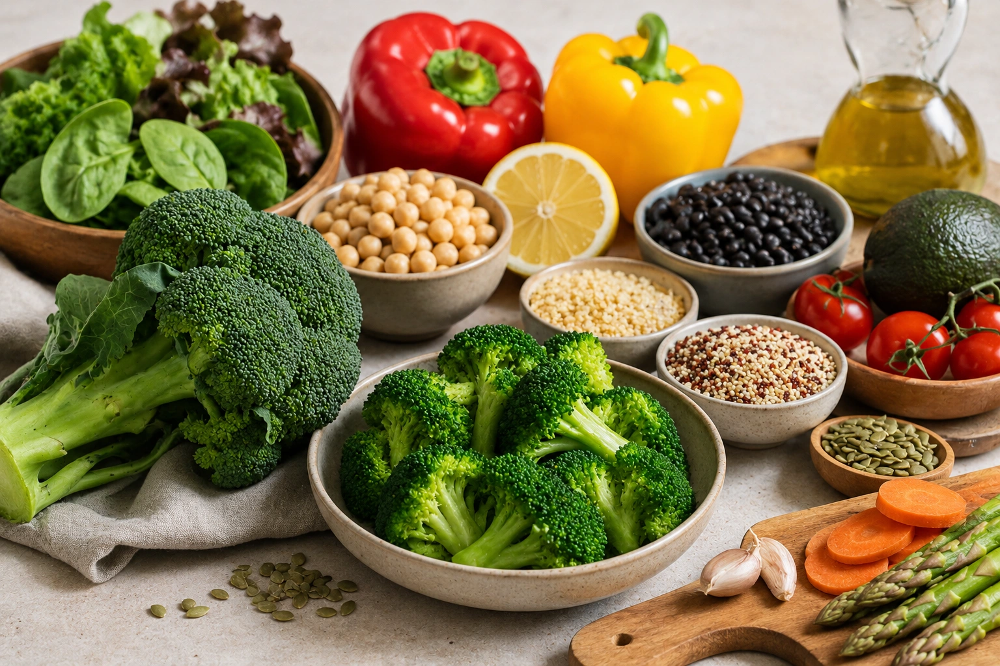
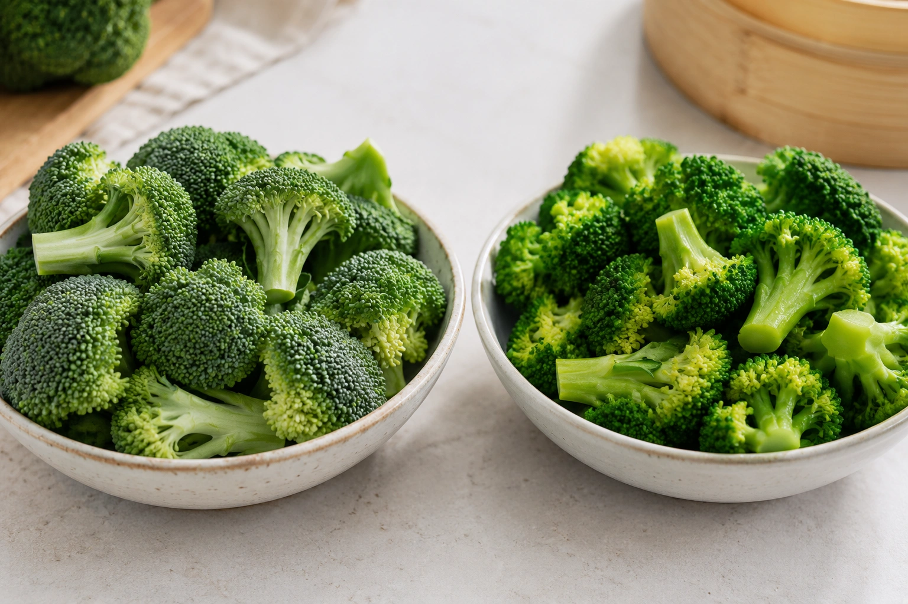
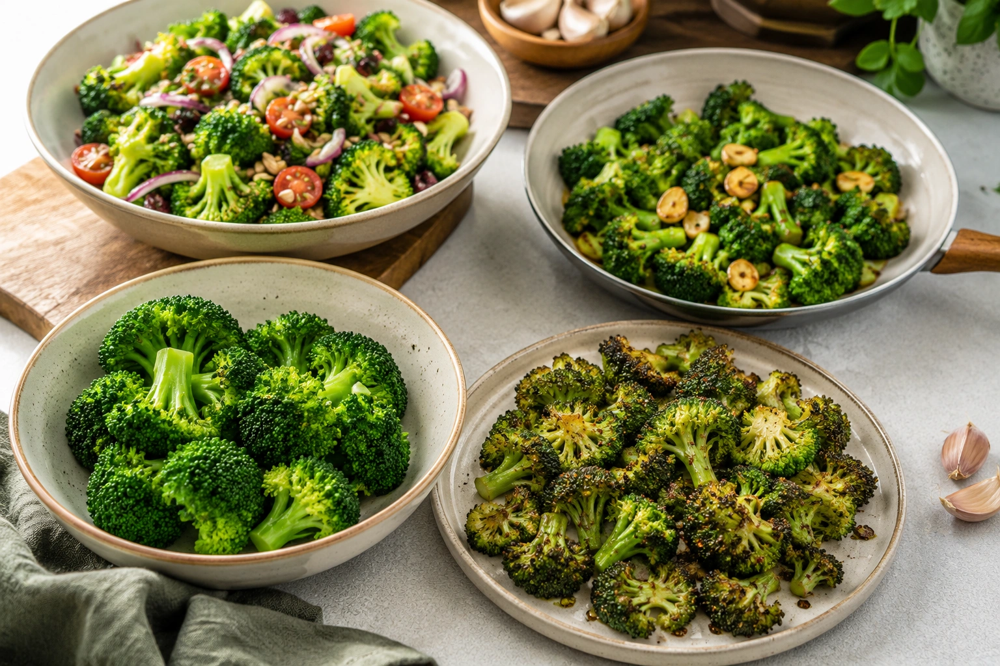

Broccoli frequently appears on lists of “superfoods,” anticancer foods, detox vegetables and foods that supposedly “boost immunity.” Behind the marketing, there is a genuinely nutritious vegetable — but its value does not depend on miracle claims.

Broccoli (_Brassica oleracea_ var. _italica_) is a cruciferous vegetable, along with cauliflower, cabbage, kale and Brussels sprouts. In addition to fiber, vitamins and minerals, cruciferous vegetables contain glucosinolates, which can form biologically active compounds during food preparation, chewing and digestion. ([NCI](https://www.cancer.gov/about-cancer/causes-prevention/risk/diet/cruciferous-vegetables-fact-sheet 'Cruciferous Vegetables and Cancer Prevention'))

The evidence-based message is straightforward: **broccoli is an excellent vegetable to include in a varied diet, but it is neither medicine nor a nutritional shortcut.**

## What nutrients does broccoli provide?

Nutrient composition varies with growing conditions, storage and preparation. According to Brazil's TBCA database, 100 g of boiled, drained broccoli without added oil or salt provides approximately: ([TBCA](https://www.tbca.net.br/base-dados/int_composicao_estatistica.php?n0REd3kv7e86D%2BViXWYUnQ%3D%3D=GZzu8FRyInu2h2jsgc8xrQ%3D%3D 'TBCA Composição Química (Informação Estatística)'))

| Nutrient                   | Amount per 100 g |
| -------------------------- | ---------------: |
| Energy                     |          27 kcal |
| Total carbohydrates        |           4.44 g |
| Available carbohydrates    |           1.17 g |
| Protein                    |           2.71 g |
| Fat                        |           0.54 g |
| Dietary fiber              |           3.28 g |
| Calcium                    |          56.8 mg |
| Magnesium                  |          16.3 mg |
| Phosphorus                 |          37.1 mg |
| Potassium                  |           197 mg |
| Vitamin C                  |            47 mg |
| Folate equivalent          |           83 mcg |
| Vitamin A equivalent (RAE) |          185 mcg |

The nutritional value of broccoli is therefore not simply that it is “low calorie.” It combines fiber, micronutrients and plant compounds in a food with relatively low energy density. ([TBCA](https://www.tbca.net.br/base-dados/int_composicao_estatistica.php?n0REd3kv7e86D%2BViXWYUnQ%3D%3D=GZzu8FRyInu2h2jsgc8xrQ%3D%3D 'TBCA Composição Química (Informação Estatística)'))

## Is broccoli a good source of vitamin C?

Yes.

The cooked broccoli analyzed by TBCA contains approximately **47 mg of vitamin C per 100 g**. ([TBCA](https://www.tbca.net.br/base-dados/int_composicao_estatistica.php?n0REd3kv7e86D%2BViXWYUnQ%3D%3D=GZzu8FRyInu2h2jsgc8xrQ%3D%3D 'TBCA Composição Química (Informação Estatística)'))

The NIH also lists broccoli as a good food source of vitamin C. This vitamin participates in antioxidant functions and normal physiological processes involving immune cells. ([NIH ODS](https://ods.od.nih.gov/factsheets/VitaminC-HealthProfessional/ 'Vitamin C — Health Professional Fact Sheet'))

That does not mean broccoli acts like an immune-system drug.

Eating a vitamin C-containing vegetable contributes to nutritional adequacy. It does not guarantee protection against infections or create an immediate, generalized “immune boost.”

## Broccoli also contributes fiber

Cooked broccoli in the TBCA database provides about **3.28 g of dietary fiber per 100 g**. ([TBCA](https://www.tbca.net.br/base-dados/int_composicao_estatistica.php?n0REd3kv7e86D%2BViXWYUnQ%3D%3D=GZzu8FRyInu2h2jsgc8xrQ%3D%3D 'TBCA Composição Química (Informação Estatística)'))

WHO guidance recommends at least 25 g of naturally occurring dietary fiber per day for people older than 10 and at least 400 g of fruits and vegetables per day. ([WHO](https://www.who.int/news-room/fact-sheets/detail/healthy-diet 'Healthy diet'))

Broccoli can contribute to those goals alongside fruit, beans, lentils, whole grains, nuts, seeds and many other vegetables.

## What is sulforaphane?

Broccoli contains **glucosinolates**, a group of sulfur-containing plant compounds.

During cutting, chewing and digestion, glucosinolates can be transformed into biologically active substances, including isothiocyanates. One of the most extensively studied is **sulforaphane**. ([NCI](https://www.cancer.gov/about-cancer/causes-prevention/risk/diet/cruciferous-vegetables-fact-sheet 'Cruciferous Vegetables and Cancer Prevention'))

Laboratory and animal research has identified effects on pathways involving carcinogen metabolism, inflammation, cellular stress and programmed cell death. ([NCI](https://www.cancer.gov/about-cancer/causes-prevention/risk/diet/cruciferous-vegetables-fact-sheet 'Cruciferous Vegetables and Cancer Prevention'))

These mechanisms are scientifically interesting.

They do not prove that a serving of broccoli prevents or treats cancer in humans.

## Does broccoli prevent cancer?

The evidence does not justify such a simple claim.

The National Cancer Institute reports that indoles and isothiocyanates from cruciferous vegetables have produced promising results in laboratory and animal studies, while studies in humans have been mixed. ([NCI](https://www.cancer.gov/about-cancer/causes-prevention/risk/diet/cruciferous-vegetables-fact-sheet 'Cruciferous Vegetables and Cancer Prevention'))

A 2024 systematic review and meta-analysis specifically examining broccoli found an inverse association between broccoli intake and cancer risk in observational research. ([PubMed](https://pubmed.ncbi.nlm.nih.gov/38892516/ 'Broccoli Consumption and Risk of Cancer: An Updated Systematic Review and Meta-Analysis of Observational Studies'))

That association is worth investigating, but it does not establish cause and effect.

People who regularly eat broccoli may also eat more vegetables overall, exercise more, smoke less or have other characteristics that influence disease risk. The NCI specifically notes this challenge when interpreting observational nutrition studies. ([NCI](https://www.cancer.gov/about-cancer/causes-prevention/risk/diet/cruciferous-vegetables-fact-sheet 'Cruciferous Vegetables and Cancer Prevention'))

## Does broccoli “detox” your body?

This claim usually stretches the science beyond what it demonstrates.

Compounds derived from cruciferous vegetables can interact with enzymes and cellular pathways involved in processing potentially harmful substances. This is one reason researchers study isothiocyanates. ([NCI](https://www.cancer.gov/about-cancer/causes-prevention/risk/diet/cruciferous-vegetables-fact-sheet 'Cruciferous Vegetables and Cancer Prevention'))

But this is not the same as proving that eating broccoli provides a generalized “detox” or cleans the body after dietary excess.

A more evidence-based reason to eat broccoli is that it helps increase the proportion and variety of nutritious vegetables in the diet.

## Broccoli and heart health

Broccoli can fit naturally into eating patterns designed to support cardiovascular health, but it should not be marketed as a treatment for high cholesterol or hypertension.

WHO recommendations emphasize varied dietary patterns rich in vegetables, fruit, whole grains and pulses rather than dependence on one particular food. ([WHO](https://www.who.int/news-room/fact-sheets/detail/healthy-diet 'Healthy diet'))

Broccoli contributes fiber, potassium, vitamins and other plant compounds, but overall dietary quality remains more important than any single vegetable.

## Broccoli is rich in vitamin K

Vitamin K is one of broccoli's clinically relevant nutrients.

The NIH lists approximately **110 mcg of vitamin K in ½ cup of chopped, boiled broccoli**. ([NIH ODS](https://ods.od.nih.gov/factsheets/VitaminK-HealthProfessional/ 'Vitamin K — Health Professional Fact Sheet'))

Vitamin K is necessary for normal blood-clotting processes and the function of several vitamin K-dependent proteins. ([NIH ODS](https://ods.od.nih.gov/factsheets/VitaminK-HealthProfessional/ 'Vitamin K — Health Professional Fact Sheet'))

For most people, that simply adds to broccoli's nutritional value.

For people taking warfarin, it requires additional attention.

## What if you take warfarin?

Warfarin and similar medications interfere with vitamin K activity.

The NIH advises people taking these anticoagulants to maintain a consistent vitamin K intake because sudden increases or decreases can alter the anticoagulant effect. ([NIH ODS](https://ods.od.nih.gov/factsheets/VitaminK-HealthProfessional/ 'Vitamin K — Health Professional Fact Sheet'))

This does not mean everyone taking warfarin must completely avoid broccoli.

## Is broccoli bad for thyroid function?

This is another claim that needs context.

Certain compounds in _Brassica_ vegetables have produced thyroid-related effects under particular experimental conditions. That history contributed to the idea that broccoli and related vegetables are inherently “goitrogenic.”

However, a comprehensive 2024 systematic review found that the vast majority of available evidence casts doubt on meaningful antithyroid effects from normal _Brassica_ consumption in humans. ([PubMed](https://pubmed.ncbi.nlm.nih.gov/38612798/ 'Do Brassica Vegetables Affect Thyroid Function?—A Comprehensive Systematic Review'))

There is therefore little justification for telling everyone with hypothyroidism to automatically eliminate broccoli, cauliflower, cabbage and kale.

Individual medical situations still matter, especially when iodine deficiency or other nutritional restrictions are present.

## Raw or cooked: which is better?

Both can be part of a healthy diet.

Cooking affects some nutrients and bioactive compounds.

Vitamin C is water-soluble and sensitive to heat. NIH guidance notes that prolonged storage and cooking can reduce vitamin C levels and that steaming or microwaving may help limit some losses. ([NIH ODS](https://ods.od.nih.gov/factsheets/VitaminC-HealthProfessional/ 'Vitamin C — Health Professional Fact Sheet'))

In one experimental study comparing five cooking techniques, steaming produced the lowest overall loss of vitamin C and glucosinolates among the methods tested. ([PubMed](https://pubmed.ncbi.nlm.nih.gov/19650196/ 'Effects of different cooking methods on health-promoting compounds of broccoli'))

That does not make boiled, roasted or stir-fried broccoli “unhealthy.”

The best cooking technique is also one that makes vegetables enjoyable enough to eat regularly.

## Practical ways to eat broccoli

Broccoli can be:

- lightly steamed;
- sautéed with garlic and olive oil;
- roasted with herbs and spices;
- added to rice or pasta;
- included in soups;
- served with eggs;
- combined with lentils, beans or chickpeas;
- used in salads when appropriately cleaned and prepared.

A small amount of dietary fat can also be useful. The NIH notes that consuming vegetables with some fat improves absorption of plant-derived vitamin K compared with eating them without fat. ([NIH ODS](https://ods.od.nih.gov/factsheets/VitaminK-HealthProfessional/ 'Vitamin K — Health Professional Fact Sheet'))

## Do you need broccoli every day?

No.

WHO healthy-diet guidance emphasizes adequacy, balance, moderation and diversity. ([WHO](https://www.who.int/news-room/fact-sheets/detail/healthy-diet 'Healthy diet'))

Broccoli can be rotated with cauliflower, cabbage, leafy greens, carrots, squash, tomatoes, peppers and many other vegetables.

Eating a wide variety of vegetables is a stronger nutritional strategy than treating one food as mandatory.

## Does broccoli cause weight loss?

Broccoli does not independently cause weight loss.

Its low energy density and fiber content can make it a useful ingredient in filling, nutrient-dense meals. The TBCA preparation provides about 27 kcal and 3.28 g of fiber per 100 g. ([TBCA](https://www.tbca.net.br/base-dados/int_composicao_estatistica.php?n0REd3kv7e86D%2BViXWYUnQ%3D%3D=GZzu8FRyInu2h2jsgc8xrQ%3D%3D 'TBCA Composição Química (Informação Estatística)'))

Body weight, however, reflects overall energy intake and expenditure alongside physical activity, sleep, medications, health conditions and behavioral factors.

Claims that broccoli “burns fat” are not supported by the sources reviewed for this article.

## What benefits can we confidently describe?

Once exaggerated promises are removed, broccoli still has plenty going for it.

It provides vitamin C, fiber, folate, carotenoids, potassium, calcium and vitamin K. It also contains glucosinolates that produce bioactive compounds of continuing scientific interest. ([TBCA](https://www.tbca.net.br/base-dados/int_composicao_estatistica.php?n0REd3kv7e86D%2BViXWYUnQ%3D%3D=GZzu8FRyInu2h2jsgc8xrQ%3D%3D 'TBCA Composição Química (Informação Estatística)'))

What the evidence does **not** justify is claiming that broccoli alone prevents cancer, detoxifies the body, treats thyroid disease, guarantees stronger immunity or directly causes weight loss.

Broccoli is a better vitamin C source than its reputation suggests — worth seeing how it compares with fruit:

[Vitamin C-Rich Fruits: 8 Options and How Much They Provide](/en/articles/vitamin-c-rich-fruits/)

## Conclusion

Broccoli deserves a place in a healthy diet without needing to be called a miracle food.

It provides **fiber, vitamin C, folate, vitamin K, carotenoids and minerals**, along with glucosinolates that continue to be studied for their biological effects. ([TBCA](https://www.tbca.net.br/base-dados/int_composicao_estatistica.php?n0REd3kv7e86D%2BViXWYUnQ%3D%3D=GZzu8FRyInu2h2jsgc8xrQ%3D%3D 'TBCA Composição Química (Informação Estatística)'))

Research on sulforaphane and cancer risk is intriguing, but it does not establish broccoli as a proven cancer-prevention treatment. Likewise, available evidence does not support widespread fear of normal cruciferous vegetable intake because of thyroid concerns. ([PubMed](https://pubmed.ncbi.nlm.nih.gov/38892516/ 'Broccoli Consumption and Risk of Cancer: An Updated Systematic Review and Meta-Analysis of Observational Studies'))

The practical message is simple: **eat broccoli if you enjoy it, vary your vegetables and judge your diet by the overall pattern rather than by individual “superfoods.”**

---
