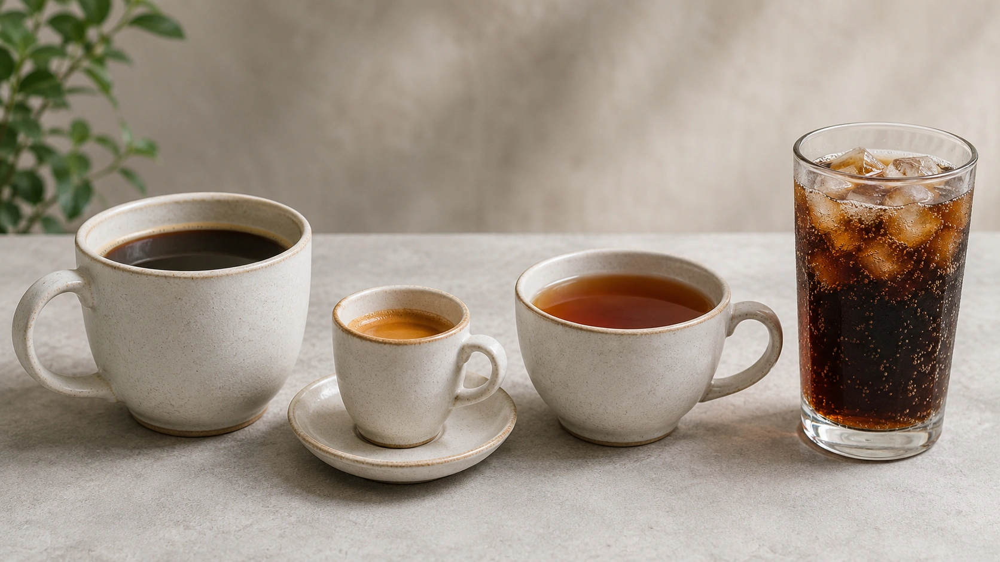
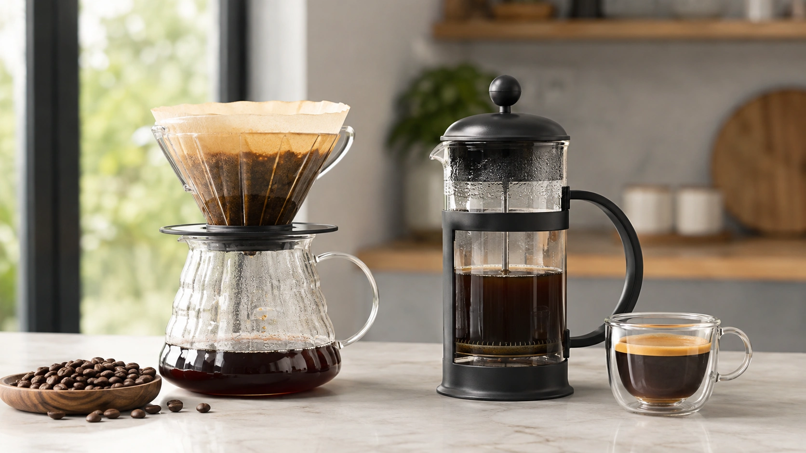
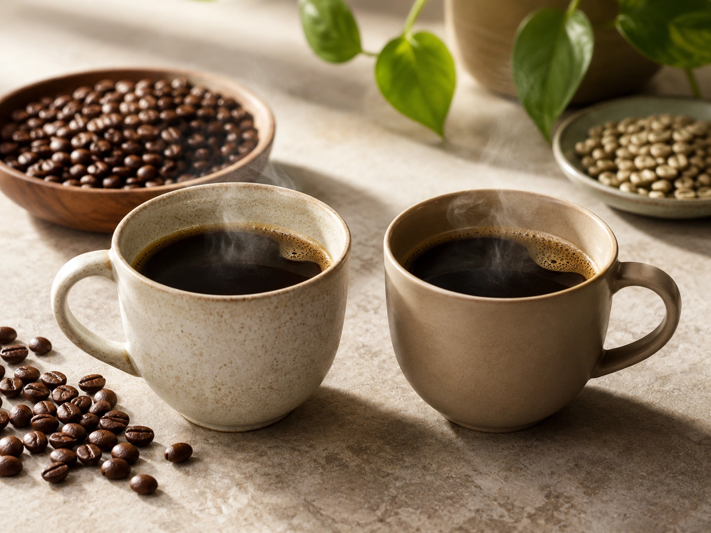

Coffee has spent decades moving between two extremes. At times it has been blamed for heart problems, dehydration and high blood pressure. At others, it has been portrayed as a drink capable of extending life, preventing diabetes and protecting the brain.

Current evidence supports neither extreme. **For most healthy adults, moderate coffee consumption can fit into a healthy diet and does not appear to increase the risk of major chronic diseases.** At the same time, excessive caffeine can produce meaningful adverse effects, particularly involving sleep, anxiety, blood pressure and palpitations. ([PubMed](https://pubmed.ncbi.nlm.nih.gov/29167102/ 'Coffee consumption and health: umbrella review of meta-analyses of multiple health outcomes'))

The better question is therefore not simply whether coffee is good or bad, but **how much you drink, how much caffeine that actually provides and how your body responds to it**.

## Coffee and caffeine are not the same thing

Coffee is a complex beverage containing caffeine along with numerous other compounds, including polyphenols. Caffeine, meanwhile, is a stimulant also found in tea, chocolate, guarana, soft drinks, energy drinks, supplements and some medications. ([Harvard T.H. Chan](https://nutritionsource.hsph.harvard.edu/caffeine/ 'Caffeine'))

This distinction matters because health findings associated with coffee cannot automatically be attributed to caffeine.

Decaffeinated coffee, for example, has also been associated with favorable outcomes in observational research, suggesting that compounds beyond caffeine may play a role. ([Harvard T.H. Chan](https://nutritionsource.hsph.harvard.edu/food-features/coffee/ 'Coffee'))

## What does caffeine do?

Caffeine stimulates the central nervous system. In moderate doses it can increase alertness and reduce sleepiness. ([EFSA](https://www.efsa.europa.eu/en/topics/topic/caffeine 'Caffeine'))

It is absorbed relatively quickly. Harvard reports that caffeine concentrations can peak in the blood from about 15 minutes to two hours after intake, while the time required to clear it varies widely between individuals. Pregnancy, smoking and certain medications can alter caffeine metabolism. ([Harvard T.H. Chan](https://nutritionsource.hsph.harvard.edu/caffeine/ 'Caffeine'))

This explains why identical servings of coffee can affect two people very differently.

## How much caffeine is considered safe?

For **healthy adults**, FDA and EFSA converge on a similar reference.

FDA considers **400 mg per day** an amount not generally associated with negative effects for most adults. EFSA likewise concludes that up to **400 mg per day**, consumed throughout the day, does not raise safety concerns for healthy adults. ([FDA](https://www.fda.gov/consumers/consumer-updates/spilling-beans-how-much-caffeine-too-much 'Spilling the Beans: How Much Caffeine is Too Much?'))

EFSA also considers **single doses of up to 200 mg** to be of no safety concern for the general healthy adult population. ([EFSA](https://www.efsa.europa.eu/en/topics/topic/caffeine 'Caffeine'))

## How many cups equal 400 mg?

That question has no fixed answer.

Caffeine content varies according to bean type, brewing method, amount of coffee used, extraction time, concentration and serving size. ([EFSA](https://www.efsa.europa.eu/en/topics/topic/caffeine 'Caffeine'))

| Beverage              | Approximate caffeine |
| --------------------- | -------------------: |
| Filter coffee, 200 ml |               ~90 mg |
| Espresso, 60 ml       |               ~80 mg |
| Brewed coffee, 355 ml |          ~113–247 mg |
| Black tea, 220 ml     |               ~50 mg |
| Cola, 355 ml          |               ~40 mg |
| Energy drink, 250 ml  |               ~80 mg |

These figures are approximate and may vary considerably. ([EFSA](https://www.efsa.europa.eu/en/topics/topic/caffeine 'Caffeine'))

This is why counting milligrams is more reliable than simply counting cups.

## Are three or four cups a day beneficial?

Large observational studies often find favorable associations at moderate intakes.

A major umbrella review published in the _BMJ_ found that coffee consumption was more often associated with benefit than harm, with the most favorable associations for several outcomes commonly appearing around **three to four cups per day** compared with none. ([PubMed](https://pubmed.ncbi.nlm.nih.gov/29167102/ 'Coffee consumption and health: umbrella review of meta-analyses of multiple health outcomes'))

That is not a prescription.

Much of this evidence is observational, meaning researchers compare the health outcomes of people with different coffee habits rather than randomly assigning them to drink coffee for decades. Lifestyle differences and residual confounding may therefore influence the results. ([PubMed](https://pubmed.ncbi.nlm.nih.gov/29167102/ 'Coffee consumption and health: umbrella review of meta-analyses of multiple health outcomes'))

Moderate intake appears compatible with good health, but people who do not drink coffee do not need to start for health reasons.

## Coffee and type 2 diabetes

One of the more consistent findings in coffee research is an inverse association between habitual coffee intake and the development of type 2 diabetes.

A comprehensive 2024 review described consistent evidence linking greater habitual coffee intake with lower type 2 diabetes risk. Similar associations have also been observed with decaffeinated coffee, suggesting that caffeine is unlikely to explain the entire relationship. ([Springer](https://link.springer.com/article/10.1007/s11357-024-01262-5 'Coffee consumption and cardiometabolic health: a comprehensive review of the evidence'))

This does not mean caffeine immediately improves blood glucose. Acute caffeine effects can differ from long-term associations seen in habitual coffee drinkers. ([Harvard T.H. Chan](https://nutritionsource.hsph.harvard.edu/food-features/coffee/ 'Coffee'))

Nor should coffee be treated as therapy for diabetes.

## What about cardiovascular health?

The relationship between coffee and heart health is nuanced.

The 2024 cardiometabolic review concluded that habitual coffee consumption does not appear to increase long-term hypertension risk and may be associated with lower risks of certain cardiovascular outcomes, particularly stroke at moderate intakes. Evidence regarding coronary heart disease remains less uniform. ([Springer](https://link.springer.com/article/10.1007/s11357-024-01262-5 'Coffee consumption and cardiometabolic health: a comprehensive review of the evidence'))

The earlier _BMJ_ umbrella review similarly found favorable associations for cardiovascular disease and cardiovascular mortality at moderate coffee intakes. Because these findings rely heavily on observational studies, however, they should not be interpreted as proof that coffee prevents heart disease. ([PubMed](https://pubmed.ncbi.nlm.nih.gov/29167102/ 'Coffee consumption and health: umbrella review of meta-analyses of multiple health outcomes'))

## Does coffee raise blood pressure?

Caffeine can temporarily increase blood pressure, particularly in people who do not consume it regularly. Some tolerance develops with habitual intake. ([Harvard T.H. Chan](https://nutritionsource.hsph.harvard.edu/caffeine/ 'Caffeine'))

Long-term evidence tells a different story. Habitual coffee intake does not appear to increase the risk of developing hypertension in the general population. ([Springer](https://link.springer.com/article/10.1007/s11357-024-01262-5 'Coffee consumption and cardiometabolic health: a comprehensive review of the evidence'))

Individual response still matters. Someone with uncontrolled hypertension or clear symptoms after caffeine may need a lower intake than general population limits suggest.

## Does coffee cause arrhythmias?

High caffeine intake can make some people feel their heart race or experience palpitations. FDA lists increased heart rate and palpitations among signs of excessive caffeine intake. ([FDA](https://www.fda.gov/consumers/consumer-updates/spilling-beans-how-much-caffeine-too-much 'Spilling the Beans: How Much Caffeine is Too Much?'))

At the population level, however, moderate habitual coffee consumption has not consistently been associated with greater atrial fibrillation risk. ([Harvard T.H. Chan](https://nutritionsource.hsph.harvard.edu/caffeine/ 'Caffeine'))

People with a diagnosed arrhythmia should nevertheless individualize their caffeine intake with their healthcare professional.

## Coffee and sleep

Sleep is one of the areas where caffeine's adverse effects are particularly clear.

A 2023 systematic review and meta-analysis found that caffeine reduced total sleep time, lowered sleep efficiency and increased the time required to fall asleep. ([PubMed](https://pubmed.ncbi.nlm.nih.gov/36870101/ 'The effect of caffeine on subsequent sleep: A systematic review and meta-analysis'))

EFSA notes that even **100 mg of caffeine** may affect sleep duration and sleep patterns in some adults when consumed close to bedtime. ([EFSA](https://www.efsa.europa.eu/en/topics/topic/caffeine 'Caffeine'))

There is no universal caffeine cutoff time because metabolism varies considerably. ([Harvard T.H. Chan](https://nutritionsource.hsph.harvard.edu/caffeine/ 'Caffeine'))

For anyone struggling with sleep, moving the final caffeinated drink earlier in the day and reducing the dose is often more useful than simply asking whether total intake remains below 400 mg.

## Can caffeine worsen anxiety?

Yes, especially in susceptible individuals.

FDA lists anxiety and jitteriness among symptoms of excessive caffeine intake. Harvard also notes that larger doses may produce nervousness and an increased heart rate, particularly in people with underlying anxiety or panic disorders. ([FDA](https://www.fda.gov/consumers/consumer-updates/spilling-beans-how-much-caffeine-too-much 'Spilling the Beans: How Much Caffeine is Too Much?'))

This is another example of why a population-level safety limit should not be treated as an ideal personal dose.

## Why do I get headaches if I skip coffee?

Regular caffeine use can lead to tolerance and physical adaptation.

Abruptly stopping caffeine may cause withdrawal symptoms such as headache, fatigue, irritability and changes in mood. These symptoms are generally temporary. ([Harvard T.H. Chan](https://nutritionsource.hsph.harvard.edu/caffeine/ 'Caffeine'))

FDA recommends gradually reducing intake when possible rather than stopping abruptly if someone regularly consumes substantial amounts. ([FDA](https://www.fda.gov/consumers/consumer-updates/spilling-beans-how-much-caffeine-too-much 'Spilling the Beans: How Much Caffeine is Too Much?'))

## Does coffee dehydrate you?

Caffeine can increase urine production temporarily in some circumstances, but this does not mean that habitual coffee drinkers automatically become dehydrated.

Coffee and tea also contribute water to total fluid intake, and available evidence does not support the idea that normal coffee intake must be “cancelled out” with a fixed amount of extra water. ([Harvard T.H. Chan](https://nutritionsource.hsph.harvard.edu/water/ 'How Much Water Do You Need? - The Nutrition Source'))

Water should still remain a primary source of hydration.

## What you add to coffee matters

Black coffee and a large specialty coffee drink containing syrups, sugar and cream are not nutritionally equivalent.

Research associating coffee with favorable health outcomes should not automatically be applied to every beverage that contains coffee.

Added sugar, saturated fat and total calories can substantially change the nutritional profile of a drink.

## Brewing method and cholesterol

Coffee contains diterpenes known as **cafestol and kahweol**, which can raise LDL cholesterol. How much reaches the cup depends strongly on the brewing method. ([Harvard T.H. Chan](https://nutritionsource.hsph.harvard.edu/food-features/coffee/ 'Coffee'))

Unfiltered methods, including some French press and boiled coffees, retain more diterpenes. Paper filtering removes much of them, leaving filtered coffee with very low concentrations. ([Harvard T.H. Chan](https://nutritionsource.hsph.harvard.edu/food-features/coffee/ 'Coffee'))

This distinction is most relevant for people who drink substantial quantities and already have elevated LDL or high cardiovascular risk.

## Is espresso a problem because it is not paper-filtered?

Not necessarily.

Harvard describes espresso as containing moderate amounts of diterpenes, while serving sizes are typically much smaller than those of many brewed coffees. ([Harvard T.H. Chan](https://nutritionsource.hsph.harvard.edu/food-features/coffee/ 'Coffee'))

Total exposure therefore depends on both concentration and the amount consumed.

## Is decaf a good option?

For caffeine-sensitive people, decaf can be very useful.

Decaffeinated coffee is not always completely caffeine-free. FDA reports that an 8-ounce cup typically contains approximately **2 to 15 mg of caffeine**, much less than regular coffee. ([FDA](https://www.fda.gov/consumers/consumer-updates/spilling-beans-how-much-caffeine-too-much 'Spilling the Beans: How Much Caffeine is Too Much?'))

Decaf still contains many non-caffeine coffee compounds, and observational research has found favorable associations with some health outcomes. ([Harvard T.H. Chan](https://nutritionsource.hsph.harvard.edu/food-features/coffee/ 'Coffee'))

It can therefore allow people to enjoy coffee while substantially reducing stimulant exposure.

## Coffee during pregnancy

Pregnancy has a different caffeine limit.

EFSA considers **up to 200 mg of caffeine per day from all sources** an intake that does not raise safety concerns for the fetus. ACOG similarly recommends keeping caffeine intake below 200 mg per day during pregnancy. ([EFSA](https://www.efsa.europa.eu/en/topics/topic/caffeine 'Caffeine'))

Sources include coffee, tea, chocolate, soft drinks, energy drinks, supplements and some medications.

Caffeine also remains in the body longer during pregnancy, particularly later in gestation. ([Harvard T.H. Chan](https://nutritionsource.hsph.harvard.edu/caffeine/ 'Caffeine'))

## Who should be especially cautious?

The 400 mg reference applies to the general healthy adult population. EFSA specifically notes that its assessment does not establish safety for people with diseases or medical conditions or in combination with medications. ([EFSA](https://www.efsa.europa.eu/en/topics/topic/caffeine 'Caffeine'))

Extra caution is reasonable for people with significant insomnia, symptomatic arrhythmias, uncontrolled hypertension, anxiety or panic symptoms, pregnancy, or medication-related concerns.

## Signs that your caffeine intake may be too high

FDA lists possible symptoms including:

- increased heart rate;
- palpitations;
- elevated blood pressure;
- insomnia or sleep disruption;
- anxiety;
- jitteriness;
- upset stomach;
- nausea;
- headache. ([FDA](https://www.fda.gov/consumers/consumer-updates/spilling-beans-how-much-caffeine-too-much 'Spilling the Beans: How Much Caffeine is Too Much?'))

Repeated symptoms are a strong reason to reconsider intake even if the total remains below 400 mg.

## Can very high caffeine intake be dangerous?

Yes.

Drinking ordinary coffee and consuming highly concentrated caffeine are not equivalent risks.

FDA warns that pure and highly concentrated caffeine products can cause serious harm. Rapid intake of around **1,200 mg** may produce toxic effects such as seizures, although toxicity varies between individuals and concentrated products pose an additional dosing-error risk. ([FDA](https://www.fda.gov/consumers/consumer-updates/spilling-beans-how-much-caffeine-too-much 'Spilling the Beans: How Much Caffeine is Too Much?'))

## Do you need coffee for better health?

No.

Associations between coffee and lower disease risk do not prove that a person who currently avoids coffee would become healthier by starting to drink it.

The _BMJ_ umbrella review itself emphasized the need for randomized trials to determine whether the observed associations are truly causal. ([PubMed](https://pubmed.ncbi.nlm.nih.gov/29167102/ 'Coffee consumption and health: umbrella review of meta-analyses of multiple health outcomes'))

A healthy dietary pattern, physical activity, sufficient sleep, avoidance of smoking and appropriate management of blood pressure, cholesterol and glucose are much more fundamental than whether someone drinks coffee.

## Finding the amount that works for you

A practical approach is to use the smallest amount that provides enjoyment or the desired alertness without creating problems elsewhere.

Consider:

1. Approximate caffeine intake from each drink.
2. Other caffeine sources during the day.
3. Anxiety, palpitations or jitteriness.
4. Whether sleep becomes harder or less restorative.
5. Sugar and calorie additions to coffee drinks.
6. Brewing method if LDL cholesterol is a concern.
7. Medical conditions or medications that require personalized advice.

The best personal dose is not necessarily the highest dose considered safe.

The same caffeine has a second use, with its own literature and doses quite unlike a cup of coffee:

[Does Caffeine Improve Workout Performance? What Studies Show](/en/articles/does-caffeine-improve-workout-performance/)

## Conclusion

For most healthy adults, **moderate coffee intake appears more compatible with benefit than harm** based on the current body of evidence. Long-term studies associate coffee consumption with lower risks of type 2 diabetes, mortality and some cardiovascular outcomes, although these findings do not prove causation. ([PubMed](https://pubmed.ncbi.nlm.nih.gov/29167102/ 'Coffee consumption and health: umbrella review of meta-analyses of multiple health outcomes'))

For caffeine itself, **up to 400 mg per day** is the main safety reference used by FDA and EFSA for healthy adults. That does not mean everyone tolerates that amount or should aim to consume it. ([FDA](https://www.fda.gov/consumers/consumer-updates/spilling-beans-how-much-caffeine-too-much 'Spilling the Beans: How Much Caffeine is Too Much?'))

Sleep, anxiety, palpitations, pregnancy, medication use, blood pressure and brewing method can all change the individual equation.

The most useful question is therefore not simply “Is coffee good or bad?” but **how much coffee, how much caffeine, at what time and for whom?**

---
