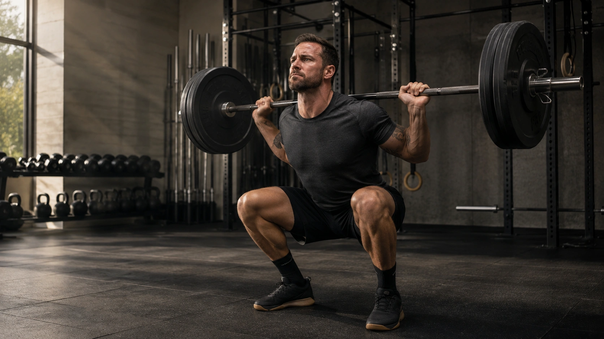

Caffeine is one of the most extensively studied ergogenic aids in sports nutrition. The accumulated evidence supports a fairly clear conclusion: **caffeine can improve several aspects of exercise performance**, although the magnitude of the benefit varies and individual responses are not identical. ([PubMed](https://pubmed.ncbi.nlm.nih.gov/30926628/ 'Wake up and smell the coffee: caffeine supplementation and exercise performance—an umbrella review of 21 published meta-analyses'))

That does not mean that more caffeine automatically produces a better workout. More recent research suggests that relatively low doses can also be effective, while higher intakes increase the likelihood of unwanted effects. ([PubMed](https://pubmed.ncbi.nlm.nih.gov/35203046/ 'Exploring the minimum ergogenic dose of caffeine on resistance exercise performance: A meta-analytic approach'))

## How can caffeine improve exercise performance?

One of caffeine's major ergogenic mechanisms involves the central nervous system. Its antagonism of adenosine receptors can increase alertness and influence fatigue and perceived effort during exercise. ([PubMed](https://pubmed.ncbi.nlm.nih.gov/34291426/))

In practical terms, this may help some athletes sustain effort longer, produce slightly greater power or better maintain movement velocity.

The effects are not identical across every sport or workout. It is therefore more useful to consider individual performance outcomes rather than asking whether caffeine simply “works”.

## Does caffeine improve endurance?

Evidence supporting caffeine during predominantly aerobic exercise is consistent. Systematic reviews indicate a small but meaningful average improvement across several endurance outcomes. ([PubMed](https://pubmed.ncbi.nlm.nih.gov/30926628/ 'Wake up and smell the coffee: caffeine supplementation and exercise performance—an umbrella review of 21 published meta-analyses'))

A 2026 systematic review and meta-analysis specifically examined aerobic time-trial performance. Both low doses of roughly **1.3–3 mg/kg** and moderate doses of **4–6 mg/kg** improved completion times compared with placebo. ([PubMed](https://pubmed.ncbi.nlm.nih.gov/42356375/ 'Dose-Response Effect of Oral Caffeine Use on Aerobic Exercise Performance: A Systematic Review and Meta-Analysis'))

This is important because it suggests athletes do not necessarily need a high dose to obtain a measurable ergogenic effect.

## What about resistance training?

Caffeine also has favorable evidence for resistance exercise.

A meta-analysis evaluating very low doses of approximately **0.9–2 mg/kg** found statistically significant improvements in muscular strength, muscular endurance and mean movement velocity. Effects on strength and endurance were small, while the reported effect on movement velocity was larger. ([PubMed](https://pubmed.ncbi.nlm.nih.gov/35203046/ 'Exploring the minimum ergogenic dose of caffeine on resistance exercise performance: A meta-analytic approach'))

A separate review concluded that there is convincing evidence supporting improvements in maximal strength, muscular endurance, velocity and power across different resistance-training protocols. ([PubMed](https://pubmed.ncbi.nlm.nih.gov/34291426/))

Newer research strengthens that conclusion. A 2025 systematic review and meta-analysis found that acute caffeine intake increased movement velocity and power output during resistance exercise. ([Frontiers](https://www.frontiersin.org/journals/nutrition/articles/10.3389/fnut.2025.1686283/full 'Effects of acute caffeine intake on muscular power during resistance exercise: a systematic review and meta-analysis'))

The practical effect is still generally modest. Caffeine should therefore be viewed as a potential performance enhancer rather than a substitute for training quality, programming or recovery.

## What is the best caffeine dose before a workout?

The range of **3–6 mg of caffeine per kilogram of body weight** has traditionally received the most attention. The International Society of Sports Nutrition considers this range consistently ergogenic across several types of exercise. ([PubMed](https://pubmed.ncbi.nlm.nih.gov/33388079/ 'International Society of Sports Nutrition position stand: caffeine and exercise performance'))

However, it is not a requirement.

| Studied dose                    | What the evidence suggests                                          |
| ------------------------------- | ------------------------------------------------------------------- |
| Around 1–2 mg/kg                | May improve several resistance-exercise outcomes                    |
| Around 1.3–3 mg/kg              | May enhance aerobic time-trial performance                          |
| 3–6 mg/kg                       | Extensively studied range with consistent evidence                  |
| Very high doses such as 9 mg/kg | More side effects and generally unnecessary for an ergogenic effect |

([PubMed](https://pubmed.ncbi.nlm.nih.gov/35203046/ 'Exploring the minimum ergogenic dose of caffeine on resistance exercise performance: A meta-analytic approach'))

For a 70 kg person, 3 mg/kg equals 210 mg, whereas 6 mg/kg equals 420 mg.

This illustrates why a **sports-performance dose should not be confused with a general safety limit**. The FDA cites 400 mg per day as an amount not generally associated with negative effects for most adults, while EFSA reports that single doses up to 200 mg do not raise safety concerns for healthy adults, including when consumed before intense exercise under normal conditions. ([FDA](https://www.fda.gov/consumers/consumer-updates/spilling-beans-how-much-caffeine-too-much 'Spilling the Beans: How Much Caffeine is Too Much?'))

## When should caffeine be taken?

Approximately **60 minutes before exercise** is the most common protocol used in research. The ideal timing, however, depends on the source and delivery method. ([PubMed](https://pubmed.ncbi.nlm.nih.gov/33388079/ 'International Society of Sports Nutrition position stand: caffeine and exercise performance'))

Capsules are commonly used 30–60 minutes before training, while caffeinated gum may work when consumed closer to the start of exercise. ([PubMed](https://pubmed.ncbi.nlm.nih.gov/34291426/))

There is therefore no single timing rule that applies equally to every caffeine-containing product.

## Coffee or caffeine supplements?

The primary stimulant remains caffeine whether it occurs naturally in coffee or tea or is added to another product. The FDA notes that the body does not distinguish between naturally occurring and added caffeine in terms of how it handles the substance. ([FDA](https://www.fda.gov/consumers/consumer-updates/spilling-beans-how-much-caffeine-too-much 'Spilling the Beans: How Much Caffeine is Too Much?'))

For athletes, the main practical difference is dosing precision. The caffeine content of coffee can vary substantially between beverages and serving sizes. ([FDA](https://www.fda.gov/consumers/consumer-updates/spilling-beans-how-much-caffeine-too-much 'Spilling the Beans: How Much Caffeine is Too Much?'))

Coffee can therefore serve as a caffeine source, but standardized products are easier to use when a precise mg/kg dose is required.

## Do regular coffee drinkers become immune to the performance effect?

Probably not.

A systematic review and meta-analysis investigating habitual caffeine intake concluded that regular caffeine consumption does not appear to eliminate the acute ergogenic response. ([PubMed](https://pubmed.ncbi.nlm.nih.gov/35536449/))

Tolerance may still develop to some subjective stimulant effects. However, current evidence does not support the simple claim that every habitual coffee drinker needs to completely withdraw from caffeine for several days before it can improve exercise performance again. ([PubMed](https://pubmed.ncbi.nlm.nih.gov/35536449/))

## What are the potential side effects?

Sensitivity varies considerably between individuals.

The FDA lists possible effects of excessive caffeine intake including:

- increased heart rate;
- heart palpitations;
- high blood pressure;
- insomnia or disrupted sleep;
- anxiety;
- jitters;
- upset stomach;
- nausea;
- headache. ([FDA](https://www.fda.gov/consumers/consumer-updates/spilling-beans-how-much-caffeine-too-much 'Spilling the Beans: How Much Caffeine is Too Much?'))

This is one reason why identifying the lowest useful dose may be preferable to continually increasing caffeine intake.

People taking medications or living with certain medical conditions, as well as those who are pregnant, trying to become pregnant or breastfeeding, should discuss caffeine intake with a qualified healthcare professional. ([FDA](https://www.fda.gov/consumers/consumer-updates/spilling-beans-how-much-caffeine-too-much 'Spilling the Beans: How Much Caffeine is Too Much?'))

## The hidden trade-off: evening caffeine and sleep

A pre-workout dose may improve today's session while undermining part of the recovery process if it interferes with sleep.

A systematic review and meta-analysis of 24 studies found that caffeine reduced total sleep time by approximately **45 minutes**, reduced sleep efficiency by around **7%** and increased sleep-onset latency by roughly **9 minutes** on average. ([PubMed](https://pubmed.ncbi.nlm.nih.gov/36870101/ 'The effect of caffeine on subsequent sleep: A systematic review and meta-analysis'))

The actual effect depends on dose, timing and individual sensitivity. For athletes training in the evening, however, potential sleep disruption deserves as much consideration as the acute performance benefit.

## So, is caffeine worth using before a workout?

For healthy adults who tolerate it well, caffeine is among the sports-nutrition strategies with the strongest evidence for modest improvements across several exercise outcomes. ([PubMed](https://pubmed.ncbi.nlm.nih.gov/30926628/ 'Wake up and smell the coffee: caffeine supplementation and exercise performance—an umbrella review of 21 published meta-analyses'))

The evidence does not support a “more is better” approach.

A more practical decision should consider:

1. whether caffeine is actually needed for that session;
2. the lowest dose that produces a useful effect;
3. total caffeine intake throughout the day;
4. workout timing;
5. effects on sleep, anxiety and gastrointestinal comfort;
6. individual response.

Some people may respond well to relatively low doses. For others, the adverse effects may outweigh the performance benefit.

Outside training, the same substance raises other questions — safe dose, sleep, blood pressure and the heart:

[Is Coffee Good or Bad for You? Benefits, Caffeine and Safe Intake](/en/articles/coffee-benefits-caffeine-safe-intake/)

## Conclusion

**Yes, caffeine can improve workout performance.** The strongest evidence supports small but consistent average benefits across aerobic endurance, muscular strength, muscular endurance, movement velocity and power. ([PubMed](https://pubmed.ncbi.nlm.nih.gov/30926628/ 'Wake up and smell the coffee: caffeine supplementation and exercise performance—an umbrella review of 21 published meta-analyses'))

Although 3–6 mg/kg remains a commonly studied range, newer research shows that **lower doses can also be effective**. This matters because increasing caffeine intake can raise the risk of insomnia, anxiety, palpitations and other unwanted effects without guaranteeing proportionally better performance. ([PubMed](https://pubmed.ncbi.nlm.nih.gov/35203046/ 'Exploring the minimum ergogenic dose of caffeine on resistance exercise performance: A meta-analytic approach'))

Caffeine is best viewed as a tool rather than a requirement for a productive workout. Consistent training, adequate nutrition, hydration, sleep and recovery remain the foundation of long-term performance.

---
