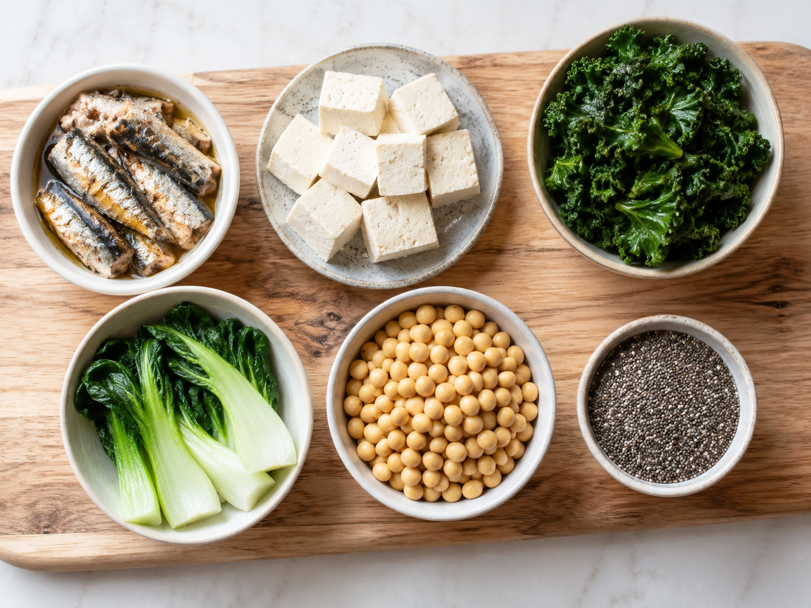
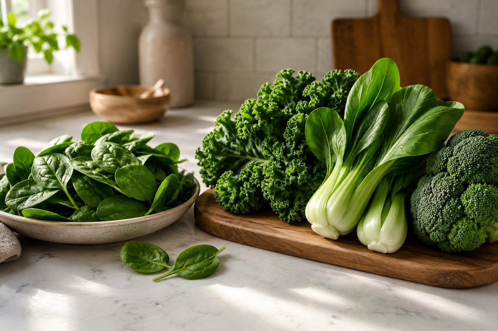
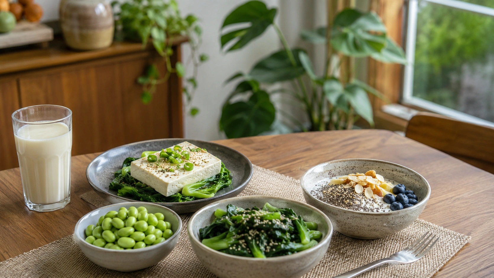

Calcium and milk are closely associated, and for good reason: dairy products are concentrated sources of the mineral. But milk is far from the only way to get calcium.

Bone-in sardines, calcium-set tofu, fortified plant beverages, soy foods, and certain leafy vegetables can all make meaningful contributions. Choosing good calcium sources, however, requires looking beyond the number of milligrams in a food and considering **how much of that calcium is actually available for absorption**. ([NIH ODS](https://ods.od.nih.gov/factsheets/Calcium-HealthProfessional/ 'Calcium — Fact Sheet for Health Professionals'))

## Why does the body need calcium?

Most of the body's calcium is stored in the skeleton. Calcium gives structure to bones and teeth, but it also participates in muscle function, nerve transmission, blood clotting, blood-vessel contraction and dilation, and hormone secretion. ([NIH ODS](https://ods.od.nih.gov/factsheets/Calcium-HealthProfessional/ 'Calcium — Fact Sheet for Health Professionals'))

Bone is constantly being remodeled, and the skeleton also serves as a calcium reservoir that helps the body maintain the tightly controlled calcium concentrations needed for normal physiology. ([NIH ODS](https://ods.od.nih.gov/factsheets/Calcium-HealthProfessional/ 'Calcium — Fact Sheet for Health Professionals'))

## How much calcium do adults need?

There is no single worldwide recommendation.

The U.S. National Academies sets the following Recommended Dietary Allowances for calcium: ([National Academies](https://www.nationalacademies.org/read/13050/chapter/7 'Dietary Reference Intakes for Calcium and Vitamin D'))

| Group                  | Recommended calcium intake |
| ---------------------- | -------------------------: |
| Adults ages 19–50      |               1,000 mg/day |
| Men ages 51–70         |               1,000 mg/day |
| Women ages 51–70       |               1,200 mg/day |
| Adults over 70         |               1,200 mg/day |
| Adolescents ages 14–18 |               1,300 mg/day |

European recommendations differ slightly. EFSA established a Population Reference Intake of **950 mg per day for adults aged 25 and older**. ([EFSA](https://www.efsa.europa.eu/en/efsajournal/pub/4101 'Scientific Opinion on Dietary Reference Values for calcium'))

## What foods provide calcium besides milk?

Useful sources come from both plant and animal foods. Some naturally contain calcium, while others are fortified with the mineral.

The following figures come from the NIH food table and should be regarded as approximate because nutrient content can vary by product and preparation. ([NIH ODS](https://ods.od.nih.gov/factsheets/Calcium-HealthProfessional/ 'Calcium — Fact Sheet for Health Professionals'))

| Food                                | Reference serving | Approximate calcium |
| ----------------------------------- | ----------------: | ------------------: |
| Canned sardines with bones          |              3 oz |              325 mg |
| Calcium-fortified soy milk          |             1 cup |              299 mg |
| Firm tofu made with calcium sulfate |           1/2 cup |              253 mg |
| Canned salmon with bones            |              3 oz |              181 mg |
| Cooked soybeans                     |           1/2 cup |              131 mg |
| Cooked kale                         |             1 cup |               94 mg |
| Chia seeds                          |      1 tablespoon |               76 mg |
| Raw shredded bok choy               |             1 cup |               74 mg |
| Pinto beans                         |           1/2 cup |               54 mg |

([NIH ODS](https://ods.od.nih.gov/factsheets/Calcium-HealthProfessional/ 'Calcium — Fact Sheet for Health Professionals'))

### Sardines and bone-in fish

Canned sardines are one of the more concentrated nondairy sources in the NIH table. Their small, edible bones are a major reason for the high calcium content.

Canned salmon can provide calcium for the same reason when its softened bones remain in the product and are eaten. ([NIH ODS](https://ods.od.nih.gov/factsheets/Calcium-HealthProfessional/ 'Calcium — Fact Sheet for Health Professionals'))

### Calcium-set tofu

Tofu deserves a closer look because its calcium content depends heavily on how it is produced.

The NIH lists about 253 mg of calcium in half a cup of firm tofu made with calcium sulfate. Tofu processed with other salts might contain substantially less calcium, making the ingredient list and nutrition label particularly useful. ([NIH ODS](https://ods.od.nih.gov/factsheets/Calcium-HealthProfessional/ 'Calcium — Fact Sheet for Health Professionals'))

### Fortified plant beverages

Soy, almond, oat, and other plant-based drinks should not automatically be assumed to match dairy milk nutritionally. When calcium is added, however, some products can provide similar amounts.

The NIH table lists around 299 mg of calcium in one cup of fortified soy milk. Because fortification practices vary between brands and countries, consumers should verify calcium content on the package rather than assuming all plant milks are equivalent. ([NIH ODS](https://ods.od.nih.gov/factsheets/Calcium-HealthProfessional/ 'Calcium — Fact Sheet for Health Professionals'))

### Leafy greens

Kale, bok choy, broccoli, and other vegetables can contribute calcium to the diet. Yet the total calcium listed in a nutrient database does not always indicate how much the body will absorb.

Plant compounds such as oxalates and phytates can bind calcium and reduce its bioavailability. The effect differs considerably between foods. ([NIH ODS](https://ods.od.nih.gov/factsheets/Calcium-HealthProfessional/ 'Calcium — Fact Sheet for Health Professionals'))

## Calcium content and calcium absorption are not the same thing

**Bioavailability** refers to the portion of a nutrient that can be absorbed and used by the body.

The NIH estimates calcium absorption from dairy and many fortified foods at around 30%. Some plant foods provide less absorbable calcium because oxalic and phytic acids can form compounds with the mineral in the digestive tract. ([NIH ODS](https://ods.od.nih.gov/factsheets/Calcium-HealthProfessional/ 'Calcium — Fact Sheet for Health Professionals'))

Spinach illustrates the difference. Half a cup of cooked spinach contains about 123 mg of calcium in the NIH table, yet estimated absorption is only around 5%. The figure given for milk is approximately 27%. ([NIH ODS](https://ods.od.nih.gov/factsheets/Calcium-HealthProfessional/ 'Calcium — Fact Sheet for Health Professionals'))

This does not make spinach unhealthy. It simply means that its calcium content should not be interpreted as being nutritionally equivalent to the same amount of calcium from a more bioavailable source.

Kale, broccoli, and cabbage contain less of the compounds that interfere with calcium absorption, giving their calcium better relative bioavailability, although their absolute calcium content per serving may still be lower. ([NIH ODS](https://ods.od.nih.gov/factsheets/Calcium-HealthProfessional/ 'Calcium — Fact Sheet for Health Professionals'))

## Vitamin D matters too

Calcium intake is only one part of bone nutrition.

Vitamin D supports active calcium absorption in the intestine and helps maintain calcium and phosphate concentrations required for normal bone mineralization. Poor vitamin D status can therefore reduce the body's ability to make optimal use of dietary calcium. ([NIH ODS](https://ods.od.nih.gov/factsheets/VitaminD-HealthProfessional/ 'Vitamin D — Fact Sheet for Health Professionals'))

That is one reason bone health cannot be reduced to eating a single calcium-rich food.

## Building a calcium-rich diet without relying on milk

A practical approach is to spread different calcium sources throughout the day.

Depending on dietary preferences, these might include:

- calcium-fortified plant beverages;
- calcium-set tofu;
- bone-in sardines or salmon;
- soybeans and other legumes;
- kale, bok choy, and broccoli;
- chia seeds;
- other calcium-fortified foods.

Harvard similarly identifies calcium across a wide range of foods, including leafy greens, beans, nuts, soy foods, bone-in fish, and fortified products. ([Harvard T.H. Chan](https://nutritionsource.hsph.harvard.edu/calcium/ 'Calcium'))

### What could that look like numerically?

Using the NIH values only as an illustration, one cup of fortified soy milk, half a cup of calcium-set tofu, half a cup of cooked soybeans, one cup of cooked kale, one tablespoon of chia seeds, and one cup of bok choy add up to approximately **927 mg of calcium** before any other foods are counted. ([NIH ODS](https://ods.od.nih.gov/factsheets/Calcium-HealthProfessional/ 'Calcium — Fact Sheet for Health Professionals'))

This is an illustration rather than a prescribed meal plan. Actual calcium intake varies with brands, serving sizes, preparation methods, individual requirements, and absorption.

## Who should pay closer attention?

People with a milk allergy, individuals who completely avoid dairy because of lactose intolerance, and people following vegan diets can have a higher risk of inadequate calcium intake. ([NIH ODS](https://ods.od.nih.gov/factsheets/Calcium-HealthProfessional/ 'Calcium — Fact Sheet for Health Professionals'))

That does not mean dairy-free diets are inherently calcium deficient. It does mean alternative sources need to be included intentionally.

For people with lactose intolerance who do not need to avoid dairy proteins, lactose-free and reduced-lactose dairy products contain calcium amounts comparable with their regular counterparts. ([NIH ODS](https://ods.od.nih.gov/factsheets/Calcium-HealthProfessional/ 'Calcium — Fact Sheet for Health Professionals'))

## What about calcium supplements?

Avoiding milk does not automatically mean a calcium supplement is needed.

Dietary intake should be considered first, along with age, health conditions, medications, and individual requirements. The NIH notes that people who avoid dairy may need calcium-fortified foods and, in some cases, supplements to meet recommended intakes. ([NIH ODS](https://ods.od.nih.gov/factsheets/Calcium-HealthProfessional/ 'Calcium — Fact Sheet for Health Professionals'))

When supplements are appropriate, larger doses are not necessarily better absorbed. The NIH reports that absorption from supplements is highest with elemental calcium doses of 500 mg or less at one time. Supplements can also cause gastrointestinal effects and interact with some medications. ([NIH ODS](https://ods.od.nih.gov/factsheets/Calcium-HealthProfessional/ 'Calcium — Fact Sheet for Health Professionals'))

## Conclusion

Milk is a convenient calcium source, but it does not have a monopoly on the mineral.

Bone-in sardines, calcium-set tofu, fortified plant beverages, soy foods, kale, bok choy, and other foods can all contribute significantly to daily calcium intake. The best combination depends on dietary pattern, preferences, and individual needs. ([NIH ODS](https://ods.od.nih.gov/factsheets/Calcium-HealthProfessional/ 'Calcium — Fact Sheet for Health Professionals'))

The key is to consider both **how much calcium a food contains and how well that calcium is absorbed**. Variety, careful label reading, and adequate vitamin D status provide a more useful strategy than focusing on a single food. ([NIH ODS](https://ods.od.nih.gov/factsheets/Calcium-HealthProfessional/ 'Calcium — Fact Sheet for Health Professionals'))
