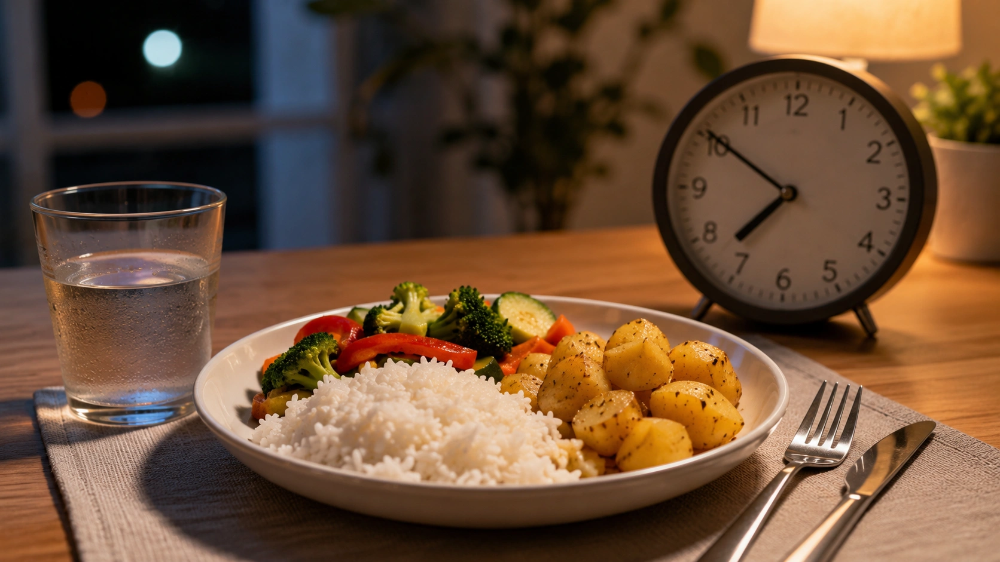
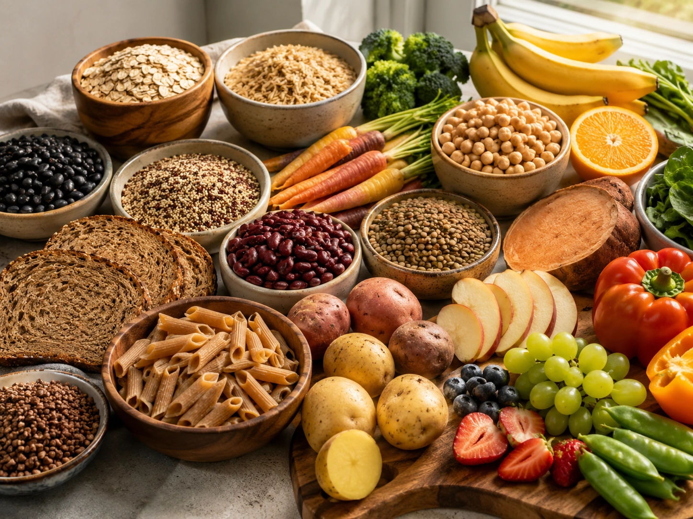
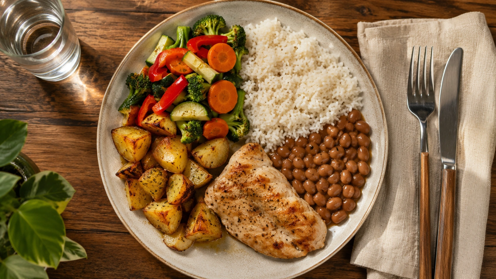

You may have heard that rice, bread, pasta or potatoes should disappear from your plate after 6 p.m. if you want to lose weight. The reasoning sounds straightforward: because we usually move less at night, carbohydrates eaten at dinner are supposedly more likely to be stored as fat.

Human metabolism is not that simple.

**Eating carbohydrates at night does not automatically cause fat gain**, and there is no universal time at which carbohydrates suddenly become “fattening.” Long-term energy balance remains central to changes in body weight. ([PubMed](https://pubmed.ncbi.nlm.nih.gov/35134825/ 'The energy balance model of obesity: beyond calories in …'))

That does not mean meal timing is completely irrelevant. Chrononutrition research suggests that very late eating or concentrating a large proportion of daily calories late in the day can influence appetite and some metabolic responses.

The important distinction is that this evidence does not justify the blanket statement that **carbs at night make you fat**. ([JAMA Network Open](https://jamanetwork.com/journals/jamanetworkopen/fullarticle/2825747 'Meal Timing and Anthropometric and Metabolic Outcomes: A Systematic Review and Meta-Analysis'))

## Where did the nighttime-carb myth come from?

The idea starts with a true observation: most people are less physically active while sleeping than they are during daytime hours.

The mistaken conclusion is that metabolism essentially shuts down overnight and carbohydrates from dinner are therefore sent directly into fat storage.

Your body continues to expend energy during sleep to support breathing, circulation, brain activity, temperature regulation and countless cellular processes.

Body-weight regulation is also dynamic. Energy intake, energy expenditure, appetite, physical activity and physiological adaptations interact across days, weeks and months. ([PubMed](https://pubmed.ncbi.nlm.nih.gov/28193517/ 'Obesity Energetics: Body Weight Regulation and the Effects of Diet Composition'))

There is no evidence of a metabolic switch that flips at exactly 6, 7 or 8 p.m.

## What actually causes weight gain?

Over time, increasing the body's energy stores requires a positive energy balance: broadly speaking, energy intake exceeds energy expenditure.

That does not mean body-weight management is simply about willpower or consciously counting every calorie. Appetite, sleep, physical activity, food environment, diet composition and biological weight-regulation mechanisms influence both intake and expenditure. ([PubMed](https://pubmed.ncbi.nlm.nih.gov/35134825/ 'The energy balance model of obesity: beyond calories in …'))

The key point is that your body does not erase everything you ate earlier in the day and determine the fate of your dinner based only on the clock.

Two people can both eat carbohydrates at night while having very different overall diets and energy intakes.

## Late eating and eating carbohydrates at night are not the same thing

This distinction matters.

A balanced dinner containing rice, beans, vegetables and a protein source is not metabolically or behaviorally equivalent to grazing on calorie-dense snacks until the early hours of the morning.

Most chrononutrition trials investigate **meal timing, eating windows or daily calorie distribution**, not simply whether dinner contains carbohydrate.

In a controlled crossover study of adults with overweight or obesity, later eating increased hunger, reduced waking energy expenditure and altered molecular pathways in adipose tissue. ([PMC](https://pmc.ncbi.nlm.nih.gov/articles/PMC10184753/ 'Late isocaloric eating increases hunger, decreases energy expenditure, and modifies metabolic pathways in adults with overweight and obesity'))

These findings are important for understanding meal timing. They do not prove that rice, bread or potatoes at dinner inevitably lead to weight gain.

## Does the timing of calories matter at all?

Possibly — but the magnitude of the effect needs context.

A 2024 systematic review and meta-analysis in _JAMA Network Open_ evaluated randomized trials of meal-timing strategies such as time-restricted eating, lower meal frequency and shifting a larger proportion of calorie intake earlier in the day.

Some strategies were associated with modest improvements in weight and metabolic outcomes, although the studies varied considerably in their designs and longer trials are needed. ([JAMA Network Open](https://jamanetwork.com/journals/jamanetworkopen/fullarticle/2825747 'Meal Timing and Anthropometric and Metabolic Outcomes: A Systematic Review and Meta-Analysis'))

A critical review published in 2026 provides an important counterbalance. It concluded that there is little evidence that timed-eating interventions are superior to general energy restriction for human weight loss.

Differences observed in free-living studies may also partly reflect actual differences in energy intake that are not captured accurately by self-reported food intake. ([PubMed](https://pubmed.ncbi.nlm.nih.gov/39789963/ 'Is the timing of eating relevant for weight loss?'))

Meal timing may therefore be a useful tool. It is not a replacement for considering the overall diet.

## Is a large dinner more fattening than a large breakfast?

A 2022 crossover trial helps clarify this question.

Adults with overweight or obesity followed energy-restricted diets in which a larger share of calories was consumed either in the morning or in the evening.

The researchers found no difference in total daily energy expenditure or weight loss between the two conditions. The morning-loaded diet, however, was associated with less hunger. ([PubMed](https://pubmed.ncbi.nlm.nih.gov/36087576/ 'Timing of daily calorie loading affects appetite and hunger responses without changes in energy metabolism in healthy subjects with obesity'))

This illustrates an important distinction: an eating pattern may make appetite management easier without creating a dramatic metabolic advantage independent of overall energy intake.

## What about blood sugar late at night?

This is one area where meal timing becomes particularly interesting.

Experimental studies have found that very late meals can produce less favorable glucose responses than earlier meals.

In a randomized crossover trial published in 2020, eating dinner at 10 p.m. rather than 6 p.m. altered overnight glucose and fat metabolism. ([PMC](https://pmc.ncbi.nlm.nih.gov/articles/PMC7337187/ 'Metabolic Effects of Late Dinner in Healthy Volunteers — A Randomized Crossover Clinical Trial'))

Another controlled study found that consuming a carbohydrate-containing meal while endogenous melatonin levels were high impaired glucose tolerance, with a stronger effect in people carrying a particular genetic risk variant. ([PubMed](https://pubmed.ncbi.nlm.nih.gov/35015083/ 'Interplay of Dinner Timing and MTNR1B Type 2 Diabetes Risk …'))

These findings are part of the reason chrononutrition is scientifically relevant.

However, **a different post-meal glucose response does not automatically mean greater body-fat gain**, nor does it establish that healthy people need to remove carbohydrates from dinner.

People with diabetes or other metabolic conditions may require individualized advice about meal composition and timing.

## Carbohydrate quality matters more than an arbitrary cutoff

For overall health, carbohydrate quality deserves more attention than a simplistic nighttime rule.

The World Health Organization's carbohydrate guideline emphasizes obtaining carbohydrates mainly from:

- whole grains;
- vegetables;
- fruits;
- pulses such as beans, chickpeas and lentils. ([WHO](https://www.who.int/publications/i/item/9789240073593 'Carbohydrate intake for adults and children: WHO guideline'))

A better question than “Can I eat carbs after 6 p.m.?” may therefore be:

**How does this carbohydrate fit into the rest of my diet?**

A meal built around rice, beans, vegetables and protein is very different from routinely consuming sugary drinks, sweets, cookies and large quantities of highly processed snack foods late at night.

Time of day is only one characteristic of a meal. Amount, food quality, combinations and the overall dietary pattern matter too.

## Do you need to remove rice, bread or potatoes from dinner to lose weight?

For most people, there is no scientific reason to create such a blanket restriction.

Carbohydrates can remain part of dinner during weight loss when the meal and the overall diet are compatible with the person's energy needs and goals.

Options may include:

- rice and beans;
- potatoes or sweet potatoes;
- whole grains;
- corn;
- oats;
- bread;
- pasta;
- fruit;
- lentils, chickpeas and other pulses.

There is no universal list of carbohydrates that become forbidden after sunset.

## When might moving dinner earlier help?

Some people may benefit from reorganizing their eating schedule even without eliminating carbohydrates.

Moving food intake earlier may be useful when late eating:

- leads to frequent additional snacking;
- increases total energy intake;
- occurs immediately before sleep and causes discomfort;
- is associated with a highly irregular eating pattern;
- makes appetite regulation more difficult;
- routinely extends far into the night.

In those cases, benefits may arise from a combination of behavioral and metabolic changes rather than from carbohydrate avoidance itself. ([PubMed](https://pubmed.ncbi.nlm.nih.gov/39789963/ 'Is the timing of eating relevant for weight loss?'))

## How to build a balanced dinner without fearing carbs

Instead of using the clock as the main rule, consider the entire meal.

A practical dinner might combine:

1. **a carbohydrate source**, such as rice, potatoes or another grain;
2. **a protein source** suited to your dietary preferences;
3. **vegetables or leafy greens**;
4. **pulses**, when appropriate;
5. an amount that makes sense for your hunger, activity and energy needs.

This is not intended as a rigid formula. It simply illustrates that carbohydrates can be part of a nutritionally balanced evening meal.

## What if you exercise at night?

An evening workout does not create a general requirement to avoid carbohydrates afterward.

Depending on training type, duration, intensity and goals, carbohydrates may be included alongside protein and other foods in a post-workout meal.

Athletes and people with high training volumes may need more individualized planning based on total energy needs, recovery, performance and body-composition goals.

Avoiding carbohydrates solely because a certain time has passed may not make sense in that context.

## What deserves more attention?

For weight management and overall diet quality, it is generally more useful to consider:

- total food and energy intake;
- food quality;
- fruits and vegetables;
- whole grains and pulses;
- adequate protein;
- physical activity;
- sleep;
- frequently eating highly energy-dense foods;
- hunger and satiety;
- whether the eating pattern is sustainable.

Meal timing can be one additional consideration, particularly for habitual very late eaters. But it does not need to become the dominant rule for everyone. ([JAMA Network Open](https://jamanetwork.com/journals/jamanetworkopen/fullarticle/2825747 'Meal Timing and Anthropometric and Metabolic Outcomes: A Systematic Review and Meta-Analysis'))

## Conclusion

**Eating carbohydrates at night does not automatically make you gain weight.** There is no universal cutoff after which rice, bread, potatoes, fruit or other carbohydrate-rich foods inevitably become body fat.

Long-term energy balance remains fundamental to body-weight change within a system also influenced by appetite, behavior, physical activity, diet quality and physiological adaptation. ([PubMed](https://pubmed.ncbi.nlm.nih.gov/35134825/ 'The energy balance model of obesity: beyond calories in …'))

At the same time, chrononutrition research suggests that meal timing can affect hunger, blood glucose and other metabolic responses. Concentrating a large amount of food very late may not be ideal for everyone. ([PMC](https://pmc.ncbi.nlm.nih.gov/articles/PMC10184753/ 'Late isocaloric eating increases hunger, decreases energy expenditure, and modifies metabolic pathways in adults with overweight and obesity'))

The best conclusion is therefore neither “timing never matters” nor “carbs after 6 p.m. make you fat.”

**The overall context matters far more than a rule based solely on the clock.**
