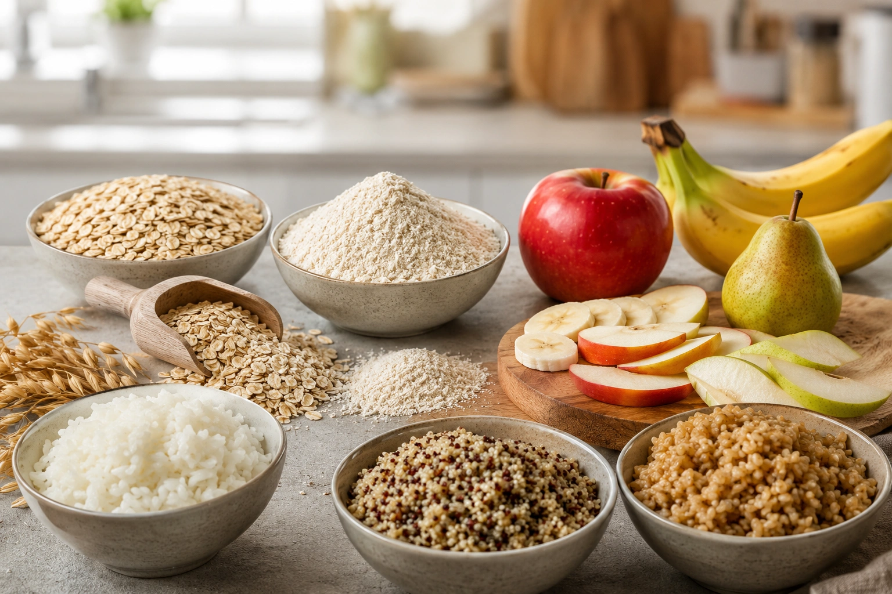

Glycemic index and glycemic load are closely related, but they do not measure exactly the same thing. **Glycemic index evaluates the relative glucose response to a standardized amount of carbohydrate, while glycemic load combines that value with the amount of available carbohydrate in a serving.** ([Linus Pauling Institute](https://lpi.oregonstate.edu/mic/food-beverages/glycemic-index-glycemic-load 'Glycemic Index and Glycemic Load'))

That distinction matters because the amount of carbohydrate on your plate can influence the overall glycemic impact of a serving.

## What is the glycemic index?

The glycemic index, or GI, ranks carbohydrate-containing foods according to their blood-glucose response relative to a reference food, usually glucose.

In standardized testing, volunteers consume a set amount of available carbohydrate from the test food — traditionally 50 g — and blood glucose is measured over the following hours. The incremental area under the glucose curve is compared with the response to the reference food. ([Linus Pauling Institute](https://lpi.oregonstate.edu/mic/food-beverages/glycemic-index-glycemic-load 'Glycemic Index and Glycemic Load'))

For that reason, describing GI simply as "how fast a food raises blood sugar" is useful shorthand but not the complete scientific definition. GI reflects the **relative glycemic response to a standardized carbohydrate dose**.

Common GI categories are: ([Linus Pauling Institute](https://lpi.oregonstate.edu/mic/food-beverages/glycemic-index-glycemic-load 'Glycemic Index and Glycemic Load'))

| Glycemic index | Classification |
| -------------- | -------------- |
| ≤55            | Low            |
| 56–69          | Medium         |
| ≥70            | High           |

What GI does not directly account for is the amount of carbohydrate in the portion a person actually eats.

## What is glycemic load?

Glycemic load, or GL, was developed to combine two pieces of information:

1. the food's glycemic index;
2. the amount of available carbohydrate in a serving.

The calculation is: ([Linus Pauling Institute](https://lpi.oregonstate.edu/mic/food-beverages/glycemic-index-glycemic-load 'Glycemic Index and Glycemic Load'))

`Glycemic load = GI × available carbohydrate per serving (g) ÷ 100`

The commonly used classifications are:

| Glycemic load | Classification |
| ------------- | -------------- |
| ≤10           | Low            |
| 11–19         | Medium         |
| ≥20           | High           |

Unlike GI, GL therefore changes when the amount of carbohydrate in the serving changes.

## A simple example

Consider two hypothetical foods:

| Example |  GI | Available carbohydrate per serving |  GL |
| ------- | --: | ---------------------------------: | --: |
| Food A  |  70 |                               10 g |   7 |
| Food B  |  50 |                               30 g |  15 |

Food A has a high GI but a low GL because the portion contains relatively little available carbohydrate.

Food B has a low GI, yet its larger carbohydrate amount produces a higher GL.

This does not mean Food B is nutritionally worse. It simply demonstrates that **carbohydrate quality and carbohydrate quantity are different dimensions**.

## Glycemic index vs. glycemic load

The main distinctions are:

| Feature                                    | Glycemic index | Glycemic load   |
| ------------------------------------------ | -------------- | --------------- |
| Reflects carbohydrate characteristics      | Yes            | Yes             |
| Directly accounts for serving carbohydrate | No             | Yes             |
| Based on a reference food                  | Yes            | Derived from GI |
| Useful for comparing carbohydrate foods    | Yes            | Yes             |
| Changes with serving size                  | No             | Yes             |
| Measures overall nutritional quality       | No             | No              |

GI is useful for comparing carbohydrate foods under standardized conditions. GL puts that information into the context of how much carbohydrate a specific portion contains. ([Linus Pauling Institute](https://lpi.oregonstate.edu/mic/food-beverages/glycemic-index-glycemic-load 'Glycemic Index and Glycemic Load'))

## Why portion size matters

Post-meal glucose responses depend not only on the characteristics of a carbohydrate source but also on how much carbohydrate is eaten.

A food can therefore have a relatively high GI while a particular serving has a low GL. Conversely, eating a larger quantity of carbohydrate increases the glycemic load even if the food itself has a lower GI. ([Linus Pauling Institute](https://lpi.oregonstate.edu/mic/food-beverages/glycemic-index-glycemic-load 'Glycemic Index and Glycemic Load'))

GL should not, however, be treated as a nutritional quality score. A food can have a low GL simply because it contains very little carbohydrate.

## Can a food's glycemic index vary?

Yes. A value listed in a GI table is a reference value rather than a guarantee of an identical response every time the food is eaten.

Relevant factors include:

- food processing;
- milling and particle size;
- fiber structure;
- fruit ripeness;
- cooking and preparation;
- fat, protein, and acid content;
- foods eaten together in a mixed meal. ([Harvard T.H. Chan](https://nutritionsource.hsph.harvard.edu/carbohydrates/carbohydrates-and-blood-sugar/ 'Carbohydrates and Blood Sugar'))

The 2021 international systematic review of GI and GL values also highlights the importance of standardized methodology and food-specific testing. ([PubMed](https://pubmed.ncbi.nlm.nih.gov/34258626/ 'International tables of glycemic index and glycemic load values 2021: a systematic review'))

## What about individual responses?

People can also differ in their post-meal glucose responses.

Research has documented methodological and biological variability in glycemic measurements, as well as individual differences in postprandial responses. GI should therefore be viewed as a useful comparative and population-level tool rather than a perfect prediction of what one person's glucose will do after every meal. ([PubMed](https://pubmed.ncbi.nlm.nih.gov/27604773/ 'Estimating the reliability of glycemic index values and potential sources of methodological and biological variability'))

For people with diabetes who monitor glucose, their own response may provide additional information that can be interpreted with their healthcare team.

## Are low-GI foods always better?

Not automatically.

Neither GI nor GL measures fiber, protein quality, vitamins, minerals, energy density, saturated fat, or degree of processing.

Legumes, whole fruits, vegetables, and whole grains provide nutritional characteristics that extend far beyond their glycemic values. Meanwhile, some foods high in fat or heavily processed can have a relatively low GI without becoming ideal everyday choices. ([Linus Pauling Institute](https://lpi.oregonstate.edu/mic/food-beverages/glycemic-index-glycemic-load 'Glycemic Index and Glycemic Load'))

The more useful question is not simply "What is the lowest GI number?" but "What is the overall quality of this food and how does it fit into the diet?"

## What does the research say?

Among people with diabetes, a 2021 systematic review and meta-analysis of randomized controlled trials found small improvements in glycemic control and some cardiometabolic risk factors with lower-GI/GL dietary patterns. The pooled reduction in HbA1c was approximately **0.31 percentage points** compared with higher-GI/GL control diets. ([PubMed](https://pubmed.ncbi.nlm.nih.gov/34348965/ 'Effect of low glycaemic index or load dietary patterns on glycaemic control and cardiometabolic risk factors in diabetes: systematic review and meta-analysis of randomised controlled trials'))

Large observational analyses have also linked higher dietary GI or GL with greater risk of some outcomes, particularly type 2 diabetes and cardiovascular disease. These findings support the potential relevance of carbohydrate quality, but observational associations alone cannot establish that GI or GL directly caused the outcomes. ([PubMed](https://pubmed.ncbi.nlm.nih.gov/38272606/ 'Association of glycaemic index and glycaemic load with type 2 diabetes, cardiovascular disease, cancer, and all-cause mortality: a meta-analysis of mega cohorts of more than 100 000 participants'))

Overall dietary quality, fiber intake, whole grains, food processing, portion size, and other lifestyle factors remain important parts of the picture.

## How to use GI and GL in everyday eating

A practical approach is to:

1. **Start with food quality.** Favor fiber-rich, minimally processed carbohydrate sources such as legumes, whole fruit, vegetables, and whole grains.
2. **Use GI when comparing similar foods.** It can provide additional information when choosing between nutritionally appropriate carbohydrate options.
3. **Remember the portion.** GL illustrates why the amount of carbohydrate eaten matters.
4. **Consider the entire meal.** Real meals contain combinations of carbohydrates, proteins, fats, fibers, and other components.
5. **Individualize when needed.** People with diabetes, insulin treatment, or other metabolic conditions should use these tools within a personalized care plan. ([Linus Pauling Institute](https://lpi.oregonstate.edu/mic/food-beverages/glycemic-index-glycemic-load 'Glycemic Index and Glycemic Load'))

## Conclusion

The central difference is straightforward: **glycemic index describes the relative glycemic response to a standardized amount of carbohydrate, while glycemic load also considers how much available carbohydrate is present in the serving.**

GL can add useful portion-size context, but neither value should be used alone to label a food as "good" or "bad."

A more complete approach considers food quality, fiber, processing, serving size, meal composition, and individual needs.
