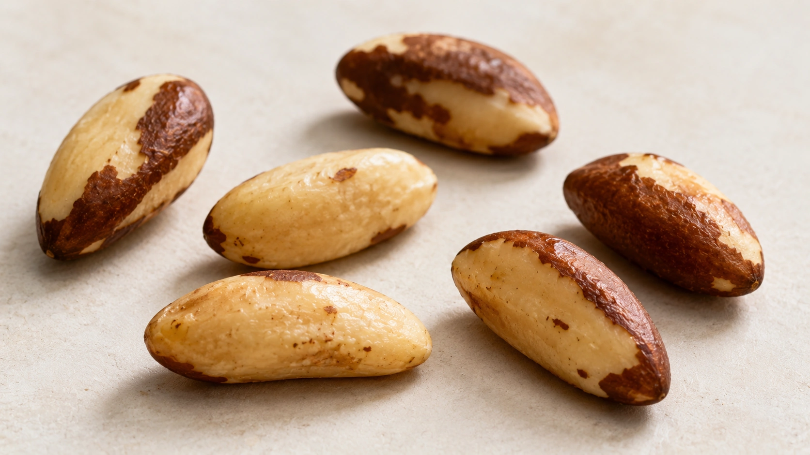
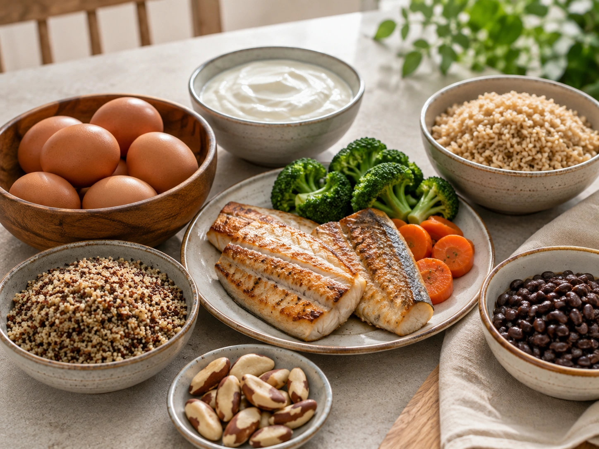
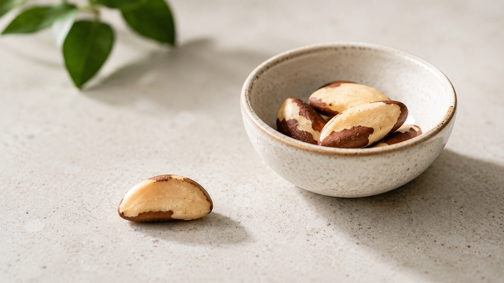

Brazil nuts are often accompanied by a simple recommendation: “eat two a day.” The science behind that advice is considerably less precise.

Brazil nuts (_Bertholletia excelsa_) are among the most concentrated dietary sources of selenium. More importantly, their **selenium content varies dramatically from one growing region and batch to another**. ([NIH ODS](https://ods.od.nih.gov/factsheets/Selenium-HealthProfessional/ 'Selenium — Health Professional Fact Sheet'))

For most healthy adults, that leads to a practical conclusion: **if you are eating Brazil nuts specifically as a source of selenium, one nut at a time is generally enough. There is no need to eat several every day.**

This is not a medical cutoff suggesting that one nut is always safe and two are dangerous. It is a conservative food-based approach to a highly concentrated nutrient source whose exact selenium content is usually unknown. ([NIH ODS](https://ods.od.nih.gov/factsheets/Selenium-HealthProfessional/ 'Selenium — Health Professional Fact Sheet'))

## Why are Brazil nuts so high in selenium?

Selenium concentrations in plant foods are strongly influenced by soil selenium, its chemical forms, soil pH and other environmental factors. This creates substantial geographical variation. ([NIH ODS](https://ods.od.nih.gov/factsheets/Selenium-HealthProfessional/ 'Selenium — Health Professional Fact Sheet'))

Research on Brazil nuts collected across the Brazilian Amazon found median selenium concentrations ranging from **2.07 mg/kg in Mato Grosso to 68.15 mg/kg in Amazonas**. Concentrations also varied within growing regions. ([PubMed](https://pubmed.ncbi.nlm.nih.gov/28923728/ 'Natural variation of selenium in Brazil nuts and soils from the Amazon region'))

That is why asking exactly how much selenium is in “one Brazil nut” does not have a single reliable answer.

## How much selenium do adults need?

The U.S. Food and Nutrition Board recommends **55 µg of selenium per day** for most adults. The value rises to 60 µg during pregnancy and 70 µg during lactation. ([NIH ODS](https://ods.od.nih.gov/factsheets/Selenium-HealthProfessional/ 'Selenium — Health Professional Fact Sheet'))

| Group     | Recommended daily intake |
| --------- | -----------------------: |
| Adults    |                    55 µg |
| Pregnancy |                    60 µg |
| Lactation |                    70 µg |

Selenium is incorporated into selenoproteins involved in thyroid hormone metabolism, DNA synthesis, reproduction and protection against oxidative damage. It is essential, but consuming more than the body needs does not automatically provide additional health benefits. ([NIH ODS](https://ods.od.nih.gov/factsheets/Selenium-HealthProfessional/ 'Selenium — Health Professional Fact Sheet'))

## How much selenium is in one Brazil nut?

The NIH lists an average of **544 µg in about 1 oz (28 g), or roughly six to eight Brazil nuts**, and separately cites approximately **68–91 µg per nut**. ([NIH ODS](https://ods.od.nih.gov/factsheets/Selenium-HealthProfessional/ 'Selenium — Health Professional Fact Sheet'))

Using those averages, one nut can already meet or exceed the 55 µg daily requirement for an adult.

However, Brazilian composition data illustrate why averages need caution. The Brazilian Food Composition Table lists **3,382 µg of selenium per 100 g** for one raw Brazil-nut entry. Its 30 g reference contains 1,014 µg. ([TBCA](https://www.tbca.net.br/base-dados/int_composicao_alimentos.php?n0REd3kv7e86D%2BViXWYUnQ%3D%3D=LmAv8bwWhrrQVHk6itA03w%3D%3D 'Food Composition — Raw Brazil Nuts, Brazil'))

This does not mean every 30 g serving contains exactly that amount. It demonstrates that some Brazilian samples can be substantially more selenium-rich than international averages.

### Clinical trials illustrate the variation

In one New Zealand trial, two Brazil nuts delivered an estimated average of about **53 µg selenium per day**. ([PubMed](https://pubmed.ncbi.nlm.nih.gov/18258628/ 'Brazil nuts: an effective way to improve selenium status'))

In a Brazilian pilot trial, **one Brazil nut per day was estimated to provide 288.75 µg of selenium**. ([PubMed](https://pubmed.ncbi.nlm.nih.gov/25567069/ 'Effects of Brazil nut consumption on selenium status and cognitive performance in older adults with mild cognitive impairment: a randomized controlled pilot trial'))

In other words, two nuts from one source may provide less selenium than a single nut from another.

## So how many Brazil nuts should you eat?

For a healthy adult, **one nut on a day when Brazil nuts are consumed is a sensible practical reference when the main goal is dietary selenium**.

There is no need to eat several every day to obtain greater benefits.

It is also unnecessary to consume Brazil nuts every day. Selenium comes from many foods, and a particularly selenium-rich nut may supply several times the daily requirement. ([NIH ODS](https://ods.od.nih.gov/factsheets/Selenium-HealthProfessional/ 'Selenium — Health Professional Fact Sheet'))

A practical way to interpret the evidence is:

- **1 nut:** a conservative amount when Brazil nuts are eaten regularly;
- **2 nuts occasionally:** not automatically toxic for a healthy adult, but not necessary as a universal daily rule;
- **several nuts every day:** inappropriate as a deliberate selenium strategy because intake may become excessive;
- **a daily handful:** may deliver very high amounts of selenium depending on the batch. ([NIH ODS](https://ods.od.nih.gov/factsheets/Selenium-HealthProfessional/ 'Selenium — Health Professional Fact Sheet'))

## How much selenium is too much?

Different authorities currently use different upper limits.

The U.S. Food and Nutrition Board sets the adult **Tolerable Upper Intake Level at 400 µg/day**. ([NIH ODS](https://ods.od.nih.gov/factsheets/Selenium-HealthProfessional/ 'Selenium — Health Professional Fact Sheet'))

In 2023, the European Food Safety Authority established a lower adult UL of **255 µg/day**, including during pregnancy and lactation. ([NIH ODS](https://ods.od.nih.gov/factsheets/Selenium-HealthProfessional/ 'Selenium — Health Professional Fact Sheet'))

| Authority                     | Adult upper limit |
| ----------------------------- | ----------------: |
| U.S. Food and Nutrition Board |        400 µg/day |
| EFSA                          |        255 µg/day |

These limits apply to **total selenium intake**, including food and supplements.

## Can eating too many Brazil nuts be harmful?

The main concern is not occasionally having an extra nut. It is **repeatedly consuming excessive selenium over time**.

Chronic high selenium intake can cause **selenosis**. Reported features include hair loss, brittle or lost nails, metallic taste, garlic-like breath, skin rash, nausea, diarrhea, fatigue, irritability and nervous-system abnormalities. ([NIH ODS](https://ods.od.nih.gov/factsheets/Selenium-HealthProfessional/ 'Selenium — Health Professional Fact Sheet'))

Someone who has routinely consumed large quantities of Brazil nuts, especially alongside selenium supplements, should discuss concerns or symptoms with a healthcare professional rather than attempting to diagnose selenium toxicity based on symptoms alone.

## What else do Brazil nuts provide?

Brazil nuts are more than a selenium source.

The Brazilian Food Composition Table reports the following values for 30 g of raw Brazil nuts:

| Nutrient   | Amount per 30 g* |
| ---------- | ---------------: |
| Energy     |         202 kcal |
| Protein    |           4.36 g |
| Fat        |           19.0 g |
| Fiber      |           2.38 g |
| Magnesium  |            97 mg |
| Phosphorus |           203 mg |
| Selenium   |         1,014 µg |
| Vitamin E  |          1.89 mg |

*Values refer to the specific TBCA entry and are not a recommendation to consume 30 g daily. Selenium concentrations can differ greatly among Brazil nuts. ([TBCA](https://www.tbca.net.br/base-dados/int_composicao_alimentos.php?n0REd3kv7e86D%2BViXWYUnQ%3D%3D=LmAv8bwWhrrQVHk6itA03w%3D%3D 'Food Composition — Raw Brazil Nuts, Brazil'))

The nuts contain both monounsaturated and polyunsaturated fats, along with plant protein, fiber and several minerals. ([TBCA](https://www.tbca.net.br/base-dados/int_composicao_alimentos.php?n0REd3kv7e86D%2BViXWYUnQ%3D%3D=LmAv8bwWhrrQVHk6itA03w%3D%3D 'Food Composition — Raw Brazil Nuts, Brazil'))

## Do Brazil nuts lower cholesterol?

This claim is less established than many online descriptions suggest.

A 2022 systematic review and meta-analysis of randomized clinical trials found that Brazil-nut interventions significantly increased blood selenium concentrations and glutathione peroxidase activity. ([PubMed](https://pubmed.ncbi.nlm.nih.gov/35204285/ 'Effect of Brazil Nuts on Selenium Status, Blood Lipids, and Biomarkers of Oxidative Stress and Inflammation: A Systematic Review and Meta-Analysis of Randomized Clinical Trials'))

However, the pooled analysis did **not find statistically significant improvements in total cholesterol, LDL cholesterol or HDL cholesterol**. ([PubMed](https://pubmed.ncbi.nlm.nih.gov/35204285/ 'Effect of Brazil Nuts on Selenium Status, Blood Lipids, and Biomarkers of Oxidative Stress and Inflammation: A Systematic Review and Meta-Analysis of Randomized Clinical Trials'))

Brazil nuts can fit into a nutritious dietary pattern, but eating one or two should not be presented as a proven cholesterol-lowering treatment.

## Are Brazil nuts good for the thyroid?

Selenium is essential to normal thyroid hormone synthesis and metabolism, which explains why Brazil nuts are frequently promoted for “thyroid health.” ([NIH ODS](https://ods.od.nih.gov/factsheets/Selenium-HealthProfessional/ 'Selenium — Health Professional Fact Sheet'))

However, needing adequate selenium is different from assuming that more selenium treats thyroid disease.

The NIH notes mixed clinical evidence regarding selenium supplementation in autoimmune thyroid conditions, and simply increasing selenium intake should not replace appropriate medical treatment. ([NIH ODS](https://ods.od.nih.gov/factsheets/Selenium-HealthProfessional/ 'Selenium — Health Professional Fact Sheet'))

## Who should be especially careful?

### People taking selenium supplements

This is one of the most important situations in which total intake needs attention.

Selenium-containing supplements can provide substantial amounts on their own. Adding very selenium-rich Brazil nuts may push total intake closer to or beyond an upper limit. ([NIH ODS](https://ods.od.nih.gov/factsheets/Selenium-HealthProfessional/ 'Selenium — Health Professional Fact Sheet'))

### Children

Upper intake levels are lower for children and depend on age. An adult rule of thumb should therefore not simply be applied to young children. ([NIH ODS](https://ods.od.nih.gov/factsheets/Selenium-HealthProfessional/ 'Selenium — Health Professional Fact Sheet'))

### Pregnant and breastfeeding people

Selenium requirements change during pregnancy and lactation, but high intake is not automatically beneficial. EFSA's adult UL of 255 µg/day also applies during pregnancy and lactation, while the U.S. FNB uses 400 µg/day. ([NIH ODS](https://ods.od.nih.gov/factsheets/Selenium-HealthProfessional/ 'Selenium — Health Professional Fact Sheet'))

### People with nut allergies

Anyone with a diagnosed allergy to Brazil nuts or other tree nuts should follow individualized medical advice regarding avoidance and accidental exposure.

## Do Brazil nuts need to be eaten every day?

No.

Brazil nuts are one way of obtaining selenium, not a required daily supplement. Seafood, meat, poultry, eggs, grains and dairy foods also contribute selenium to the diet. ([NIH ODS](https://ods.od.nih.gov/factsheets/Selenium-HealthProfessional/ 'Selenium — Health Professional Fact Sheet'))

Because the selenium concentration of Brazil nuts is unusually high and variable, eating them on some days rather than automatically every day can also fit within a varied diet.

## The practical takeaway

Brazil nuts are nutritious, but their exceptional selenium concentration is a reason for **moderation rather than high consumption**.

For a healthy adult, **one nut at a time is generally plenty when the purpose is to obtain selenium**. There is no established benefit to making two, four or six Brazil nuts a mandatory daily dose. ([NIH ODS](https://ods.od.nih.gov/factsheets/Selenium-HealthProfessional/ 'Selenium — Health Professional Fact Sheet'))

If you already use a selenium-containing supplement, have a medical condition or intend to consume Brazil nuts specifically for therapeutic purposes, discuss your total intake with a qualified dietitian or physician.

## Conclusion

Brazil nuts are an exceptionally concentrated source of selenium, and that makes portion size particularly important.

For most healthy adults, **one nut when consumed is a practical and conservative reference**, but it is not a universal safety cutoff. Selenium concentrations differ substantially between regions, trees and batches, meaning that two visually identical nuts may supply very different amounts. ([PubMed](https://pubmed.ncbi.nlm.nih.gov/28923728/ 'Natural variation of selenium in Brazil nuts and soils from the Amazon region'))

The key message is simple: more is not necessarily better. Selenium is essential in small amounts, but chronically excessive intake can also cause harm. ([NIH ODS](https://ods.od.nih.gov/factsheets/Selenium-HealthProfessional/ 'Selenium — Health Professional Fact Sheet'))
