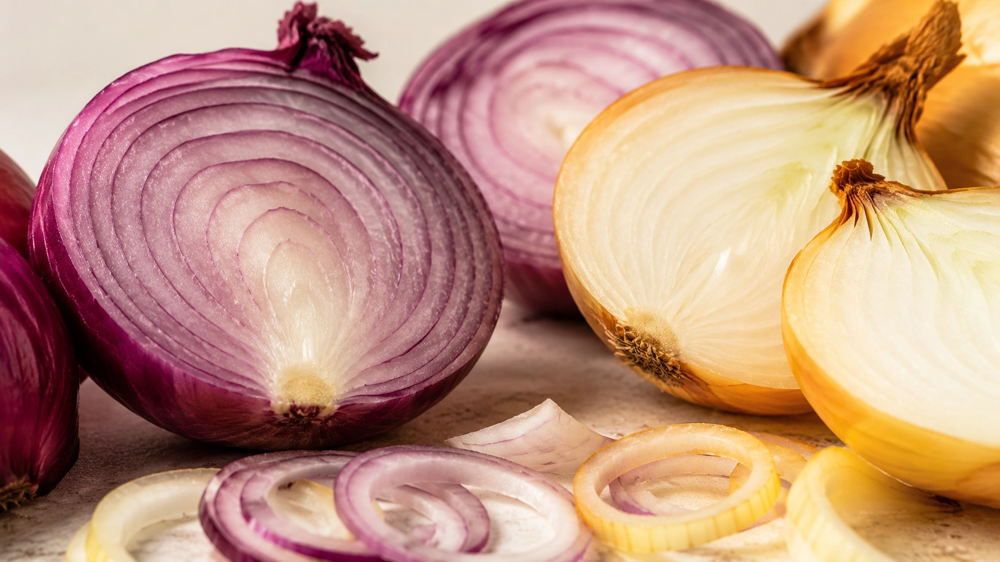
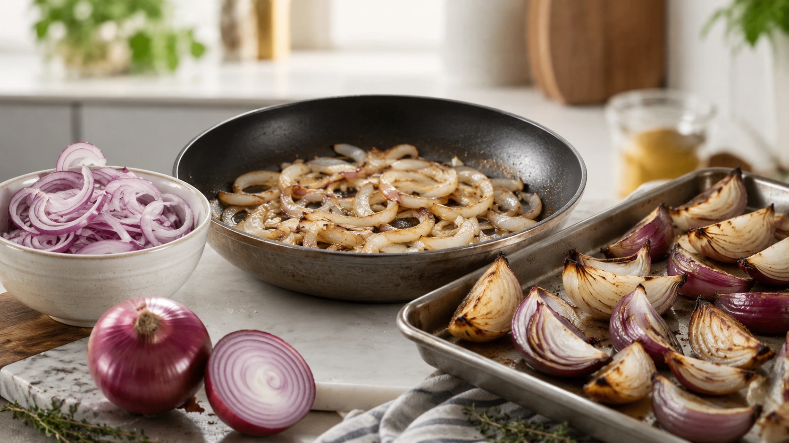
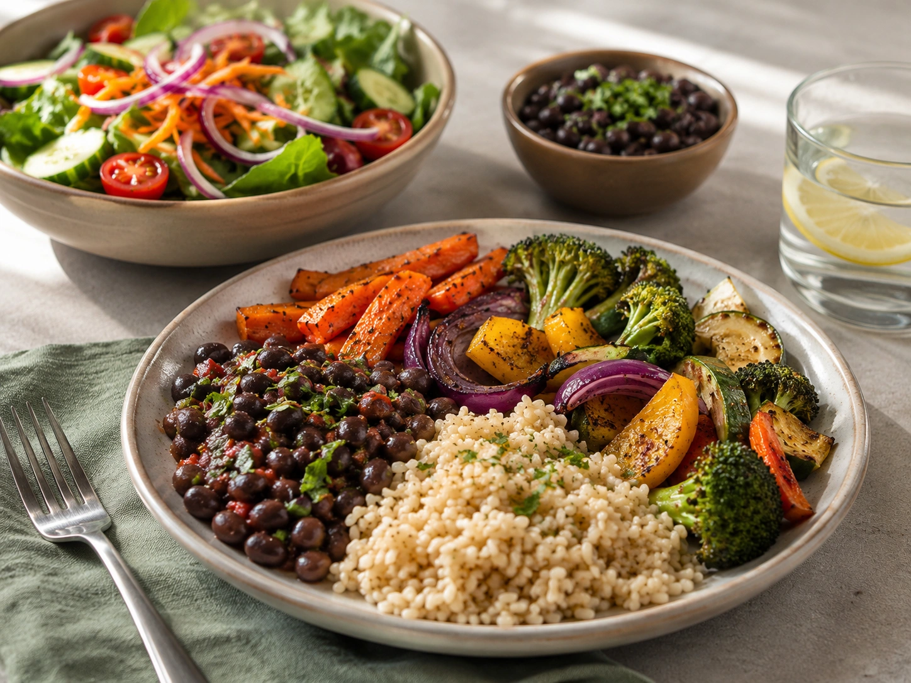

Onions are so common in soups, salads, sauces and cooked dishes that they are easy to think of as little more than a flavoring ingredient. Nutritionally, however, onions provide fiber, modest amounts of several vitamins and minerals, and a diverse collection of plant compounds. ([TBCA](https://www.tbca.net.br/base-dados/int_composicao_alimentos.php?n0REd3kv7e86D%2BViXWYUnQ%3D%3D=HLV6KhlJAInKkwyACjTGYA%3D%3D 'Food Composition — White Onion, Raw, Brazil'))

The best known of these is **quercetin**, a flavonoid widely studied in nutrition research. Onions also contain characteristic sulfur-containing compounds. ([PubMed](https://pubmed.ncbi.nlm.nih.gov/12410539/ 'Onions--a global benefit to health'))

That does not make onions a natural drug. Laboratory experiments, studies of isolated compounds and trials using concentrated extracts cannot automatically tell us what will happen when someone eats a normal serving of onion with dinner.

## What nutrients do onions provide?

According to the Brazilian Food Composition Table, 100 g of raw white onion from Brazil provides approximately: ([TBCA](https://www.tbca.net.br/base-dados/int_composicao_alimentos.php?n0REd3kv7e86D%2BViXWYUnQ%3D%3D=HLV6KhlJAInKkwyACjTGYA%3D%3D 'Food Composition — White Onion, Raw, Brazil'))

| Nutrient                   | Amount per 100 g |
| -------------------------- | ---------------: |
| Energy                     |          41 kcal |
| Total carbohydrate         |           9.21 g |
| Available carbohydrate     |           7.16 g |
| Protein                    |           1.76 g |
| Fat                        |           0.13 g |
| Fiber                      |           2.04 g |
| Potassium                  |           184 mg |
| Magnesium                  |          11.9 mg |
| Phosphorus                 |          39.6 mg |
| Vitamin C                  |          4.87 mg |
| Vitamin B6                 |          0.15 mg |
| Dietary folate equivalents |          20.2 µg |

These numbers illustrate that onions should not be marketed as an exceptionally concentrated source of vitamins.

Their nutritional value also comes from their low energy density, contribution to vegetable intake and variety of plant phytochemicals.

## Quercetin: the best-known onion flavonoid

Quercetin belongs to the flavonoid family of plant compounds.

In onions, it occurs largely as different quercetin glycosides. These compounds can be absorbed and metabolized by humans, although their availability depends on the form consumed and several dietary and biological factors. ([PubMed](https://pubmed.ncbi.nlm.nih.gov/36829817/ 'Potential Role of Quercetin Glycosides as Anti-Atherosclerotic Food-Derived Factors for Human Health'))

Experimental research has documented antioxidant-related and cell-signaling properties. But demonstrating antioxidant activity in a laboratory is not the same as proving that a food prevents disease in humans.

This distinction is central to understanding onion research.

## What about sulfur compounds?

Onions belong to the _Allium_ genus together with garlic, leeks and related vegetables.

They contain several sulfur-containing precursors and breakdown products that contribute to their characteristic aroma and have attracted scientific interest for potential biological effects. ([PubMed](https://pubmed.ncbi.nlm.nih.gov/12410539/ 'Onions--a global benefit to health'))

These mechanisms are scientifically interesting, but they do not justify treating an onion as a concentrated therapeutic preparation.

## Could onions support cardiovascular health?

Human research provides some promising signals.

A 2023 systematic review and meta-analysis combined **14 randomized controlled trials** examining onion supplementation or onion-based interventions. The pooled analysis reported favorable changes in several measures, including LDL cholesterol, total cholesterol, HDL cholesterol and systolic blood pressure. ([PubMed](https://pubmed.ncbi.nlm.nih.gov/38056991/ 'Onion supplementation and health metabolic parameters: A systematic review and meta-analysis of randomized controlled trials'))

There is an important limitation: the interventions were not simply equivalent servings of onions added to ordinary meals.

Different studies used different onion preparations, concentrations and study populations. Consequently, these results do not demonstrate that a few slices of onion will produce a predictable reduction in blood pressure or cholesterol.

### A quercetin trial illustrates the problem

A randomized, double-blind, placebo-controlled crossover trial enrolled 70 overweight-to-obese adults with elevated blood pressure. Participants received **162 mg of quercetin per day from onion-skin extract** for six weeks. ([PubMed](https://pubmed.ncbi.nlm.nih.gov/26328470/ 'Effects of a quercetin-rich onion skin extract on 24 h ambulatory blood pressure and endothelial function in overweight-to-obese patients with (pre-)hypertension'))

There was no significant effect on the main blood-pressure parameters in the entire study group. A reduction in ambulatory systolic pressure appeared in the subgroup with hypertension.

This is useful research, but the intervention was a concentrated extract—not an ordinary portion of onion.

## Can onions lower cholesterol?

The 2023 meta-analysis found favorable changes in several lipid markers across onion interventions. ([PubMed](https://pubmed.ncbi.nlm.nih.gov/38056991/ 'Onion supplementation and health metabolic parameters: A systematic review and meta-analysis of randomized controlled trials'))

That evidence is not strong enough to claim that onions “clean arteries” or can replace established strategies for managing cholesterol.

Overall dietary pattern, fiber intake, type of dietary fat, physical activity, smoking status and appropriate medical treatment remain much more important than any single vegetable.

## What about blood sugar?

Experimental research and some clinical studies have investigated onion compounds in relation to glucose regulation. The human evidence, however, is not strong enough to use onion as a diabetes treatment. ([Clinical Nutrition ESPEN](https://www.clinicalnutritionespen.com/article/S2405-4577%2823%2901228-7/fulltext 'Onion supplementation and health metabolic parameters'))

In one trial using 162 mg/day of quercetin from onion-skin extract, researchers found no significant improvements in glucose or insulin in the studied overweight-to-obese population. ([PubMed](https://pubmed.ncbi.nlm.nih.gov/27423432/ 'No effects of quercetin from onion skin extract on serum …'))

People with diabetes can certainly include onions in an appropriate diet, but onions should not replace medication, glucose monitoring or professional care.

## Do onions promote weight loss?

This is another area where the details matter.

A 2023 systematic review and meta-analysis of five clinical trials reported favorable changes in body weight, BMI, waist circumference and other outcomes. ([Wiley](https://onlinelibrary.wiley.com/doi/10.1002/fsn3.3426 'Antiobesity effects of onion (Allium cepa) in subjects with obesity: Systematic review and meta-analysis'))

However, **four of the five trials used onion-peel products and only one studied onions themselves**. ([PubMed](https://pubmed.ncbi.nlm.nih.gov/37576046/ 'Antiobesity effects of onion (Allium cepa) in subjects with obesity: Systematic review and meta-analysis'))

That makes it inappropriate to claim that eating onions causes weight loss.

Onions can still be useful in weight-management meals for a simpler reason: they are low in calories and can add flavor and vegetable volume to dishes. That is different from having a direct fat-burning effect.

## Are onions good for gut health?

The answer depends partly on individual tolerance.

Onions are an important source of **fructans**, fermentable carbohydrates belonging to the FODMAP group. ([PubMed](https://pubmed.ncbi.nlm.nih.gov/26350937/ 'The Low FODMAP Diet and Its Application in East and Southeast Asia'))

Fermentation of carbohydrates by gut microbes is a normal process. In susceptible people, however, fructans can contribute to:

- gas;
- bloating;
- abdominal pain;
- bowel-habit changes. ([PubMed](https://pubmed.ncbi.nlm.nih.gov/29102613/ 'Fructan, Rather Than Gluten, Induces Symptoms in …'))

This is particularly relevant for some people with irritable bowel syndrome.

It does not mean onions are inflammatory or harmful to everyone.

## Is red onion healthier than white onion?

Onion varieties do differ in phytochemical composition.

Red onions contain pigments that are not present at comparable levels in white varieties, and studies have found differences in phenolic and quercetin-derivative concentrations among onion cultivars. ([PubMed](https://pubmed.ncbi.nlm.nih.gov/34066759/ 'Influence of Cooking Methods on Onion Phenolic Compounds Bioaccessibility'))

In one experimental comparison, the tested red onion contained more total phenolic compounds than the tested yellow variety. That finding cannot establish that every red onion is universally more nutritious than every white onion. ([PubMed](https://pubmed.ncbi.nlm.nih.gov/34066759/ 'Influence of Cooking Methods on Onion Phenolic Compounds Bioaccessibility'))

For most people, eating a variety of vegetables matters more than choosing one onion color exclusively.

## Are raw onions better?

Not automatically.

Heat can reduce some compounds while altering plant structure and potentially increasing the release of others.

A laboratory study comparing cooking techniques found that baking, grilling and frying changed onion phenolic profiles and the bioaccessibility of quercetin derivatives in different ways. ([PubMed](https://pubmed.ncbi.nlm.nih.gov/34066759/ 'Influence of Cooking Methods on Onion Phenolic Compounds Bioaccessibility'))

This does not mean fried onions are automatically healthier. The study examined particular plant compounds rather than long-term health outcomes, and the nutritional impact of the entire cooking method still matters.

Both raw and cooked onions can comfortably fit into a healthy diet.

## Does cooking destroy quercetin?

The answer is more complicated than yes or no.

Cooking can cause degradation, chemical transformation, leaching into cooking water or greater release of compounds from plant tissue. Different techniques therefore produce different results. ([PubMed](https://pubmed.ncbi.nlm.nih.gov/34066759/ 'Influence of Cooking Methods on Onion Phenolic Compounds Bioaccessibility'))

There is no evidence-based need to eat onions only raw in order to receive nutritional value.

Using onions raw in salads, sautéed in meals, roasted with vegetables or cooked into soups can all contribute to dietary variety.

## Are onions “antioxidant”?

It is reasonable to say that onions **contain compounds with antioxidant-related properties**, including quercetin derivatives. ([PubMed](https://pubmed.ncbi.nlm.nih.gov/36829817/ 'Potential Role of Quercetin Glycosides as Anti-Atherosclerotic Food-Derived Factors for Human Health'))

It is much less accurate to say that onions “detox the body,” eliminate inflammation or prevent disease simply because these compounds are present.

Once eaten, phytochemicals are absorbed and extensively metabolized. Their biological effects involve multiple pathways and cannot be reduced to a simple idea of directly neutralizing every harmful molecule.

## Do onions boost immunity?

Onions provide vitamin C and several phytochemicals, but an ordinary serving is not an exceptionally concentrated vitamin C source. The TBCA lists 4.87 mg per 100 g of raw white onion. ([TBCA](https://www.tbca.net.br/base-dados/int_composicao_alimentos.php?n0REd3kv7e86D%2BViXWYUnQ%3D%3D=HLV6KhlJAInKkwyACjTGYA%3D%3D 'Food Composition — White Onion, Raw, Brazil'))

There is insufficient evidence to promise that eating onions meaningfully “boosts” immunity or prevents infections.

Normal immune function depends on overall nutritional adequacy and many other health factors rather than one particular food.

## Can onions prevent cancer?

Onion and other _Allium_ vegetables have been extensively studied in experimental and observational research, partly because of their flavonoids and sulfur-containing compounds. ([PubMed](https://pubmed.ncbi.nlm.nih.gov/12410539/ 'Onions--a global benefit to health'))

However, biological plausibility is not equivalent to proof that onions prevent or treat cancer.

Laboratory findings involving isolated compounds or cancer cells cannot be directly translated into the effects of eating onions. Dose, absorption, metabolism and the complexity of human disease all matter.

Onions can therefore be part of a vegetable-rich diet without being marketed as anticancer therapy.

## How much onion should you eat?

There is no specific daily requirement or therapeutic dose of onion.

It is best viewed as one of many vegetables that can contribute to a varied diet.

Onions can be used to:

- add flavor to foods;
- increase vegetable variety;
- complement salads;
- provide a base for soups and sauces;
- flavor beans, grains, eggs, meat and other vegetables.

There is no need to eat onions every day or consume large amounts in an attempt to reproduce supplement studies.

## Who may need to limit onions?

Most people tolerate normal culinary amounts of onion.

The most common practical exception is someone with gastrointestinal sensitivity to fructans and other FODMAPs. ([PubMed](https://pubmed.ncbi.nlm.nih.gov/26350937/ 'The Low FODMAP Diet and Its Application in East and Southeast Asia'))

Food allergy is another, separate issue.

Persistent digestive symptoms or suspected allergic reactions deserve proper medical assessment rather than broad, unsupervised food restriction.

## Practical takeaway

Onions do not need a “superfood” label to be worth eating.

They provide:

- low energy density;
- dietary fiber;
- modest amounts of potassium, folate, vitamin B6 and vitamin C;
- flavonoids, especially quercetin derivatives;
- sulfur-containing compounds characteristic of _Allium_ vegetables. ([TBCA](https://www.tbca.net.br/base-dados/int_composicao_alimentos.php?n0REd3kv7e86D%2BViXWYUnQ%3D%3D=HLV6KhlJAInKkwyACjTGYA%3D%3D 'Food Composition — White Onion, Raw, Brazil'))

Clinical research on concentrated onion preparations suggests potentially favorable cardiometabolic effects, but those studies cannot prove that ordinary onion consumption by itself lowers blood pressure, cholesterol, blood glucose or body weight to a clinically meaningful degree. ([PubMed](https://pubmed.ncbi.nlm.nih.gov/38056991/ 'Onion supplementation and health metabolic parameters: A systematic review and meta-analysis of randomized controlled trials'))

## Conclusion

Onions are inexpensive, versatile vegetables with a useful nutritional and phytochemical profile. They provide fiber, modest amounts of several micronutrients and plant compounds such as quercetin derivatives and sulfur-containing substances. ([TBCA](https://www.tbca.net.br/base-dados/int_composicao_alimentos.php?n0REd3kv7e86D%2BViXWYUnQ%3D%3D=HLV6KhlJAInKkwyACjTGYA%3D%3D 'Food Composition — White Onion, Raw, Brazil'))

Human trials and meta-analyses provide some promising results for particular cardiovascular and metabolic markers, but many of those studies involve **extracts, powders, onion peels or concentrated doses** rather than ordinary servings. ([PubMed](https://pubmed.ncbi.nlm.nih.gov/38056991/ 'Onion supplementation and health metabolic parameters: A systematic review and meta-analysis of randomized controlled trials'))

The strongest reason to eat onions is therefore not to use them as medicine. It is to include them as one flavorful component of a varied, vegetable-rich dietary pattern.
