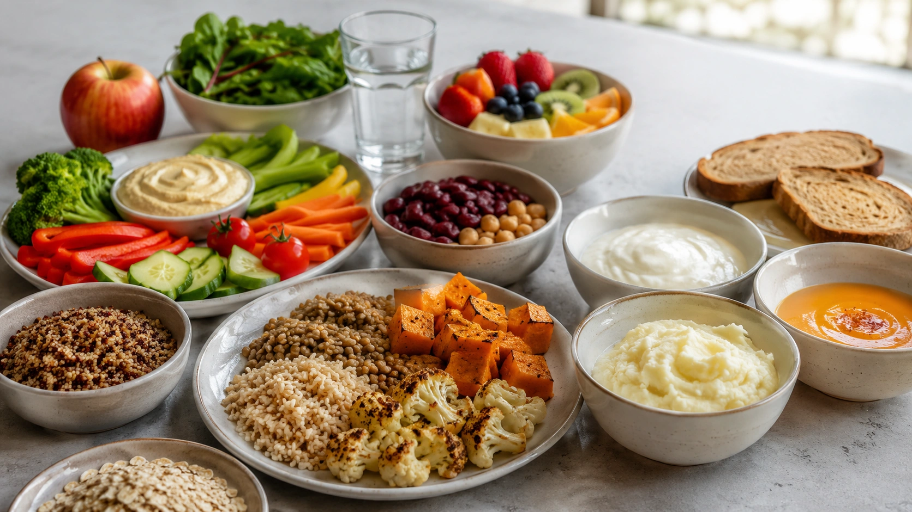

Eating slowly may sound like a very simple habit, but eating rate can influence **how much food and energy people consume during a meal**.

Experimental research generally suggests that slowing down eating can reduce intake. The effects on subjective hunger and fullness are less consistent, however, and current evidence does not show that eating slowly by itself guarantees meaningful long-term weight loss. ([PubMed](https://pubmed.ncbi.nlm.nih.gov/24847856/ 'A systematic review and meta-analysis examining the effect of eating rate on energy intake and hunger'))

A useful way to think about it is that **slower eating can be a self-regulation tool rather than a weight-loss method on its own**.

## What changes when you eat more slowly?

Eating rate describes how much food is consumed over a given amount of time.

Smaller bites, more chewing, and foods that require more oral processing can all slow the rate at which a meal is consumed. This extends sensory exposure to food and limits how much can be eaten quickly. ([PubMed](https://pubmed.ncbi.nlm.nih.gov/29408331/ 'Influence of oral processing on appetite and food intake — A systematic review and meta-analysis'))

A meta-analysis of 22 experimental studies found that slower eating was associated with lower energy intake compared with faster eating, even though individual study results varied considerably. ([PubMed](https://pubmed.ncbi.nlm.nih.gov/24847856/ 'A systematic review and meta-analysis examining the effect of eating rate on energy intake and hunger'))

That makes the evidence more informative than studies that simply ask people whether they consider themselves fast or slow eaters.

## Does eating slowly improve fullness?

Possibly, but the answer depends on what we mean by fullness.

Researchers often distinguish between processes that help bring the current meal to an end and the suppression of hunger that persists after the meal. ([PubMed](https://pubmed.ncbi.nlm.nih.gov/37638839/ 'The role of gastric function in control of food intake (and …'))

The evidence for eating rate appears stronger for **how much people consume before stopping** than for substantially changing how hungry they feel several hours later.

In Robinson and colleagues' meta-analysis, slower eating reduced energy intake, but eating rate was not significantly associated with hunger at the end of the meal or for up to 3.5 hours afterward. ([PubMed](https://pubmed.ncbi.nlm.nih.gov/24847856/ 'A systematic review and meta-analysis examining the effect of eating rate on energy intake and hunger'))

A separate review of oral processing found reductions in food intake as well as smaller effects on self-reported hunger. ([PubMed](https://pubmed.ncbi.nlm.nih.gov/29408331/ 'Influence of oral processing on appetite and food intake — A systematic review and meta-analysis'))

So the common explanation that slower eating simply “gives the brain time to realize you're full” is incomplete.

## Is there a 20-minute fullness rule?

A precise 20-minute rule is often repeated in popular nutrition advice, but controlled studies do not establish one universal timer that applies to every person and meal.

Researchers have changed eating speed in many different ways, and responses vary substantially between studies. ([PubMed](https://pubmed.ncbi.nlm.nih.gov/24847856/ 'A systematic review and meta-analysis examining the effect of eating rate on energy intake and hunger'))

Time can still matter. The practical point is simply not to consume a large quantity of food so rapidly that there is little opportunity for the ongoing sensory and physiological processes of eating to influence the meal.

## Can slower eating reduce how much you eat?

This is where experimental evidence is particularly compelling.

In a 2024 _British Journal of Nutrition_ experiment using 24 different ad libitum breakfast and lunch meals, researchers changed meal textures to encourage faster or slower eating.

Across the study conditions, slower meals resulted in an average of **22% less food by weight and 13% less energy**, corresponding to an average difference of about 71 kcal in the tested meals. ([Cambridge University Press](https://www.cambridge.org/core/journals/british-journal-of-nutrition/article/consistent-effect-of-eating-rate-on-food-and-energy-intake-across-twentyfour-ad-libitum-meals/D1339BB6E581048B06BB1FF0B3F5BC35 'Consistent effect of eating rate on food and energy intake across twenty-four ad libitum meals | British Journal of Nutrition | Cambridge Core'))

Those figures should not be treated as a promise that everyone will automatically eat 13% fewer calories when slowing down. The experiment was controlled and relatively small, and the authors emphasized that longer-term research in real-life settings is still needed. ([Cambridge University Press](https://www.cambridge.org/core/journals/british-journal-of-nutrition/article/consistent-effect-of-eating-rate-on-food-and-energy-intake-across-twentyfour-ad-libitum-meals/D1339BB6E581048B06BB1FF0B3F5BC35 'Consistent effect of eating rate on food and energy intake across twenty-four ad libitum meals | British Journal of Nutrition | Cambridge Core'))

The finding does, however, reinforce the broader evidence that foods and meals that naturally require slower oral processing can reduce intake at that eating occasion.

## Does chewing matter?

Probably to some extent.

A systematic review and meta-analysis examining oral processing found that manipulations involving chewing, eating rate, and texture influenced food intake, with smaller effects on appetite ratings. ([PubMed](https://pubmed.ncbi.nlm.nih.gov/29408331/ 'Influence of oral processing on appetite and food intake — A systematic review and meta-analysis'))

More chewing increases the amount of time food spends in the mouth before swallowing and changes the pace at which the next bite can be taken.

But that does not justify a universal rule such as chewing every bite 20, 30, or 40 times.

Different foods have very different physical structures, so the amount of processing required to eat an apple, lentils, yogurt, or soup naturally differs. ([Cambridge University Press](https://www.cambridge.org/core/journals/british-journal-of-nutrition/article/consistent-effect-of-eating-rate-on-food-and-energy-intake-across-twentyfour-ad-libitum-meals/D1339BB6E581048B06BB1FF0B3F5BC35 'Consistent effect of eating rate on food and energy intake across twenty-four ad libitum meals | British Journal of Nutrition | Cambridge Core'))

## What about fullness hormones?

There are interesting physiological clues.

A small experimental study found that eating the same meal more slowly produced a stronger post-meal response of the gut hormones GLP-1 and PYY, both of which are involved in appetite regulation. ([PubMed](https://pubmed.ncbi.nlm.nih.gov/19875483/ 'Eating slowly increases the postprandial response of the anorexigenic gut hormones, peptide YY and glucagon-like peptide-1'))

This supports a possible biological pathway, but it does not establish that hormone changes are the primary reason slower eating influences intake or that those changes automatically produce weight loss.

Eating behavior is regulated by an interaction between gastrointestinal signals, sensory experience, reward, food availability, learning, social context, and many other factors.

## Is fast eating linked with higher body weight?

Yes, observational research repeatedly finds this association.

A systematic review and meta-analysis published in the _International Journal of Obesity_ concluded that faster eating was positively associated with excess body weight. The authors also noted that intervention research was needed to determine whether deliberately reducing eating speed could effectively control weight. ([PubMed](https://pubmed.ncbi.nlm.nih.gov/26100137/ 'Association between eating rate and obesity: a systematic review and meta-analysis'))

A later systematic review of self-reported eating speed likewise found associations with obesity indicators in adults. ([MDPI](https://www.mdpi.com/2227-9032/9/11/1559 'Self-Reported Eating Speed Is Associated with Indicators …'))

However, **association does not prove causation**.

Fast eaters may differ from slow eaters in food choices, portion sizes, schedules, stress, sleep, and many other characteristics that can also affect body weight.

## What do we know about long-term weight control?

Some longitudinal findings are encouraging, but they need careful interpretation.

One study followed health-check data from **59,717 Japanese adults with type 2 diabetes**. Compared with people classified as fast eaters, normal and slow eaters had lower odds of obesity in the statistical models. Slower eating patterns were also associated with small favorable differences in BMI and waist circumference. ([PubMed](https://pubmed.ncbi.nlm.nih.gov/29440054/ 'Effects of changes in eating speed on obesity in patients with diabetes: a secondary analysis of longitudinal health check-up data'))

The study was large, but it was not a randomized clinical trial, eating speed was self-reported, and the participants represented a specific clinical population.

It therefore strengthens the hypothesis that eating rate may matter without proving that intentionally slowing every meal will cause weight loss.

## So can eating slowly help with weight loss?

**It may contribute, but it should not be presented as a stand-alone solution.**

If slower eating causes someone to become satisfied with smaller portions or prevents automatic second servings, it may reduce energy intake over time.

But that effect could be offset by eating more later or regularly choosing very energy-dense foods in larger quantities.

Sleep, physical activity, food quality, medications, health conditions, environment, and many other factors also influence body-weight regulation.

## Food texture can change eating speed too

Eating rate is not only a personal characteristic.

The **physical texture of food** has a strong influence on how quickly it can be consumed.

Foods that are soft, moist, and require little oral processing can often be eaten rapidly. Harder, chewier, or more structurally complex foods generally require more oral processing and take longer to consume. ([Cambridge University Press](https://www.cambridge.org/core/journals/british-journal-of-nutrition/article/consistent-effect-of-eating-rate-on-food-and-energy-intake-across-twentyfour-ad-libitum-meals/D1339BB6E581048B06BB1FF0B3F5BC35 'Consistent effect of eating rate on food and energy intake across twenty-four ad libitum meals | British Journal of Nutrition | Cambridge Core'))

In the 2024 experiment, researchers consistently changed eating rate by modifying the textures of everyday meals. ([Cambridge University Press](https://www.cambridge.org/core/journals/british-journal-of-nutrition/article/consistent-effect-of-eating-rate-on-food-and-energy-intake-across-twentyfour-ad-libitum-meals/D1339BB6E581048B06BB1FF0B3F5BC35 'Consistent effect of eating rate on food and energy intake across twenty-four ad libitum meals | British Journal of Nutrition | Cambridge Core'))

This suggests that slowing down does not have to depend entirely on conscious willpower. Meal composition and food structure can also shape eating behavior.

## Practical ways to slow your eating pace

There is no mandatory technique. The goal is to reduce automatic, rushed eating.

Possible approaches include:

1. **Take smaller bites.** Smaller amounts per bite can naturally extend the meal.
2. **Chew without rushing.** There is no need to count every chew.
3. **Put down your utensils occasionally.** Brief pauses interrupt continuous bite-to-bite eating.
4. **Notice flavor and texture.** Paying attention to the sensory experience can naturally slow the pace.
5. **Practice with one meal a day.** You do not have to change every meal immediately.
6. **Include foods that require oral processing when appropriate.** Food texture itself can help regulate eating rate. ([PubMed](https://pubmed.ncbi.nlm.nih.gov/29408331/ 'Influence of oral processing on appetite and food intake — A systematic review and meta-analysis'))

These are ways to alter eating pace, not guaranteed weight-loss techniques.

## Is eating more slowly worth trying?

For many people, yes.

Unlike restrictive diet rules, slowing down does not require eliminating entire food groups. It can be integrated into an otherwise nutritionally balanced diet.

If it helps you notice when you've had enough, reduce automatic second servings, or simply experience meals with less urgency, it may be practically useful.

Someone who already eats slowly, however, should not expect that slowing down even further will necessarily lead to weight loss.

## Conclusion

**Eating more slowly can reduce the amount of food and energy consumed during a meal.** This is the most consistent finding in the research. ([PubMed](https://pubmed.ncbi.nlm.nih.gov/24847856/ 'A systematic review and meta-analysis examining the effect of eating rate on energy intake and hunger'))

Effects on subjective hunger and fullness are less consistent. And while faster eating is associated with higher body weight in observational studies, there is less long-term experimental evidence showing that simply slowing down leads to sustained weight loss. ([PubMed](https://pubmed.ncbi.nlm.nih.gov/29408331/ 'Influence of oral processing on appetite and food intake — A systematic review and meta-analysis'))

Slower eating can therefore be a useful healthy habit, especially when it reduces automatic intake, but it works best as **one part of a broader eating pattern and lifestyle rather than an isolated weight-control solution**.
