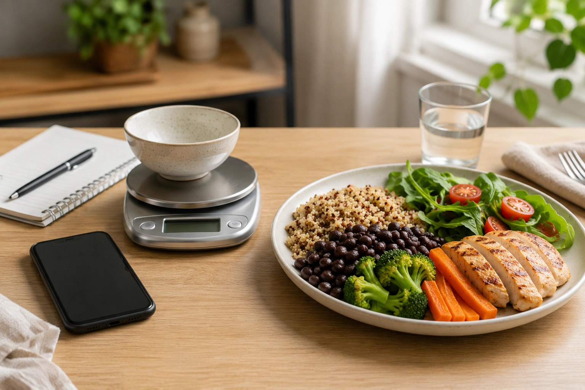
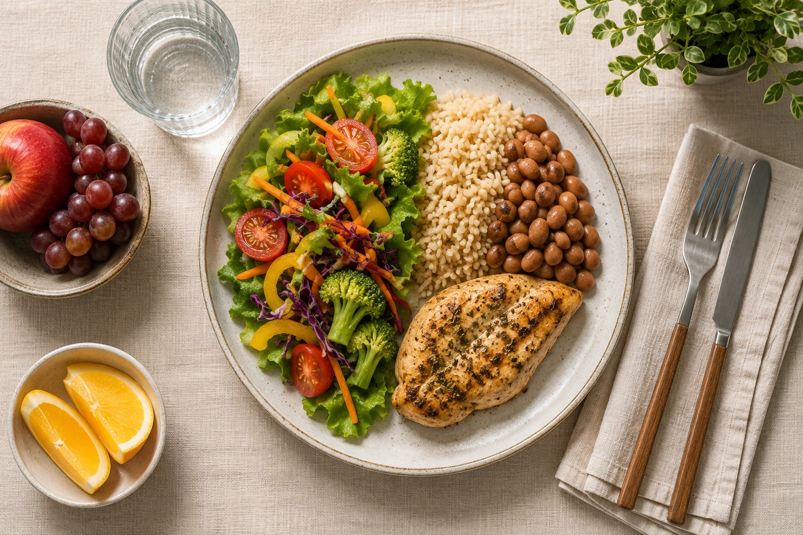
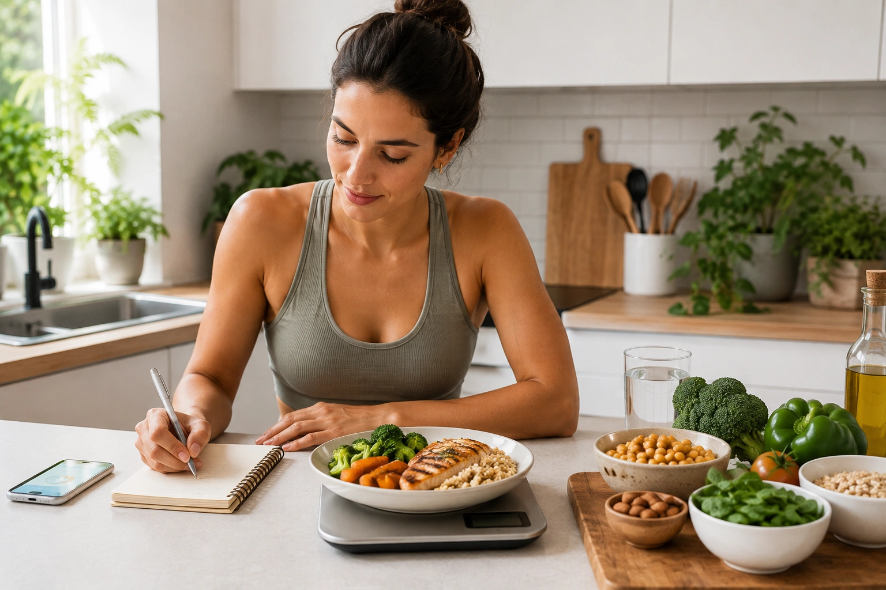

Do you have to weigh every serving of rice, measure cooking oil, log your morning coffee, and end each evening checking whether an app says you stayed within your target?

**Not necessarily.**

Two ideas are often treated as if they were the same: **calories matter for weight loss** and **you must count calories to lose weight**.

The first relates to energy balance.

The second is simply one possible weight-management tool.

In short: **an energy deficit is necessary; a calorie-tracking app is not**.

## What actually needs to happen for weight to go down?

Over time, the body needs to use more energy than it receives from food and drinks if stored body energy is to decrease.

This is commonly called an **energy deficit or calorie deficit**.

The World Health Organization recognizes the importance of energy intake and expenditure while also emphasizing that obesity is a complex, chronic condition influenced by genetics, neurobiology, behaviors, access to healthy food, the environment, medications, and social factors. ([WHO](https://www.who.int/news-room/fact-sheets/detail/obesity-and-overweight 'Obesity and overweight'))

Saying that energy balance matters therefore does not mean weight loss is simple or entirely under conscious control.

## A calorie deficit is not the same as calorie counting

This distinction is central.

Imagine two people.

The first tracks every meal, weighs ingredients, and follows a numerical calorie target.

The second does not track calories but starts to:

- drink water instead of calorie-containing drinks;
- reduce portions of energy-dense foods;
- add more vegetables;
- eat more minimally processed foods;
- plan meals;
- reduce automatic snacking;
- pay more attention to hunger and fullness.

If either strategy consistently causes energy intake to fall below expenditure, **either can lead to weight loss**.

Counting calories is one way to manage a deficit.

It is not the deficit itself.

## Can people really lose weight without a calorie target?

The DIETFITS randomized clinical trial provides a useful example.

Researchers randomized 609 adults with overweight or obesity to either a healthy low-fat or healthy low-carbohydrate eating pattern. Participants received intensive guidance on food quality and on reducing either fat or carbohydrates, but they **were not instructed to follow a specific calorie-restriction target**. ([JAMA Network Open](https://jamanetwork.com/journals/jama/fullarticle/2673150 'Effect of Low-Fat vs Low-Carbohydrate Diet on 12-Month Weight Loss in Overweight Adults and the Association With Genotype Pattern or Insulin Secretion: The DIETFITS Randomized Clinical Trial'))

Despite that, reported energy intake fell by roughly 500 to 600 kcal per day on average after the intervention began. At 12 months, average weight loss was about 5.3 kg in the healthy low-fat group and 6.0 kg in the healthy low-carbohydrate group, with no significant difference between them. ([JAMA Network Open](https://jamanetwork.com/journals/jama/fullarticle/2673150 'Effect of Low-Fat vs Low-Carbohydrate Diet on 12-Month Weight Loss in Overweight Adults and the Association With Genotype Pattern or Insulin Secretion: The DIETFITS Randomized Clinical Trial'))

This does not prove that calorie counting is useless.

It demonstrates that changes in eating behavior and food selection can reduce energy intake without requiring a specific daily calorie prescription.

## Why does calorie counting help some people?

Because tracking can reveal habits that are otherwise easy to overlook.

Cooking oils, drinks, nuts, desserts, snacks, and larger-than-expected portions can all contribute meaningfully to daily energy intake.

Writing things down can make those patterns easier to recognize.

Systematic reviews of behavioral weight-loss programs indicate that **dietary self-monitoring** can support weight loss. Monitoring methods have included paper diaries, websites, smartphone apps, and less intensive approaches. ([PubMed](https://pubmed.ncbi.nlm.nih.gov/34412727/ 'A systematic review of the use of dietary self-monitoring in behavioural weight loss interventions: delivery, intensity and effectiveness'))

NIDDK also describes digital trackers as tools that **may help** people monitor food, activity, and weight. ([NIDDK](https://www.niddk.nih.gov/health-information/weight-management/adult-overweight-obesity/eating-physical-activity 'Eating & Physical Activity to Lose or Maintain Weight'))

The key word is “may.”

## Food does not have to become a math exercise

Dietary monitoring exists on a spectrum.

Raber and colleagues reviewed 59 weight-loss intervention studies and found approaches ranging from detailed recording of all food to lower-intensity methods that focused on only certain aspects of eating. Both lower- and higher-intensity monitoring strategies showed potential to support weight loss. ([PubMed](https://pubmed.ncbi.nlm.nih.gov/34412727/ 'A systematic review of the use of dietary self-monitoring in behavioural weight loss interventions: delivery, intensity and effectiveness'))

That matters because the most detailed strategy is not automatically the best.

A highly precise method that someone abandons within days may be less useful than a simpler method they can follow for months.

## How can you lose weight without counting calories?

The goal is to adopt behaviors that make lower energy intake more likely without requiring calculations at every meal.

### 1. Change the composition of your meals

Foods that provide substantial volume and nutrients can make portion control easier.

Vegetables, fruit, legumes, and other fiber-rich foods can make up a larger share of the meal while providing nutritional value and helping create a more filling eating pattern.

### 2. Pay attention to energy-dense foods

Some foods contain a large amount of energy in relatively small servings.

Oils, butter, nuts, cheese, sweets, and many prepared foods can still fit into a balanced diet, but portion size matters.

The goal is awareness, not prohibition.

### 3. Review what you drink

Sugar-sweetened drinks, alcohol, sweetened coffee beverages, and other calorie-containing drinks can increase energy intake without necessarily providing the same fullness as a meal.

Choosing water more often can be one of the simplest changes available.

### 4. Give meals some structure

Eating entirely on impulse can make portion management harder, particularly when hunger becomes intense.

Planning meals and keeping suitable foods available can help reduce reactive choices.

### 5. Learn what reasonable portions look like

You do not have to weigh food forever.

A food scale may be useful for a short period to learn portions before switching to household measurements or visual references.

NIDDK notes that portion control can help with reaching or maintaining a healthy weight. ([NIDDK](https://www.niddk.nih.gov/health-information/weight-management/just-enough-food-portions 'Food Portions: Choosing Just Enough for You - NIDDK'))

### 6. Monitor outcomes as well as inputs

Short-term body weight can fluctuate for many reasons, so one measurement does not define whether a plan is working.

Looking at longer-term trends can help you assess whether your overall strategy is producing the expected result.

NIDDK includes progress monitoring as part of behavioral weight-management approaches. ([NIDDK](https://www.niddk.nih.gov/health-information/weight-management/adult-overweight-obesity/eating-physical-activity 'Eating & Physical Activity to Lose or Maintain Weight'))

## When can calorie tracking be especially useful?

Tracking may be helpful if you:

- cannot identify why your weight is not changing;
- have difficulty estimating portions;
- frequently eat energy-dense foods;
- enjoy data and feel more organized when tracking;
- want to learn how different meals affect daily intake;
- are working with a professional who uses food records to adjust your plan.

Sometimes a few days or weeks of tracking are enough to reveal useful patterns.

Tracking does not have to become permanent.

## When might not tracking be better?

If calorie counting consistently causes anxiety, guilt, food fear, or obsessive behavior, the costs may outweigh the benefits.

A 2025 systematic review in _Body Image_ found associations between diet and fitness app use and disordered eating symptoms, body-image concerns, and compulsive exercise in the available literature. ([PubMed](https://pubmed.ncbi.nlm.nih.gov/39671845/ 'The link between the use of diet and fitness monitoring apps, body image and disordered eating symptomology: A systematic review'))

This finding needs context. Much of the evidence was observational, so researchers cannot determine whether app use caused these problems. People who already have greater food or body-image concerns may also be more likely to use tracking apps.

Still, the association supports caution for vulnerable individuals.

## Are calories the only thing that matters?

No.

Calories are fundamental to energy balance, but two diets containing the same amount of energy can differ greatly in:

- fiber;
- protein;
- vitamins and minerals;
- fullness;
- fruit and vegetable intake;
- degree of processing;
- enjoyment;
- sustainability.

The goal should not simply be to achieve the lowest number an app allows.

NIDDK recommends scientifically supported, reduced-energy eating patterns that can be tailored to health needs, preferences, culture, and long-term adherence. ([NIDDK](https://www.niddk.nih.gov/health-information/weight-management/choosing-a-safe-successful-weight-loss-program 'Choosing a Safe & Successful Weight-loss Program - NIDDK'))

## What about exercise?

Physical activity is important for health and can support weight management, particularly after weight loss.

But exercise does not need to become a system for “earning” food or compensating for every meal.

Both WHO and NIDDK place physical activity within a broader approach that also includes healthy eating and sustainable lifestyle behaviors. ([WHO](https://www.who.int/news-room/fact-sheets/detail/obesity-and-overweight 'Obesity and overweight'))

The health value of exercise goes far beyond calories burned.

## Calorie counting or not: how should you choose?

A practical question is whether the method improves your ability to maintain healthy behaviors.

| Approach                    | May be useful when                                   | Potential limitation                     |
| --------------------------- | ---------------------------------------------------- | ---------------------------------------- |
| Detailed calorie tracking   | You enjoy numbers and want to learn portions         | Can be time-consuming                    |
| Food diary without calories | You want to identify patterns and triggers           | Does not directly quantify energy        |
| Portion control             | You prefer a simple system                           | Requires learning portion references     |
| Visual plate method         | You want practical everyday guidance                 | Less precise for energy-dense foods      |
| Weight-trend monitoring     | You want to assess whether the overall plan works    | Does not identify exactly what to change |
| Professional guidance       | Medical or behavioral factors complicate weight loss | Requires access to qualified care        |

No single method is right for everyone.

You can also change methods over time.

## What if you are not losing weight without tracking?

Before assuming something is fundamentally wrong, review your routine over several weeks.

Ask whether:

- portions have gradually increased;
- drinks or alcohol are contributing extra energy;
- weekends differ significantly from weekdays;
- unplanned snacks are frequent;
- energy-dense foods are being eaten in larger quantities;
- physical activity has decreased;
- the plan is being followed consistently.

Temporary food tracking can then be used as a **diagnostic tool**, rather than a permanent rule.

Health conditions and medications may also affect weight regulation. WHO specifically recognizes biological, medical, environmental, and psychosocial influences on obesity. ([WHO](https://www.who.int/news-room/fact-sheets/detail/obesity-and-overweight 'Obesity and overweight'))

## The best approach is one you can sustain

Weight management does not end when you reach a target on the scale.

Maintaining weight loss usually requires behaviors that can remain part of daily life.

NIDDK emphasizes choosing an eating pattern that can be sustained and notes that metabolism, hormonal changes, and other adaptations can make long-term weight maintenance challenging. ([NIDDK](https://www.niddk.nih.gov/health-information/weight-management/adult-overweight-obesity/eating-physical-activity 'Eating & Physical Activity to Lose or Maintain Weight'))

Sustainability is therefore not an optional extra.

It is part of the strategy.

## Conclusion

**No, counting calories is not required to lose weight.**

What is required is a sustained reduction in energy intake relative to expenditure. Some people achieve this by tracking calories. Others do it by changing portions, food choices, beverages, eating routines, and their food environment.

Evidence also indicates that dietary self-monitoring can be useful without necessarily requiring the most intensive form of tracking. ([PubMed](https://pubmed.ncbi.nlm.nih.gov/34412727/ 'A systematic review of the use of dietary self-monitoring in behavioural weight loss interventions: delivery, intensity and effectiveness'))

The best strategy is one that creates an appropriate energy deficit **without making eating impossible to sustain**.

If calorie tracking helps you understand your habits without causing anxiety or obsession, it may be useful.

If it does not, there are other evidence-based ways to approach weight loss.
