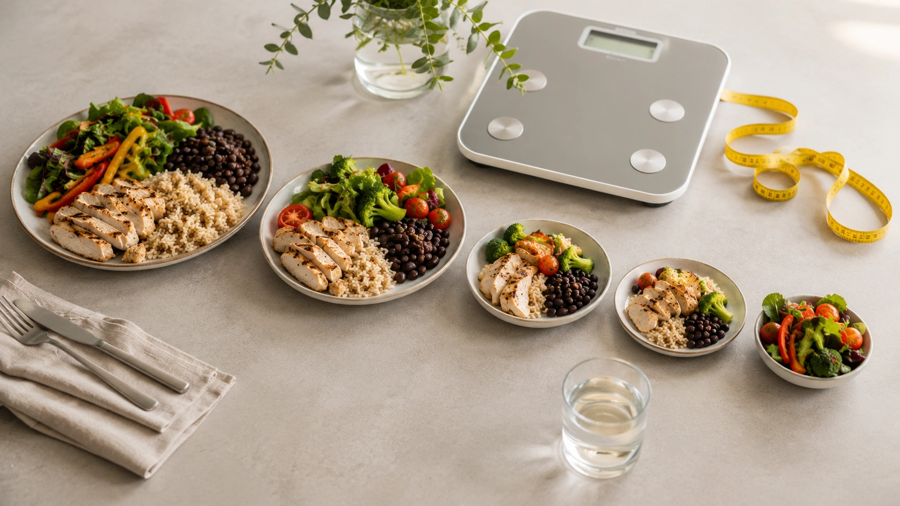

“To lose weight, just burn more calories than you eat.”

The statement describes an important principle, but it is often presented as if it explained the entire biology of weight loss.

**A calorie deficit occurs when the body uses more energy over time than it receives from food and beverages.** The body must then draw on stored energy, contributing to a reduction in body weight. ([CDC](https://www.cdc.gov/healthy-weight-growth/physical-activity/index.html 'Physical Activity and Your Weight and Health'))

That sounds straightforward.

In practice, however, both sides of the energy-balance equation can change. Body weight, body composition, physical activity, appetite, and physiological adaptations interact, which is why weight loss rarely follows a perfectly straight line. ([PubMed](https://pubmed.ncbi.nlm.nih.gov/21872751/ 'Quantification of the effect of energy imbalance on bodyweight'))

## What does being in a calorie deficit mean?

Your body continuously uses energy.

Some energy supports essential functions at rest. Additional energy is used to digest food and to support movement, from structured exercise to ordinary daily activities. Together, these processes contribute to total energy expenditure. ([PMC](https://pmc.ncbi.nlm.nih.gov/articles/PMC5568065/ 'Obesity Energetics: Body Weight Regulation and the Effects of Diet Composition'))

When energy intake remains below energy expenditure for a sufficient period of time, the body is in **negative energy balance**, commonly called a calorie deficit. ([CDC](https://www.cdc.gov/healthy-weight-growth/physical-activity/index.html 'Physical Activity and Your Weight and Health'))

Consider a purely illustrative example:

| Estimated situation      |     Energy |
| ------------------------ | ---------: |
| Daily energy expenditure | 2,400 kcal |
| Daily energy intake      | 2,000 kcal |
| Estimated deficit        |   400 kcal |

The important word is **estimated**.

Energy expenditure is not a permanently fixed number. The NIDDK Body Weight Planner, for example, uses dynamic modeling to predict how changes in calorie intake and physical activity may affect body weight over time. ([NIDDK](https://www.niddk.nih.gov/health-information/weight-management/body-weight-planner 'About the Body Weight Planner'))

## Does a calorie deficit really cause weight loss?

Yes.

For stored body energy to decline sustainably, energy expenditure must exceed energy intake over time. CDC guidance specifically describes reducing calorie intake, increasing physical activity, or combining both as ways to create the deficit that produces weight loss. ([CDC](https://www.cdc.gov/healthy-weight-growth/physical-activity/index.html 'Physical Activity and Your Weight and Health'))

That does not mean every diet works equally well for every individual.

Different dietary approaches can influence hunger, satiety, preferences, routine, and adherence differently. The energy principle remains, but the easiest way to establish and maintain a deficit can vary substantially between people. This is one reason structured weight-management programs combine nutrition, physical activity, monitoring, and behavioral support. ([NIDDK](https://www.niddk.nih.gov/health-information/weight-management/adult-overweight-obesity/treatment 'Treatment for Overweight & Obesity'))

## A calorie deficit is not a diet

A calorie deficit describes an **energy state**, not a particular menu.

A Mediterranean-style diet can produce a deficit.

A vegetarian diet can produce a deficit.

A lower-carbohydrate diet can produce a deficit.

A traditional mixed diet can produce a deficit.

Conversely, none of these approaches guarantees weight loss merely because of its name. Sustainable weight reduction requires the overall pattern to produce lower energy intake than expenditure over time, while food quality remains important for nutrition, health, and adherence. ([NIDDK](https://www.niddk.nih.gov/health-information/weight-management/adult-overweight-obesity/treatment 'Treatment for Overweight & Obesity'))

## Why doesn't the 500-calorie rule work perfectly?

A commonly repeated formula says that reducing intake by 500 calories every day produces a weekly deficit of 3,500 calories and therefore approximately one pound, or 0.45 kg, of weight loss each week.

The arithmetic is not the main problem.

The assumption that the body remains unchanged while weight is being lost is.

The traditional 3,500-calorie rule has been criticized because it treats energy expenditure too statically. Dynamic models developed by Hall and colleagues demonstrate that changes in body size and composition alter energy expenditure and that the body's response to an intake change unfolds gradually. ([PMC](https://pmc.ncbi.nlm.nih.gov/articles/PMC3880593/ 'Quantification of the effect of energy imbalance on bodyweight'))

In other words:

**a deficit estimated today will not necessarily remain the same size several months from now.**

That is why projecting exactly the same weekly weight loss indefinitely creates unrealistic expectations. ([PubMed](https://pubmed.ncbi.nlm.nih.gov/21872751/ 'Quantification of the effect of energy imbalance on bodyweight'))

## Why does energy expenditure decline during weight loss?

Two concepts are particularly important.

### 1. A smaller body generally requires less energy

As body weight decreases, there is less tissue to maintain and less mass to move. Part of the decline in energy expenditure during weight loss is therefore an expected consequence of becoming smaller. ([PMC](https://pmc.ncbi.nlm.nih.gov/articles/PMC5568065/ 'Obesity Energetics: Body Weight Regulation and the Effects of Diet Composition'))

An intake that produced a meaningful calorie deficit at a higher body weight may therefore produce a smaller deficit after substantial weight loss. Dynamic weight models account for this changing relationship. ([PubMed](https://pubmed.ncbi.nlm.nih.gov/21872751/ 'Quantification of the effect of energy imbalance on bodyweight'))

### 2. Adaptive thermogenesis may also occur

Researchers use the term **adaptive thermogenesis** to describe a reduction in energy expenditure beyond what would be predicted from changes in weight and body composition alone.

A systematic review in the _British Journal of Nutrition_ identified adaptive thermogenesis in many studies but also found substantial methodological and individual variability. Better-designed studies tended to report smaller or nonsignificant effects, and the phenomenon appeared to diminish after periods of weight stability. ([Cambridge University Press](https://www.cambridge.org/core/journals/british-journal-of-nutrition/article/does-adaptive-thermogenesis-occur-after-weight-loss-in-adults-a-systematic-review/726FC60518DA67349B9C3EC1D75A7156 'Does adaptive thermogenesis occur after weight loss in adults? A systematic review'))

So saying that dieting permanently “damages your metabolism” is not supported.

But saying the body never adapts to weight loss is also inaccurate.

## Does the body enter “starvation mode”?

The popular concept of “starvation mode” often implies that metabolism can slow so dramatically that weight loss becomes impossible despite a true, sustained energy deficit.

That interpretation is misleading.

Metabolic adaptations can reduce energy expenditure and make the original deficit smaller, but they do not abolish energy balance. The systematic review of adaptive thermogenesis also suggests that the additional metabolic effect may be modest in higher-quality studies. ([Cambridge University Press](https://www.cambridge.org/core/journals/british-journal-of-nutrition/article/does-adaptive-thermogenesis-occur-after-weight-loss-in-adults-a-systematic-review/726FC60518DA67349B9C3EC1D75A7156 'Does adaptive thermogenesis occur after weight loss in adults? A systematic review'))

What can happen is that a diet estimated to produce a deficit at the beginning no longer produces the same deficit later.

## Why does weight loss slow down?

Imagine again a person whose estimated expenditure begins at 2,400 calories per day while intake is 2,000.

The initial estimated deficit is 400 calories.

After significant weight loss, energy expenditure may be lower. If it hypothetically approached 2,200 calories while intake remained at 2,000, the theoretical deficit would now be smaller.

Those numbers are illustrative rather than a prediction, but they demonstrate the principle captured by dynamic models: the difference between energy intake and expenditure changes as the body changes. ([PubMed](https://pubmed.ncbi.nlm.nih.gov/21872751/ 'Quantification of the effect of energy imbalance on bodyweight'))

This is one reason the same diet cannot be expected to produce identical weight loss indefinitely.

## Does a calorie deficit mean losing only fat?

No.

Weight loss and fat loss are not exactly the same outcome.

Weight-loss interventions can involve changes in both fat mass and fat-free tissue. For that reason, a well-designed approach should not focus only on making the number on the scale fall as quickly as possible. Preserving muscle mass is also relevant. ([PubMed](https://pubmed.ncbi.nlm.nih.gov/39002131/ 'Enhanced protein intake on maintaining muscle mass, strength, and physical function in adults with overweight/obesity: A systematic review and meta-analysis'))

A 2024 systematic review and meta-analysis found that increased protein intake helped attenuate muscle-mass loss in adults with overweight or obesity who were pursuing weight loss. ([PubMed](https://pubmed.ncbi.nlm.nih.gov/39002131/ 'Enhanced protein intake on maintaining muscle mass, strength, and physical function in adults with overweight/obesity: A systematic review and meta-analysis'))

Physical activity also provides benefits extending far beyond calorie expenditure. CDC guidance recommends adults obtain at least 150 minutes of moderate-intensity aerobic activity per week, or an equivalent amount of vigorous activity, as well as muscle-strengthening activity on at least two days per week for general health. ([CDC](https://www.cdc.gov/healthy-weight-growth/physical-activity/index.html 'Physical Activity and Your Weight and Health'))

## How large should a calorie deficit be?

There is no single ideal number for everyone.

Energy requirements differ according to body size, composition, physical activity, health status, and other factors. NIDDK provides individualized modeling tools because a single calorie prescription cannot adequately represent every adult. ([NIDDK](https://www.niddk.nih.gov/health-information/weight-management/body-weight-planner 'About the Body Weight Planner'))

CDC guidance notes that gradual weight loss of around 1 to 2 pounds per week, approximately 0.45 to 0.9 kg, is more likely to be maintained than faster weight loss. This is general population guidance rather than a requirement to lose exactly that amount every week. ([CDC](https://www.cdc.gov/healthy-weight-growth/losing-weight/index.html 'Steps for Losing Weight'))

Smaller individuals, people closer to their target weight, and people with specific medical circumstances may experience different rates.

## Is a larger deficit always better?

No.

Speed should not be the only measure of success.

Safe weight-management programs consider both energy intake and nutritional needs, and NIDDK guidance emphasizes individualized goals and timelines. ([NIDDK](https://www.niddk.nih.gov/health-information/weight-management/adult-overweight-obesity/treatment 'Treatment for Overweight & Obesity'))

Severe restriction can also make preservation of muscle more challenging, which is one reason diet quality, protein intake, and appropriate exercise deserve attention during weight loss. ([PubMed](https://pubmed.ncbi.nlm.nih.gov/39002131/ 'Enhanced protein intake on maintaining muscle mass, strength, and physical function in adults with overweight/obesity: A systematic review and meta-analysis'))

A deficit that can be maintained is often more useful than an extreme strategy that cannot.

## Do you have to count calories?

No.

Your metabolism does not know whether you recorded your meal in an app.

A person can enter a calorie deficit without formally tracking calories. Adjusting portions, beverages, food choices, meal structure, and physical activity can change energy balance sufficiently to promote weight loss. ([NIDDK](https://www.niddk.nih.gov/health-information/weight-management/adult-overweight-obesity/treatment 'Treatment for Overweight & Obesity'))

Calorie tracking can still be a useful educational tool for some people, especially for understanding portions and identifying previously overlooked sources of energy.

It remains an estimate rather than a perfect measurement of human metabolism.

## How can you create a calorie deficit in practice?

### 1. Start with an estimate, not a guarantee

Energy-expenditure calculators can provide a starting point. More advanced resources, such as the NIDDK Body Weight Planner, use dynamic models that account for weight change over time, but predictions still need to be compared with an individual's actual response. ([NIDDK](https://www.niddk.nih.gov/health-information/weight-management/body-weight-planner 'About the Body Weight Planner'))

### 2. Make changes you can repeat

A reduction in energy intake can come from many combinations of portion changes, beverage choices, food selection, and meal organization.

The goal is not to eat as little as possible.

It is to establish an eating pattern that reduces energy intake while remaining nutritionally appropriate and sustainable. ([NIDDK](https://www.niddk.nih.gov/health-information/weight-management/adult-overweight-obesity/treatment 'Treatment for Overweight & Obesity'))

### 3. Use physical activity as an ally

Physical activity increases energy expenditure and can contribute to a calorie deficit. CDC guidance notes that much weight loss generally comes from reducing calorie intake, while regular physical activity also plays an important role in overall health and long-term weight maintenance. ([CDC](https://www.cdc.gov/healthy-weight-growth/physical-activity/index.html 'Physical Activity and Your Weight and Health'))

This helps avoid the assumption that increasing exercise indefinitely can compensate for any eating pattern.

### 4. Monitor trends

NIDDK describes regular monitoring of food intake, physical activity, and weight as components of structured weight-loss programs. Tracking trends provides information for adjusting the plan rather than reacting to a single measurement. ([NIDDK](https://www.niddk.nih.gov/health-information/weight-management/adult-overweight-obesity/treatment 'Treatment for Overweight & Obesity'))

### 5. Reassess as your body changes

A calorie deficit is not a fixed contract.

As body weight declines, energy requirements can also decrease. Strategies that worked early in the process may therefore need to be adjusted later. ([PubMed](https://pubmed.ncbi.nlm.nih.gov/21872751/ 'Quantification of the effect of energy imbalance on bodyweight'))

## “I'm in a calorie deficit but I'm not losing weight”

It is useful to distinguish between a **calculated deficit** and a **deficit that is actually being maintained over time**.

A calculator may estimate that someone expends 2,300 calories. An app may estimate an intake of 1,800 calories. The apparent difference is 500 calories, but both sides of that equation contain uncertainty.

Energy expenditure also changes with body weight and physical activity. Dynamic scientific models exist precisely because static calculations cannot perfectly predict real-world weight trajectories. ([PubMed](https://pubmed.ncbi.nlm.nih.gov/21872751/ 'Quantification of the effect of energy imbalance on bodyweight'))

If body weight remains stable for a sufficiently long period, the effective deficit is likely smaller than estimated or may no longer be present.

That does not automatically mean a lack of effort. CDC guidance notes that medications, medical conditions, stress, genes, hormones, environment, and age can all affect weight management. ([CDC](https://www.cdc.gov/healthy-weight-growth/losing-weight/index.html 'Steps for Losing Weight'))

## Is a calorie deficit the only thing that matters?

For explaining **why stored body energy decreases**, energy balance is fundamental.

For explaining **how someone successfully creates and maintains that deficit**, it is not the whole story.

Hunger, food quality, sleep, activity, routine, medications, medical conditions, and the surrounding environment can all affect eating behavior and weight management. This is why health authorities treat weight loss as a broader process rather than simply handing everyone the same calorie number. ([CDC](https://www.cdc.gov/healthy-weight-growth/losing-weight/index.html 'Steps for Losing Weight'))

The mathematics matters.

So do physiology and behavior.

## Conclusion

**A calorie deficit means that the body is using more energy than it receives from food and beverages over time, and this negative energy balance is required for weight loss.** ([CDC](https://www.cdc.gov/healthy-weight-growth/physical-activity/index.html 'Physical Activity and Your Weight and Health'))

Problems arise when that principle is converted into a rigid formula.

A 500-calorie daily deficit does not guarantee identical weekly weight loss, and the traditional 3,500-calorie-per-pound rule does not adequately account for changes in energy expenditure as body weight falls. ([PMC](https://pmc.ncbi.nlm.nih.gov/articles/PMC3880593/ 'Quantification of the effect of energy imbalance on bodyweight'))

In practice, the best deficit is not necessarily the largest one. It is one that can be sustained, provides adequate nutrition, and can be adjusted as the person's body and circumstances change.

Pregnant or breastfeeding people, individuals under 18, and people with medical conditions requiring specific nutritional management should not use generic calorie-deficit tools as a substitute for professional care. NIDDK specifically limits its Body Weight Planner to nonpregnant, nonbreastfeeding adults aged 18 or older. ([NIDDK](https://www.niddk.nih.gov/health-information/weight-management/body-weight-planner 'About the Body Weight Planner'))
