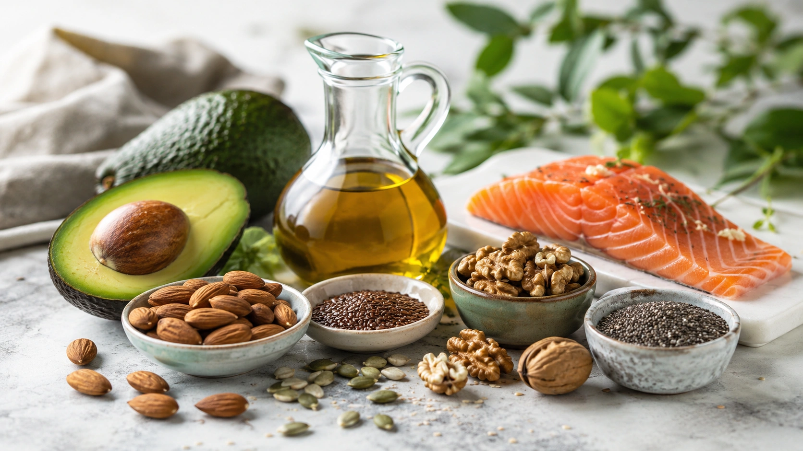
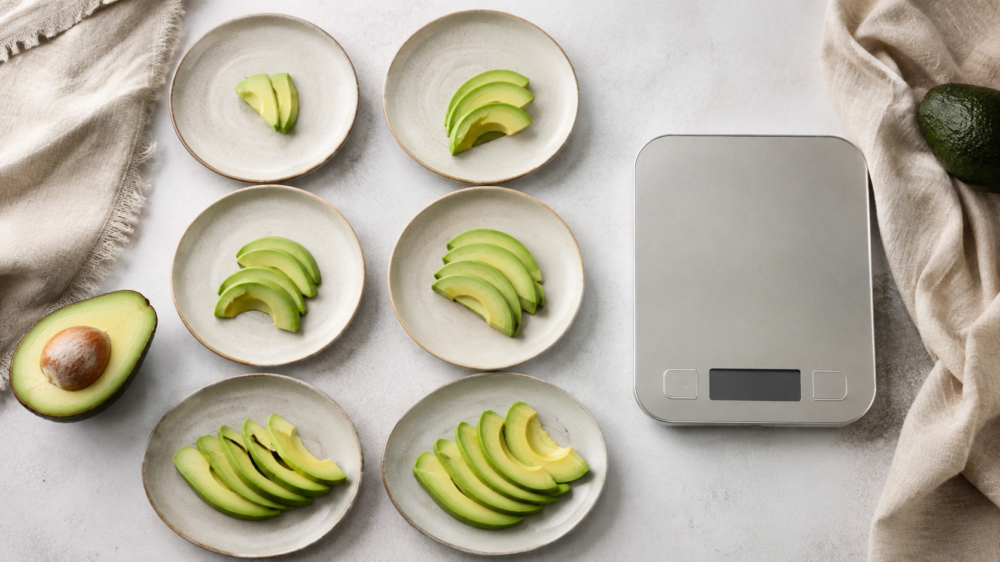
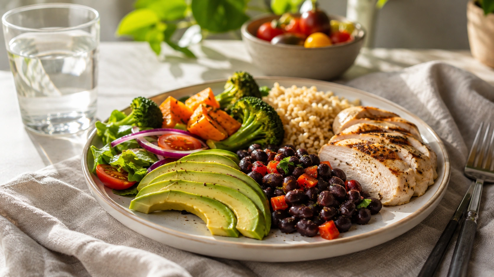

O abacate carrega uma contradição curiosa: de um lado, aparece em cardápios considerados saudáveis; de outro, muita gente evita a fruta porque ela tem “muita gordura” e poderia engordar.

A resposta curta é: **abacate não engorda por si só**. Ele realmente é mais rico em gordura e energia do que muitas frutas, mas o ganho de peso ocorre dentro de um contexto alimentar mais amplo. Ao longo do tempo, consumir mais energia do que o organismo utiliza favorece o aumento de peso, e esse processo também é influenciado por fatores biológicos, ambientais, comportamentais e sociais. ([OMS](https://www.who.int/news-room/fact-sheets/detail/obesity-and-overweight 'Obesity and overweight'))

Além disso, ensaios clínicos reunidos em revisões sistemáticas não mostram que incluir abacate na alimentação necessariamente leve ao ganho de peso. ([PubMed](https://pubmed.ncbi.nlm.nih.gov/35405602/ 'Can avocado intake improve weight loss in adults with excess body weight? A systematic review and meta-analysis of randomized controlled trials'))

## Quantas calorias tem o abacate?

Depende da variedade, do tamanho da fruta e da tabela utilizada.

Segundo a **Tabela Brasileira de Composição de Alimentos (TACO)**, cada 100 g de abacate cru apresentam aproximadamente:

| Nutriente       | Quantidade por 100 g |
| --------------- | -------------------: |
| Energia         |              96 kcal |
| Proteínas       |                1,2 g |
| Gorduras totais |                8,4 g |
| Carboidratos    |                6,0 g |
| Fibra alimentar |                6,3 g |

Isso significa que, tomando essa referência específica como base, 50 g forneceriam aproximadamente 48 kcal.

Mas há um detalhe importante: **“abacate” não representa um alimento com exatamente a mesma composição em qualquer país ou variedade**.

A Harvard Nutrition Source, por exemplo, apresenta como referência um abacate médio com cerca de **240 kcal, 22 g de gordura e 10 g de fibra**. A diferença em relação à tabela brasileira ilustra por que simplesmente dizer que “um abacate tem X calorias” pode ser enganoso sem especificar variedade, peso ou porção. ([Harvard T.H. Chan](https://nutritionsource.hsph.harvard.edu/avocados/ 'Avocados'))

## Por que o abacate tem mais calorias que outras frutas?

A principal diferença está na composição.

Enquanto muitas frutas obtêm a maior parte de sua energia dos carboidratos, o abacate possui uma quantidade relativamente alta de gordura. Harvard classifica a fruta como uma fonte especialmente rica em gordura e fibra e indica que a maior parte de sua gordura é monoinsaturada. ([Harvard T.H. Chan](https://nutritionsource.hsph.harvard.edu/avocados/ 'Avocados'))

Na referência brasileira da TACO, 100 g de abacate contêm aproximadamente:

- 4,3 g de gorduras monoinsaturadas;
- 1,4 g de gorduras poli-insaturadas;
- 2,3 g de gorduras saturadas.

Portanto, dizer que o abacate “tem gordura” é correto. O erro seria concluir automaticamente que isso torna a fruta prejudicial ou que qualquer quantidade promoverá ganho de gordura corporal.

## A gordura do abacate é diferente?

Sim. A maior parte é insaturada.

A Organização Mundial da Saúde destaca que a **qualidade da gordura alimentar importa** e cita o abacate entre os alimentos que fornecem gorduras insaturadas. De maneira geral, a OMS recomenda priorizar gorduras insaturadas sobre saturadas e trans. ([OMS](https://www.who.int/news-room/fact-sheets/detail/healthy-diet 'Healthy diet'))

Isso não torna as calorias da fruta irrelevantes.

Um alimento pode, ao mesmo tempo, ser nutricionalmente interessante e concentrar bastante energia. Esses conceitos não são contraditórios.

## Então gordura não engorda?

A frase “gordura engorda” simplifica demais a questão.

Ganho de peso ocorre quando existe um excedente energético sustentado, mas o comportamento alimentar humano e a regulação do peso são muito mais complexos do que atribuir o resultado a um único nutriente. A OMS descreve a obesidade como uma condição multifatorial, ainda que o desequilíbrio entre ingestão e gasto energético tenha papel fundamental. ([OMS](https://www.who.int/news-room/fact-sheets/detail/obesity-and-overweight 'Obesity and overweight'))

Por isso, uma porção de abacate não se transforma automaticamente em gordura corporal apenas porque contém gordura alimentar.

O mais relevante é observar **quantidade, frequência, preparação e o restante da alimentação**.

## O que os estudos mostram sobre abacate e peso corporal?

Até agora, a pesquisa não sustenta a ideia de que o abacate seja um alimento que inevitavelmente faça ganhar peso.

Uma revisão sistemática e meta-análise publicada em 2022 reuniu ensaios clínicos randomizados realizados com adultos com excesso de peso. Os pesquisadores não encontraram mudança significativa no peso corporal associada ao consumo de abacate e concluíram que os dados disponíveis não mostravam promoção de ganho de peso. ([PubMed](https://pubmed.ncbi.nlm.nih.gov/35405602/ 'Can avocado intake improve weight loss in adults with excess body weight? A systematic review and meta-analysis of randomized controlled trials'))

Uma revisão sistemática e meta-análise publicada posteriormente no _Journal of the Academy of Nutrition and Dietetics_ chegou a uma conclusão semelhante: o consumo de abacate **não parece afetar negativamente o peso corporal**. Os autores, porém, ressaltaram que estudos maiores e de melhor qualidade ainda são necessários. ([PubMed](https://pubmed.ncbi.nlm.nih.gov/36565850/ 'Avocado Consumption and Cardiometabolic Health: A Systematic Review and Meta-Analysis'))

Isso permite uma conclusão razoável:

**ser calórico não significa automaticamente provocar ganho de peso quando o alimento é incorporado adequadamente à dieta.**

## Mas o abacate ajuda a emagrecer?

Aqui é preciso evitar o exagero oposto.

O fato de não haver evidência consistente de aumento do peso não significa que o abacate seja um “alimento emagrecedor”.

A meta-análise de 2022 não encontrou redução significativa de peso capaz de justificar essa alegação. Portanto, não há base sólida para afirmar que comer abacate produz perda de gordura independentemente do restante da alimentação. ([PubMed](https://pubmed.ncbi.nlm.nih.gov/35405602/ 'Can avocado intake improve weight loss in adults with excess body weight? A systematic review and meta-analysis of randomized controlled trials'))

Ele pode fazer parte de uma estratégia de emagrecimento. Isso é diferente de dizer que provoca emagrecimento.

## Abacate aumenta a saciedade?

Essa possibilidade é interessante porque o abacate combina **gordura e fibra**, dois componentes capazes de modificar as características de uma refeição.

Em um pequeno ensaio clínico randomizado, 31 adultos com sobrepeso ou obesidade receberam, em ocasiões diferentes, uma refeição controle ou refeições de valor energético semelhante nas quais parte dos carboidratos foi substituída por abacate. ([PubMed](https://pubmed.ncbi.nlm.nih.gov/31035472/ 'Using the Avocado to Test the Satiety Effects of a Fat-Fiber Combination in Place of Carbohydrate Energy in a Breakfast Meal in Overweight and Obese Men and Women: A Randomized Clinical Trial'))

Os participantes relataram maior satisfação depois das refeições contendo meio ou um abacate inteiro. A refeição com um abacate inteiro também suprimiu mais a fome do que a refeição controle em parte das avaliações realizadas durante as seis horas seguintes. ([PubMed](https://pubmed.ncbi.nlm.nih.gov/31035472/ 'Using the Avocado to Test the Satiety Effects of a Fat-Fiber Combination in Place of Carbohydrate Energy in a Breakfast Meal in Overweight and Obese Men and Women: A Randomized Clinical Trial'))

O estudo também observou diferenças em hormônios relacionados ao apetite, como PYY e GLP-1. ([PubMed](https://pubmed.ncbi.nlm.nih.gov/31035472/ 'Using the Avocado to Test the Satiety Effects of a Fat-Fiber Combination in Place of Carbohydrate Energy in a Breakfast Meal in Overweight and Obese Men and Women: A Randomized Clinical Trial'))

### O que esse resultado não prova

Um estudo agudo de seis horas não consegue demonstrar que consumir abacate produzirá perda de peso ao longo de meses ou anos.

A amostra também era pequena e composta por pessoas com sobrepeso ou obesidade. Além disso, o estudo recebeu financiamento do Hass Avocado Board, fator que merece transparência ao interpretar os resultados. ([Hass Avocado Board](https://loveonetoday.com/health-professionals/research-initiative/using-the-avocado-to-test-the-satiety-effects-of-a-fat-fiber-combination-in-place-of-carbohydrate-energy-in-a-breakfast-meal-in-overweight-and-obese-men-and-women-a-randomized-clinical-trial/ 'Professional Avocado Studies: Avocado and Satiety Effects'))

Portanto, uma interpretação mais adequada é:

**o abacate pode contribuir para a satisfação e saciedade de uma refeição, mas ainda não é possível transformar esse efeito em promessa de emagrecimento.**

## Fibra também faz diferença

Além das gorduras, o abacate se destaca pelo conteúdo de fibra.

A TACO registra aproximadamente **6,3 g de fibra em 100 g de abacate cru**.

A OMS recomenda que pessoas com mais de 10 anos busquem pelo menos 25 g diários de fibras naturalmente presentes nos alimentos. Dessa forma, o abacate pode contribuir de maneira relevante para a ingestão total, junto com legumes, verduras, outras frutas, cereais integrais e leguminosas. ([OMS](https://www.who.int/news-room/fact-sheets/detail/healthy-diet 'Healthy diet'))

A fibra também é uma das razões pelas quais a fruta pode produzir uma experiência de refeição diferente daquela obtida ao consumir apenas uma fonte concentrada de gordura.

## Dá para comer abacate durante uma dieta de emagrecimento?

Sim.

O ponto principal não é eliminar o abacate, e sim encaixá-lo dentro da alimentação e das necessidades energéticas individuais.

Para quem precisa controlar calorias, é especialmente útil pensar em **substituição**, e não apenas em adição.

Por exemplo, o abacate pode ocupar o lugar de outra fonte de gordura em determinadas refeições. Acrescentar grandes porções de abacate sobre uma alimentação que já fornece toda a energia necessária terá um efeito energético diferente de utilizá-lo no lugar de outro ingrediente.

Essa lógica é consistente com o princípio de equilíbrio energético usado nas recomendações para controle de peso. ([CDC](https://www.cdc.gov/healthy-weight-growth/about/tips-for-balancing-food-activity.html 'Tips for Maintaining Healthy Weight'))

## Quanto abacate comer?

Não existe uma quantidade científica única que todo adulto deva consumir.

Uma pessoa pequena e sedentária, um atleta, alguém tentando ganhar peso e uma pessoa em déficit energético podem ter necessidades bastante diferentes.

Também existe a questão da variedade.

Tomando apenas a TACO como referência:

| Quantidade de abacate | Energia aproximada |
| --------------------- | -----------------: |
| 30 g                  |            29 kcal |
| 50 g                  |            48 kcal |
| 75 g                  |            72 kcal |
| 100 g                 |            96 kcal |

Valores calculados a partir da composição de 96 kcal por 100 g apresentada na TACO.

Esses valores **não devem ser aplicados automaticamente a todas as variedades de avocado**, já que outras referências apresentam maior densidade energética. ([Harvard T.H. Chan](https://nutritionsource.hsph.harvard.edu/avocados/ 'Avocados'))

## A forma de preparar também importa

Comparar apenas a fruta isolada pode esconder uma parte importante da questão.

Abacate consumido puro, em uma salada ou em uma preparação com vegetais representa uma refeição diferente de uma vitamina feita com grandes quantidades de açúcar ou de uma sobremesa que combine a fruta com outros ingredientes muito calóricos.

O organismo recebe energia da preparação inteira, não apenas do ingrediente chamado abacate.

Por isso, quando o objetivo é controlar o peso, vale observar **o conjunto da receita e a porção total**.

## É melhor comer abacate ou evitar gordura?

Evitar toda gordura não é uma meta nutricional adequada.

A OMS considera a gordura um nutriente essencial e destaca que a qualidade das fontes escolhidas importa. Fontes de gordura insaturada, incluindo abacate, peixes, nozes, sementes e determinados óleos vegetais, devem ser priorizadas em relação às gorduras saturadas e trans. ([OMS](https://www.who.int/news-room/fact-sheets/detail/healthy-diet 'Healthy diet'))

Isso reforça uma ideia importante: alimentação saudável não depende simplesmente de escolher os alimentos menos calóricos possíveis.

O equilíbrio entre adequação nutricional, qualidade dos alimentos, quantidade e sustentabilidade do padrão alimentar é mais relevante. ([OMS](https://www.who.int/news-room/fact-sheets/detail/healthy-diet 'Healthy diet'))

## Abacate todos os dias engorda?

Não necessariamente.

A evidência disponível não mostra que a inclusão regular de abacate cause automaticamente ganho de peso. Revisões de ensaios clínicos encontraram efeito neutro sobre peso corporal de maneira geral. ([PubMed](https://pubmed.ncbi.nlm.nih.gov/35405602/ 'Can avocado intake improve weight loss in adults with excess body weight? A systematic review and meta-analysis of randomized controlled trials'))

Mas “não engordar automaticamente” não significa que as calorias deixem de existir.

Se uma grande quantidade de abacate for simplesmente adicionada todos os dias sem qualquer ajuste no restante da dieta e isso resultar em excedente energético sustentado, poderá contribuir para ganho de peso — assim como aconteceria com outras fontes de energia. ([OMS](https://www.who.int/news-room/fact-sheets/detail/obesity-and-overweight 'Obesity and overweight'))

## O que realmente importa para controlar o peso?

Nenhum alimento sozinho determina o resultado.

Para manutenção ou perda de peso, é mais útil observar:

- padrão alimentar ao longo das semanas e meses;
- quantidade total de energia;
- tamanho das porções;
- qualidade dos alimentos;
- consumo adequado de fibras e proteínas;
- atividade física;
- sono;
- ambiente alimentar;
- condições de saúde e medicamentos quando relevantes.

A própria OMS enfatiza que obesidade é uma condição multifatorial, e estratégias simplistas baseadas em demonizar um único alimento deixam de considerar essa complexidade. ([OMS](https://www.who.int/news-room/fact-sheets/detail/obesity-and-overweight 'Obesity and overweight'))

Para comparar com outra fonte de gordura insaturada muito usada no dia a dia, veja também:

[Amêndoas: benefícios nutricionais e tamanho adequado da porção](/artigos/amendoas-beneficios-porcao-adequada/)

## Conclusão

**Abacate não precisa ser retirado da alimentação por medo de engordar.**

Ele contém mais gordura e pode apresentar maior densidade calórica que muitas outras frutas, mas grande parte dessa gordura é insaturada, além de a fruta fornecer uma quantidade relevante de fibras.

Os melhores estudos disponíveis não mostram que consumir abacate necessariamente provoque ganho de peso. Ao mesmo tempo, também não há evidência suficiente para tratá-lo como um alimento que produz emagrecimento por conta própria. ([PubMed](https://pubmed.ncbi.nlm.nih.gov/35405602/ 'Can avocado intake improve weight loss in adults with excess body weight? A systematic review and meta-analysis of randomized controlled trials'))

A conclusão prática é simples: **porção e contexto importam mais do que rotular o abacate como “engordativo” ou “emagrecedor”**.

Ele pode fazer parte tanto de uma alimentação para manutenção do peso quanto de uma estratégia de emagrecimento, especialmente quando substitui outras fontes de energia e é consumido dentro de um padrão alimentar equilibrado.

---
