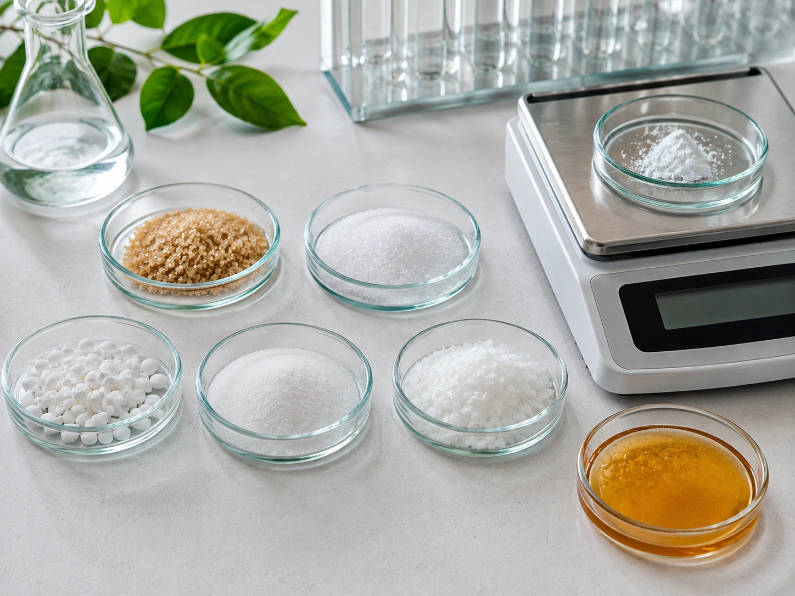
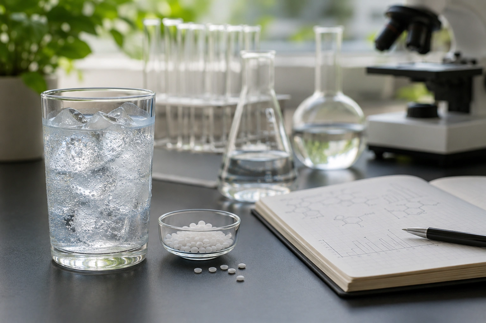

Poucos ingredientes geram tantas manchetes contraditórias quanto os adoçantes. Em um dia, aparecem como alternativa inteligente ao açúcar; no outro, são associados a câncer, diabetes, ganho de peso ou alterações da microbiota intestinal.

A resposta científica não cabe bem em nenhum desses extremos. **Os adoçantes autorizados não são considerados automaticamente perigosos quando consumidos dentro das condições avaliadas de segurança. Ao mesmo tempo, substituir açúcar por adoçante não transforma um alimento em saudável nem garante emagrecimento ou proteção contra doenças.** ([OMS](https://www.who.int/publications/i/item/9789240073616 'Use of non-sugar sweeteners: WHO guideline'))

Para entender o tema, é preciso separar segurança toxicológica, efeitos metabólicos, controle de peso e estudos observacionais de longo prazo.

## Primeiro: “adoçante” não é uma única substância

A palavra adoçante reúne compostos bastante diferentes.

Entre os adoçantes não açucarados estão:

- aspartame;
- sucralose;
- sacarina;
- acessulfame K;
- ciclamatos;
- neotame;
- advantame;
- glicosídeos de esteviol, derivados da estévia.

A OMS inclui tanto adoçantes sintéticos quanto alguns de origem natural ou modificada em sua definição de _non-sugar sweeteners_. Portanto, do ponto de vista científico, classificar um produto simplesmente como “natural” ou “artificial” diz muito pouco sobre sua segurança ou seus efeitos sobre a saúde. ([OMS](https://www.who.int/news/item/15-05-2023-who-advises-not-to-use-non-sugar-sweeteners-for-weight-control-in-newly-released-guideline 'WHO advises not to use non-sugar sweeteners for weight control in newly released guideline'))

Há ainda os **polióis**, como xilitol, eritritol, sorbitol e maltitol. Eles são outra categoria de substitutos do açúcar e não foram incluídos na recomendação da OMS de 2023 para adoçantes não açucarados. Seus efeitos, metabolismo e possíveis desconfortos gastrointestinais precisam ser avaliados separadamente. ([OMS](https://www.who.int/news/item/15-05-2023-who-advises-not-to-use-non-sugar-sweeteners-for-weight-control-in-newly-released-guideline 'WHO advises not to use non-sugar sweeteners for weight control in newly released guideline'))

## O que significa dizer que um adoçante é “seguro”?

Na toxicologia alimentar, autoridades como JECFA, EFSA, FDA e Anvisa avaliam dados experimentais e de exposição antes de estabelecer condições seguras de uso.

Um conceito importante é a **ingestão diária aceitável**, ou IDA. Ela representa uma quantidade que pode ser ingerida diariamente ao longo da vida sem risco apreciável para a saúde segundo a avaliação toxicológica disponível. ([FDA](https://www.fda.gov/food/food-additives-petitions/aspartame-and-other-sweeteners-food 'Aspartame and Other Sweeteners in Food'))

Isso não significa que uma pessoa tenha que consumir essa quantidade.

A IDA funciona como um limite de segurança, e não como meta nutricional.

No Brasil, a Anvisa informa que os edulcorantes autorizados passam por avaliação de segurança e devem respeitar condições e limites específicos de utilização. ([ANVISA](https://www.gov.br/anvisa/pt-br/assuntos/noticias-anvisa/2024/Resumoexecutivo_documentodebasesobreusodeedulcorantes.pdf 'Documento de base sobre uso de edulcorantes — resumo executivo'))

## Então por que a OMS recomendou evitar adoçantes?

Em 2023, a Organização Mundial da Saúde publicou uma diretriz recomendando **não utilizar adoçantes não açucarados como estratégia para controlar o peso corporal ou reduzir o risco de doenças crônicas** na população geral. ([OMS](https://www.who.int/news/item/15-05-2023-who-advises-not-to-use-non-sugar-sweeteners-for-weight-control-in-newly-released-guideline 'WHO advises not to use non-sugar sweeteners for weight control in newly released guideline'))

Essa recomendação gerou confusão porque algumas pessoas interpretaram a mensagem como “a OMS declarou que adoçantes são tóxicos”.

Não foi isso que aconteceu.

A própria OMS afirma explicitamente que a diretriz **não é uma avaliação toxicológica da segurança de cada adoçante** e não pretende substituir as ingestões diárias aceitáveis definidas pelo JECFA ou por outras autoridades. ([OMS](https://www.who.int/publications/i/item/9789240073616 'Use of non-sugar sweeteners: WHO guideline'))

O foco da diretriz era outro: descobrir se utilizar adoçantes no lugar de açúcar é uma boa estratégia de longo prazo para reduzir peso e prevenir doenças.

A conclusão foi que não há benefício convincente de longo prazo suficiente para recomendar essa estratégia à população geral. ([OMS](https://www.who.int/news/item/15-05-2023-who-advises-not-to-use-non-sugar-sweeteners-for-weight-control-in-newly-released-guideline 'WHO advises not to use non-sugar sweeteners for weight control in newly released guideline'))

## Adoçantes ajudam a emagrecer?

Aqui está uma das aparentes contradições da literatura.

Se alguém toma regularmente uma bebida com grande quantidade de açúcar e a substitui por uma versão sem calorias, é possível reduzir a ingestão de energia. Ensaios clínicos de fato encontram benefícios pequenos quando os adoçantes **substituem açúcares calóricos**. ([OMS](https://www.who.int/publications/i/item/9789240046429 'Health effects of the use of non-sugar sweeteners: a systematic review and meta-analysis'))

Uma meta-análise publicada no _Journal of Endocrinological Investigation_ em 2026 reuniu 19 estudos randomizados. Na análise geral, substituir açúcares calóricos por adoçantes não nutritivos esteve associado a uma diferença média de aproximadamente **-0,79 kg** no peso corporal. ([PubMed](https://pubmed.ncbi.nlm.nih.gov/40913681/ 'Effects of non-nutritive sweeteners on body weight: a systematic review and meta-analysis of randomized controlled trial studies'))

Mas os detalhes mudam a interpretação.

Nos estudos com duração inferior a 18 semanas, houve pequena vantagem. Nos estudos mais longos, o efeito deixou de ser estatisticamente significativo. Também houve elevada heterogeneidade entre os estudos. ([PubMed](https://pubmed.ncbi.nlm.nih.gov/40913681/ 'Effects of non-nutritive sweeteners on body weight: a systematic review and meta-analysis of randomized controlled trial studies'))

Portanto, adoçantes podem funcionar como **ferramenta de substituição** em determinadas situações, mas não são um método de emagrecimento por si só.

### O que o adoçante está substituindo?

Essa talvez seja a pergunta mais útil.

Trocar:

**refrigerante com açúcar → refrigerante sem açúcar**

pode reduzir açúcar e calorias.

Trocar:

**água → refrigerante diet**

não traz a mesma vantagem energética.

E acrescentar adoçante a uma alimentação já muito rica em produtos ultraprocessados também não melhora automaticamente sua qualidade.

Por isso, os resultados dependem fortemente do alimento utilizado como comparação. ([PubMed](https://pubmed.ncbi.nlm.nih.gov/40913681/ 'Effects of non-nutritive sweeteners on body weight: a systematic review and meta-analysis of randomized controlled trial studies'))

## Por que estudos observacionais parecem encontrar mais riscos?

Alguns grandes estudos de acompanhamento observam que pessoas que consomem mais produtos adoçados artificialmente apresentam maior incidência de diabetes tipo 2, doenças cardiovasculares ou mortalidade.

Essas associações merecem investigação, mas não provam que o adoçante foi a causa. A própria OMS reconheceu que os resultados podem sofrer influência de características preexistentes dos participantes e de padrões complexos de consumo. ([OMS](https://www.who.int/news/item/15-05-2023-who-advises-not-to-use-non-sugar-sweeteners-for-weight-control-in-newly-released-guideline 'WHO advises not to use non-sugar sweeteners for weight control in newly released guideline'))

Imagine uma pessoa que recebeu diagnóstico de pré-diabetes, ganhou peso e, por orientação ou iniciativa própria, passou a trocar refrigerante comum por diet.

Anos depois, ela pode continuar apresentando maior risco de diabetes. Nesse cenário, o refrigerante diet aparece associado à doença, mas parte dessa associação pode existir porque **o risco veio antes da mudança para o adoçante**.

Esse problema é conhecido como causalidade reversa.

Além disso, alimentação, peso corporal, atividade física, tabagismo, condições socioeconômicas e outras características podem influenciar os resultados.

É por isso que ensaios randomizados e estudos observacionais às vezes contam histórias diferentes. ([OMS](https://www.who.int/publications/i/item/9789240046429 'Health effects of the use of non-sugar sweeteners: a systematic review and meta-analysis'))

## Aspartame causa câncer?

Essa questão ganhou atenção mundial em 2023.

Naquele ano, a Agência Internacional de Pesquisa em Câncer, a IARC, classificou o aspartame como **“possivelmente carcinogênico para humanos”**, Grupo 2B. A classificação se baseou em evidência limitada de câncer em humanos, particularmente carcinoma hepatocelular, além de limitações nas evidências experimentais e mecanísticas. ([OMS](https://www.who.int/news/item/14-07-2023-aspartame-hazard-and-risk-assessment-results-released 'Aspartame hazard and risk assessment results released'))

No mesmo período, o JECFA — comitê de especialistas da FAO e da OMS responsável pela avaliação de risco de aditivos — revisou os dados e **manteve a ingestão diária aceitável do aspartame em 0–40 mg por kg de peso corporal por dia**. ([OMS](https://www.who.int/news/item/14-07-2023-aspartame-hazard-and-risk-assessment-results-released 'Aspartame hazard and risk assessment results released'))

Como as duas instituições chegaram a mensagens aparentemente diferentes?

### Perigo e risco não são a mesma coisa

A IARC procura responder principalmente:

**Existe evidência de que essa substância possa causar câncer em determinadas circunstâncias?**

O JECFA procura responder:

**Qual é o risco nas quantidades às quais as pessoas realmente podem estar expostas?**

A classificação da IARC não leva em conta apenas o nível habitual de consumo para definir o grupo. Ela indica a força da evidência de um possível perigo carcinogênico, não a probabilidade de uma pessoa desenvolver câncer ao tomar determinado número de bebidas diet. ([OMS](https://www.who.int/news/item/14-07-2023-aspartame-hazard-and-risk-assessment-results-released 'Aspartame hazard and risk assessment results released'))

O JECFA, por sua vez, concluiu que os dados disponíveis não justificavam alterar sua IDA.

Para uma pessoa de 70 kg, 40 mg/kg equivalem a **2.800 mg de aspartame por dia**. A própria OMS exemplificou que, considerando latas com 200–300 mg de aspartame, seriam necessárias mais de aproximadamente 9 a 14 latas por dia para ultrapassar a IDA, caso nenhuma outra fonte fosse consumida. A quantidade real varia conforme o produto. ([OMS](https://www.who.int/news/item/14-07-2023-aspartame-hazard-and-risk-assessment-results-released 'Aspartame hazard and risk assessment results released'))

## E a sucralose?

A sucralose também é alvo frequente de afirmações alarmantes.

A informação mais atualizada é especialmente importante neste caso: em **17 de fevereiro de 2026**, a EFSA publicou uma nova reavaliação completa da sucralose. A agência concluiu que não havia necessidade de modificar a IDA existente de **15 mg/kg de peso corporal por dia** e que os níveis estimados de exposição nos usos atualmente autorizados não apresentavam preocupação de segurança. ([EFSA](https://www.efsa.europa.eu/en/plain-language-summary/re-evaluation-sucralose-e-955-food-additive 'Re-evaluation of sucralose (E 955) as a food additive - EFSA'))

A EFSA também não identificou preocupação genotóxica para a sucralose e seus principais produtos avaliados nas condições analisadas. ([EFSA](https://efsa.onlinelibrary.wiley.com/doi/10.2903/j.efsa.2026.9854))

Houve, porém, uma ressalva.

A agência analisou uma proposta para ampliar a utilização da sucralose em determinados produtos de panificação e concluiu que não havia informação suficiente para confirmar a segurança dessa extensão devido às incertezas sobre a possível formação de compostos clorados em diferentes condições de processamento térmico. ([EFSA](https://www.efsa.europa.eu/en/news/efsa-finds-sucralose-safe-when-used-currently-authorised-cannot-confirm-safety-extending-its 'EFSA finds sucralose safe when used as currently authorised'))

Isso merece pesquisa e acompanhamento regulatório, mas **não é o mesmo que concluir que a sucralose, nos usos atualmente permitidos, faz mal**.

## Estévia é melhor por ser natural?

“Natural” é uma descrição da origem, não uma conclusão toxicológica.

Os glicosídeos de esteviol usados como adoçantes são avaliados como aditivos alimentares. Em 2026, o JECFA confirmou novamente uma IDA de **0–4 mg/kg de peso corporal por dia, expressa como esteviol**. ([OMS](https://apps.who.int/food-additives-contaminants-jecfa-database/Home/Chemical/267 'WHO | JECFA'))

Além disso, a própria recomendação da OMS sobre adoçantes não açucarados inclui estévia e derivados. ([OMS](https://www.who.int/news/item/15-05-2023-who-advises-not-to-use-non-sugar-sweeteners-for-weight-control-in-newly-released-guideline 'WHO advises not to use non-sugar sweeteners for weight control in newly released guideline'))

Portanto, não existe base para afirmar que um adoçante é automaticamente superior apenas porque sua origem é vegetal.

Da mesma forma, ser produzido industrialmente não significa automaticamente que uma substância seja perigosa.

O que importa é a evidência específica para cada composto, sua dose e a exposição real.

## Adoçantes aumentam a glicose ou causam diabetes?

Adoçantes de alta intensidade geralmente fornecem poucas ou nenhuma caloria e, quando utilizados no lugar do açúcar, não produzem a mesma carga de glicose da sacarose. A FDA destaca que esses substitutos geralmente não elevam a glicemia da mesma maneira que o açúcar. ([FDA](https://www.fda.gov/food/food-additives-petitions/aspartame-and-other-sweeteners-food 'Aspartame and Other Sweeteners in Food'))

Isso explica por que podem ser úteis para algumas pessoas que precisam reduzir açúcar.

Mas outra pergunta é saber se o consumo habitual durante muitos anos diminui ou aumenta o risco de desenvolver diabetes tipo 2.

Nesse ponto, as evidências são menos claras.

Ensaios randomizados tendem a encontrar pouco efeito negativo sobre o metabolismo da glicose no curto prazo, enquanto estudos observacionais frequentemente mostram associações entre maior consumo e maior risco cardiometabólico. A causalidade dessas associações continua incerta. ([OMS](https://www.who.int/publications/i/item/9789240046429 'Health effects of the use of non-sugar sweeteners: a systematic review and meta-analysis'))

Por isso, dizer tanto que “adoçantes causam diabetes” quanto que “adoçantes protegem contra diabetes” vai além do que a evidência atual permite concluir.

## E a microbiota intestinal?

A microbiota se tornou outro argumento frequente contra adoçantes.

Estudos laboratoriais e alguns experimentos humanos sugerem que certas substâncias podem modificar a composição ou função de microrganismos intestinais. Entretanto, **adoçantes diferentes são metabolizados de maneiras diferentes**, e os resultados não são uniformes. ([PubMed](https://pubmed.ncbi.nlm.nih.gov/40291991/ 'Impacts of non-nutritive sweeteners on the human microbiome'))

Uma revisão recente da literatura humana descreveu resultados heterogêneos nos ensaios clínicos e destacou que ainda existem importantes lacunas para determinar relevância clínica e efeitos metabólicos de longo prazo. ([PubMed](https://pubmed.ncbi.nlm.nih.gov/40291991/ 'Impacts of non-nutritive sweeteners on the human microbiome'))

Assim, afirmações como “sucralose destrói as bactérias boas” ou “todos os adoçantes destroem a microbiota” são fortes demais para as evidências disponíveis.

É uma área legítima de pesquisa, mas ainda não uma conclusão definitiva.

## E os polióis, como eritritol e xilitol?

Polióis são frequentemente vendidos na mesma seção dos adoçantes, mas não são equivalentes a aspartame, sucralose ou estévia.

A OMS excluiu os polióis de sua recomendação sobre adoçantes não açucarados porque eles são açúcares ou derivados de açúcares que fornecem alguma energia. ([OMS](https://www.who.int/news/item/15-05-2023-who-advises-not-to-use-non-sugar-sweeteners-for-weight-control-in-newly-released-guideline 'WHO advises not to use non-sugar sweeteners for weight control in newly released guideline'))

Entre eles estão:

- eritritol;
- xilitol;
- sorbitol;
- maltitol;
- manitol.

Alguns podem causar gases, distensão abdominal ou efeito laxativo quando consumidos em quantidades elevadas. A tolerância varia bastante entre produtos e pessoas. ([FDA](https://www.fda.gov/food/food-additives-petitions/aspartame-and-other-sweeteners-food 'Aspartame and Other Sweeteners in Food'))

Por isso, estudos sobre eritritol não devem ser usados automaticamente como evidência contra aspartame ou sucralose — e o contrário também vale.

## Existe um “melhor adoçante”?

Não há evidência suficiente para montar um ranking universal.

A escolha pode depender de:

- sabor;
- quantidade utilizada;
- alimento em que será usado;
- necessidade de estabilidade térmica;
- tolerância gastrointestinal;
- condições clínicas;
- preferência pessoal.

Uma pessoa que bebe café sem açúcar nem adoçante não precisa começar a usar adoçante em busca de um benefício nutricional.

Para quem consome grandes quantidades de açúcar, utilizar temporariamente um adoçante para diminuir açúcar pode ser uma ferramenta prática. Ensaios clínicos sustentam algum benefício quando a substituição reduz calorias de fato. ([PubMed](https://pubmed.ncbi.nlm.nih.gov/40913681/ 'Effects of non-nutritive sweeteners on body weight: a systematic review and meta-analysis of randomized controlled trial studies'))

A longo prazo, entretanto, a OMS propõe uma direção diferente: **reduzir gradualmente a preferência por sabores excessivamente doces**, em vez de depender dos adoçantes como estratégia central de saúde. ([OMS](https://www.who.int/news/item/15-05-2023-who-advises-not-to-use-non-sugar-sweeteners-for-weight-control-in-newly-released-guideline 'WHO advises not to use non-sugar sweeteners for weight control in newly released guideline'))

## Quanto adoçante é seguro?

Não existe um único número porque cada adoçante possui propriedades e valores de referência diferentes.

Além disso, autoridades de diferentes regiões podem estabelecer IDAs distintas a partir de seus próprios processos de avaliação.

Por exemplo, o JECFA mantém para o aspartame uma IDA de **40 mg/kg/dia**, enquanto a FDA utiliza **50 mg/kg/dia**. Para a sucralose, a EFSA manteve em 2026 uma IDA de **15 mg/kg/dia**, enquanto a FDA utiliza 5 mg/kg/dia. Essas diferenças não significam necessariamente que uma agência considere o produto perigoso e outra não; refletem metodologias e decisões regulatórias distintas. ([OMS](https://www.who.int/news/item/14-07-2023-aspartame-hazard-and-risk-assessment-results-released 'Aspartame hazard and risk assessment results released'))

Na prática, para consumidores, tentar calcular miligramas de cada adoçante raramente é necessário quando o consumo é habitual e os produtos seguem a regulamentação.

A preocupação aumenta em situações de consumo muito elevado e repetitivo de diversas fontes contendo o mesmo adoçante.

## Quem precisa de atenção especial?

Uma exceção clara envolve o aspartame.

Pessoas com **fenilcetonúria**, uma condição genética rara, precisam evitar ou controlar rigorosamente a ingestão de fenilalanina e, portanto, não devem consumir aspartame livremente. ([FDA](https://www.fda.gov/food/food-additives-petitions/aspartame-and-other-sweeteners-food 'Aspartame and Other Sweeteners in Food'))

Para crianças, gestantes ou pessoas com condições médicas específicas, vale priorizar uma alimentação nutricionalmente adequada e discutir uso frequente ou situações particulares com um profissional de saúde quando necessário.

A recomendação da OMS contra utilizar adoçantes como estratégia de controle de peso também abrange crianças na população geral. ([OMS](https://www.who.int/publications/i/item/9789240073616 'Use of non-sugar sweeteners: WHO guideline'))

## Então é melhor açúcar ou adoçante?

A pergunta cria uma falsa escolha.

A alternativa ao refrigerante açucarado não precisa ser obrigatoriamente refrigerante diet. Pode ser água.

A alternativa ao café com três colheres de açúcar pode ser café com menos açúcar, com adoçante durante uma transição ou, para quem se adapta, sem nenhum dos dois.

Se um adoçante substitui uma quantidade relevante de açúcar, ele pode ajudar a diminuir açúcar e calorias. ([PubMed](https://pubmed.ncbi.nlm.nih.gov/40913681/ 'Effects of non-nutritive sweeteners on body weight: a systematic review and meta-analysis of randomized controlled trial studies'))

Mas transformar cada alimento em uma experiência intensamente doce — com açúcar ou com adoçante — também mantém a preferência por altos níveis de dulçor. A estratégia proposta pela OMS é reduzir gradualmente essa dependência. ([OMS](https://www.who.int/news/item/15-05-2023-who-advises-not-to-use-non-sugar-sweeteners-for-weight-control-in-newly-released-guideline 'WHO advises not to use non-sugar sweeteners for weight control in newly released guideline'))

A mesma pergunta vale para as versões “menos processadas” do açúcar:

[Açúcar mascavo é mais saudável que açúcar branco?](/artigos/acucar-mascavo-e-mais-saudavel/)

## Conclusão

Então, **adoçantes fazem mal?**

A resposta mais adequada é: **não há evidência para classificar todos os adoçantes autorizados como perigosos quando utilizados dentro dos níveis considerados seguros, mas também não há razão para tratá-los como produtos capazes de melhorar a saúde por si mesmos**. ([OMS](https://www.who.int/publications/i/item/9789240073616 'Use of non-sugar sweeteners: WHO guideline'))

Quando substituem açúcar e calorias, podem produzir pequenas vantagens em determinados contextos, especialmente no curto prazo. Isso não se traduziu de forma convincente em benefícios de longo prazo suficientes para a OMS recomendar seu uso como estratégia de controle do peso ou prevenção de doenças na população geral. ([PubMed](https://pubmed.ncbi.nlm.nih.gov/40913681/ 'Effects of non-nutritive sweeteners on body weight: a systematic review and meta-analysis of randomized controlled trial studies'))

O aspartame possui uma classificação de possível perigo carcinogênico pela IARC, mas o JECFA manteve sua ingestão diária aceitável após avaliar o risco nas doses de exposição. A sucralose, por sua vez, passou por uma nova reavaliação da EFSA em 2026 e continua considerada segura nos usos atualmente autorizados. ([OMS](https://www.who.int/news/item/14-07-2023-aspartame-hazard-and-risk-assessment-results-released 'Aspartame hazard and risk assessment results released'))

Na prática, uma estratégia sensata é menos dramática: **reduzir o excesso de açúcar, não depender de adoçantes como solução para a saúde e, quando possível, acostumar o paladar gradualmente a alimentos e bebidas menos doces**.

---
