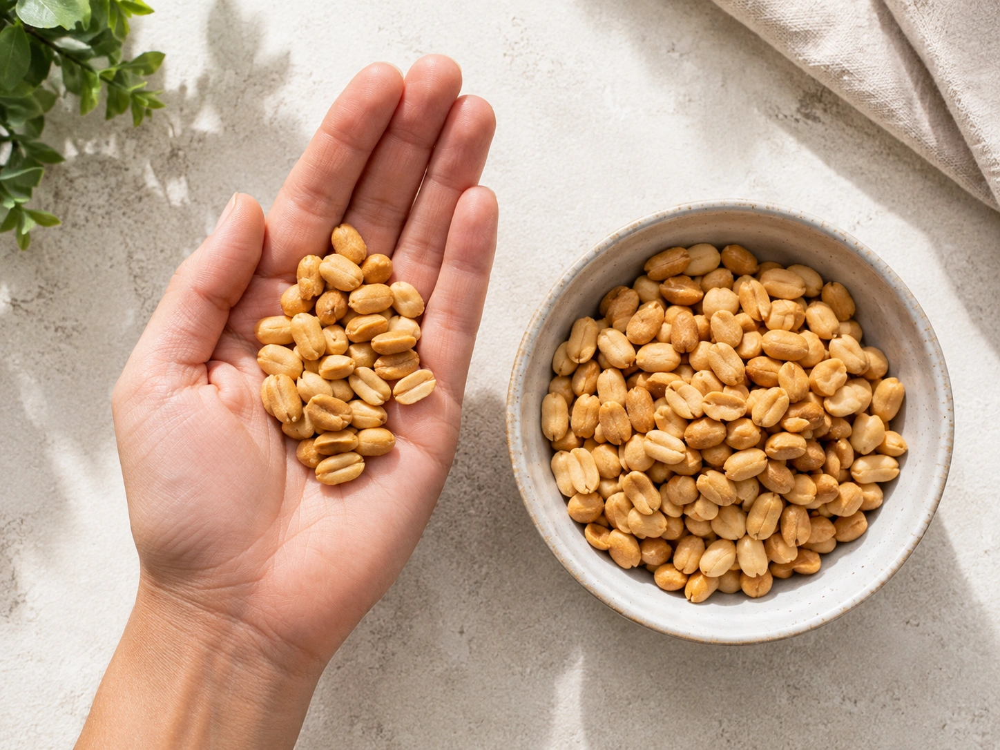
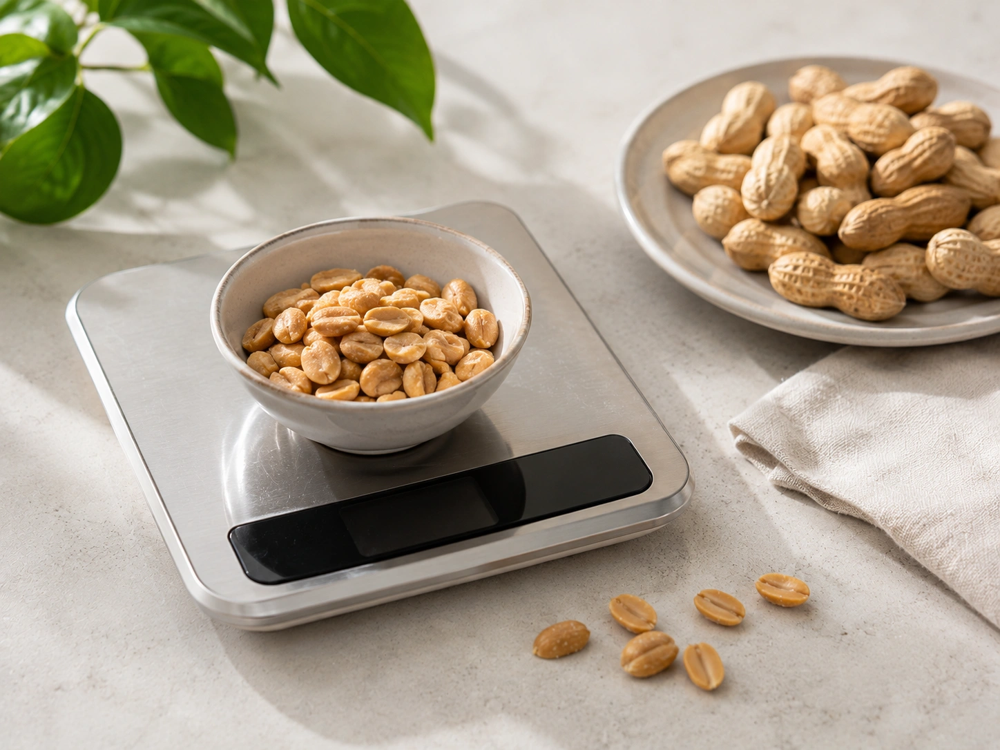
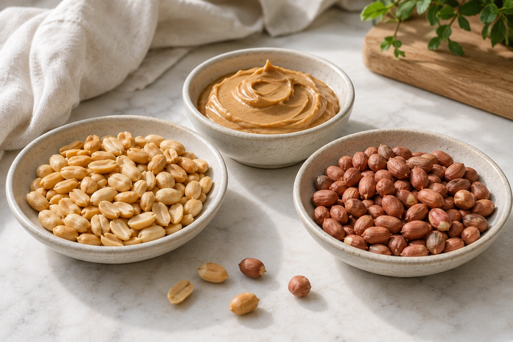

Pequeno, acessível e fácil de encaixar em lanches e receitas, o amendoim reúne proteínas, fibras, gorduras predominantemente insaturadas e minerais. Ao mesmo tempo, é um alimento bastante concentrado em energia — e é justamente por isso que tamanho da porção e forma de preparo fazem diferença.

Para a maioria das pessoas sem alergia, o amendoim pode fazer parte de uma alimentação equilibrada. A questão não é classificá-lo simplesmente como um alimento que "engorda" ou "emagrece", mas entender **o que ele oferece e em que quantidade é consumido**.

## Quais nutrientes o amendoim oferece?

Embora seja frequentemente agrupado culinariamente com castanhas e nozes, o amendoim pertence ao grupo das leguminosas. A TACO o classifica entre "leguminosas e derivados" e mostra um perfil nutricional bastante concentrado.

Em 100 g de amendoim cru, a tabela brasileira registra 544 kcal, 27,2 g de proteína, 43,9 g de lipídios, 20,3 g de carboidratos e 8 g de fibra alimentar. Também são registrados 171 mg de magnésio por 100 g.

Na prática, porém, uma porção costuma ser muito menor do que 100 g.

| Nutriente       | Amendoim cru — 100 g | Amendoim cru — 30 g |
| --------------- | -------------------: | ------------------: |
| Energia         |             544 kcal |           ~163 kcal |
| Proteína        |               27,2 g |              ~8,2 g |
| Lipídios        |               43,9 g |             ~13,2 g |
| Carboidratos    |               20,3 g |              ~6,1 g |
| Fibra alimentar |                8,0 g |              ~2,4 g |

Valores calculados a partir da composição por 100 g informada pela TACO.

### Amendoim torrado tem mais calorias?

Pode ter mais calorias por 100 g, principalmente porque o processamento e a redução de umidade alteram a concentração dos nutrientes. Na TACO, o amendoim torrado e salgado analisado apresenta 606 kcal por 100 g, contra 544 kcal no grão cru.

Isso equivale a cerca de **182 kcal em 30 g** daquela amostra torrada e salgada. O valor exato de um produto comercial pode ser diferente, portanto vale consultar a tabela nutricional da embalagem.

## Quais são os benefícios do amendoim?

O principal mérito nutricional do amendoim não vem de um único composto. Ele combina gordura insaturada, proteína vegetal, fibra e micronutrientes em um alimento relativamente pequeno. ([Harvard T.H. Chan](https://hsph.harvard.edu/news/peanuts-can-be-healthy/ 'Peanuts and peanut butter can be healthy'))

### 1. Fornece principalmente gorduras insaturadas

Apesar de o amendoim ser rico em gordura, a maior parte dela é insaturada. Segundo a TACO, 100 g do grão cru apresentam 17,2 g de gorduras monoinsaturadas e 16,2 g de poli-insaturadas, enquanto as saturadas somam 8,7 g.

Harvard também destaca esse predomínio de gorduras mono e poli-insaturadas ao discutir o amendoim dentro de um padrão alimentar saudável. ([Harvard T.H. Chan](https://hsph.harvard.edu/news/peanuts-can-be-healthy/ 'Peanuts and peanut butter can be healthy'))

Isso não significa que seja necessário comer grandes quantidades. Como todo alimento rico em gordura, ele também concentra energia.

### 2. É uma fonte relevante de proteína vegetal

Com 27,2 g de proteína por 100 g na TACO, o amendoim contribui de forma interessante para a ingestão de proteína vegetal. Uma porção de 30 g oferece aproximadamente 8,2 g.

Isso pode ser útil em lanches e refeições, especialmente quando o alimento substitui opções com pouco valor nutricional. Ainda assim, quem possui uma meta específica de proteína deve considerar o conjunto da dieta, e não depender apenas do amendoim.

### 3. Também fornece fibras

O amendoim cru analisado pela TACO fornece 8 g de fibra por 100 g, ou aproximadamente 2,4 g em 30 g.

A combinação de gordura, proteína, fibras e estrutura física das oleaginosas é uma das razões estudadas para explicar por que suas calorias nem sempre se traduzem diretamente em maior peso corporal. Revisões sobre nozes, castanhas e amendoins observam mecanismos de compensação energética, embora a resposta varie entre pessoas e formas de consumo. ([PubMed](https://pubmed.ncbi.nlm.nih.gov/36811596/ 'The Effects of Tree Nut and Peanut Consumption on Energy Compensation and Energy Expenditure: A Systematic Review and Meta-Analysis'))

### 4. Pode contribuir para um padrão alimentar cardioprotetor

Estudos observacionais relacionam o consumo de oleaginosas, incluindo amendoim, a menor risco de alguns desfechos cardiovasculares. Como esses estudos observam associações, eles não provam que o amendoim isoladamente seja responsável pela redução do risco. ([PubMed](https://pubmed.ncbi.nlm.nih.gov/31361320/ 'Nut consumption and incidence of cardiovascular diseases and cardiovascular disease mortality: a meta-analysis of prospective cohort studies - PubMed'))

Quando a análise é restrita a intervenções com amendoim, os resultados são mais moderados. Uma meta-análise publicada em 2022 encontrou redução de triglicerídeos, mas não demonstrou melhoras igualmente consistentes em todos os outros fatores de risco estudados. ([PubMed](https://pubmed.ncbi.nlm.nih.gov/35433776/ 'Effect of Peanut Consumption on Cardiovascular Risk Factors: A Randomized Clinical Trial and Meta-Analysis'))

## Amendoim engorda?

O amendoim é calórico, mas **ser calórico não significa provocar automaticamente ganho de peso**.

Uma revisão sistemática e meta-análise com 55 estudos de intervenção com oleaginosas não encontrou aumento significativo de peso, IMC ou circunferência da cintura quando esses alimentos foram incluídos na dieta, inclusive em estudos sem orientação explícita para substituir outras calorias. ([PubMed](https://pubmed.ncbi.nlm.nih.gov/32945861/ 'Intake of Nuts or Nut Products Does Not Lead to Weight Gain, Independent of Dietary Substitution Instructions: A Systematic Review and Meta-Analysis of Randomized Trials'))

Outra revisão, incluindo nozes e amendoins, encontrou evidências de que parte da energia ingerida pode ser compensada pela redução da ingestão posterior. Esse mecanismo, contudo, não elimina as calorias do alimento e varia de acordo com a situação. ([PubMed](https://pubmed.ncbi.nlm.nih.gov/36811596/ 'The Effects of Tree Nut and Peanut Consumption on Energy Compensation and Energy Expenditure: A Systematic Review and Meta-Analysis'))

Há também uma ressalva importante: na meta-análise específica de intervenções com amendoim, participantes com alto risco cardiometabólico apresentaram pequeno aumento médio de peso, especialmente com doses maiores, embora não tenha ocorrido aumento correspondente de gordura corporal ou IMC. ([PubMed](https://pubmed.ncbi.nlm.nih.gov/35433776/ 'Effect of Peanut Consumption on Cardiovascular Risk Factors: A Randomized Clinical Trial and Meta-Analysis'))

Portanto, quem busca controlar o peso pode se beneficiar mais ao usar o amendoim **como substituição**, e não simplesmente como calorias extras.

## Quanto amendoim consumir?

Não existe uma recomendação universal estabelecendo que toda pessoa deve consumir determinada quantidade de amendoim diariamente.

Como referência prática, cerca de **30 g — um pequeno punhado —** é uma porção razoável para muitas situações. A FDA utiliza 30 g como quantidade de referência de rotulagem para nozes, sementes e misturas, categoria que inclui o amendoim. Isso não deve ser confundido com uma prescrição nutricional individual.

| Quantidade de amendoim cru | Energia aproximada |
| -------------------------- | -----------------: |
| 15 g                       |            82 kcal |
| 30 g                       |           163 kcal |
| 50 g                       |           272 kcal |
| 100 g                      |           544 kcal |

Cálculos baseados nos 544 kcal por 100 g registrados pela TACO.

Para uma pessoa com necessidades energéticas menores, 15 a 20 g podem ser suficientes como complemento. Para outras, 30 g ou mais podem se encaixar normalmente. O restante da dieta é que define se a quantidade é adequada.

## Qual tipo de amendoim escolher?

Para consumo habitual, vale priorizar versões com lista de ingredientes simples.

Boas opções incluem:

- amendoim torrado sem sal;
- amendoim com pouco sal;
- amendoim sem açúcar ou coberturas;
- pasta de amendoim cuja composição seja predominantemente amendoim.

Harvard recomenda atenção a açúcares adicionados e óleos hidrogenados nas pastas e destaca opções torradas sem açúcar adicionado. ([Harvard T.H. Chan](https://hsph.harvard.edu/news/peanuts-can-be-healthy/ 'Peanuts and peanut butter can be healthy'))

Amendoim salgado não precisa necessariamente ser excluído, mas pessoas que precisam limitar a ingestão de sódio devem prestar atenção especial ao rótulo, já que a quantidade adicionada pode variar bastante entre marcas.

## E a pasta de amendoim?

A pasta pode ser uma forma prática de consumir o alimento, mas é fácil ultrapassar a porção sem perceber.

Para pastas de nozes e sementes, a FDA utiliza **duas colheres de sopa** como quantidade de referência de rotulagem. A quantidade em gramas e as calorias reais devem ser verificadas no rótulo do produto.

Uma lista de ingredientes simples facilita a escolha. Produtos com grandes quantidades de açúcar, coberturas ou outros ingredientes podem apresentar perfil bastante diferente do amendoim puro.

## Quem precisa ter cuidado com o amendoim?

A principal contraindicação é a **alergia ao amendoim**.

A FDA classifica o amendoim entre os principais alérgenos alimentares e informa que reações podem variar de urticária e inchaço até anafilaxia potencialmente grave. Quem possui alergia diagnosticada deve evitar o alimento de acordo com a orientação do profissional responsável e conferir cuidadosamente os rótulos. ([FDA](https://www.fda.gov/food/nutrition-food-labeling-and-critical-foods/food-allergies 'Food Allergies'))

Para comparar com a oleaginosa mais estudada da prateleira:

[Amêndoas: benefícios nutricionais e tamanho adequado da porção](/artigos/amendoas-beneficios-porcao-adequada/)

## Conclusão

O amendoim é um alimento nutricionalmente denso: oferece proteínas, fibras, gorduras predominantemente insaturadas e minerais, mas também concentra calorias. Uma porção de aproximadamente **30 g** fornece cerca de **163 kcal no amendoim cru**, enquanto preparações torradas podem apresentar valores maiores.

Para quem não tem alergia, uma pequena porção pode fazer parte de uma alimentação equilibrada, especialmente quando substitui snacks de menor qualidade nutricional. A melhor quantidade depende das necessidades individuais — mais não significa necessariamente melhor.

---
