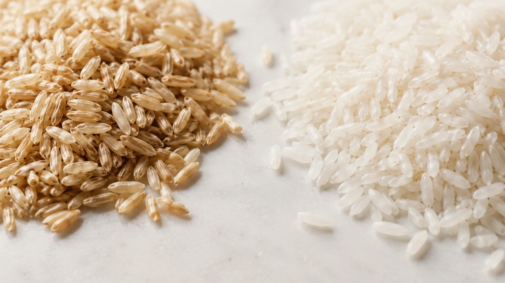
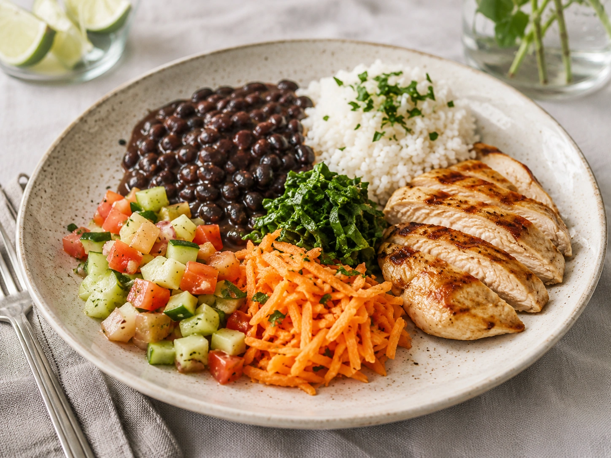
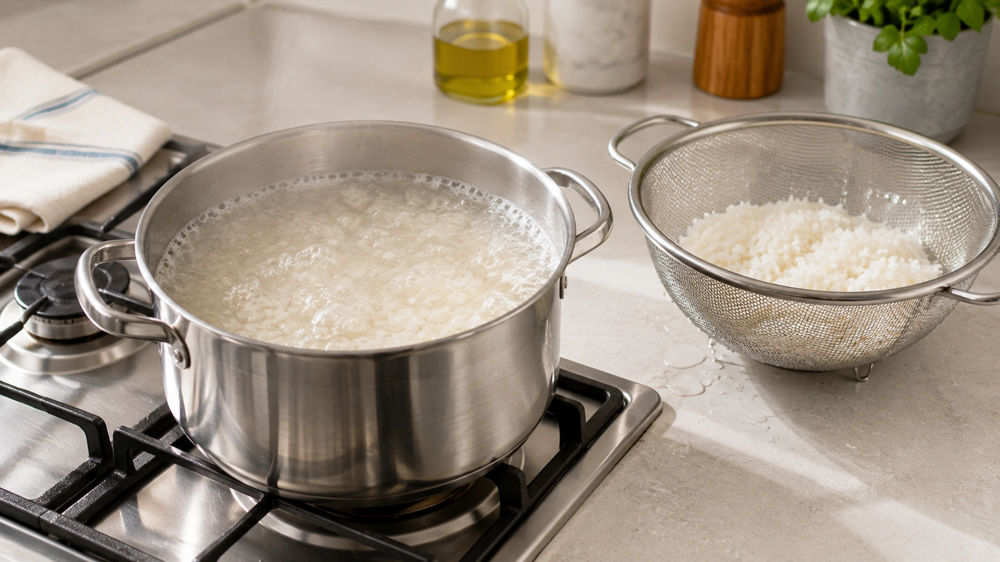

Quando o assunto é alimentação saudável, o arroz integral costuma ocupar o lado dos “alimentos bons”, enquanto o arroz branco frequentemente é colocado na categoria dos que deveriam ser evitados.

A realidade é mais interessante do que essa divisão.

**Do ponto de vista nutricional, o arroz integral geralmente leva vantagem.** Ele preserva partes do grão que são retiradas na produção do arroz branco e, com elas, uma quantidade maior de fibras e diversos micronutrientes. Mas isso não significa que o arroz branco seja um alimento ruim ou que trocar um pelo outro provoque automaticamente grandes mudanças na saúde. ([BMJ Open](https://bmjopen.bmj.com/content/12/9/e065426 'White rice, brown rice and the risk of type 2 diabetes: a systematic review and meta-analysis'))

## O que muda quando o arroz se torna branco?

Um grão integral de arroz possui diferentes estruturas. Entre elas estão o endosperma rico em amido, o germe e as camadas externas de farelo.

No arroz integral, grande parte dessas estruturas permanece no alimento. Para produzir o arroz branco, o grão passa por um processo de polimento que remove o farelo e o germe, deixando principalmente o endosperma. ([BMJ Open](https://bmjopen.bmj.com/content/12/9/e065426 'White rice, brown rice and the risk of type 2 diabetes: a systematic review and meta-analysis'))

Essa diferença explica boa parte das características nutricionais dos dois produtos.

| Característica     | Arroz integral                                   | Arroz branco                                          |
| ------------------ | ------------------------------------------------ | ----------------------------------------------------- |
| Fibras             | Maior quantidade                                 | Menor quantidade                                      |
| Farelo e germe     | Preservados                                      | Removidos no polimento                                |
| Minerais           | Geralmente maior quantidade de vários minerais   | Parte é perdida no processamento                      |
| Vitaminas          | Mantém naturalmente diferentes vitaminas do grão | Pode ser enriquecido com algumas vitaminas e minerais |
| Calorias           | Semelhantes ao branco                            | Semelhantes ao integral                               |
| Carboidratos       | Semelhantes                                      | Semelhantes                                           |
| Textura            | Mais firme e mastigável                          | Mais macia                                            |
| Tempo de cozimento | Geralmente maior                                 | Geralmente menor                                      |

Portanto, escolher o integral não significa necessariamente consumir muito menos carboidrato ou calorias. **A principal vantagem está na qualidade nutricional do grão.** ([USDA FoodData Central](https://fdc.nal.usda.gov/ 'FoodData Central'))

## O arroz integral tem mais fibras?

Sim.

Como o farelo é mantido, o arroz integral fornece mais fibra alimentar que o arroz branco. Dados do USDA mostram essa diferença de forma consistente entre as versões dos dois produtos. ([USDA FoodData Central](https://fdc.nal.usda.gov/ 'FoodData Central'))

Isso pode ajudar a aumentar a ingestão total de fibras da alimentação — um ponto relevante porque a Organização Mundial da Saúde recomenda que, para pessoas com mais de 10 anos, a ingestão diária de fibras naturalmente presentes nos alimentos seja de pelo menos 25 gramas. A OMS também recomenda que os carboidratos venham prioritariamente de grãos integrais, vegetais, frutas e leguminosas. ([OMS](https://www.who.int/news-room/fact-sheets/detail/healthy-diet 'Healthy diet'))

Mas há um detalhe importante: **o arroz integral sozinho não transforma uma dieta pobre em fibras em uma dieta rica em fibras.**

Feijão, lentilha, grão-de-bico, aveia, frutas, verduras e outros alimentos também podem ter participação muito maior no total diário.

## E o índice glicêmico?

Essa comparação costuma ser simplificada demais.

O arroz integral frequentemente apresenta resposta glicêmica menor que algumas variedades de arroz branco, em parte pela presença do farelo, das fibras e pela estrutura do grão. Entretanto, os valores podem variar bastante conforme a variedade de arroz e seu processamento. ([BMJ Open](https://bmjopen.bmj.com/content/12/9/e065426 'White rice, brown rice and the risk of type 2 diabetes: a systematic review and meta-analysis'))

Além disso, dificilmente comemos arroz sozinho.

Uma refeição com arroz, feijão, vegetais e uma fonte de proteína pode produzir uma resposta metabólica diferente daquela observada ao consumir uma porção isolada de arroz.

Por isso, escolher o tipo de arroz é apenas uma parte da equação.

## O que os estudos mostram sobre diabetes?

Aqui é importante separar **associação observacional** de **efeito comprovado em experimentos**.

Uma revisão sistemática e meta-análise publicada em 2022 reuniu estudos de coorte e ensaios clínicos. Nos estudos observacionais, maior consumo de arroz branco esteve associado a maior risco de diabetes tipo 2, enquanto o consumo de arroz integral esteve associado a menor risco. ([BMJ Open](https://bmjopen.bmj.com/content/12/9/e065426 'White rice, brown rice and the risk of type 2 diabetes: a systematic review and meta-analysis'))

Entretanto, quando os pesquisadores analisaram ensaios clínicos que substituíam arroz branco por arroz integral, os resultados sobre fatores de risco cardiometabólico foram inconsistentes. ([BMJ Open](https://bmjopen.bmj.com/content/12/9/e065426 'White rice, brown rice and the risk of type 2 diabetes: a systematic review and meta-analysis'))

Outra meta-análise, direcionada a pessoas com pré-diabetes ou diabetes tipo 2, não encontrou melhora significativa de HbA1c ou glicemia de jejum com a dieta de arroz integral em comparação com arroz branco. A qualidade das evidências foi classificada entre baixa e moderada. ([PubMed](https://pubmed.ncbi.nlm.nih.gov/34123581/ 'The effect of a brown-rice diets on glycemic control and metabolic parameters in prediabetes and type 2 diabetes mellitus'))

Isso não significa que os dois sejam nutricionalmente idênticos.

Significa apenas que **uma vantagem na composição nutricional não necessariamente se transforma em uma grande diferença clínica quando apenas um alimento da dieta é modificado**.

## Então arroz branco faz mal?

Não há evidência suficiente para classificar o arroz branco dessa maneira.

Uma meta-análise com estudos prospectivos encontrou associação entre maior consumo de arroz branco e maior risco de diabetes tipo 2. Por outro lado, não encontrou associações significativas com doença cardiovascular, mortalidade cardiovascular, câncer ou síndrome metabólica nos conjuntos de evidências analisados. ([PubMed](https://pubmed.ncbi.nlm.nih.gov/35852223/ 'White rice consumption and risk of cardiometabolic and cancer outcomes: A systematic review and dose-response meta-analysis of prospective cohort studies'))

O contexto também importa.

Existe uma grande diferença entre uma dieta baseada predominantemente em grandes quantidades de cereais refinados e uma refeição composta por arroz branco, feijão, verduras, legumes e uma fonte adequada de proteína.

O alimento não precisa ser avaliado isoladamente do restante do prato.

## Arroz integral ajuda a emagrecer?

O fato de ter mais fibras pode contribuir para a qualidade nutricional e, dependendo da refeição, para a saciedade.

Mas isso não transforma o arroz integral em um alimento que provoque emagrecimento automaticamente.

Também não existe uma diferença calórica suficientemente grande entre os dois tipos para sustentar a ideia de que apenas trocar arroz branco por integral levará necessariamente à perda de peso. O balanço energético, a qualidade global da alimentação e a capacidade de manter os hábitos no longo prazo continuam sendo muito mais importantes.

## E o arsênio do arroz integral?

Existe uma desvantagem pouco comentada.

O arroz consegue absorver arsênio do ambiente com relativa facilidade. Como parte desse elemento se concentra nas camadas externas do grão, **o arroz integral geralmente apresenta mais arsênio que o arroz branco**. Uma avaliação publicada em 2025 encontrou maior concentração e maior exposição estimada entre consumidores regulares de arroz integral nos Estados Unidos. ([PubMed](https://pubmed.ncbi.nlm.nih.gov/40018851/ 'Arsenic content and exposure in brown rice compared to white rice in the United States'))

Isso não é motivo para concluir que arroz integral seja perigoso para todos. O próprio estudo não indicou risco agudo para a população geral dos Estados Unidos decorrente da exposição ao arsênio pelo arroz. ([PubMed](https://pubmed.ncbi.nlm.nih.gov/40018851/ 'Arsenic content and exposure in brown rice compared to white rice in the United States'))

Uma estratégia simples é variar os cereais e alimentos ricos em carboidratos consumidos ao longo da semana.

Aveia, milho, trigo, quinoa, batata, mandioca e diferentes leguminosas podem dividir espaço com o arroz, em vez de depender exclusivamente de uma única fonte.

### O preparo também pode ajudar

A FDA informa que cozinhar o arroz de maneira semelhante ao macarrão — usando grande quantidade de água e descartando o excesso após o cozimento — pode reduzir entre 40% e 60% do arsênio inorgânico, dependendo do arroz. ([FDA](https://www.fda.gov/food/environmental-contaminants-food/what-you-can-do-limit-exposure-arsenic 'What You Can Do to Limit Exposure to Arsenic'))

Há uma contrapartida: o método também pode remover nutrientes solúveis, especialmente vitaminas e minerais adicionados ao arroz branco enriquecido. ([FDA](https://www.fda.gov/food/environmental-contaminants-food/what-you-can-do-limit-exposure-arsenic 'What You Can Do to Limit Exposure to Arsenic'))

## Quando escolher arroz branco pode fazer sentido?

A melhor escolha não precisa ser a mesma para todas as pessoas.

O arroz branco pode ser preferido por:

- quem simplesmente gosta mais do sabor e da textura;
- pessoas que precisam temporariamente de uma alimentação com menos fibras sob orientação profissional;
- quem considera o arroz integral menos tolerável do ponto de vista digestivo;
- famílias em que preço, disponibilidade ou tempo de preparo fazem diferença.

Adesão também importa. Um padrão alimentar saudável que a pessoa consegue manter é mais útil do que uma escolha teoricamente perfeita que ela detesta.

## Como aproveitar o melhor dos dois

Não é necessário transformar a troca em uma regra de tudo ou nada.

Uma estratégia prática pode ser começar misturando arroz branco e integral ou usar cada um em refeições diferentes.

Mais importante ainda é olhar para o prato inteiro. Uma refeição com arroz, feijão ou outra leguminosa, vegetais variados e uma fonte adequada de proteína provavelmente merece mais atenção do que a cor do arroz isoladamente.

Boa parte da diferença entre os dois está na fibra — e ela vale um texto próprio:

[Fibras: por que elas são tão importantes?](/artigos/fibras-por-que-sao-importantes/)

## Conclusão

**Sim, o arroz integral é nutricionalmente superior ao arroz branco em vários aspectos**, especialmente porque preserva o farelo e o germe e fornece mais fibras e diferentes micronutrientes. Diretrizes da OMS também favorecem grãos integrais como fontes prioritárias de carboidratos. ([OMS](https://www.who.int/publications/i/item/9789240073593 'Carbohydrate intake for adults and children: WHO guideline'))

Mas “melhor” não significa “obrigatório”.

Os estudos que comparam diretamente os dois tipos de arroz não mostram que uma simples troca produz benefícios enormes ou universais. E o arroz branco pode fazer parte de uma alimentação saudável quando consumido em quantidade adequada e dentro de uma refeição nutricionalmente equilibrada. ([BMJ Open](https://bmjopen.bmj.com/content/12/9/e065426 'White rice, brown rice and the risk of type 2 diabetes: a systematic review and meta-analysis'))

Se você gosta de arroz integral e ele cabe na sua rotina, ele é uma ótima forma de aumentar a proporção de grãos integrais da alimentação.

Se prefere arroz branco, a qualidade do restante do prato continua fazendo enorme diferença.

---
