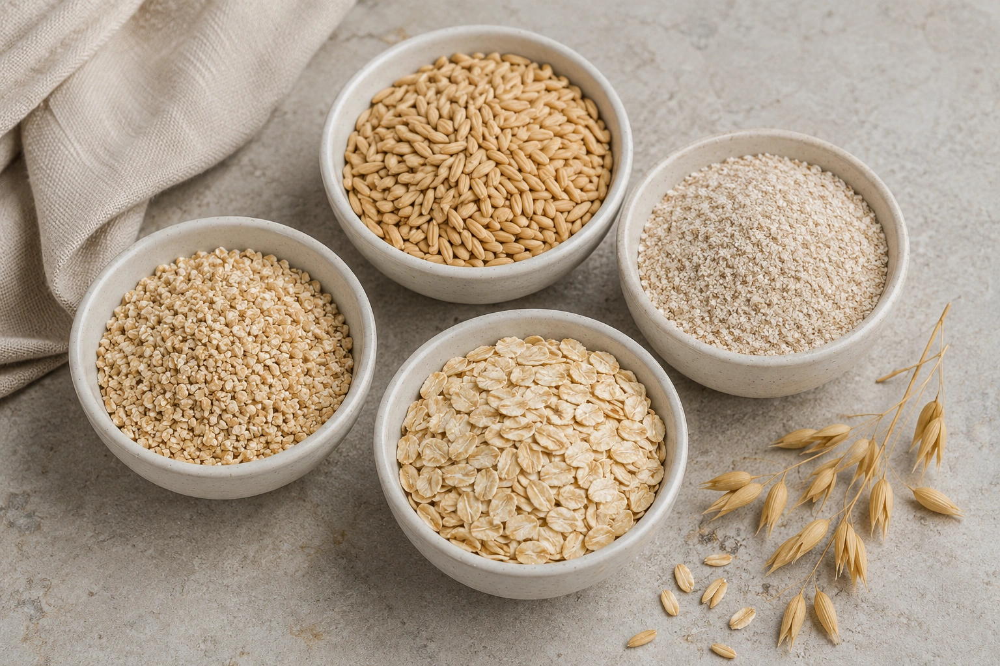
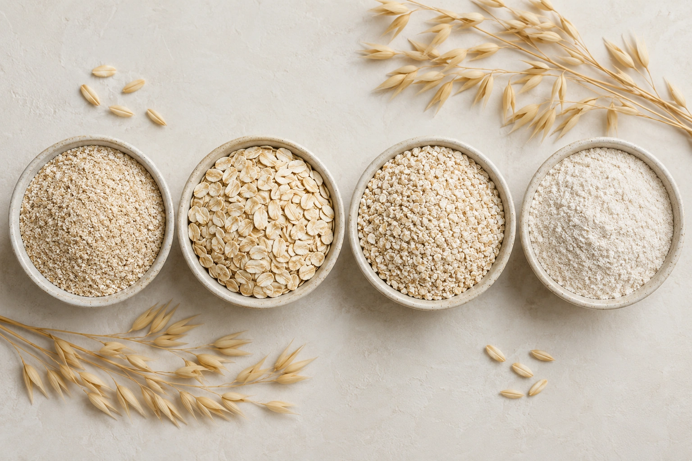
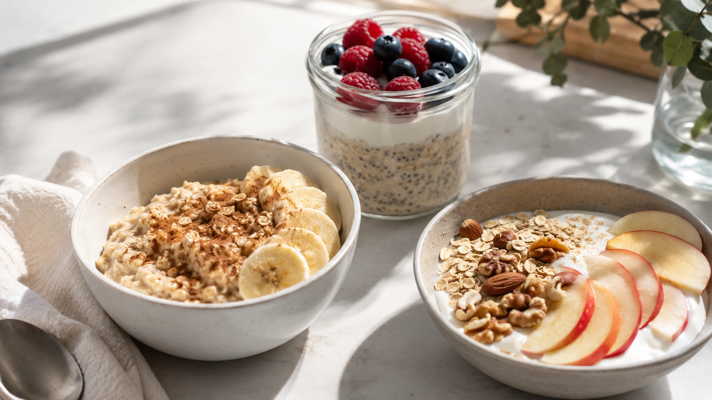

A aveia é um daqueles alimentos simples que conseguem reunir praticidade, versatilidade e um perfil nutricional interessante. Pode entrar no mingau, acompanhar frutas e iogurte, virar overnight oats, integrar massas ou até aparecer em preparações salgadas.

Seu principal diferencial nutricional está nas fibras — especialmente a **beta-glucana**, uma fibra solúvel bastante estudada por seus efeitos sobre o colesterol e a resposta glicêmica. A aveia também fornece proteínas, gorduras predominantemente insaturadas e minerais como magnésio, ferro, fósforo e zinco. ([TBCA](https://www.tbca.net.br/base-dados/int_composicao_alimentos.php?n0REd3kv7e86D%2BViXWYUnQ%3D%3D=4SOmZfTvoNg%2BRpmiYQKthQ%3D%3D 'TBCA - Composição de Alimentos (Em Medidas Caseiras)'))

Mas nem todo benefício atribuído à aveia possui o mesmo nível de evidência. A relação com a redução do LDL-colesterol é bem mais consistente do que alegações de que o cereal "emagrece", "controla o diabetes" ou resolve problemas intestinais sozinho.

## O que é a aveia?

A aveia, de nome científico _Avena sativa_, é um cereal da família das gramíneas. O grão pode passar por diferentes graus de processamento antes de chegar ao consumidor, dando origem a produtos como aveia em grãos, steel-cut oats, flocos tradicionais, flocos finos, aveia instantânea, farelo e farinha de aveia. ([Harvard T.H. Chan](https://nutritionsource.hsph.harvard.edu/food-features/oats/ 'Oats'))

Nas formas integrais, o cereal mantém partes importantes do grão e combina amido, proteínas, lipídios, fibras e diversos micronutrientes.

O processamento altera principalmente a estrutura física e o tempo de preparo. Embora flocos tradicionais e versões instantâneas possam ter composição nutricional relativamente semelhante, a velocidade de digestão pode ser diferente. De forma geral, aveias menos processadas apresentam resposta glicêmica mais lenta. ([Harvard T.H. Chan](https://nutritionsource.hsph.harvard.edu/food-features/oats/ 'Oats'))

## Quais são os nutrientes da aveia?

Segundo a Tabela Brasileira de Composição de Alimentos, a média de diferentes tipos de aveia crua contém, a cada 100 g, aproximadamente 382 kcal, 15,4 g de proteína, 8,7 g de lipídios e 9,74 g de fibra alimentar. ([TBCA](https://www.tbca.net.br/base-dados/int_composicao_alimentos.php?n0REd3kv7e86D%2BViXWYUnQ%3D%3D=4SOmZfTvoNg%2BRpmiYQKthQ%3D%3D 'TBCA - Composição de Alimentos (Em Medidas Caseiras)'))

Considerando **30 g apenas como porção de referência**, os valores aproximados são:

| Nutriente             | Quantidade aproximada em 30 g |
| --------------------- | ----------------------------: |
| Energia               |                      115 kcal |
| Carboidratos totais   |                        19,6 g |
| Proteínas             |                         4,6 g |
| Gorduras              |                         2,6 g |
| Fibras alimentares    |                         2,9 g |
| Magnésio              |                         35 mg |
| Fósforo               |                         46 mg |
| Potássio              |                        101 mg |
| Ferro                 |                       1,34 mg |
| Zinco                 |                       0,79 mg |
| Tiamina (vitamina B1) |                       0,17 mg |

_Valores calculados a partir dos dados por 100 g da TBCA para "aveia, crua, Brasil — média de diferentes tipos". A composição pode variar conforme variedade, processamento e produto._ ([TBCA](https://www.tbca.net.br/base-dados/int_composicao_alimentos.php?n0REd3kv7e86D%2BViXWYUnQ%3D%3D=4SOmZfTvoNg%2BRpmiYQKthQ%3D%3D 'TBCA - Composição de Alimentos (Em Medidas Caseiras)'))

A presença simultânea de carboidratos, fibras, proteínas e gorduras torna a aveia um ingrediente versátil para compor refeições. Isso não significa, porém, que uma porção isolada forneça todos os nutrientes necessários em uma refeição completa.

## Beta-glucana: por que essa fibra chama tanta atenção?

A beta-glucana é uma fibra solúvel presente na aveia e na cevada. Quando entra em contato com líquidos no trato gastrointestinal, contribui para aumentar a viscosidade do conteúdo digestivo. Essa característica está relacionada a alguns de seus efeitos metabólicos. ([Harvard T.H. Chan](https://nutritionsource.hsph.harvard.edu/food-features/oats/ 'Oats'))

Um dos mecanismos propostos para a redução do colesterol envolve a interação da fibra viscosa com ácidos biliares no intestino, aumentando sua eliminação. O organismo passa então a utilizar mais colesterol para produzir novos ácidos biliares.

É importante diferenciar **gramas de aveia** de **gramas de beta-glucana**. A EFSA avaliou evidências que sustentam um efeito de redução do colesterol com ingestão de 3 g de beta-glucana de aveia por dia. Isso não significa que 3 g de aveia sejam suficientes: a concentração da fibra varia conforme o produto. ([EFSA](https://efsa.onlinelibrary.wiley.com/doi/10.2903/j.efsa.2010.1885))

## Aveia pode ajudar a reduzir o colesterol?

Esse é provavelmente o benefício da aveia com suporte científico mais sólido.

Uma meta-análise de 58 ensaios clínicos randomizados, envolvendo 3.974 participantes, encontrou reduções modestas no LDL-colesterol, colesterol não HDL e apolipoproteína B com dietas enriquecidas com beta-glucana da aveia. A dose mediana nos estudos foi de aproximadamente 3,5 g de beta-glucana por dia. ([Cambridge University Press](https://www.cambridge.org/core/journals/british-journal-of-nutrition/article/effect-of-oat-glucan-on-ldlcholesterol-nonhdlcholesterol-and-apob-for-cvd-risk-reduction-a-systematic-review-and-metaanalysis-of-randomisedcontrolled-trials/60A75CB215602240E9363D49DCB690ED))

Uma revisão sistemática e meta-análise publicada em 2024 também concluiu que produtos à base de aveia podem reduzir colesterol total e LDL em pessoas com dislipidemia, enquanto os efeitos sobre HDL e triglicerídeos foram pequenos ou ausentes. Os dados disponíveis também não permitem dizer que consumir aveia, isoladamente, previna eventos cardiovasculares. ([PubMed](https://pubmed.ncbi.nlm.nih.gov/38441173/ 'Efficacy of oats in dyslipidemia: a systematic review and meta-analysis'))

Portanto, a aveia pode ser uma ferramenta alimentar útil dentro de um padrão de alimentação favorável à saúde cardiovascular, mas não substitui medicamentos prescritos nem outras medidas recomendadas para quem possui colesterol elevado.

## Efeito da aveia sobre a glicemia

A aveia contém carboidratos, portanto não deve ser tratada como um alimento que "não aumenta a glicose". O ponto relevante é que a beta-glucana pode modificar **a velocidade e a magnitude** da resposta depois da refeição.

Uma revisão sistemática e meta-análise de ensaios controlados concluiu que adicionar beta-glucana de aveia a refeições contendo carboidratos reduz as respostas pós-prandiais de glicose e insulina. A magnitude varia de acordo com fatores como dose, peso molecular da beta-glucana e composição do alimento utilizado como comparação. ([PubMed](https://pubmed.ncbi.nlm.nih.gov/33608654/ 'The effect of oat β-glucan on postprandial blood glucose and insulin responses: a systematic review and meta-analysis'))

O processamento também faz diferença. Aveia em grãos e steel-cut costuma manter uma estrutura física maior e ser digerida mais lentamente, enquanto versões instantâneas são mais rapidamente hidratadas e digeridas. ([Harvard T.H. Chan](https://nutritionsource.hsph.harvard.edu/food-features/oats/ 'Oats'))

Para quem tem diabetes, isso não significa que exista uma quantidade universalmente adequada. Porção, acompanhamento da glicemia, medicamentos e composição da refeição precisam ser considerados individualmente.

## Aveia aumenta a saciedade?

Existe uma explicação fisiológica plausível. Ao absorver água e aumentar a viscosidade do conteúdo digestivo, a beta-glucana pode retardar etapas da digestão e favorecer sinais relacionados à saciedade.

Uma revisão dedicada especificamente à aveia e saciedade encontrou evidências de que a beta-glucana pode ajudar nesse aspecto, mas os resultados variam de acordo com a quantidade consumida e as características da fibra. ([PubMed](https://pubmed.ncbi.nlm.nih.gov/26724486/ 'Dietary fiber and satiety: the effects of oats on satiety'))

Por isso, é razoável dizer que **a aveia pode contribuir para a saciedade**, mas não que ela "tira a fome" de todas as pessoas ou que provoque emagrecimento automaticamente.

Na prática, uma refeição tende a ficar mais completa quando a aveia é combinada com outras fontes de nutrientes, como frutas, leite ou iogurte natural e oleaginosas.

## Aveia ajuda o intestino?

A aveia fornece tanto fibras solúveis quanto insolúveis. As fibras contribuem para o funcionamento intestinal, especialmente quando a alimentação como um todo contém quantidade adequada de fibras e há consumo suficiente de líquidos. ([Harvard T.H. Chan](https://nutritionsource.hsph.harvard.edu/food-features/oats/ 'Oats'))

Parte da beta-glucana também pode ser fermentada pela microbiota intestinal. Há interesse científico sobre possíveis efeitos dessa interação, mas ainda não é adequado concluir que aveia "equilibra a microbiota" ou trata doenças intestinais específicas. Harvard destaca que mais pesquisas são necessárias para esclarecer essas relações. ([Harvard T.H. Chan](https://nutritionsource.hsph.harvard.edu/food-features/oats/ 'Oats'))

Quem aumenta rapidamente a ingestão de fibras pode perceber gases, distensão abdominal ou alterações intestinais. Uma introdução gradual costuma ser mais confortável.

## Farelo, flocos, farinha ou aveia instantânea: qual escolher?

As formas de aveia podem atender a necessidades diferentes.

### Aveia em grãos ou steel-cut

Passa por pouco processamento e mantém pedaços maiores do grão. Demora mais para cozinhar e tende a ser digerida mais lentamente. ([Harvard T.H. Chan](https://nutritionsource.hsph.harvard.edu/food-features/oats/ 'Oats'))

### Aveia em flocos

Os grãos são submetidos ao vapor, achatados e secos. É uma opção prática para mingaus, frutas, iogurtes, overnight oats e diferentes receitas.

### Flocos finos e aveia instantânea

São processados para hidratar e cozinhar mais rapidamente. Podem produzir resposta glicêmica mais rápida, especialmente quando comparados às versões de estrutura mais preservada. Versões instantâneas saborizadas também podem apresentar açúcar adicionado, portanto vale conferir o rótulo. ([Harvard T.H. Chan](https://nutritionsource.hsph.harvard.edu/food-features/oats/ 'Oats'))

### Farelo de aveia

Corresponde à fração externa do grão e é particularmente interessante quando o objetivo culinário é aumentar a presença de fibras em uma preparação. ([Harvard T.H. Chan](https://nutritionsource.hsph.harvard.edu/food-features/oats/ 'Oats'))

### Farinha de aveia

É obtida pela moagem da aveia. Funciona bem em bolos, panquecas, pães e outras massas, embora a moagem reduza a estrutura física do grão.

Não existe necessidade de escolher apenas um tipo. A melhor opção depende da preparação, preferências pessoais, tolerância e objetivo nutricional.

## Quanto de aveia consumir por dia?

Não existe uma quantidade diária universal de aveia que todas as pessoas precisem consumir.

A TBCA apresenta 30 g como porção de referência para o alimento consultado, mas isso não deve ser interpretado como uma prescrição individual. Necessidades energéticas, ingestão de fibras, demais alimentos da dieta e condições clínicas variam entre pessoas. ([TBCA](https://www.tbca.net.br/base-dados/int_composicao_alimentos.php?n0REd3kv7e86D%2BViXWYUnQ%3D%3D=4SOmZfTvoNg%2BRpmiYQKthQ%3D%3D 'TBCA - Composição de Alimentos (Em Medidas Caseiras)'))

Também não é correto afirmar que "duas colheres de aveia" necessariamente fornecem a quantidade de beta-glucana associada ao efeito sobre o colesterol. Para fazer essa equivalência, seria necessário conhecer o teor específico de beta-glucana do produto.

## Como incluir aveia na alimentação

A facilidade de combinar aveia com alimentos doces ou salgados é uma de suas principais vantagens.

### 1. Com frutas e iogurte

Misture aveia em flocos a iogurte natural e frutas frescas. Sementes ou castanhas podem acrescentar textura e outros nutrientes.

### 2. Em mingaus

Cozinhe a aveia com leite ou bebida vegetal. Banana, maçã, canela e cacau sem açúcar podem ser usados para variar o sabor sem depender de grandes quantidades de açúcar adicionado.

### 3. Overnight oats

Aveia em flocos pode permanecer hidratando na geladeira por algumas horas com leite, iogurte ou outra base líquida. Frutas e sementes podem ser adicionadas antes ou depois. Harvard apresenta essa preparação como uma opção prática sem cozimento. ([Harvard T.H. Chan](https://nutritionsource.hsph.harvard.edu/food-features/oats/ 'Oats'))

### 4. Em panquecas e bolos

Flocos finos ou farinha de aveia podem integrar massas junto a ovos, frutas e outros ingredientes.

### 5. Em vitaminas

Uma pequena quantidade pode ser batida com fruta, leite ou iogurte para aumentar a presença de cereais e fibras na preparação.

### 6. Em preparações salgadas

Aveia também pode entrar em hambúrgueres caseiros, almôndegas, sopas e preparações semelhantes como ingrediente de textura e estrutura.

## Como escolher uma aveia no supermercado

Para a aveia simples, uma lista de ingredientes curta costuma facilitar a escolha: muitas opções têm apenas aveia.

Ao comprar versões instantâneas ou aromatizadas, vale observar:

- presença de açúcar adicionado;
- quantidade de fibras;
- tamanho da porção indicada no rótulo;
- ingredientes adicionais;
- informação sobre glúten quando isso for clinicamente relevante.

Uma embalagem com alegações de saúde na frente não substitui a leitura da composição do produto.

## Aveia contém glúten?

A FDA considera a aveia um grão diferente de trigo, centeio e cevada, que são os cereais contendo glúten contemplados em sua regulamentação. Entretanto, a aveia pode entrar em contato com esses cereais durante cultivo, colheita, transporte, armazenamento ou processamento. ([FDA](https://www.fda.gov/food/nutrition-food-labeling-and-critical-foods/questions-and-answers-gluten-free-food-labeling-final-rule 'Questions and Answers on the Gluten-Free Food Labeling Final Rule'))

Nos Estados Unidos, um produto de aveia que utiliza a alegação regulamentada "gluten-free" precisa apresentar menos de 20 partes por milhão de glúten. As regras de rotulagem variam entre países. ([FDA](https://www.fda.gov/food/nutrition-food-labeling-and-critical-foods/questions-and-answers-gluten-free-food-labeling-final-rule 'Questions and Answers on the Gluten-Free Food Labeling Final Rule'))

Para pessoas com doença celíaca, a escolha deve ser feita com atenção à rotulagem aplicável no país e às orientações da equipe de saúde.

## Existe algum cuidado ao aumentar o consumo de aveia?

Para a maioria das pessoas, a aveia é um alimento comum e bem tolerado. Mesmo assim, aumentar a ingestão de fibras de maneira muito rápida pode provocar gases, distensão ou desconforto gastrointestinal.

Quem possui doença celíaca precisa considerar a questão do contato cruzado com glúten. Pessoas com doenças gastrointestinais, diabetes em tratamento ou outras condições que exijam controle alimentar individualizado podem se beneficiar da orientação de nutricionista ou médico.

A aveia costuma aparecer na primeira refeição do dia — e essa refeição tem uma fama que vale examinar:

[Café da manhã é realmente a refeição mais importante do dia?](/artigos/cafe-da-manha-refeicao-mais-importante/)

## Conclusão

A aveia reúne carboidratos, proteínas, gorduras, fibras e micronutrientes em um alimento acessível e fácil de utilizar. Seu componente mais estudado é a beta-glucana, cuja relação com a redução do LDL-colesterol possui respaldo de meta-análises e avaliações de autoridades científicas. ([Cambridge University Press](https://www.cambridge.org/core/journals/british-journal-of-nutrition/article/effect-of-oat-glucan-on-ldlcholesterol-nonhdlcholesterol-and-apob-for-cvd-risk-reduction-a-systematic-review-and-metaanalysis-of-randomisedcontrolled-trials/60A75CB215602240E9363D49DCB690ED))

Também existem evidências de que essa fibra pode suavizar a resposta de glicose e insulina após determinadas refeições e favorecer a saciedade, embora esses efeitos dependam da quantidade, processamento e contexto da alimentação. ([PubMed](https://pubmed.ncbi.nlm.nih.gov/33608654/ 'The effect of oat β-glucan on postprandial blood glucose and insulin responses: a systematic review and meta-analysis'))

Na prática, não é preciso transformar a aveia em um "superalimento". O maior benefício vem de utilizá-la como parte de uma alimentação equilibrada: com frutas, iogurte, sementes, oleaginosas ou em preparações culinárias que façam sentido para a rotina.

---
