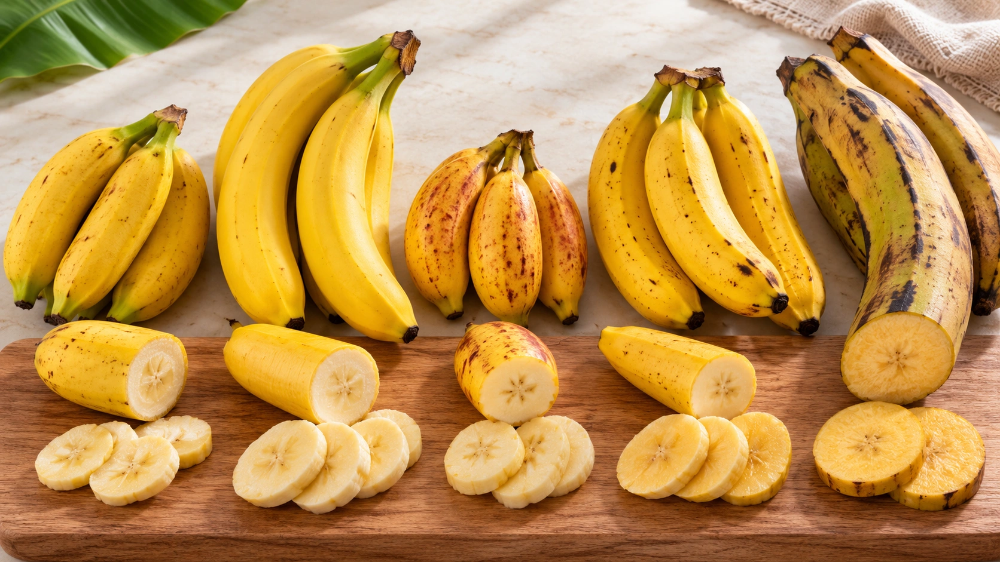
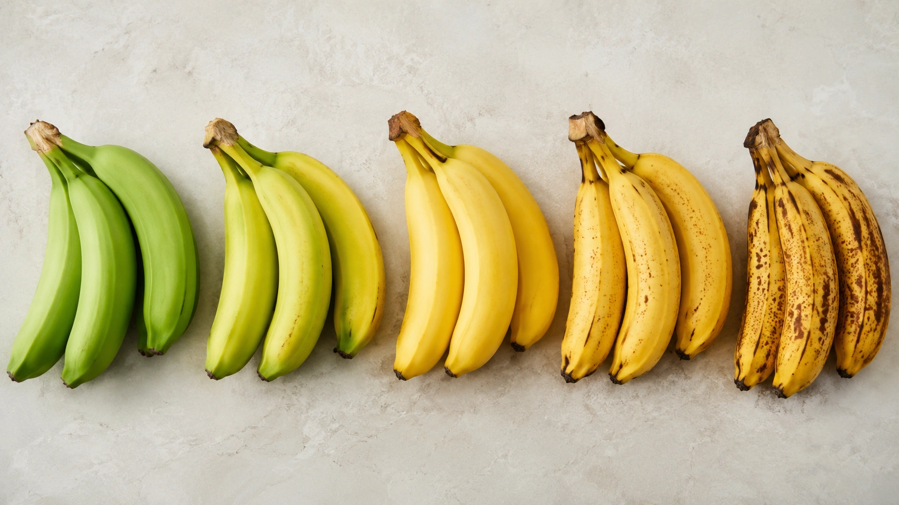
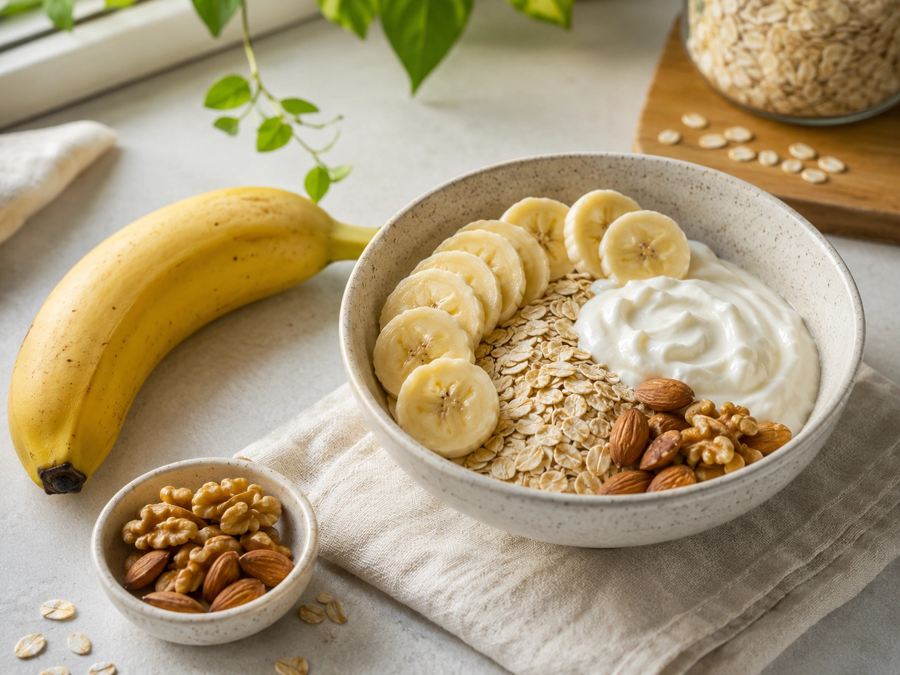

Banana-prata, nanica, maçã, ouro ou da-terra: embora todas pertençam ao mesmo grande grupo de frutas, elas não são nutricionalmente idênticas. Quantidade de água, carboidratos, fibras, minerais e vitaminas varia conforme a cultivar, e o amadurecimento também modifica a composição da polpa.

Ainda assim, há um ponto em comum: a banana é uma fruta in natura que pode contribuir com carboidratos, fibras, potássio e outros micronutrientes dentro de uma alimentação variada. Isso é bem diferente de dizer que ela, isoladamente, previne doenças ou produz algum efeito “milagroso”. ([OMS](https://www.who.int/news-room/fact-sheets/detail/healthy-diet 'Healthy diet'))

## Quais nutrientes existem na banana?

A banana é composta principalmente por água e carboidratos. Também contém pequenas quantidades de proteína e gordura, além de fibras e minerais como potássio e magnésio. A composição exata depende da variedade.

Segundo a Tabela Brasileira de Composição de Alimentos, cinco variedades populares apresentam diferenças que ficam mais claras quando comparamos a mesma quantidade de parte comestível. ([TACO](https://nepa.unicamp.br/publicacoes/tabela-taco-pdf/ 'Tabela Brasileira de Composição de Alimentos — TACO, 4ª edição revisada e ampliada'))

| Tipo de banana, crua | Energia (kcal/100 g) | Carboidratos (g) | Fibras (g) | Potássio (mg) | Vitamina C (mg) |
| -------------------- | -------------------: | ---------------: | ---------: | ------------: | --------------: |
| Banana-da-terra      |                  128 |             33,7 |        1,5 |           328 |            15,7 |
| Banana-maçã          |                   87 |             22,3 |        2,6 |           264 |            10,5 |
| Banana-nanica        |                   92 |             23,8 |        1,9 |           376 |             5,9 |
| Banana-ouro          |                  112 |             29,3 |        2,0 |           355 |             7,6 |
| Banana-prata         |                   98 |             26,0 |        2,0 |           358 |            21,6 |

**Fonte:** TACO/NEPA-UNICAMP, valores por 100 g de parte comestível.

Esses valores são úteis para comparar variedades, mas não devem ser interpretados como a composição exata de qualquer banana comprada no mercado. Cultivar, condições de produção, tamanho e maturação podem gerar diferenças. ([TACO](https://nepa.unicamp.br/publicacoes/tabela-taco-pdf/ 'Tabela Brasileira de Composição de Alimentos — TACO, 4ª edição revisada e ampliada'))

## Quais são os benefícios da banana?

### Ajuda a compor uma alimentação rica em frutas

Um dos benefícios mais bem sustentados não depende de tratar a banana como um alimento especial: ela é uma forma prática de incluir fruta in natura na alimentação.

A OMS recomenda que carboidratos venham prioritariamente de alimentos como frutas, verduras, leguminosas e grãos integrais. Para pessoas com mais de 10 anos, a orientação atual é atingir pelo menos 400 g de frutas e hortaliças diariamente e 25 g de fibras naturalmente presentes nos alimentos. ([OMS](https://www.who.int/news-room/fact-sheets/detail/healthy-diet 'Healthy diet'))

Uma banana não precisa ser a única fruta do dia. Diversidade continua sendo importante porque diferentes frutas oferecem combinações diferentes de nutrientes e compostos vegetais. ([OMS](https://www.who.int/news-room/fact-sheets/detail/healthy-diet 'Healthy diet'))

### Fornece carboidratos

Entre as variedades cruas analisadas pela TACO, o teor de carboidratos variou de 22,3 g a 33,7 g por 100 g. A banana-da-terra apresentou o maior valor entre as cinco comparadas.

Isso torna a banana uma opção conveniente de alimento fonte de carboidratos. Dependendo da refeição, ela pode ser consumida sozinha ou combinada com alimentos que acrescentem proteínas e gorduras, como iogurte natural, aveia ou oleaginosas.

O fato de possuir carboidratos não transforma a banana em um alimento “ruim”. A OMS destaca que a qualidade e a fonte desses carboidratos importam e inclui as frutas entre as fontes recomendadas. ([OMS](https://www.who.int/news-room/fact-sheets/detail/healthy-diet 'Healthy diet'))

### Contribui para a ingestão de potássio

O potássio é um eletrólito necessário para funções celulares e musculares e participa da regulação da pressão arterial. A OMS recomenda aumento da ingestão de potássio por meio dos alimentos e sugere pelo menos 3.510 mg ao dia para adultos. ([OMS](https://www.who.int/tools/elena/interventions/potassium-cvd-adults 'Increasing potassium intake to reduce blood pressure and risk of cardiovascular diseases in adults'))

Nas variedades avaliadas pela TACO, o teor variou de 264 mg/100 g na banana-maçã a 376 mg/100 g na nanica. Isso mostra que a banana pode contribuir para a ingestão diária, mas também deixa claro que não basta depender apenas dela para obter todo o potássio necessário.

Leguminosas, verduras, outras frutas e diversos alimentos in natura também fornecem esse mineral. ([OMS](https://www.who.int/tools/elena/interventions/potassium-cvd-adults 'Increasing potassium intake to reduce blood pressure and risk of cardiovascular diseases in adults'))

### Oferece fibras

As variedades comparadas na TACO forneceram aproximadamente 1,5 a 2,6 g de fibras por 100 g. A banana-maçã apresentou o maior valor nesse conjunto.

Fibras fazem parte das recomendações para uma alimentação saudável. A OMS atualmente orienta pelo menos 25 g por dia para pessoas acima de 10 anos, obtidas naturalmente de alimentos como frutas, verduras, grãos integrais e leguminosas. ([OMS](https://www.who.int/news-room/fact-sheets/detail/healthy-diet 'Healthy diet'))

A banana pode contribuir para essa meta, mas não deve substituir a variedade de outras fontes de fibra.

## Banana-prata, nanica, maçã, ouro ou da-terra: o que muda?

### Banana-prata

A banana-prata apresenta sabor doce a suavemente ácido segundo materiais técnicos da Embrapa. Na composição da TACO, fornece 98 kcal, 26 g de carboidratos, 2 g de fibras e 358 mg de potássio por 100 g. ([Embrapa](https://ainfo.cnptia.embrapa.br/digital/bitstream/item/110622/1/Sistema-de-Producao-da-Bananeira-Irrigada.pdf 'Sistema de Produção da Bananeira Irrigada - Ainfo'))

Entre as cinco variedades da comparação, foi a que apresentou maior vitamina C: 21,6 mg/100 g.

### Banana-nanica

Apesar do nome, “nanica” faz referência ao porte da bananeira, e não necessariamente ao tamanho da fruta. Ela pertence ao grupo Cavendish e está entre os tipos descritos pela Embrapa como mais doces. ([Embrapa](https://www.embrapa.br/web/agencia-de-informacao-tecnologica/cultivos/banana/pre-producao/especie/cultivares/principais 'Cultivares de banana — principais variedades'))

Na TACO, apresenta 92 kcal e 23,8 g de carboidratos por 100 g. Entre as cinco variedades desta comparação, teve o maior teor de potássio: 376 mg/100 g.

### Banana-maçã

Bananas do tipo Maçã são apreciadas pelo sabor adocicado, baixa acidez e polpa macia, segundo publicação técnica da Embrapa. ([Embrapa](https://www.infoteca.cnptia.embrapa.br/infoteca/handle/doc/1068812 'Cultivo de bananeiras tipo maçã - ’BRS Princesa’ e ... - Infoteca-e'))

Na TACO, a banana-maçã foi a menos energética entre as cinco selecionadas, com 87 kcal/100 g, além de apresentar 22,3 g de carboidratos e 2,6 g de fibras.

Isso não torna automaticamente a banana-maçã “melhor” para emagrecimento. Diferenças de tamanho da porção e do restante da alimentação continuam sendo mais relevantes do que escolher uma fruta exclusivamente por alguns quilocalorias de diferença.

### Banana-ouro

A banana-ouro pertence a um grupo descrito pela Embrapa como mais doce. Na TACO, apresenta 112 kcal, 29,3 g de carboidratos, 2 g de fibras e 355 mg de potássio a cada 100 g. ([Embrapa](https://www.embrapa.br/web/agencia-de-informacao-tecnologica/cultivos/banana/pre-producao/especie/cultivares/principais 'Cultivares de banana — principais variedades'))

Por ser geralmente uma fruta menor, comparar apenas “uma unidade” de banana-ouro com uma unidade grande de outra variedade pode causar confusão. Para avaliar composição, comparações por peso são mais adequadas.

### Banana-da-terra

A banana-da-terra se diferencia de muitas bananas de mesa por apresentar menor teor de água e maior presença de amido e carboidratos, sendo amplamente utilizada em preparações culinárias. ([Embrapa](https://www.embrapa.br/web/mandioca-e-fruticultura/cultivos/banana 'Banana - Unidade Embrapa Mandioca e Fruticultura'))

Na TACO, apresentou 128 kcal e 33,7 g de carboidratos por 100 g, os maiores valores entre as cinco variedades comparadas.

Isso não significa que seja menos saudável. Significa apenas que sua composição e seu papel culinário são diferentes. O preparo também importa: assar, cozinhar ou grelhar sem grande adição de gordura resulta em um alimento bastante diferente de uma porção frita em óleo ou preparada com grande quantidade de açúcar.

## Qual banana tem mais potássio?

Na comparação da TACO entre essas cinco variedades, a ordem foi:

1. **Banana-nanica:** 376 mg/100 g;
2. **Banana-prata:** 358 mg/100 g;
3. **Banana-ouro:** 355 mg/100 g;
4. **Banana-da-terra:** 328 mg/100 g;
5. **Banana-maçã:** 264 mg/100 g.

As diferenças existem, mas não há necessidade de escolher uma única variedade exclusivamente por causa do potássio. Uma alimentação variada fornece o mineral a partir de muitas fontes. ([OMS](https://www.who.int/tools/elena/interventions/potassium-cvd-adults 'Increasing potassium intake to reduce blood pressure and risk of cardiovascular diseases in adults'))

## Banana mais madura tem mais açúcar?

O amadurecimento muda de maneira importante a estrutura dos carboidratos da banana.

Na fruta verde, uma proporção maior desses carboidratos está armazenada como amido. Com o amadurecimento, enzimas quebram esse amido e há formação de açúcares, processo que acompanha o aumento da doçura e o amolecimento da polpa. ([PubMed](https://pubmed.ncbi.nlm.nih.gov/34237070/ 'Dietary fiber, starch, and sugars in bananas at different stages of ripeness in the retail market'))

Isso, porém, não significa que seja possível olhar para duas bananas diferentes e calcular o açúcar apenas pelo número de manchas marrons. Um estudo que avaliou amostras do varejo encontrou variação considerável entre lotes e não observou diferenças simples e uniformes entre todos os estágios de maturação analisados. ([PubMed](https://pubmed.ncbi.nlm.nih.gov/34237070/ 'Dietary fiber, starch, and sugars in bananas at different stages of ripeness in the retail market'))

## E a banana verde?

A banana verde contém mais amido antes que grande parte dele seja transformada em açúcares durante o amadurecimento. Uma parcela desse carboidrato pode estar na forma de **amido resistente**, que não é digerido da mesma maneira que o amido rapidamente disponível. ([PubMed](https://pubmed.ncbi.nlm.nih.gov/34237070/ 'Dietary fiber, starch, and sugars in bananas at different stages of ripeness in the retail market'))

Por esse motivo, biomassa, farinha e outros produtos de banana verde têm sido estudados em relação à função intestinal, saciedade e metabolismo da glicose.

Uma revisão sistemática publicada em 2019 encontrou resultados favoráveis em diversos estudos, mas também destacou um problema importante: foram utilizadas diferentes variedades, produtos, quantidades e populações. Os autores concluíram que ainda são necessários estudos mais padronizados para definir dose e efeito. ([PMC](https://pmc.ncbi.nlm.nih.gov/articles/PMC6627159/))

Portanto, banana verde pode ser mais uma opção alimentar, mas não deve ser apresentada como tratamento comprovado para emagrecimento, diabetes ou doenças intestinais.

## Quem tem diabetes pode comer banana?

A presença de açúcar natural na fruta não significa que pessoas com diabetes precisem excluir banana.

A American Diabetes Association considera frutas inteiras parte das opções alimentares para pessoas com diabetes. Ao mesmo tempo, lembra que frutas contêm carboidratos e precisam ser consideradas no planejamento da refeição, especialmente por quem realiza contagem de carboidratos. ([American Diabetes Association](https://diabetes.org/food-nutrition/reading-food-labels/fruit 'Best Fruit Choices for Diabetes'))

O tamanho merece atenção. Uma banana pequena e uma banana grande não fornecem a mesma quantidade de carboidratos. ([American Diabetes Association](https://diabetes.org/food-nutrition/reading-food-labels/fruit 'Best Fruit Choices for Diabetes'))

O grau de maturação também pode modificar a proporção entre amido e açúcares, embora a resposta de cada pessoa não possa ser determinada apenas pela cor da fruta. ([PubMed](https://pubmed.ncbi.nlm.nih.gov/34237070/ 'Dietary fiber, starch, and sugars in bananas at different stages of ripeness in the retail market'))

Para quem utiliza insulina ou precisa de controle glicêmico individualizado, quantidade e combinação com o restante da refeição devem seguir o plano definido com a equipe de saúde.

## Quem precisa ter cuidado com o potássio da banana?

Para a maioria das pessoas saudáveis, alimentos que fornecem potássio fazem parte de uma alimentação equilibrada, e a OMS estimula maior ingestão desse mineral a partir dos alimentos. ([OMS](https://www.who.int/tools/elena/interventions/potassium-cvd-adults 'Increasing potassium intake to reduce blood pressure and risk of cardiovascular diseases in adults'))

A situação pode ser diferente em alguns casos de doença renal, especialmente quando a capacidade de eliminar potássio está reduzida.

O NIDDK informa que pessoas com doença renal crônica avançada podem precisar limitar alimentos com mais potássio, incluindo bananas. Entretanto, a própria instituição alerta para não restringir frutas e verduras desnecessariamente sem avaliação profissional. ([NIDDK](https://www.niddk.nih.gov/health-information/kidney-disease/heart-disease 'Heart Disease & Kidney Disease'))

Se exames já demonstraram potássio elevado ou existe orientação específica de nefrologista ou nutricionista, a quantidade e o tipo de fruta devem seguir o plano individual.

## Banana “prende” ou “solta” o intestino?

Essa divisão é simplista.

A banana fornece fibras, e o perfil dos carboidratos muda conforme o amadurecimento. A banana verde apresenta maior quantidade de amido e amido resistente, enquanto a madura possui maior transformação do amido em açúcares. ([PubMed](https://pubmed.ncbi.nlm.nih.gov/34237070/ 'Dietary fiber, starch, and sugars in bananas at different stages of ripeness in the retail market'))

Estudos com produtos de banana verde avaliaram tanto constipação quanto diarreia, com alguns resultados positivos, mas as evidências são heterogêneas. ([PMC](https://pmc.ncbi.nlm.nih.gov/articles/PMC6627159/))

O funcionamento intestinal depende também de ingestão total de fibras, líquidos, atividade física, microbiota, medicamentos e condições clínicas. Por isso, não é adequado classificar toda banana como obrigatoriamente “constipante” ou “laxante”.

## Como escolher o melhor tipo de banana?

Para a maioria das pessoas, não há necessidade de escolher a banana exclusivamente pela tabela nutricional.

Na prática:

- **Banana-maçã:** apresentou menos calorias e mais fibras entre as cinco da tabela;
- **Banana-nanica:** teve o maior teor de potássio nessa comparação;
- **Banana-prata:** destacou-se pelo maior teor de vitamina C;
- **Banana-ouro:** é uma variedade doce e relativamente mais concentrada em carboidratos;
- **Banana-da-terra:** possui mais carboidratos e amido e se adapta especialmente bem a preparações culinárias.

Essas diferenças são interessantes, mas nenhuma transforma uma variedade em “boa” e outra em “ruim”.

Preço, disponibilidade, preferência, maturação desejada e maneira de preparo podem ser critérios tão relevantes quanto diferenças relativamente pequenas na composição.

A companhia mais comum da banana na tigela tem uma fibra com evidência propria:

[Aveia: nutrientes, benefícios e como incluir na alimentação](/artigos/aveia-nutrientes-beneficios-como-consumir/)

## Conclusão

Bananas são nutritivas, mas não são todas iguais. Dependendo da variedade, 100 g da fruta podem fornecer aproximadamente **87 a 128 kcal, 22,3 a 33,7 g de carboidratos, 1,5 a 2,6 g de fibras e 264 a 376 mg de potássio**, segundo a TACO.

A banana-nanica se destacou em potássio, a prata em vitamina C, a maçã em fibras e menor densidade energética, enquanto a banana-da-terra apresentou mais carboidratos e energia. Essas diferenças podem ajudar na escolha, mas não criam uma hierarquia rígida entre variedades.

O principal valor da banana está em algo mais simples: ela é uma fruta in natura, prática e versátil que pode contribuir para uma alimentação baseada em frutas, verduras, leguminosas, grãos integrais e outros alimentos pouco processados. ([OMS](https://www.who.int/news-room/fact-sheets/detail/healthy-diet 'Healthy diet'))

Para pessoas com diabetes, doença renal ou outras condições que exigem controle individualizado de carboidratos ou potássio, quantidade e frequência podem precisar de adaptação profissional. ([American Diabetes Association](https://diabetes.org/food-nutrition/reading-food-labels/fruit 'Best Fruit Choices for Diabetes'))

---
