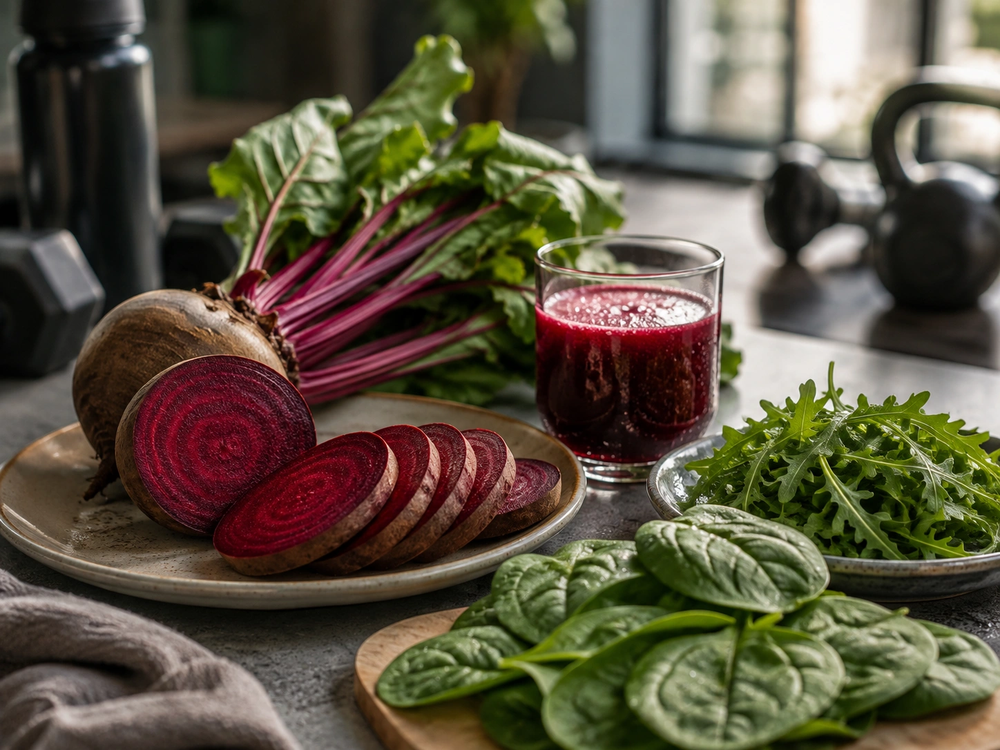
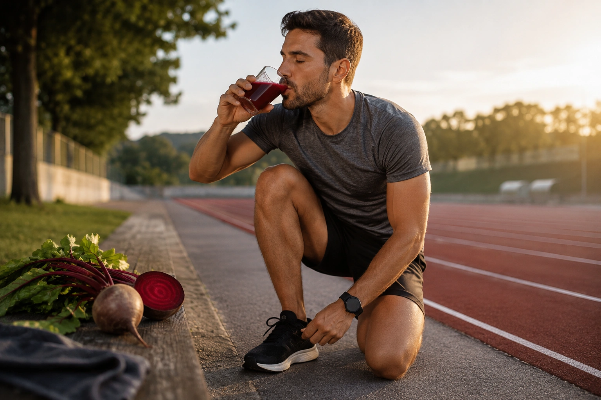

Sim, **a beterraba pode melhorar alguns aspectos do desempenho físico**, mas há uma condição importante: o efeito estudado está relacionado principalmente à quantidade de **nitrato inorgânico** ingerida, e não simplesmente ao fato de comer beterraba.

As pesquisas mostram benefícios pequenos, porém potencialmente úteis, em determinadas situações. O efeito parece mais consistente em exercícios de resistência, esforços intensos de alguns minutos e algumas tarefas de resistência muscular. Em atletas altamente treinados, entretanto, a resposta pode ser menor ou até imperceptível. ([PubMed](https://pubmed.ncbi.nlm.nih.gov/35580578/ 'Factors that Moderate the Effect of Nitrate Ingestion on Exercise Performance in Adults: A Systematic Review with Meta-Analyses and Meta-Regressions'))

Portanto, a resposta curta é: **funciona para algumas pessoas e modalidades, mas não é um pré-treino milagroso**.

## Por que a beterraba pode melhorar o desempenho?

A explicação começa com o nitrato naturalmente presente na beterraba e em outros vegetais, especialmente folhas verdes.

Depois da ingestão, parte do nitrato é absorvida e retorna à boca através da saliva. Bactérias presentes naturalmente na cavidade oral convertem esse nitrato em **nitrito**. Posteriormente, o nitrito pode participar da formação de **óxido nítrico**, uma molécula envolvida na regulação do fluxo sanguíneo, pressão arterial e função muscular. ([AIS](https://www.ausport.gov.au/ais/nutrition/supplements/group_a/performance-supplements2/beetroot-juicenitrate 'Dietary Nitrate / Beetroot Juice'))

De maneira simplificada:

**nitrato → nitrito → óxido nítrico**

Durante o exercício, essa via pode contribuir para alterações na distribuição de sangue para os músculos, na contração muscular e no custo energético do movimento. Estudos clássicos observaram que a suplementação com nitrato pode reduzir a quantidade de oxigênio necessária para realizar determinada carga submáxima de exercício. ([PubMed](https://pubmed.ncbi.nlm.nih.gov/24791915/ 'Dietary nitrate supplementation and exercise performance'))

Isso ajuda a explicar por que uma mesma intensidade pode, em determinadas condições, tornar-se ligeiramente mais econômica.

## Quanto o desempenho pode melhorar?

Aqui é importante controlar as expectativas.

Uma revisão sistemática com meta-análises e meta-regressões publicada em 2022 avaliou **123 estudos randomizados, com 1.705 participantes**, e encontrou um efeito positivo geral do nitrato sobre o desempenho. No entanto, o tamanho médio do efeito foi pequeno. ([PubMed](https://pubmed.ncbi.nlm.nih.gov/35580578/ 'Factors that Moderate the Effect of Nitrate Ingestion on Exercise Performance in Adults: A Systematic Review with Meta-Analyses and Meta-Regressions'))

Os melhores resultados apareceram particularmente em exercícios com duração entre aproximadamente **2 e 10 minutos**. O Australian Institute of Sport também cita benefícios observados em protocolos de corrida e ciclismo de cerca de **4 a 30 minutos**, além de exercícios intermitentes semelhantes aos realizados em esportes coletivos. ([PubMed](https://pubmed.ncbi.nlm.nih.gov/35580578/ 'Factors that Moderate the Effect of Nitrate Ingestion on Exercise Performance in Adults: A Systematic Review with Meta-Analyses and Meta-Regressions'))

Isso significa que o nitrato pode fazer diferença em determinados contextos, mas não transforma condicionamento físico, técnica ou treinamento inadequado em alta performance.

## Beterraba ajuda na corrida e no ciclismo?

Corrida e ciclismo estão entre as modalidades mais estudadas.

Os possíveis benefícios incluem:

- menor custo de oxigênio em determinada intensidade;
- aumento da tolerância ao esforço;
- pequeno ganho em alguns testes de desempenho;
- possível melhora da capacidade aeróbica em determinadas populações.

Uma meta-análise publicada em **14 de julho de 2026** reuniu 38 estudos randomizados ou crossover, totalizando 703 participantes, e encontrou uma melhora média pequena em VO₂max/VO₂peak com suplementação de suco de beterraba. ([Frontiers](https://www.frontiersin.org/journals/nutrition/articles/10.3389/fnut.2026.1858216/full 'Effects of beetroot juice supplementation on maximal oxygen uptake during aerobic exercise: a systematic review and meta-analysis'))

O efeito, entretanto, não foi igual para todos.

### Pessoas recreacionalmente ativas parecem responder melhor

Na análise de 2026, pessoas recreacionalmente ativas apresentaram o maior efeito médio, enquanto participantes moderadamente treinados tiveram benefício menor. Entre atletas altamente treinados ou de elite, não houve efeito estatisticamente significativo sobre VO₂max/VO₂peak. ([Frontiers](https://www.frontiersin.org/journals/nutrition/articles/10.3389/fnut.2026.1858216/full 'Effects of beetroot juice supplementation on maximal oxygen uptake during aerobic exercise: a systematic review and meta-analysis'))

O Australian Institute of Sport apresenta conclusão semelhante ao destacar que atletas de endurance com VO₂max superior a aproximadamente **65 mL/kg/min** tendem a apresentar menor resposta ao nitrato. ([AIS](https://www.ausport.gov.au/ais/nutrition/supplements/group_a/performance-supplements2/beetroot-juicenitrate 'Dietary Nitrate / Beetroot Juice'))

Isso não significa que nenhum atleta de elite responderá. Significa apenas que, conforme o condicionamento aeróbico aumenta, a chance de obter um ganho mensurável parece diminuir.

## E para musculação?

A literatura sobre exercícios de força aumentou bastante nos últimos anos.

Uma revisão sistemática e meta-análise publicada em 2024 avaliou suplementos à base de beterraba em homens saudáveis e encontrou um pequeno efeito positivo sobre **resistência muscular**. Em termos práticos, isso pode representar um modesto aumento no número de repetições ou no tempo até a exaustão em determinadas condições. ([PubMed](https://pubmed.ncbi.nlm.nih.gov/37167368/ 'Effects of Beetroot-Based Supplements on Muscular Endurance and Strength in Healthy Male Individuals: A Systematic Review and Meta-Analysis'))

Também houve efeito sobre força quando ela foi medida após uma tarefa que já havia provocado fadiga. Quando a força foi avaliada com os músculos descansados, o benefício não foi consistente. ([PubMed](https://pubmed.ncbi.nlm.nih.gov/37167368/ 'Effects of Beetroot-Based Supplements on Muscular Endurance and Strength in Healthy Male Individuals: A Systematic Review and Meta-Analysis'))

Portanto, não é adequado afirmar que suco de beterraba simplesmente “aumenta a força”.

Uma interpretação melhor seria:

**o nitrato pode ajudar algumas pessoas a sustentar melhor o desempenho muscular durante séries ou situações de fadiga.**

## Beterraba aumenta o VO₂max?

Possivelmente, mas o efeito médio é pequeno.

A meta-análise de 2026 encontrou um efeito combinado de aproximadamente **SMD 0,24** sobre VO₂max/VO₂peak. Após ajuste estatístico para possível viés relacionado a estudos pequenos, o tamanho do efeito foi ainda menor. Os autores ressaltam que o resultado deve ser interpretado como um benefício médio modesto, e não como um grande aumento da capacidade aeróbica. ([Frontiers](https://www.frontiersin.org/journals/nutrition/articles/10.3389/fnut.2026.1858216/full 'Effects of beetroot juice supplementation on maximal oxygen uptake during aerobic exercise: a systematic review and meta-analysis'))

Também é importante diferenciar uma pequena mudança em um teste de VO₂max de um ganho relevante em uma competição específica.

O desempenho esportivo envolve treinamento, técnica, estratégia, sono, disponibilidade de carboidratos, hidratação, motivação e vários outros fatores.

## Quanto de nitrato usar?

O Australian Institute of Sport recomenda, para uso esportivo direcionado, aproximadamente:

| Estratégia             |                       Quantidade |
| ---------------------- | -------------------------------: |
| Nitrato                |                     **6–8 mmol** |
| Equivalente aproximado |        **350–500 mg de nitrato** |
| Momento                | **2–3 horas antes do exercício** |

([AIS](https://www.ausport.gov.au/ais/nutrition/supplements/group_a/performance-supplements2/beetroot-juicenitrate 'Dietary Nitrate / Beetroot Juice'))

Uma grande meta-análise encontrou os melhores resultados com doses agudas de aproximadamente **5 a 14,9 mmol**, utilizadas pelo menos 150 minutos antes do exercício. Já uma meta-análise de 2026 identificou efeitos mais consistentes sobre VO₂max/VO₂peak com aproximadamente **6,4 a 12,8 mmol**. ([PubMed](https://pubmed.ncbi.nlm.nih.gov/35580578/ 'Factors that Moderate the Effect of Nitrate Ingestion on Exercise Performance in Adults: A Systematic Review with Meta-Analyses and Meta-Regressions'))

Para aplicação prática, entretanto, a recomendação de **6–8 mmol** utilizada pelo AIS oferece uma referência mais simples e conservadora.

Mais não significa necessariamente melhor: o próprio AIS observa que doses acima de aproximadamente **10–12 mmol** não parecem produzir benefício adicional consistente em relação a 6–8 mmol. ([AIS](https://www.ausport.gov.au/ais/nutrition/supplements/group_a/performance-supplements2/beetroot-juicenitrate/what-does-it-look-like 'What does it look like?'))

## Quanto tempo antes do treino?

A recomendação prática costuma ser **2 a 3 horas antes do exercício**.

Isso está relacionado ao tempo necessário para que o nitrato seja absorvido, circule pelo organismo, seja concentrado novamente na saliva e convertido pelas bactérias da boca em nitrito. As concentrações de nitrito no plasma costumam atingir valores elevados aproximadamente 2,5 horas após a ingestão. ([AIS](https://www.ausport.gov.au/ais/nutrition/supplements/group_a/performance-supplements2/beetroot-juicenitrate 'Dietary Nitrate / Beetroot Juice'))

Beber suco de beterraba cinco ou dez minutos antes de iniciar o treino, portanto, não reproduz os protocolos mais utilizados nas pesquisas.

## Precisa usar por vários dias?

Não necessariamente.

Tanto estratégias agudas — uma dose antes do exercício — quanto protocolos realizados durante vários dias foram associados a benefícios em estudos. O AIS cita como possibilidade o consumo diário de aproximadamente 6–8 mmol durante alguns dias antes de uma competição. ([AIS](https://www.ausport.gov.au/ais/nutrition/supplements/group_a/performance-supplements2/beetroot-juicenitrate/how-and-when-do-i-use-it 'How and when do I use it?'))

Na meta-análise de 2026 focada em VO₂max/VO₂peak, tanto a suplementação aguda quanto a realizada durante vários dias apresentaram efeitos positivos, embora a resposta dos protocolos crônicos tenha sido mais variável. ([Frontiers](https://www.frontiersin.org/journals/nutrition/articles/10.3389/fnut.2026.1858216/full 'Effects of beetroot juice supplementation on maximal oxygen uptake during aerobic exercise: a systematic review and meta-analysis'))

Não há, porém, motivo para concluir que o uso contínuo por meses seja necessário. O próprio AIS destaca que a segurança e a utilidade do uso crônico de suplementos concentrados de nitrato ainda não foram tão bem estudadas quanto o uso de curto prazo. ([AIS](https://www.ausport.gov.au/ais/nutrition/supplements/group_a/performance-supplements2/beetroot-juicenitrate 'Dietary Nitrate / Beetroot Juice'))

## Comer beterraba produz o mesmo efeito?

Não podemos assumir isso.

A concentração de nitrato das plantas varia de acordo com fatores como solo, clima, cultivo, armazenamento e processamento. Por isso, duas porções semelhantes de beterraba podem fornecer quantidades diferentes. ([AIS](https://www.ausport.gov.au/ais/nutrition/supplements/group_a/performance-supplements2/beetroot-juicenitrate/what-does-it-look-like 'What does it look like?'))

O AIS ressalta que preparar beterraba cozida, relish ou suco caseiro pode não fornecer uma quantidade suficientemente elevada ou previsível para atingir uma dose ergogênica específica. ([AIS](https://www.ausport.gov.au/ais/nutrition/supplements/group_a/performance-supplements2/beetroot-juicenitrate/what-does-it-look-like 'What does it look like?'))

Isso não diminui o valor nutricional do alimento.

A diferença é entre:

- **comer beterraba como parte de uma alimentação saudável**; e
- **usar nitrato de maneira padronizada com objetivo de performance**.

São objetivos diferentes.

## Por que o enxaguante bucal pode atrapalhar?

Essa é uma das particularidades mais interessantes do nitrato.

As bactérias da boca têm papel importante na conversão do nitrato em nitrito. Se essa população bacteriana for reduzida por determinados enxaguantes bucais antibacterianos, a quantidade de nitrito formada pode diminuir. ([AIS](https://www.ausport.gov.au/ais/nutrition/supplements/group_a/performance-supplements2/beetroot-juicenitrate 'Dietary Nitrate / Beetroot Juice'))

A meta-análise de 2022 também identificou que práticas capazes de interferir na microbiota oral diminuíam o efeito ergogênico associado ao nitrato. ([PubMed](https://pubmed.ncbi.nlm.nih.gov/35580578/ 'Factors that Moderate the Effect of Nitrate Ingestion on Exercise Performance in Adults: A Systematic Review with Meta-Analyses and Meta-Regressions'))

Isso não significa que higiene bucal seja prejudicial.

A recomendação prática se refere especialmente a **evitar enxaguantes antibacterianos próximos ao protocolo de suplementação**, quando o objetivo é maximizar a conversão de nitrato.

## Todo mundo responde da mesma forma?

Não.

A resposta pode depender de:

- nível de treinamento;
- dose de nitrato;
- duração do exercício;
- modalidade esportiva;
- dieta habitual;
- microbiota oral;
- sexo;
- protocolo de suplementação;
- capacidade aeróbica individual.

A meta-análise de 2026 destaca particularmente a falta de dados em mulheres: 29 dos 38 estudos analisados incluíram exclusivamente homens, enquanto apenas nove incluíram mulheres ou amostras mistas com dados relevantes. ([Frontiers](https://www.frontiersin.org/journals/nutrition/articles/10.3389/fnut.2026.1858216/full 'Effects of beetroot juice supplementation on maximal oxygen uptake during aerobic exercise: a systematic review and meta-analysis'))

Por isso, ainda existe incerteza sobre possíveis diferenças de resposta entre homens e mulheres.

## O suco de beterraba tem efeitos colaterais?

Em geral, as quantidades utilizadas em protocolos esportivos são bem toleradas, mas efeitos adversos podem ocorrer.

O Australian Institute of Sport cita principalmente:

- desconforto gastrointestinal, especialmente com produtos concentrados ou doses maiores;
- coloração temporariamente rosada ou avermelhada da urina;
- coloração avermelhada das fezes.

A mudança de cor provocada pelos pigmentos da beterraba é considerada inofensiva. ([AIS](https://www.ausport.gov.au/ais/nutrition/supplements/group_a/performance-supplements2/beetroot-juicenitrate 'Dietary Nitrate / Beetroot Juice'))

O nitrato também pode reduzir a pressão arterial. Pessoas com pressão naturalmente baixa ou que utilizam medicamentos capazes de reduzir a pressão devem procurar orientação profissional antes de adotar suplementação concentrada de nitrato como estratégia esportiva. A recomendação é especialmente prudente porque o efeito vascular do nitrato é biologicamente ativo. ([AIS](https://www.ausport.gov.au/ais/nutrition/supplements/group_a/performance-supplements2/beetroot-juicenitrate 'Dietary Nitrate / Beetroot Juice'))

## Vale usar beterraba como pré-treino?

Pode valer a pena em situações específicas.

O nitrato da beterraba está entre as estratégias de nutrição esportiva com suporte científico suficiente para fazer parte do **Grupo A de suplementos do Australian Institute of Sport**. Isso significa que existe evidência de benefício em situações esportivas específicas — não que o efeito seja grande ou garantido para todos. ([AIS](https://www.ais.gov.au/nutrition/supplements/group_a 'Group A'))

A estratégia parece particularmente razoável para quem pratica provas ou sessões envolvendo:

- corrida;
- ciclismo;
- exercícios de alguns minutos em alta intensidade;
- esforços intermitentes;
- algumas formas de treinamento de resistência muscular.

Mesmo nesses casos, o ideal é testar primeiro durante os treinos, e não experimentar pela primeira vez no dia de uma competição.

## O que importa mais: beterraba ou treinamento?

Treinamento, alimentação adequada e recuperação continuam tendo impacto incomparavelmente maior.

As próprias meta-análises mostram que os efeitos do nitrato são geralmente **pequenos**. Em esportes competitivos, uma melhoria pequena pode ser relevante; para quem está começando a se exercitar, porém, ganhos decorrentes de treinamento consistente, sono, alimentação e organização da rotina serão muito maiores. ([PubMed](https://pubmed.ncbi.nlm.nih.gov/35580578/ 'Factors that Moderate the Effect of Nitrate Ingestion on Exercise Performance in Adults: A Systematic Review with Meta-Analyses and Meta-Regressions'))

A beterraba deve ser encarada como uma possível ferramenta complementar, e não como substituta dos fundamentos.

O outro recurso pré-treino com evidência real — e com efeito bem maior que o do nitrato:

[Cafeína melhora o desempenho no treino? O que mostram os estudos](/artigos/cafeina-melhora-desempenho-treino/)

## Conclusão

**A beterraba pode melhorar modestamente o desempenho físico em algumas situações, principalmente por causa do nitrato que fornece.**

A evidência é mais favorável para determinados exercícios aeróbicos, esforços intensos de alguns minutos, atividades intermitentes e resistência muscular. Pessoas recreacionalmente ativas parecem obter benefícios aeróbicos mais consistentes que atletas de endurance altamente treinados. ([PubMed](https://pubmed.ncbi.nlm.nih.gov/35580578/ 'Factors that Moderate the Effect of Nitrate Ingestion on Exercise Performance in Adults: A Systematic Review with Meta-Analyses and Meta-Regressions'))

Para uma estratégia esportiva padronizada, o Australian Institute of Sport utiliza como referência **6–8 mmol de nitrato, aproximadamente 350–500 mg, consumidos 2–3 horas antes do exercício**. ([AIS](https://www.ausport.gov.au/ais/nutrition/supplements/group_a/performance-supplements2/beetroot-juicenitrate/how-and-when-do-i-use-it 'How and when do I use it?'))

Isso é diferente de simplesmente comer uma porção qualquer de beterraba antes do treino, pois o teor de nitrato do alimento pode variar bastante.

A melhor interpretação das evidências é simples: **beterraba não transforma o desempenho, mas uma dose adequada de nitrato pode oferecer uma pequena vantagem em contextos específicos**.

---
