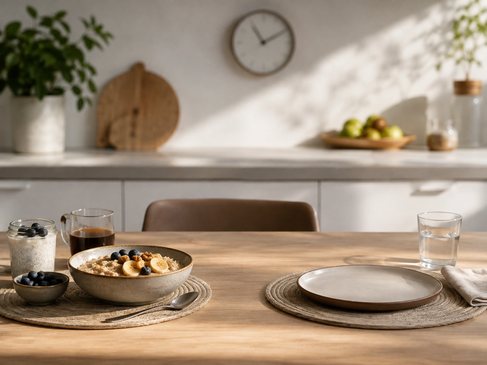
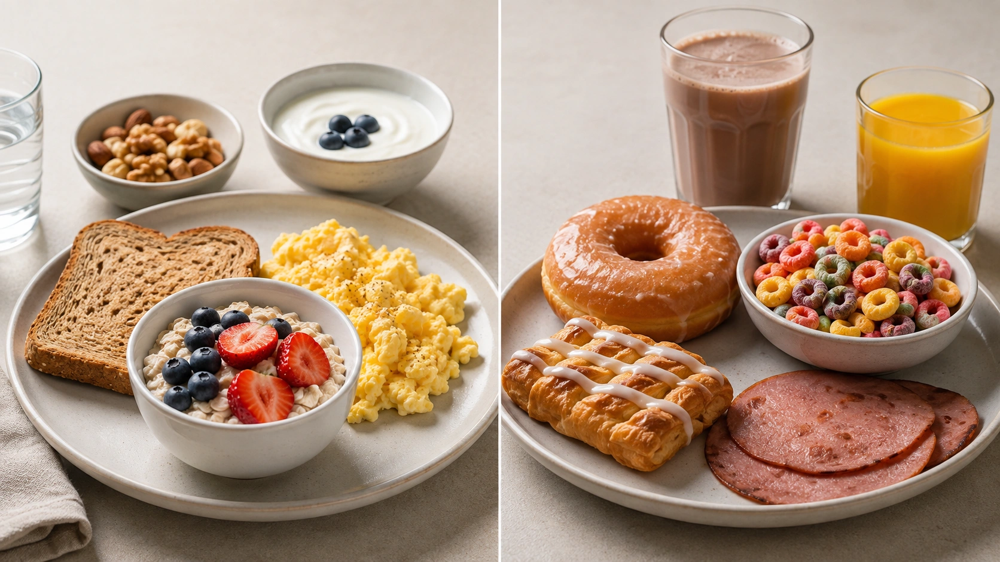
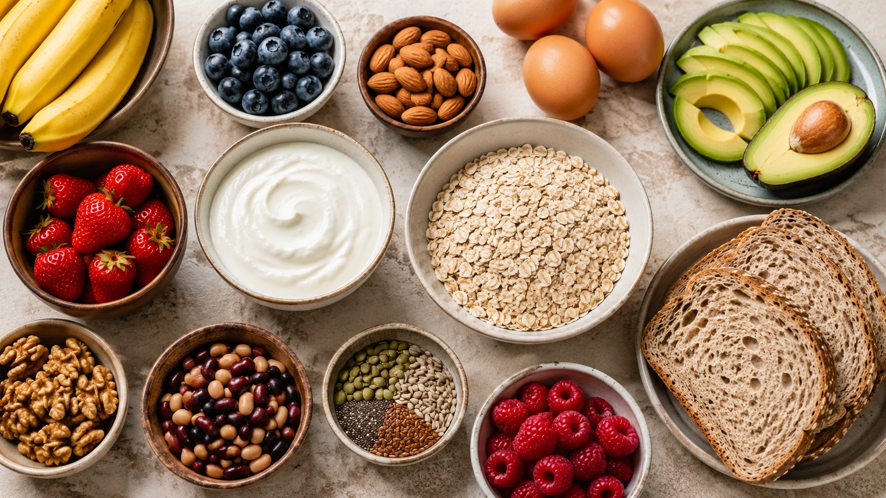

“Não saia de casa sem tomar café da manhã.” “O café da manhã acelera o metabolismo.” “Quem pula essa refeição engorda.”

Essas ideias foram repetidas tantas vezes que o café da manhã ganhou a reputação de ser **a refeição mais importante do dia**.

Mas a ciência não sustenta uma hierarquia tão simples.

O café da manhã pode ser uma ótima oportunidade para consumir frutas, fibras, proteínas, grãos integrais e outros nutrientes. Para algumas pessoas, ele também ajuda a organizar a rotina e controlar a fome.

Isso é bem diferente de afirmar que **todas as pessoas precisam comer logo pela manhã para serem saudáveis**. Revisões e ensaios clínicos mostram que os efeitos de consumir ou omitir o café da manhã variam conforme o desfecho analisado e não justificam tratar a refeição como uma regra universal. ([Cambridge University Press](https://www.cambridge.org/core/journals/proceedings-of-the-nutrition-society/article/is-breakfast-the-most-important-meal-of-the-day/74DC8BF20CAF1D7D5E75CD46A35451F8 'Is breakfast the most important meal of the day?'))

## De onde vem a ideia de que o café da manhã é tão importante?

Há uma razão para a reputação positiva da refeição.

Ao longo de décadas, estudos observacionais encontraram repetidamente que pessoas que tomam café da manhã apresentam, em média, alguns indicadores de saúde mais favoráveis do que aquelas que costumam pular a refeição.

Meta-análises observacionais, por exemplo, relacionaram a omissão do café da manhã a maior prevalência de sobrepeso e obesidade. Uma revisão de estudos prospectivos publicada em 2024 também encontrou associação entre pular a refeição e maior risco de mortalidade por todas as causas e cardiovascular. ([PubMed](https://pubmed.ncbi.nlm.nih.gov/31918985/ 'Skipping breakfast is associated with overweight and obesity'))

À primeira vista, parece uma prova convincente.

O problema é que **associação não significa causalidade**.

## Quem toma café da manhã pode ser diferente de quem não toma

Imagine que um grande estudo acompanhe milhares de pessoas e observe que quem toma café da manhã apresenta menor risco de determinada doença.

Isso não significa necessariamente que foi o café da manhã que produziu a diferença.

Os grupos podem diferir também em:

- qualidade global da alimentação;
- atividade física;
- sono;
- tabagismo;
- consumo de álcool;
- horário de trabalho;
- renda;
- escolaridade;
- acesso a alimentos;
- organização da rotina.

Pesquisadores tentam ajustar estatisticamente esses fatores, mas nem todo confundimento pode ser eliminado.

É justamente por isso que ensaios clínicos randomizados são tão importantes quando queremos saber se determinada intervenção **causa** um resultado.

## O que acontece quando o café da manhã é testado em ensaios clínicos?

Os resultados se tornam menos espetaculares.

Uma revisão sistemática e meta-análise publicada no _BMJ_ em 2019 avaliou ensaios randomizados que compararam consumo e omissão do café da manhã. Os resultados não sustentaram a ideia de adicionar café da manhã como estratégia para emagrecer. ([The BMJ](https://www.bmj.com/content/364/bmj.l42 'Effect of breakfast on weight and energy intake: systematic review and meta-analysis of randomised controlled trials'))

Outra meta-análise, publicada em 2020, reuniu sete ensaios randomizados, com 425 participantes e duração média de aproximadamente 8,6 semanas.

Nesse conjunto de estudos, **pular o café da manhã esteve associado a cerca de 0,54 kg a menos de peso corporal** em comparação com consumi-lo. Isso não significa que omitir a refeição seja uma recomendação para emagrecimento: o efeito foi pequeno, os estudos eram relativamente curtos e não houve diferença significativa na porcentagem de gordura corporal. ([PubMed](https://pubmed.ncbi.nlm.nih.gov/32304359/ 'Breakfast Skipping, Body Composition, and Cardiometabolic Risk: A Systematic Review and Meta-Analysis of Randomized Trials'))

Além disso, nessa mesma análise, o LDL foi em média cerca de **9,24 mg/dL maior** entre quem pulou o café da manhã. Para pressão arterial, colesterol total, HDL, triglicerídeos, glicemia de jejum, insulina e vários outros marcadores, não foram observadas diferenças significativas. ([PubMed](https://pubmed.ncbi.nlm.nih.gov/32304359/ 'Breakfast Skipping, Body Composition, and Cardiometabolic Risk: A Systematic Review and Meta-Analysis of Randomized Trials'))

A conclusão mais sensata não é “pule o café da manhã” nem “nunca pule o café da manhã”.

É que **uma única refeição não determina sozinha o peso ou a saúde metabólica**.

## Pular o café da manhã faz você comer mais depois?

Essa explicação parece intuitiva: se alguém não comer pela manhã, ficará com tanta fome que compensará no almoço e no jantar.

Às vezes isso realmente pode acontecer.

Mas não ocorre de maneira previsível em todas as pessoas.

Uma revisão sistemática conduzida pelo USDA para subsidiar a avaliação das evidências nutricionais analisou 19 estudos sobre café da manhã em adultos, sendo 18 ensaios randomizados. Os pesquisadores encontraram resultados mistos e concluíram que não era possível estabelecer uma conclusão sobre a relação entre consumir café da manhã e a ingestão energética total do dia. ([PubMed](https://pubmed.ncbi.nlm.nih.gov/39812565/ 'Frequency of Meals and/or Snacking and Energy Intake: A Systematic Review'))

Algumas pessoas compensam parte das calorias mais tarde. Outras não.

Por isso, frases como “pular o café da manhã sempre faz comer mais” simplificam demais o comportamento alimentar.

## E a história de “acelerar o metabolismo”?

Esse é outro argumento popular.

O corpo utiliza energia para digerir, absorver e metabolizar alimentos, fenômeno conhecido como efeito térmico dos alimentos. Mas comer uma refeição pela manhã não liga uma espécie de “interruptor metabólico” capaz de produzir emagrecimento automaticamente.

Experimentos que compararam café da manhã e jejum matinal encontraram mudanças em componentes como ingestão energética, atividade física e gasto energético ao longo do dia. Entretanto, as diferenças não se traduzem em uma vantagem consistente de peso para quem toma café da manhã. ([Cambridge University Press](https://www.cambridge.org/core/journals/proceedings-of-the-nutrition-society/article/is-breakfast-the-most-important-meal-of-the-day/74DC8BF20CAF1D7D5E75CD46A35451F8 'Is breakfast the most important meal of the day?'))

## Então os estudos observacionais estão errados?

Não.

Eles estão respondendo a uma pergunta diferente.

Quando milhões de pessoas são observadas ao longo do tempo, pode surgir um padrão importante: indivíduos que habitualmente pulam o café da manhã podem apresentar maior risco de determinados desfechos.

Uma meta-análise publicada em 2024 reuniu nove estudos de coorte com 242.095 participantes e encontrou associação entre omitir o café da manhã e maior mortalidade por todas as causas e cardiovascular. ([PubMed](https://pubmed.ncbi.nlm.nih.gov/38738978/ 'Breakfast skipping and risk of all-cause, cardiovascular and cancer mortality among adults: a systematic review and meta-analysis of prospective cohort studies'))

Essa informação merece atenção.

Mas estudos desse tipo não conseguem provar que **começar a tomar café da manhã reduzirá automaticamente o risco na mesma proporção**.

O hábito de pular a refeição pode ser também um marcador de outros padrões de estilo de vida.

## O horário das refeições pode importar?

Provavelmente importa em algum grau, mas essa é uma pergunta mais ampla do que simplesmente “tomar ou não tomar café da manhã”.

Nosso metabolismo segue ritmos biológicos ao longo de aproximadamente 24 horas. Por isso, existe interesse crescente na chamada **crononutrição**, área que estuda como horário e distribuição das refeições podem interagir com o relógio biológico.

A American Heart Association já destacou a relevância potencial de padrões e horários das refeições para a saúde cardiovascular, embora a evidência não justifique uma regra única para todos. ([American Heart Association](https://professional.heart.org/en/science-news/meal-timing-and-frequency-implications-for-cardiovascular-disease-prevention/top-things-to-know 'Meal Timing and Frequency: Implications for CVD Prevention'))

Isso também significa que “pular o café da manhã” e “jejum intermitente” não são necessariamente a mesma intervenção.

Uma pessoa pode restringir sua janela alimentar encerrando as refeições mais cedo, por exemplo, sem eliminar o café da manhã.

## Café da manhã e emagrecimento: qual é a resposta?

Se a pergunta for:

**“Preciso tomar café da manhã para emagrecer?”**

A resposta é **não**.

Os ensaios clínicos disponíveis não mostram que acrescentar essa refeição seja uma estratégia de emagrecimento por si só. ([The BMJ](https://www.bmj.com/content/364/bmj.l42 'Effect of breakfast on weight and energy intake: systematic review and meta-analysis of randomised controlled trials'))

Se a pergunta for:

**“Preciso pular o café da manhã para emagrecer?”**

A resposta também é **não**.

Uma pessoa pode perder peso consumindo café da manhã diariamente. Outra pode preferir começar a comer mais tarde.

O resultado dependerá de fatores como:

- ingestão energética total;
- qualidade dos alimentos;
- saciedade;
- consumo de proteína e fibras;
- atividade física;
- sono;
- comportamento alimentar;
- capacidade de manter o padrão escolhido.

O horário é apenas uma parte do conjunto.

## O que você come no café da manhã pode importar mais do que simplesmente comer

Considere dois cafés da manhã.

**Opção A:**

- fruta;
- aveia;
- iogurte natural;
- castanhas ou sementes.

**Opção B:**

- bebida açucarada;
- cereal com muito açúcar;
- biscoitos ou doces;
- carnes processadas.

As duas pessoas “tomaram café da manhã”.

Do ponto de vista nutricional, porém, não fizeram a mesma coisa.

A OMS recomenda um padrão alimentar baseado em variedade, com maior presença de frutas, vegetais, leguminosas, grãos integrais e nozes, além da limitação de açúcar livre, sódio e gorduras menos favoráveis. ([OMS](https://www.who.int/health-topics/healthy-diet 'Healthy diet'))

A American Heart Association segue lógica semelhante, enfatizando o padrão global e alimentos minimamente processados, frutas e vegetais, grãos integrais, fontes adequadas de proteína e gorduras insaturadas. ([American Heart Association](https://www.heart.org/en/healthy-living/healthy-eating/eat-smart/nutrition-basics/aha-diet-and-lifestyle-recommendations 'The American Heart Association Diet and Lifestyle Recommendations'))

Portanto, perguntar apenas **“você tomou café da manhã?”** pode ser menos útil do que perguntar **“o que você costuma comer e como é sua alimentação durante o dia?”**

## Como montar um café da manhã nutritivo

Não existe uma fórmula única nem necessidade de utilizar alimentos tradicionalmente considerados “de café da manhã”.

Uma estratégia prática é combinar alguns dos seguintes grupos.

### Uma fonte de proteína

Exemplos:

- ovos;
- iogurte natural;
- leite;
- queijo em quantidade adequada;
- tofu;
- feijão ou outras leguminosas;
- pasta de amendoim ou outras oleaginosas sem excesso de açúcar.

### Uma fonte de fibras e carboidratos de melhor qualidade

Exemplos:

- aveia;
- pão integral;
- outros grãos integrais;
- frutas;
- leguminosas.

### Frutas, vegetais ou ambos

Frutas inteiras podem ser uma maneira simples de acrescentar fibras, vitaminas, minerais e variedade à refeição.

### Gorduras insaturadas

Exemplos:

- castanhas;
- amendoim;
- sementes;
- abacate;
- azeite, quando fizer sentido na preparação.

Esse princípio de combinar alimentos vegetais, grãos integrais e fontes adequadas de proteína é consistente com as orientações gerais da Harvard Nutrition Source, OMS e American Heart Association. ([Harvard T.H. Chan](https://nutritionsource.hsph.harvard.edu/healthy-eating-plate/ 'Healthy Eating Plate'))

## O café da manhã não precisa ter “comida de café da manhã”

Essa também é uma questão cultural.

Nada impede que a primeira refeição do dia tenha:

- arroz e feijão;
- uma omelete com vegetais;
- sobras equilibradas do jantar;
- pão integral com ovos;
- iogurte com aveia e frutas;
- uma preparação com leguminosas.

Do ponto de vista nutricional, o horário não transforma automaticamente determinado alimento em adequado ou inadequado.

A qualidade do conjunto continua sendo o ponto principal.

## E quem não sente fome pela manhã?

Um adulto saudável que acorda sem fome não precisa necessariamente comer imediatamente apenas porque “é hora do café da manhã”.

A revisão mais recente do USDA sobre café da manhã e ingestão energética não encontrou evidência consistente para estabelecer que todos os adultos obtenham determinada vantagem energética ao consumir essa refeição. ([PubMed](https://pubmed.ncbi.nlm.nih.gov/39812565/ 'Frequency of Meals and/or Snacking and Energy Intake: A Systematic Review'))

Algumas pessoas sentem fome cedo e funcionam melhor com uma refeição matinal.

Outras preferem comer algumas horas depois.

É possível construir bons padrões alimentares das duas maneiras.

## E para crianças e adolescentes?

Aqui, o contexto merece atenção especial.

Para crianças e adolescentes, o café da manhã pode representar uma oportunidade importante de oferta de energia e nutrientes — e programas de alimentação escolar também podem desempenhar papel relevante no acesso regular a alimentos.

Entretanto, mesmo nessa faixa etária, é preciso cuidado para não transformar associações em causalidade. Uma revisão sistemática brasileira sobre adolescentes encontrou associação entre omissão do café da manhã e alguns fatores de risco cardiometabólico, mas classificou a qualidade dessas evidências como baixa. ([PubMed](https://pubmed.ncbi.nlm.nih.gov/34932697/))

Além disso, estudos sobre desempenho cognitivo e café da manhã apresentam resultados que variam de acordo com população, estado nutricional, composição da refeição e desenho do estudo. ([PubMed](https://pubmed.ncbi.nlm.nih.gov/19930787/))

Portanto, crianças não devem ser tratadas simplesmente como “adultos menores” nesse debate.

## Café da manhã e jejum intermitente são incompatíveis?

Não necessariamente.

“Jejum intermitente” descreve diferentes estratégias, e não apenas pular o café da manhã.

Uma pessoa pode:

- atrasar a primeira refeição;
- antecipar a última refeição;
- utilizar uma janela alimentar mais curta;
- seguir outros protocolos de restrição temporal.

Por isso, não é correto concluir que os possíveis efeitos do jejum intermitente sejam causados especificamente pela ausência do café da manhã.

Além disso, uma grande meta-análise em rede publicada no _BMJ_ em 2025 encontrou que estratégias de jejum intermitente podem produzir reduções de peso semelhantes às observadas com restrição energética contínua, com diferenças relativamente pequenas entre estratégias. Isso reforça que não existe um único horário obrigatório para emagrecer. ([The BMJ](https://www.bmj.com/content/389/bmj-2024-082007))

## Então, devo tomar café da manhã ou não?

Uma forma prática de decidir é observar o que acontece com você durante o restante do dia.

### O café da manhã pode ser útil se:

- você acorda com fome;
- ajuda a manter energia e concentração;
- facilita o consumo de alimentos nutritivos;
- evita chegar excessivamente faminto às refeições seguintes;
- encaixa-se bem em sua rotina;
- ajuda a distribuir proteína e outros nutrientes ao longo do dia.

### Talvez não seja necessário comer cedo se:

- você naturalmente não sente fome;
- consegue manter uma alimentação equilibrada mais tarde;
- não apresenta episódios de compulsão ou fome excessiva por causa disso;
- a estratégia é compatível com suas necessidades de saúde.

A questão central não é obedecer a um slogan.

É construir um padrão que seja **nutricionalmente adequado, seguro e sustentável**.

## O que realmente importa mais do que eleger uma “refeição campeã”

As principais recomendações de alimentação saudável não dependem de declarar café da manhã, almoço ou jantar como vencedor.

A OMS enfatiza variedade, adequação energética e nutricional e a preferência por alimentos como frutas, vegetais, leguminosas, grãos integrais e nozes. ([OMS](https://www.who.int/health-topics/healthy-diet 'Healthy diet'))

A American Heart Association também destaca que **o padrão geral das escolhas alimentares é o que conta** para a saúde cardiovascular. ([American Heart Association](https://www.heart.org/en/healthy-living/healthy-eating/eat-smart/nutrition-basics/aha-diet-and-lifestyle-recommendations 'The American Heart Association Diet and Lifestyle Recommendations'))

Na prática, vale prestar atenção a:

| Fator                         | Por que importa                                               |
| ----------------------------- | ------------------------------------------------------------- |
| Qualidade dos alimentos       | Determina grande parte da densidade nutricional da dieta      |
| Quantidade total              | Influencia o balanço energético                               |
| Frutas e vegetais             | Contribuem com fibras, vitaminas, minerais e outros compostos |
| Grãos integrais e leguminosas | Ajudam a aumentar fibras e qualidade dos carboidratos         |
| Proteínas adequadas           | Contribuem para necessidades nutricionais e saciedade         |
| Açúcares adicionados          | Devem ser limitados dentro de um padrão saudável              |
| Regularidade e rotina         | Podem facilitar adesão para algumas pessoas                   |
| Preferências individuais      | Tornam o padrão mais sustentável                              |

([OMS](https://www.who.int/health-topics/healthy-diet 'Healthy diet'))

Entre os alimentos que resolvem a parte proteica dessa refeição, um concentra bastante coisa em pouco espaço:

[Ovos: proteína, vitaminas e minerais em um alimento só](/artigos/ovos-proteina-vitaminas-minerais/)

## Conclusão

O café da manhã **não precisa ser coroado como a refeição mais importante do dia** para ser uma refeição útil.

Para quem gosta de comer pela manhã, ele pode representar uma excelente oportunidade de incluir frutas, grãos integrais, proteínas, fibras e outros alimentos nutritivos.

Para um adulto saudável que não sente fome cedo, entretanto, as evidências atuais não demonstram que se obrigar a comer pela manhã seja necessário para emagrecer ou manter o metabolismo funcionando. Revisões de ensaios clínicos não mostram uma vantagem consistente de peso apenas por consumir café da manhã. ([The BMJ](https://www.bmj.com/content/364/bmj.l42 'Effect of breakfast on weight and energy intake: systematic review and meta-analysis of randomised controlled trials'))

Ao mesmo tempo, estudos observacionais continuam encontrando associações entre pular frequentemente a refeição e alguns desfechos desfavoráveis, o que justifica continuar pesquisando o tema, principalmente em relação ao horário das refeições e à saúde cardiometabólica. ([PubMed](https://pubmed.ncbi.nlm.nih.gov/38738978/ 'Breakfast skipping and risk of all-cause, cardiovascular and cancer mortality among adults: a systematic review and meta-analysis of prospective cohort studies'))

A mensagem prática é mais simples do que o slogan:

**se você toma café da manhã, preocupe-se com a qualidade dele. Se não toma, preocupe-se com a qualidade e a adequação da alimentação ao longo do restante do dia.**

---
