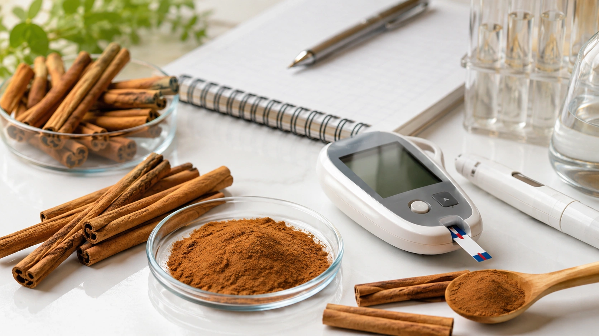
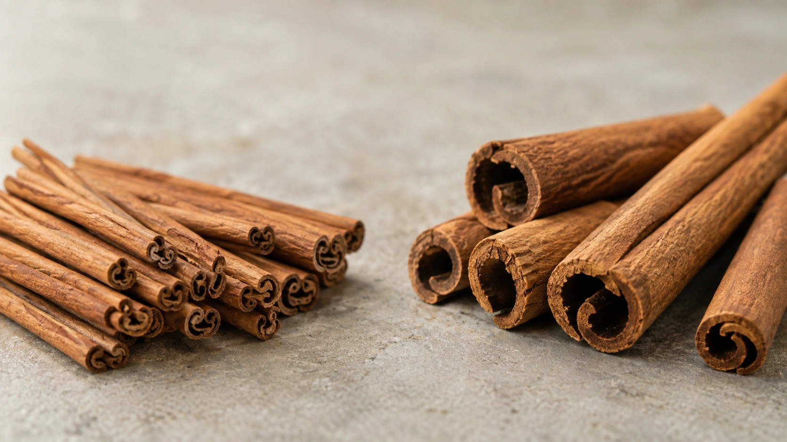
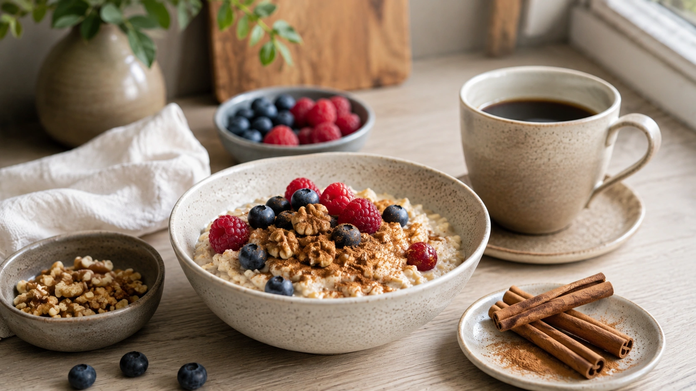

A canela é frequentemente apresentada como uma forma natural de “baixar o açúcar no sangue”. Nas redes sociais, algumas recomendações vão ainda mais longe e sugerem tomar canela diariamente para controlar pré-diabetes ou diabetes.

A ciência oferece uma resposta mais interessante — e bem menos absoluta.

**Alguns ensaios clínicos e meta-análises mostram que a canela pode reduzir modestamente a glicemia, principalmente a glicemia de jejum, em determinadas populações. Porém, os resultados são bastante inconsistentes, os produtos estudados variam e ainda não existe evidência suficiente para utilizar canela como tratamento do diabetes.** ([Nutrition Reviews](https://academic.oup.com/nutritionreviews/article-abstract/83/2/249/7699031 'Effects of cinnamon supplementation on metabolic biomarkers in individuals with type 2 diabetes: a systematic review and meta-analysis'))

Ela pode ser um ingrediente de uma alimentação saudável. Isso é muito diferente de considerá-la um medicamento natural para glicose alta.

## O que acontece quando a glicose fica elevada?

A glicose circulante é uma importante fonte de energia. A insulina, produzida pelo pâncreas, ajuda as células a utilizarem essa glicose. Na resistência à insulina, o organismo deixa de responder adequadamente à ação desse hormônio, o que pode contribuir para elevação da glicemia e desenvolvimento de pré-diabetes e diabetes tipo 2. ([NIDDK](https://www.niddk.nih.gov/health-information/diabetes/overview/what-is-diabetes/prediabetes-insulin-resistance 'Insulin Resistance & Prediabetes - NIDDK'))

A alimentação exerce influência importante porque carboidratos presentes nos alimentos são digeridos e contribuem para a entrada de glicose no sangue. A velocidade dessa resposta também pode mudar conforme a composição da refeição, incluindo a presença de fibras, proteínas e gorduras. ([CDC](https://www.cdc.gov/diabetes/healthy-eating/diabetes-meal-planning.html 'Diabetes Meal Planning'))

É nesse contexto que os possíveis efeitos da canela vêm sendo investigados.

## Afinal, canela ajuda a baixar a glicose?

**Possivelmente, mas o efeito não é consistente o suficiente para ser tratado como uma terapia estabelecida.**

Uma revisão sistemática e meta-análise publicada no _Nutrition Reviews_ avaliou **28 ensaios clínicos randomizados, envolvendo 3.054 adultos e idosos com diabetes tipo 2**. As intervenções duraram entre 30 e 120 dias. ([Nutrition Reviews](https://academic.oup.com/nutritionreviews/article-abstract/83/2/249/7699031 'Effects of cinnamon supplementation on metabolic biomarkers in individuals with type 2 diabetes: a systematic review and meta-analysis'))

Quando os resultados foram agrupados, participantes que utilizaram canela apresentaram redução média da glicemia de jejum de aproximadamente **15 mg/dL** em comparação com os grupos controle. ([Nutrition Reviews](https://academic.oup.com/nutritionreviews/article-abstract/83/2/249/7699031 'Effects of cinnamon supplementation on metabolic biomarkers in individuals with type 2 diabetes: a systematic review and meta-analysis'))

À primeira vista, isso parece bastante convincente.

Há, porém, um detalhe fundamental: a heterogeneidade da análise foi de **88%**. Em termos simples, isso significa que os resultados dos estudos diferiram muito entre si. ([Nutrition Reviews](https://academic.oup.com/nutritionreviews/article-abstract/83/2/249/7699031 'Effects of cinnamon supplementation on metabolic biomarkers in individuals with type 2 diabetes: a systematic review and meta-analysis'))

Portanto, a média não significa que uma pessoa que começar a consumir canela possa esperar que sua glicemia caia 15 mg/dL.

## E a glicose depois das refeições?

A mesma revisão encontrou redução da glicose pós-prandial entre participantes que receberam canela. O resultado agregado foi maior do que o observado na glicemia de jejum. ([Nutrition Reviews](https://academic.oup.com/nutritionreviews/article-abstract/83/2/249/7699031 'Effects of cinnamon supplementation on metabolic biomarkers in individuals with type 2 diabetes: a systematic review and meta-analysis'))

Entretanto, a heterogeneidade para esse resultado chegou a **100%**, o que demonstra uma variação extrema entre os estudos. ([Nutrition Reviews](https://academic.oup.com/nutritionreviews/article-abstract/83/2/249/7699031 'Effects of cinnamon supplementation on metabolic biomarkers in individuals with type 2 diabetes: a systematic review and meta-analysis'))

Isso reduz a confiança em qualquer número único como previsão do efeito real para uma pessoa.

Uma explicação possível é que os estudos não estavam testando exatamente a mesma intervenção: diferentes espécies de canela, extratos, cápsulas, concentrações, doses, períodos de uso e populações foram agrupados sob o nome geral de “canela”. O NCCIH considera justamente essa dificuldade de padronização uma das limitações mais importantes da literatura. ([NCCIH](https://www.nccih.nih.gov/health/cinnamon 'Cinnamon: Usefulness and Safety'))

## Canela reduz a hemoglobina glicada?

A hemoglobina glicada, ou **HbA1c**, oferece uma visão mais prolongada da exposição à glicose do que uma medição isolada de glicemia.

Algumas meta-análises encontraram redução estatisticamente significativa da HbA1c com a suplementação de canela. A revisão de 28 ensaios clínicos também encontrou resultado favorável, mas com heterogeneidade de **94%**, novamente demonstrando grande inconsistência. ([Nutrition Reviews](https://academic.oup.com/nutritionreviews/article-abstract/83/2/249/7699031 'Effects of cinnamon supplementation on metabolic biomarkers in individuals with type 2 diabetes: a systematic review and meta-analysis'))

Uma revisão guarda-chuva publicada em 2025 oferece uma perspectiva especialmente útil.

Os pesquisadores reuniram **21 meta-análises** envolvendo diferentes doenças metabólicas e reavaliaram a força das evidências. Para HbA1c, encontraram inicialmente uma redução moderada, porém também identificaram sinais de efeitos de estudos pequenos e possível excesso de resultados positivos. ([Frontiers](https://www.frontiersin.org/journals/nutrition/articles/10.3389/fnut.2025.1683477/full 'The effects of cinnamon on patients with metabolic diseases: an umbrella review of meta-analyses of randomized controlled trials'))

Depois que os autores reanalisaram os estudos originais para reduzir problemas de sobreposição entre meta-análises, **os efeitos globais sobre HbA1c e resistência à insulina deixaram de ser estatisticamente significativos**. Os próprios autores classificaram essas evidências como fracas. ([Frontiers](https://www.frontiersin.org/journals/nutrition/articles/10.3389/fnut.2025.1683477/full 'The effects of cinnamon on patients with metabolic diseases: an umbrella review of meta-analyses of randomized controlled trials'))

Esse é um bom exemplo de por que a resposta para “canela funciona?” não deve ser baseada apenas em uma meta-análise isolada.

## Qual benefício parece mais provável?

Considerando o conjunto atual da literatura, o sinal mais consistente está na **glicemia de jejum**.

A revisão guarda-chuva de 2025 classificou a evidência relacionada à glicose de jejum como mais convincente do que aquela disponível para HbA1c e resistência à insulina. ([Frontiers](https://www.frontiersin.org/journals/nutrition/articles/10.3389/fnut.2025.1683477/full 'The effects of cinnamon on patients with metabolic diseases: an umbrella review of meta-analyses of randomized controlled trials'))

Uma forma prática de resumir é:

| Resultado                    | O que as evidências sugerem                                         |
| ---------------------------- | ------------------------------------------------------------------- |
| Glicemia de jejum            | Possível redução modesta; evidência mais promissora                 |
| Glicose pós-prandial         | Algumas análises mostram redução, mas com grande heterogeneidade    |
| HbA1c                        | Resultados positivos em algumas meta-análises, porém inconsistentes |
| Resistência à insulina       | Possível melhora, mas evidência fraca                               |
| Prevenção de complicações    | Não estabelecida                                                    |
| Substituição de medicamentos | Não sustentada                                                      |

([Nutrition Reviews](https://academic.oup.com/nutritionreviews/article-abstract/83/2/249/7699031 'Effects of cinnamon supplementation on metabolic biomarkers in individuals with type 2 diabetes: a systematic review and meta-analysis'))

## Por que tantos estudos chegam a resultados diferentes?

Um dos problemas é que **“canela” não representa um único produto padronizado**.

Existem diferentes espécies do gênero _Cinnamomum_. Entre as mais conhecidas estão a canela-do-ceilão (_Cinnamomum verum_) e a canela cássia. Além disso, estudos podem utilizar casca em pó, cápsulas, extratos ou outras formulações. ([NCCIH](https://www.nccih.nih.gov/health/cinnamon 'Cinnamon: Usefulness and Safety'))

Também variam:

- dose diária;
- duração da suplementação;
- idade dos participantes;
- glicemia inicial;
- medicamentos utilizados;
- alimentação;
- espécie de canela;
- processo de extração;
- qualidade metodológica do ensaio.

Essas diferenças ajudam a explicar por que duas pesquisas aparentemente sobre “canela e diabetes” podem chegar a resultados distintos. ([Nutrition Reviews](https://academic.oup.com/nutritionreviews/article-abstract/83/2/249/7699031 'Effects of cinnamon supplementation on metabolic biomarkers in individuals with type 2 diabetes: a systematic review and meta-analysis'))

## Então a canela funciona ou não?

A conclusão mais adequada é:

**Existe evidência de um possível efeito glicêmico modesto, principalmente sobre a glicemia de jejum, mas ainda não há consistência suficiente para considerar a canela um tratamento comprovado para diabetes.**

Essa interpretação também explica a aparente divergência entre artigos científicos positivos e recomendações institucionais cautelosas.

Uma meta-análise procura saber se, em média, existe algum sinal de efeito. Uma diretriz clínica precisa responder a uma pergunta mais exigente: o resultado é confiável, reproduzível, clinicamente relevante e seguro o suficiente para recomendar uma intervenção a pacientes?

Até o momento, NCCIH afirma que não está claro se suplementos de canela são úteis para diabetes e que pesquisas de maior qualidade ainda são necessárias. ([NCCIH](https://www.nccih.nih.gov/health/cinnamon 'Cinnamon: Usefulness and Safety'))

## O que dizem as diretrizes de diabetes?

Os _Standards of Care in Diabetes—2026_, da American Diabetes Association, não recomendam depender de suplementos herbais ou não herbais para o manejo de diabetes na ausência de uma indicação nutricional específica. ([Diabetes Care](https://diabetesjournals.org/care/article/49/Supplement_1/S89/163932/5-Facilitating-Positive-Health-Behaviors-and-Well 'Standards of Care in Diabetes—2026: Facilitating Positive Health Behaviors and Well-being to Improve Health Outcomes'))

O NCCIH adota posição semelhante e afirma que **não há evidência confiável de que suplementos herbais controlem diabetes ou suas complicações**. ([NCCIH](https://www.nccih.nih.gov/health/diabetes-and-dietary-supplements-what-you-need-to-know 'Diabetes and Dietary Supplements: What You Need To Know'))

Isso não significa que os estudos positivos sejam falsos.

Significa que o conjunto de evidências ainda não atingiu o nível necessário para transformar canela em uma recomendação terapêutica padronizada.

## Canela pode substituir medicamentos?

**Não.**

Nenhuma das evidências disponíveis demonstra que canela seja equivalente a metformina, insulina ou outros medicamentos utilizados no tratamento do diabetes.

O NCCIH alerta que produtos comercializados como formas “naturais” de controlar ou curar diabetes podem ser especialmente perigosos quando levam uma pessoa a abandonar terapias comprovadas. O controle inadequado aumenta o risco de complicações da doença. ([NCCIH](https://www.nccih.nih.gov/health/diabetes-and-dietary-supplements-what-you-need-to-know 'Diabetes and Dietary Supplements: What You Need To Know'))

## Qual dose de canela foi estudada?

Não existe uma “dose para baixar a glicose” oficialmente estabelecida.

As pesquisas utilizam quantidades e formulações bastante diferentes. Uma meta-análise atualizada publicada em 2024 reuniu ensaios com doses muito variadas, enquanto análises posteriores continuaram encontrando diferenças importantes de resposta conforme quantidade, produto e duração. ([PubMed](https://pubmed.ncbi.nlm.nih.gov/37818728/ 'The effect of cinnamon supplementation on glycemic control in patients with type 2 diabetes mellitus: An updated systematic review and dose-response meta-analysis of randomized controlled trials'))

A revisão guarda-chuva de 2025 encontrou efeitos mais pronunciados sobre glicemia de jejum em alguns estudos com doses superiores a 1,5 g por dia e intervenções mais curtas. Isso é uma análise de subgrupos e **não deve ser transformado em recomendação para consumir mais de 1,5 g diariamente**. ([Frontiers](https://www.frontiersin.org/journals/nutrition/articles/10.3389/fnut.2025.1683477/full 'The effects of cinnamon on patients with metabolic diseases: an umbrella review of meta-analyses of randomized controlled trials'))

Existe uma razão adicional para evitar essa interpretação: doses maiores também aumentam a importância da espécie de canela e da exposição à cumarina. ([BfR](https://www.bfr.bund.de/en/service/frequently-asked-questions/topic/faq-on-coumarin-in-cinnamon-and-other-foods/ 'FAQ on coumarin in cinnamon and other foods'))

## Canela em pó e cápsulas são a mesma coisa?

Não necessariamente.

Um suplemento pode conter:

- canela em pó;
- extrato concentrado;
- uma espécie específica;
- uma mistura de espécies;
- uma preparação cuja espécie não está claramente informada.

O NCCIH ressalta que muitos produtos não indicam claramente qual espécie ou qual parte da planta foi utilizada, embora essas diferenças possam alterar sua composição química e seus efeitos. ([NCCIH](https://www.nccih.nih.gov/health/cinnamon 'Cinnamon: Usefulness and Safety'))

Portanto, o resultado obtido com um determinado extrato em um ensaio clínico não pode ser automaticamente aplicado a qualquer canela comprada no supermercado ou suplemento disponível no mercado.

## Canela cássia e canela-do-ceilão são iguais?

Não.

A **canela-do-ceilão**, também chamada de _Cinnamomum verum_, contém níveis baixos de cumarina. A **canela cássia** apresenta concentrações consideravelmente maiores. ([BfR](https://www.bfr.bund.de/en/service/frequently-asked-questions/topic/faq-on-coumarin-in-cinnamon-and-other-foods/ 'FAQ on coumarin in cinnamon and other foods'))

Essa diferença é particularmente importante para quem pensa em consumir canela diariamente e em quantidades maiores do que aquelas normalmente usadas apenas para dar sabor aos alimentos.

Não existe, porém, base suficiente para dizer que a canela-do-ceilão controla melhor a glicose. Sua principal vantagem nesse contexto é a menor exposição à cumarina. ([BfR](https://www.bfr.bund.de/en/service/frequently-asked-questions/topic/faq-on-coumarin-in-cinnamon-and-other-foods/ 'FAQ on coumarin in cinnamon and other foods'))

## O que é a cumarina?

Cumarina é uma substância encontrada naturalmente em várias plantas e presente em concentrações relativamente altas na canela cássia. Pessoas particularmente sensíveis podem desenvolver alterações hepáticas quando expostas a quantidades suficientes. ([BfR](https://www.bfr.bund.de/en/service/frequently-asked-questions/topic/faq-on-coumarin-in-cinnamon-and-other-foods/ 'FAQ on coumarin in cinnamon and other foods'))

O BfR estabelece uma **ingestão diária tolerável de 0,1 mg de cumarina por kg de peso corporal por dia**. ([BfR](https://www.bfr.bund.de/en/service/frequently-asked-questions/topic/faq-on-coumarin-in-cinnamon-and-other-foods/ 'FAQ on coumarin in cinnamon and other foods'))

Isso corresponde a aproximadamente:

| Peso corporal | Ingestão diária tolerável de cumarina |
| ------------- | ------------------------------------: |
| 50 kg         |                                  5 mg |
| 60 kg         |                                  6 mg |
| 70 kg         |                                  7 mg |
| 80 kg         |                                  8 mg |

Valores calculados a partir da referência de 0,1 mg/kg/dia do BfR. ([BfR](https://www.bfr.bund.de/en/service/frequently-asked-questions/topic/faq-on-coumarin-in-cinnamon-and-other-foods/ 'FAQ on coumarin in cinnamon and other foods'))

O problema é que a quantidade de cumarina presente na canela cássia varia bastante.

## Quanto de canela cássia pode atingir esse limite?

Segundo dados de monitoramento utilizados pelo BfR, a canela cássia contém, em média, cerca de **3.000 mg de cumarina por kg de canela**, embora produtos com concentrações muito maiores já tenham sido encontrados. ([BfR](https://www.bfr.bund.de/en/service/frequently-asked-questions/topic/faq-on-coumarin-in-cinnamon-and-other-foods/ 'FAQ on coumarin in cinnamon and other foods'))

Com essa concentração média, **um adulto de 60 kg atingiria a ingestão diária tolerável ao consumir aproximadamente 2 g de canela cássia por dia**. ([BfR](https://www.bfr.bund.de/en/service/frequently-asked-questions/topic/faq-on-coumarin-in-cinnamon-and-other-foods/ 'FAQ on coumarin in cinnamon and other foods'))

Isso não significa que ultrapassar essa quantidade uma vez vá causar intoxicação. O próprio BfR explica que exceder moderadamente o limite durante um curto período não representa o mesmo risco de exposição elevada e contínua. A preocupação é principalmente com grandes quantidades consumidas regularmente por longos períodos. ([BfR](https://www.bfr.bund.de/en/service/frequently-asked-questions/topic/faq-on-coumarin-in-cinnamon-and-other-foods/ 'FAQ on coumarin in cinnamon and other foods'))

## Canela faz mal ao fígado?

Em quantidades culinárias usuais, a canela é considerada provavelmente segura para a maioria das pessoas. Problemas tornam-se mais relevantes com grandes quantidades ou uso prolongado. ([NCCIH](https://www.nccih.nih.gov/health/cinnamon 'Cinnamon: Usefulness and Safety'))

A cumarina merece atenção porque pode causar lesão hepática em uma pequena parcela de pessoas particularmente sensíveis. Quem já possui doença no fígado deve ser especialmente cauteloso com produtos contendo grandes quantidades de canela cássia. ([BfR](https://www.bfr.bund.de/en/service/frequently-asked-questions/topic/faq-on-coumarin-in-cinnamon-and-other-foods/ 'FAQ on coumarin in cinnamon and other foods'))

Efeitos adversos descritos com quantidades maiores também incluem problemas gastrointestinais e reações alérgicas. ([NCCIH](https://www.nccih.nih.gov/health/cinnamon 'Cinnamon: Usefulness and Safety'))

## Canela pode interagir com medicamentos?

Suplementos herbais podem interagir com medicamentos, e pessoas que utilizam tratamentos para diabetes devem informar seus profissionais de saúde sobre os produtos que estão tomando. ([NCCIH](https://www.nccih.nih.gov/health/diabetes-and-dietary-supplements-what-you-need-to-know 'Diabetes and Dietary Supplements: What You Need To Know'))

Isso ganha relevância quando o próprio objetivo do suplemento é alterar a glicose.

Em pessoas que utilizam insulina ou determinados medicamentos, glicose excessivamente baixa pode se tornar um problema médico importante. O NIDDK destaca que insulina e alguns fármacos, como sulfonilureias, estão particularmente associados ao risco de hipoglicemia. ([NIDDK](https://www.niddk.nih.gov/health-information/diabetes/overview/healthy-living-with-diabetes 'Healthy Living with Diabetes - NIDDK'))

Por isso, tentar intensificar o controle da glicemia com suplementos sem acompanhamento pode dificultar o manejo seguro do tratamento.

## E durante a gravidez?

O NCCIH informa que as quantidades de canela normalmente presentes em alimentos parecem ser seguras durante a gravidez, enquanto quantidades maiores de canela-do-ceilão não são consideradas seguras. Também existem poucos dados sobre doses elevadas durante a amamentação. ([NCCIH](https://www.nccih.nih.gov/health/cinnamon 'Cinnamon: Usefulness and Safety'))

Isso reforça a diferença entre utilizar canela como tempero e utilizá-la deliberadamente como suplemento terapêutico.

## Colocar canela no café ajuda?

Pode ser uma forma de utilizar a especiaria culinariamente, mas não é possível prometer que essa quantidade produzirá uma redução clinicamente relevante da glicemia.

Grande parte das pesquisas investiga suplementação diária padronizada ou quantidades específicas durante várias semanas. Isso não é equivalente a polvilhar uma pequena quantidade de canela em uma bebida. ([Nutrition Reviews](https://academic.oup.com/nutritionreviews/article-abstract/83/2/249/7699031 'Effects of cinnamon supplementation on metabolic biomarkers in individuals with type 2 diabetes: a systematic review and meta-analysis'))

Se o café estiver sem açúcar, a canela também pode ser usada simplesmente pelo sabor, sem necessidade de atribuir a ela um efeito medicinal.

## Canela em sobremesas “anula” o açúcar?

Não.

Quando uma pessoa come alimentos com carboidratos, esses carboidratos contribuem para a elevação da glicemia. A velocidade da resposta depende do alimento e da composição da refeição, mas adicionar canela não remove o açúcar ou o amido que já estão presentes. ([CDC](https://www.cdc.gov/diabetes/healthy-eating/diabetes-meal-planning.html 'Diabetes Meal Planning'))

Um bolo com açúcar continua contendo açúcar mesmo que tenha bastante canela.

Da mesma forma, adicionar canela a uma bebida açucarada não transforma a preparação em um alimento de baixo impacto glicêmico.

## O que tem evidência mais forte para controlar a glicose?

Para pessoas com diabetes, o controle glicêmico envolve um conjunto de estratégias, incluindo alimentação adequada, atividade física, acompanhamento de peso quando necessário, monitoramento e medicamentos quando indicados. ([NCCIH](https://www.nccih.nih.gov/health/diabetes-and-dietary-supplements-what-you-need-to-know 'Diabetes and Dietary Supplements: What You Need To Know'))

O CDC destaca que a quantidade e o tipo de carboidrato, as porções e a combinação dos alimentos influenciam a resposta glicêmica. Proteínas, gorduras e fibras podem modificar a velocidade com que os carboidratos elevam a glicose. ([CDC](https://www.cdc.gov/diabetes/healthy-eating/diabetes-meal-planning.html 'Diabetes Meal Planning'))

Portanto, concentrar toda a atenção em uma especiaria pode desviar o foco de intervenções com impacto muito mais estabelecido.

## Como usar canela de forma sensata?

Para quem gosta do sabor, a canela pode ser incorporada naturalmente a alimentos como:

- aveia;
- frutas;
- iogurte natural;
- café;
- preparações com maçã ou banana;
- receitas salgadas;
- bebidas sem açúcar.

O objetivo não precisa ser consumir uma determinada “dose medicinal”.

Em pessoas sem contraindicações, o uso culinário moderado é muito diferente de tomar cápsulas ou várias colheres de canela todos os dias. O NCCIH considera o consumo em quantidades normalmente utilizadas como tempero provavelmente seguro. ([NCCIH](https://www.nccih.nih.gov/health/cinnamon 'Cinnamon: Usefulness and Safety'))

## Quem precisa ter mais cuidado?

É particularmente importante conversar com um profissional antes de usar grandes quantidades ou suplementos de canela quando houver:

- diabetes em tratamento medicamentoso;
- uso de insulina;
- doença hepática;
- utilização de diversos medicamentos;
- gravidez;
- amamentação;
- intenção de consumir doses elevadas diariamente.

As preocupações envolvem interações, dificuldade de prever o efeito glicêmico, diferenças entre produtos e exposição à cumarina, sobretudo na canela cássia. ([NCCIH](https://www.nccih.nih.gov/health/cinnamon 'Cinnamon: Usefulness and Safety'))

## Então vale a pena usar canela para controlar a glicose?

Para temperar alimentos, a canela pode fazer parte normalmente de uma alimentação saudável.

Usá-la especificamente como tratamento para glicemia elevada é outra questão.

Os estudos oferecem um sinal interessante de que a canela **pode produzir uma pequena redução da glicemia de jejum em algumas pessoas**, especialmente em populações com alterações metabólicas. ([Frontiers](https://www.frontiersin.org/journals/nutrition/articles/10.3389/fnut.2025.1683477/full 'The effects of cinnamon on patients with metabolic diseases: an umbrella review of meta-analyses of randomized controlled trials'))

Mas ainda permanecem dúvidas importantes:

- qual espécie funciona melhor;
- qual extrato deve ser usado;
- qual é a dose ideal;
- quem realmente responde;
- quanto do efeito permanece no longo prazo;
- se pequenas mudanças laboratoriais se traduzem em menos complicações;
- qual é a segurança do uso prolongado.

Essas incertezas explicam por que as autoridades de saúde ainda não recomendam canela como tratamento padronizado do diabetes. ([NCCIH](https://www.nccih.nih.gov/health/cinnamon 'Cinnamon: Usefulness and Safety'))

## Conclusão

**A canela pode ter um efeito modesto sobre a glicose, mas está longe de ser uma solução comprovada para controlar diabetes.**

Meta-análises encontraram reduções na glicemia de jejum e, em alguns casos, na glicose pós-prandial, HbA1c e resistência à insulina. Entretanto, os resultados variam muito entre os estudos e as evidências para alguns desses desfechos perdem força quando analisadas com métodos mais rigorosos. ([Nutrition Reviews](https://academic.oup.com/nutritionreviews/article-abstract/83/2/249/7699031 'Effects of cinnamon supplementation on metabolic biomarkers in individuals with type 2 diabetes: a systematic review and meta-analysis'))

Por isso, utilizar canela como tempero pode ser perfeitamente razoável, mas **ela não deve substituir alimentação adequada, atividade física, monitoramento ou medicamentos prescritos**. ([NCCIH](https://www.nccih.nih.gov/health/diabetes-and-dietary-supplements-what-you-need-to-know 'Diabetes and Dietary Supplements: What You Need To Know'))

Para quem pretende consumir grandes quantidades regularmente, a espécie também importa: a canela cássia contém mais cumarina, enquanto a canela-do-ceilão possui níveis bem menores. ([BfR](https://www.bfr.bund.de/en/service/frequently-asked-questions/topic/faq-on-coumarin-in-cinnamon-and-other-foods/ 'FAQ on coumarin in cinnamon and other foods'))

A melhor interpretação da ciência hoje não é “canela não funciona” nem “canela controla diabetes”. É mais precisa:

**há um possível benefício glicêmico pequeno, principalmente para glicemia de jejum, mas ainda insuficiente para transformar a especiaria em tratamento.**
