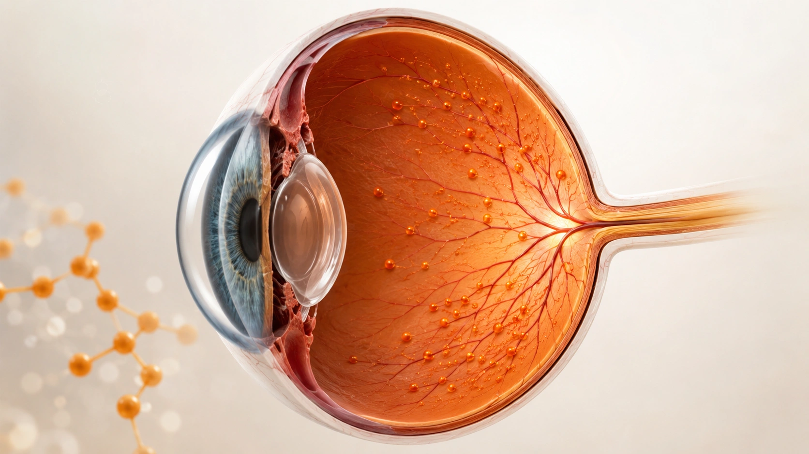
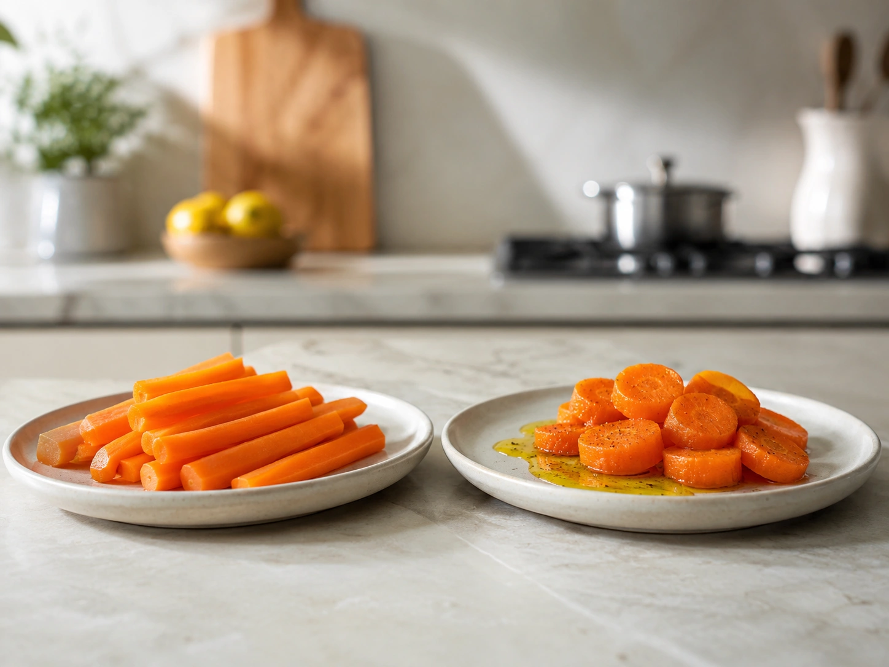
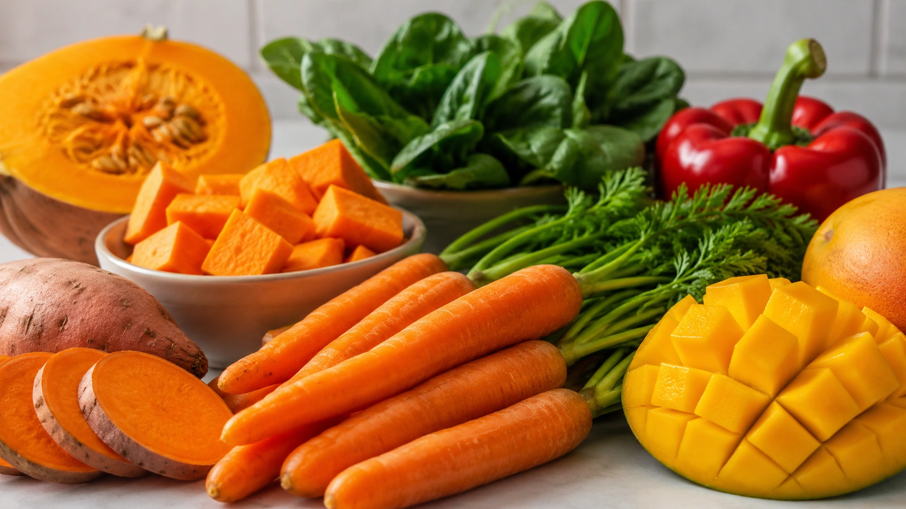

A associação entre cenoura e boa visão tem um fundo científico real — mas costuma ser exagerada.

A cenoura é rica em carotenoides, incluindo o **betacaroteno**, que pode ser convertido pelo organismo em vitamina A. E a vitamina A, de fato, é indispensável para o funcionamento normal dos olhos. Ela participa da rodopsina, uma proteína da retina sensível à luz e fundamental para enxergarmos adequadamente, especialmente em ambientes pouco iluminados. ([NIH ODS](https://ods.od.nih.gov/factsheets/VitaminA-HealthProfessional/ 'Vitamin A and Carotenoids — Health Professional Fact Sheet'))

Isso, porém, não significa que comer cenoura deixe automaticamente sua visão mais nítida.

Se uma pessoa já possui vitamina A suficiente, acrescentar quantidades cada vez maiores de cenoura à dieta não demonstrou transformar a acuidade visual, corrigir miopia ou dispensar óculos. A forma mais correta de dizer é: **a cenoura fornece nutrientes que ajudam a manter o funcionamento normal da visão, sobretudo por contribuir para a oferta de vitamina A.**

## De onde vem a relação entre cenoura e visão?

O ponto central dessa história é o betacaroteno.

Os carotenoides são pigmentos encontrados em diversos vegetais. Alguns deles, como betacaroteno, alfa-caroteno e beta-criptoxantina, funcionam como **provitamina A**: depois de absorvidos, podem ser transformados pelo organismo em formas de vitamina A. ([NIH ODS](https://ods.od.nih.gov/factsheets/VitaminA-HealthProfessional/ 'Vitamin A and Carotenoids — Health Professional Fact Sheet'))

A cenoura contém quantidades expressivas desses pigmentos. Dados da Tabela Brasileira de Composição de Alimentos mostram, por exemplo, que uma amostra de cenoura crua da variedade Imperador apresentou cerca de 3.840 µg de betacaroteno total e 399 µg de vitamina A em equivalentes de atividade de retinol, ou RAE, por 100 g de parte comestível. Esses números não devem ser considerados universais para toda cenoura, pois cultivar, origem e preparo modificam a composição. ([TBCA](https://www.tbca.net.br/base-dados/int_composicao_estatistica2.php?cod_produto=330B 'Cenoura crua, Daucus carota var. Imperador — Composição química'))

O NIH também classifica a cenoura entre as fontes alimentares relevantes de vitamina A proveniente de carotenoides. ([NIH ODS](https://ods.od.nih.gov/factsheets/VitaminA-HealthProfessional/ 'Vitamin A and Carotenoids — Health Professional Fact Sheet'))

## O que a vitamina A faz dentro dos olhos?

A vitamina A não é apenas associada à visão: ela participa diretamente do processo visual.

Uma de suas funções é integrar a **rodopsina**, proteína fotossensível localizada na retina. A retina transforma a luz que entra no olho em sinais que podem ser processados pelo sistema visual. A vitamina A também participa da manutenção normal da córnea e das membranas conjuntivais. ([NIH ODS](https://ods.od.nih.gov/factsheets/VitaminA-HealthProfessional/ 'Vitamin A and Carotenoids — Health Professional Fact Sheet'))

Quando as reservas de vitamina A ficam muito reduzidas, a quantidade de rodopsina pode diminuir. Um dos primeiros sintomas clínicos é justamente a dificuldade de enxergar em ambientes com pouca iluminação — a chamada **cegueira noturna**. ([NIH ODS](https://ods.od.nih.gov/factsheets/VitaminA-HealthProfessional/ 'Vitamin A and Carotenoids — Health Professional Fact Sheet'))

Em casos graves e prolongados, a deficiência pode provocar alterações conhecidas coletivamente como xeroftalmia, comprometendo conjuntiva e córnea e podendo, em situações extremas, causar cegueira permanente. ([OMS](https://www.who.int/data/nutrition/nlis/info/vitamin-a-deficiency 'Vitamin A deficiency'))

Essa é a parte verdadeira da relação entre vitamina A e visão.

## Então cenoura melhora ou não melhora a visão?

Depende do que se entende por “melhorar”.

Se uma pessoa apresenta deficiência de vitamina A e essa deficiência está comprometendo sua função visual, restaurar um estado adequado de vitamina A pode corrigir manifestações relacionadas à deficiência, conforme a causa e a gravidade. ([OMS](https://www.who.int/data/nutrition/nlis/info/vitamin-a-deficiency 'Vitamin A deficiency'))

Mas isso é bem diferente de dizer que cenoura oferece uma espécie de “upgrade” para olhos saudáveis.

Não encontramos nas fontes analisadas suporte para afirmar que aumentar o consumo de cenoura melhore a acuidade visual além do funcionamento normal em pessoas com vitamina A adequada. O NIH descreve a vitamina A como essencial para a **visão normal**, não como um recurso para aumentar indefinidamente a capacidade visual. ([NIH ODS](https://ods.od.nih.gov/factsheets/VitaminA-HealthProfessional/ 'Vitamin A and Carotenoids — Health Professional Fact Sheet'))

## O que significa “provitamina A”?

Existem diferentes formas pelas quais obtemos vitamina A na alimentação.

Alimentos de origem animal podem fornecer vitamina A pré-formada, principalmente retinol e ésteres de retinila. Já diversos vegetais fornecem carotenoides de provitamina A. O betacaroteno da cenoura pertence a esse segundo grupo. ([NIH ODS](https://ods.od.nih.gov/factsheets/VitaminA-HealthProfessional/ 'Vitamin A and Carotenoids — Health Professional Fact Sheet'))

Depois que o betacaroteno é absorvido, enzimas do organismo podem convertê-lo em vitamina A. Essa conversão não ocorre em uma proporção de 1 para 1.

Por isso, valores nutricionais modernos costumam utilizar a unidade **µg RAE**, ou microgramas de equivalentes de atividade de retinol. Segundo os valores de referência apresentados pelo NIH, 12 µg de betacaroteno proveniente de alimentos correspondem, para fins de cálculo nutricional, a 1 µg RAE de vitamina A. Alfa-caroteno e beta-criptoxantina possuem fatores de conversão diferentes. ([NIH ODS](https://ods.od.nih.gov/factsheets/VitaminA-HealthProfessional/ 'Vitamin A and Carotenoids — Health Professional Fact Sheet'))

## Quanta vitamina A precisamos?

As recomendações variam conforme idade, sexo e fase da vida.

Como referência, as Dietary Reference Intakes utilizadas pelo NIH estabelecem uma ingestão recomendada de 900 µg RAE por dia para homens adultos e 700 µg RAE para mulheres adultas. As necessidades são diferentes durante gravidez e amamentação. ([NIH ODS](https://ods.od.nih.gov/factsheets/VitaminA-HealthProfessional/ 'Vitamin A and Carotenoids — Health Professional Fact Sheet'))

Isso não significa que uma pessoa precise atingir toda a recomendação exclusivamente com cenouras.

Vitamina A e carotenoides podem vir de diferentes alimentos. Vegetais alaranjados, amarelos e verde-escuros participam da oferta de provitamina A, enquanto ovos, laticínios, peixes e outros produtos de origem animal podem fornecer vitamina A pré-formada. ([NIH ODS](https://ods.od.nih.gov/factsheets/VitaminA-HealthProfessional/ 'Vitamin A and Carotenoids — Health Professional Fact Sheet'))

Uma alimentação variada é mais coerente do que procurar um único “alimento dos olhos”.

## Cenoura crua ou cozida: qual é melhor para o betacaroteno?

Essa pergunta mostra por que a composição de um alimento não conta toda a história.

Na base da TBCA, uma amostra de cenoura Imperador crua apresentou aproximadamente 3.840 µg de betacaroteno total por 100 g. A mesma variedade analisada após oito minutos de cozimento apresentou cerca de 3.640 µg por 100 g. ([TBCA](https://www.tbca.net.br/base-dados/int_composicao_estatistica2.php?cod_produto=330B 'Cenoura crua, Daucus carota var. Imperador — Composição química'))

À primeira vista, poderíamos concluir que a cenoura crua é sempre “melhor”. Mas existe outro conceito: **biodisponibilidade**, ou seja, quanto daquele composto efetivamente se torna disponível para absorção e utilização pelo organismo.

Em um estudo com voluntários, refeições contendo cenoura cozida e processada disponibilizaram mais betacaroteno para absorção do que refeições contendo o vegetal cru. O processamento pode romper a estrutura das células vegetais e facilitar a liberação dos carotenoides. ([PubMed](https://pubmed.ncbi.nlm.nih.gov/14673607/ 'Beta-carotene bioavailability from differently processed carrot meals in human ileostomy volunteers'))

O próprio NIH observa que o tratamento térmico pode aumentar a biodisponibilidade do betacaroteno dos alimentos. ([NIH ODS](https://ods.od.nih.gov/factsheets/VitaminA-HealthProfessional/ 'Vitamin A and Carotenoids — Health Professional Fact Sheet'))

Portanto, **crua e cozida podem ser boas opções**.

## Um pouco de gordura pode ajudar na absorção

Betacaroteno e outros carotenoides são lipossolúveis. Por isso, a presença de gordura na refeição pode favorecer sua absorção.

Em um ensaio clínico pequeno, sete participantes consumiram saladas contendo vegetais como espinafre, alface, tomate e cenoura com diferentes quantidades de óleo no molho. A presença de gordura aumentou a aparição de carotenoides nas partículas responsáveis pelo transporte de lipídios após a refeição. ([PubMed](https://pubmed.ncbi.nlm.nih.gov/15277161/ 'Carotenoid bioavailability is higher from salads ingested with full-fat than with fat-reduced salad dressings'))

Isso não significa que seja necessário encharcar a cenoura em óleo.

Uma refeição normal já pode incluir pequenas ou moderadas quantidades de gordura provenientes de alimentos como azeite, castanhas, sementes, ovos, abacate ou outras fontes.

### Exemplos simples

- cenoura ralada com azeite em uma salada;
- cenoura assada com um pouco de azeite;
- legumes cozidos servidos em uma refeição que contenha ovos;
- sopa de legumes preparada como parte de uma refeição completa;
- cenoura acompanhada de sementes ou oleaginosas.

A variedade de preparações também ajuda a tornar a alimentação mais interessante.

## Cenoura é a única fonte de betacaroteno?

Não.

O NIH destaca que carotenoides com atividade de provitamina A estão presentes principalmente em vegetais verde-escuros, amarelos e alaranjados e em algumas frutas. Batata-doce, espinafre, abóbora e pimentões estão entre os exemplos de alimentos que podem contribuir para a ingestão de vitamina A ou carotenoides. ([NIH ODS](https://ods.od.nih.gov/factsheets/VitaminA-HealthProfessional/ 'Vitamin A and Carotenoids — Health Professional Fact Sheet'))

Essa diversidade é importante porque o olho não depende de um único alimento.

Além disso, nem todos os carotenoides exercem as mesmas funções. Luteína e zeaxantina, por exemplo, não são convertidas em vitamina A, mas acumulam-se na retina e têm sido estudadas em contextos específicos de saúde ocular. ([NIH ODS](https://ods.od.nih.gov/factsheets/VitaminA-HealthProfessional/ 'Vitamin A and Carotenoids — Health Professional Fact Sheet'))

## E a degeneração macular? Betacaroteno ajuda?

Esse é um ponto em que alimentação e suplementação são frequentemente confundidas.

O National Eye Institute conduziu grandes estudos chamados AREDS e AREDS2 para avaliar suplementos em pessoas com diferentes estágios de degeneração macular relacionada à idade, ou DMRI. A formulação original AREDS continha betacaroteno entre diversos outros nutrientes. ([National Eye Institute](https://www.nei.nih.gov/eye-health-information/clinical-trials/age-related-eye-disease-studies-aredsareds2/about-areds-and-areds2 'AREDS/AREDS2 Clinical Trials'))

O AREDS2 substituiu o betacaroteno por **luteína e zeaxantina**. A nova formulação manteve o benefício para determinados pacientes com DMRI e reduziu a preocupação relacionada ao betacaroteno em fumantes e ex-fumantes. ([National Eye Institute](https://www.nei.nih.gov/eye-health-information/clinical-trials/age-related-eye-disease-studies-aredsareds2/about-areds-and-areds2 'AREDS/AREDS2 Clinical Trials'))

Também é importante observar que esses suplementos **não impediram o aparecimento da DMRI**. O benefício identificado foi reduzir a progressão de formas intermediárias para avançadas em grupos específicos. ([National Eye Institute](https://www.nei.nih.gov/eye-health-information/clinical-trials/age-related-eye-disease-studies-aredsareds2/about-areds-and-areds2 'AREDS/AREDS2 Clinical Trials'))

Portanto, esses resultados não justificam tomar betacaroteno para “melhorar a visão”.

## Comer muita cenoura pode fazer mal?

O excesso alimentar de betacaroteno tem um comportamento diferente do excesso de vitamina A pré-formada.

Ingestão prolongada de grandes quantidades de betacaroteno pode provocar uma coloração amarelada ou alaranjada da pele chamada **carotenodermia**. Segundo o NIH, ela é considerada inofensiva e tende a desaparecer quando o consumo excessivo é interrompido. ([NIH ODS](https://ods.od.nih.gov/factsheets/VitaminA-HealthProfessional/ 'Vitamin A and Carotenoids — Health Professional Fact Sheet'))

Já quantidades excessivas de vitamina A pré-formada, principalmente por suplementos, podem causar toxicidade. A vitamina A é lipossolúvel e pode se acumular no organismo. ([NIH ODS](https://ods.od.nih.gov/factsheets/VitaminA-HealthProfessional/ 'Vitamin A and Carotenoids — Health Professional Fact Sheet'))

Por isso, a mensagem “quanto mais vitamina, melhor” não se aplica.

## Quando um problema de visão exige avaliação?

Dificuldade para enxergar não deve ser automaticamente atribuída à falta de cenoura ou de vitamina A.

Alterações na visão podem ter inúmeras causas. O surgimento de cegueira noturna, visão embaçada persistente, perda de campo visual, manchas, flashes luminosos ou redução súbita da visão merece avaliação profissional.

A deficiência de vitamina A é apenas uma das possíveis explicações para alterações oculares, e seu diagnóstico não deve ser feito com base em sintomas isolados. A própria WHO destaca que a avaliação do estado de vitamina A possui limitações e exige interpretação adequada. ([OMS](https://www.who.int/data/nutrition/nlis/info/vitamin-a-deficiency 'Vitamin A deficiency'))

## Conclusão

Então, **cenoura melhora a visão?**

A resposta mais correta é: **a cenoura ajuda a fornecer nutrientes necessários para manter a visão normal, mas não funciona como um intensificador da capacidade visual**.

Seu betacaroteno pode ser convertido em vitamina A, nutriente indispensável para a retina, a rodopsina, a córnea e a adaptação à pouca luz. Quando existe deficiência de vitamina A, a função visual pode ser prejudicada e a cegueira noturna pode aparecer. ([NIH ODS](https://ods.od.nih.gov/factsheets/VitaminA-HealthProfessional/ 'Vitamin A and Carotenoids — Health Professional Fact Sheet'))

Mas, para quem já apresenta estado adequado desse nutriente, não há base para esperar que simplesmente comer mais cenoura corrija erros de refração ou produza uma visão além do normal.

A cenoura continua sendo um alimento nutricionalmente interessante — só não precisa carregar uma promessa que a ciência não sustenta.
