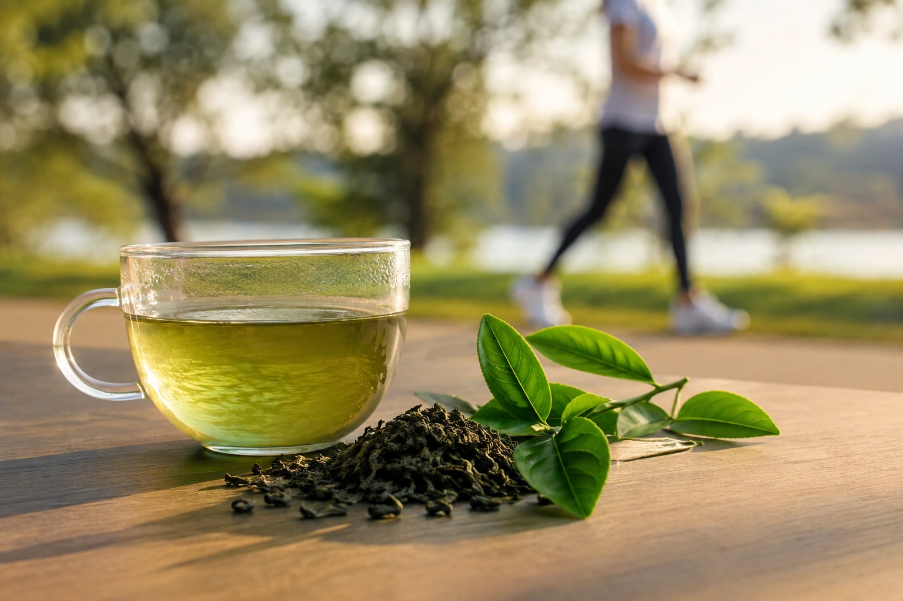
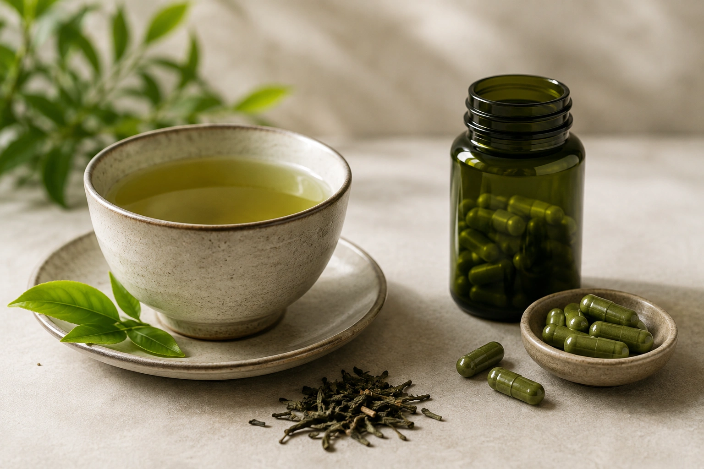

Poucas bebidas conquistaram uma reputação tão forte no universo do emagrecimento quanto o chá verde. Ele aparece em dietas, cápsulas, “termogênicos” e produtos vendidos com promessas de acelerar o metabolismo e aumentar a queima de gordura.

Existe alguma ciência por trás dessa fama.

O chá verde contém **catequinas**, especialmente a epigalocatequina galato, conhecida pela sigla **EGCG**, além de cafeína. Esses compostos realmente podem influenciar o gasto energético e o metabolismo das gorduras. ([NIH ODS](https://ods.od.nih.gov/factsheets/WeightLoss-HealthProfessional/ 'Dietary Supplements for Weight Loss — Health Professional Fact Sheet'))

O problema surge quando um pequeno efeito metabólico é transformado na promessa de perda de peso significativa.

**As melhores evidências disponíveis indicam que chá verde ou seus extratos podem produzir uma redução pequena no peso corporal, mas o efeito médio é modesto demais para transformar a bebida em uma estratégia de emagrecimento por si só.** ([Cambridge University Press](https://www.cambridge.org/core/journals/british-journal-of-nutrition/article/effects-of-green-tea-extract-supplementation-on-body-composition-obesityrelated-hormones-and-oxidative-stress-markers-a-gradeassessed-systematic-review-and-doseresponse-metaanalysis-of-randomised-controlled-trials/5F7DCFF04BE51796D39A6CC5B0A3089A 'The effects of green tea extract supplementation on body composition, obesity-related hormones and oxidative stress markers: a grade-assessed systematic review and dose–response meta-analysis of randomised controlled trials | British Journal of Nutrition | Cambridge Core'))

## Por que o chá verde ganhou fama de emagrecedor?

O chá verde é produzido a partir da planta _Camellia sinensis_, a mesma espécie utilizada para produzir outros tipos de chá.

Entre seus compostos mais estudados estão as catequinas, uma classe de flavonoides. A EGCG recebe atenção especial por ser uma das catequinas mais abundantes e investigadas.

Além disso, o chá verde normalmente contém cafeína. ([NIH ODS](https://ods.od.nih.gov/factsheets/WeightLoss-HealthProfessional/ 'Dietary Supplements for Weight Loss — Health Professional Fact Sheet'))

Foi justamente a combinação entre **catequinas e cafeína** que deu origem à hipótese de que o chá verde poderia:

- aumentar o gasto energético;
- favorecer a oxidação de gorduras;
- elevar discretamente a termogênese;
- auxiliar no controle do peso.

Há evidências de que alguns desses efeitos metabólicos realmente ocorrem. O ponto principal é entender sua magnitude.

## Chá verde realmente acelera o metabolismo?

Em certo sentido, sim — mas “acelerar o metabolismo” pode soar muito mais impressionante do que o efeito observado na prática.

O NIH Office of Dietary Supplements relata que estudos controlados encontraram aumento do gasto energético com cafeína isoladamente ou em associação às catequinas do chá verde. A combinação de catequinas e cafeína também pode aumentar a oxidação de gorduras. ([NIH ODS](https://ods.od.nih.gov/factsheets/WeightLoss-HealthProfessional/ 'Dietary Supplements for Weight Loss — Health Professional Fact Sheet'))

Curiosamente, a EGCG isolada não demonstrou de forma consistente aumentar metabolismo de repouso ou oxidação de gorduras, indicando que a interação com a cafeína pode ser relevante. ([NIH ODS](https://ods.od.nih.gov/factsheets/WeightLoss-HealthProfessional/ 'Dietary Supplements for Weight Loss — Health Professional Fact Sheet'))

Porém, existe uma diferença fundamental entre duas perguntas:

**“O chá verde altera o gasto energético por algumas horas?”**

e:

**“Essa alteração é grande o suficiente para causar emagrecimento relevante ao longo de meses?”**

É na segunda pergunta que o entusiasmo precisa diminuir.

## Quanto peso o chá verde realmente ajuda a perder?

Uma das revisões mais importantes sobre o assunto foi realizada pela Cochrane.

A análise avaliou ensaios clínicos com adultos com sobrepeso ou obesidade. Nos seis estudos realizados fora do Japão que puderam ser combinados de maneira adequada, a diferença média de peso entre preparações de chá verde e controle foi de apenas **0,04 kg** — sem significância estatística. ([Cochrane](https://www.cochrane.org/evidence/CD008650_green-tea-weight-loss-and-weight-maintenance-overweight-or-obese-adults 'Green tea for weight loss and weight maintenance in overweight or obese adults'))

Os autores concluíram que a perda de peso observada com preparações de chá verde era muito pequena e provavelmente sem relevância clínica. Também não foi demonstrado benefício claro para manutenção do peso após o emagrecimento. ([Cochrane](https://www.cochrane.org/evidence/CD008650_green-tea-weight-loss-and-weight-maintenance-overweight-or-obese-adults 'Green tea for weight loss and weight maintenance in overweight or obese adults'))

Mas pesquisas mais recentes acrescentaram novas informações.

## O que mostram as meta-análises mais recentes?

Uma ampla revisão sistemática e meta-análise publicada no _British Journal of Nutrition_ em 2024 avaliou suplementação com extrato de chá verde e diferentes formas de catequinas em adultos.

Em 38 estudos que avaliaram peso corporal, o efeito combinado foi uma redução média de aproximadamente:

**0,64 kg em comparação ao grupo controle.** ([Cambridge University Press](https://www.cambridge.org/core/journals/british-journal-of-nutrition/article/effects-of-green-tea-extract-supplementation-on-body-composition-obesityrelated-hormones-and-oxidative-stress-markers-a-gradeassessed-systematic-review-and-doseresponse-metaanalysis-of-randomised-controlled-trials/5F7DCFF04BE51796D39A6CC5B0A3089A 'The effects of green tea extract supplementation on body composition, obesity-related hormones and oxidative stress markers: a grade-assessed systematic review and dose–response meta-analysis of randomised controlled trials | British Journal of Nutrition | Cambridge Core'))

Para IMC, a diferença média foi de:

**−0,16 kg/m².** ([Cambridge University Press](https://www.cambridge.org/core/journals/british-journal-of-nutrition/article/effects-of-green-tea-extract-supplementation-on-body-composition-obesityrelated-hormones-and-oxidative-stress-markers-a-gradeassessed-systematic-review-and-doseresponse-metaanalysis-of-randomised-controlled-trials/5F7DCFF04BE51796D39A6CC5B0A3089A 'The effects of green tea extract supplementation on body composition, obesity-related hormones and oxidative stress markers: a grade-assessed systematic review and dose–response meta-analysis of randomised controlled trials | British Journal of Nutrition | Cambridge Core'))

A porcentagem de gordura corporal também apresentou pequena redução média, mas não houve redução estatisticamente significativa da **massa de gordura total** ou da **circunferência abdominal** no conjunto das análises. ([Cambridge University Press](https://www.cambridge.org/core/journals/british-journal-of-nutrition/article/effects-of-green-tea-extract-supplementation-on-body-composition-obesityrelated-hormones-and-oxidative-stress-markers-a-gradeassessed-systematic-review-and-doseresponse-metaanalysis-of-randomised-controlled-trials/5F7DCFF04BE51796D39A6CC5B0A3089A 'The effects of green tea extract supplementation on body composition, obesity-related hormones and oxidative stress markers: a grade-assessed systematic review and dose–response meta-analysis of randomised controlled trials | British Journal of Nutrition | Cambridge Core'))

Isso cria uma situação importante para interpretar corretamente estudos científicos:

**um resultado pode ser estatisticamente significativo e, ainda assim, ter pouca importância prática.**

Uma diferença média de 0,64 kg pode ser detectável matematicamente em uma grande meta-análise, mas está muito distante da ideia de que chá verde provoque emagrecimento substancial.

## Quão confiável é essa evidência?

A própria meta-análise de 2024 avaliou a certeza das evidências utilizando o sistema GRADE.

A certeza foi considerada **moderada para peso corporal**.

Para IMC e massa de gordura, a qualidade foi classificada como baixa. Para circunferência abdominal e porcentagem de gordura corporal, entre outros desfechos, foi considerada muito baixa. Os autores também identificaram heterogeneidade elevada e risco de viés em diversos estudos. ([Cambridge University Press](https://www.cambridge.org/core/journals/british-journal-of-nutrition/article/effects-of-green-tea-extract-supplementation-on-body-composition-obesityrelated-hormones-and-oxidative-stress-markers-a-gradeassessed-systematic-review-and-doseresponse-metaanalysis-of-randomised-controlled-trials/5F7DCFF04BE51796D39A6CC5B0A3089A 'The effects of green tea extract supplementation on body composition, obesity-related hormones and oxidative stress markers: a grade-assessed systematic review and dose–response meta-analysis of randomised controlled trials | British Journal of Nutrition | Cambridge Core'))

Portanto, a conclusão mais adequada não é “chá verde não faz absolutamente nada”.

Também não é “chá verde emagrece”.

A melhor síntese é:

**se existir um efeito sobre o peso, ele provavelmente é pequeno.**

## Chá verde “queima gordura”?

Essa expressão merece cuidado.

Estudos metabólicos mostram que catequinas associadas à cafeína podem aumentar a **oxidação de gorduras**, ou seja, a utilização de ácidos graxos como fonte de energia em determinadas condições. ([NIH ODS](https://ods.od.nih.gov/factsheets/WeightLoss-HealthProfessional/ 'Dietary Supplements for Weight Loss — Health Professional Fact Sheet'))

Mas aumentar temporariamente a proporção de gordura utilizada como combustível não é sinônimo de perder gordura corporal.

O corpo humano ajusta constantemente o uso de carboidratos e gorduras ao longo do dia. Para ocorrer redução sustentada das reservas corporais, o balanço energético ao longo do tempo continua sendo determinante.

É justamente por isso que mecanismos bioquímicos promissores nem sempre resultam em grandes diferenças na balança.

## Chá verde com exercício funciona melhor?

Essa hipótese também já foi testada.

Uma meta-análise publicada em 2024 reuniu dez ensaios randomizados que compararam **exercício + chá verde** com **exercício sem chá verde** em pessoas com sobrepeso ou obesidade.

Adicionar chá verde produziu pequenos efeitos sobre:

- peso corporal;
- IMC;
- gordura corporal.

Porém, os próprios autores concluíram que o benefício adicional sobre a perda de peso produzida pelo exercício foi **bastante limitado**. ([PubMed](https://pubmed.ncbi.nlm.nih.gov/39350601/ 'Does green tea catechin enhance weight-loss effect of exercise training in overweight and obese individuals? a systematic review and meta-analysis of randomized trials'))

Isso coloca as prioridades em perspectiva.

Se uma pessoa estiver escolhendo entre:

- manter uma rotina regular de atividade física;
- melhorar a alimentação;
- dormir adequadamente;
- ou simplesmente acrescentar chá verde;

as intervenções relacionadas ao estilo de vida possuem importância muito maior para o controle do peso. O NIH considera alimentação adequada, redução de ingestão energética quando necessária e atividade física como fundamentos das estratégias de emagrecimento. ([NIH ODS](https://ods.od.nih.gov/factsheets/WeightLoss-HealthProfessional/ 'Dietary Supplements for Weight Loss — Health Professional Fact Sheet'))

## Então vale a pena tomar chá verde para emagrecer?

Se a pessoa gosta de chá verde, ele pode fazer parte tranquilamente de uma alimentação equilibrada.

O problema está na expectativa.

Tomar chá verde esperando perder vários quilos sem outras mudanças provavelmente levará à frustração, porque esse efeito não aparece nos ensaios clínicos. ([Cochrane](https://www.cochrane.org/evidence/CD008650_green-tea-weight-loss-and-weight-maintenance-overweight-or-obese-adults 'Green tea for weight loss and weight maintenance in overweight or obese adults'))

Por outro lado, existe uma maneira indireta pela qual a bebida pode ser útil.

Se uma pessoa costuma beber refrigerante, chá adoçado ou outras bebidas calóricas e passa a substituí-las por chá verde **sem açúcar**, a redução de calorias da troca pode contribuir para o controle energético.

Nesse caso, porém, grande parte da vantagem vem da **substituição da bebida calórica**, não de uma capacidade excepcional do chá verde de “derreter gordura”. Essa interpretação é coerente com as recomendações de controle de peso baseadas em padrão alimentar e ingestão energética. ([NIH ODS](https://ods.od.nih.gov/factsheets/WeightLoss-HealthProfessional/ 'Dietary Supplements for Weight Loss — Health Professional Fact Sheet'))

## Bebida e extrato de chá verde são a mesma coisa?

Não.

Essa talvez seja uma das distinções mais importantes do artigo.

Uma xícara preparada com folhas ou sachê fornece água, catequinas e alguma cafeína em concentrações que variam conforme:

- quantidade de folhas;
- tempo de infusão;
- temperatura da água;
- tipo de chá;
- volume da bebida.

Já um extrato pode concentrar catequinas em quantidades muito maiores.

Grande parte dos ensaios sobre emagrecimento utilizou justamente **preparações ou extratos de chá verde**, e não simplesmente uma ou duas xícaras da bebida tradicional. ([Cochrane](https://www.cochrane.org/evidence/CD008650_green-tea-weight-loss-and-weight-maintenance-overweight-or-obese-adults 'Green tea for weight loss and weight maintenance in overweight or obese adults'))

Isso cria dois problemas.

Primeiro, não é possível converter automaticamente a dose de um suplemento estudado para um determinado número de xícaras.

Segundo, a segurança também muda.

## Extrato de chá verde merece mais cautela

O NCCIH informa que não existem preocupações importantes de segurança relatadas para adultos que consomem chá verde como bebida, embora seja necessário considerar seu conteúdo de cafeína. ([NCCIH](https://www.nccih.nih.gov/health/green-tea 'Green Tea: Usefulness and Safety'))

A situação é diferente com suplementos concentrados.

Efeitos adversos relatados com extratos incluem:

- náusea;
- desconforto abdominal;
- constipação;
- aumento da pressão arterial em algumas situações.

Além disso, casos raros de **lesão hepática** foram associados principalmente a produtos contendo extrato de chá verde em cápsulas ou comprimidos. ([NCCIH](https://www.nccih.nih.gov/health/green-tea 'Green Tea: Usefulness and Safety'))

A EFSA analisou especificamente essa questão.

A instituição concluiu que catequinas provenientes das infusões tradicionais de chá verde são geralmente consideradas seguras. Em suplementos, porém, ingestões de **800 mg de EGCG por dia ou mais** foram associadas a sinais iniciais de dano hepático em estudos clínicos. ([EFSA](https://www.efsa.europa.eu/en/press/news/180418 'EFSA assesses safety of green tea catechins - European Union'))

A EFSA também ressaltou que não foi possível determinar, com os dados existentes, uma dose de EGCG suplementar abaixo da qual pudesse ser garantida ausência de risco em todas as pessoas. ([EFSA](https://www.efsa.europa.eu/en/press/news/180418 'EFSA assesses safety of green tea catechins - European Union'))

## Existe uma dose ideal de chá verde para emagrecer?

Não existe uma dose de chá verde convencional estabelecida como capaz de produzir perda de peso clinicamente importante.

Os estudos utilizaram quantidades muito diferentes de catequinas, EGCG e cafeína, frequentemente por meio de suplementos ou bebidas especialmente enriquecidas. Essa heterogeneidade é justamente uma das dificuldades para interpretar o conjunto da literatura. ([NIH ODS](https://ods.od.nih.gov/factsheets/WeightLoss-HealthProfessional/ 'Dietary Supplements for Weight Loss — Health Professional Fact Sheet'))

Por isso, recomendações como “tome três xícaras”, “cinco xícaras” ou “chá verde três vezes ao dia para acelerar o metabolismo” não podem ser tratadas como uma prescrição científica de emagrecimento.

Beber mais também não garante um efeito proporcionalmente maior.

## É melhor tomar em jejum?

Não há evidência convincente de que consumir chá verde em jejum produza perda de peso significativamente maior.

Além disso, estratégias de suplementação concentrada em jejum merecem cautela. A avaliação da EFSA observou que suplementos de catequinas apresentam exposições diferentes das infusões tradicionais, que normalmente são consumidas ao longo do dia e frequentemente junto de alimentos. ([EFSA](https://www.efsa.europa.eu/en/press/news/180418 'EFSA assesses safety of green tea catechins - European Union'))

Portanto, perseguir horários específicos ou doses muito concentradas não transforma um efeito pequeno em um grande resultado.

## E a cafeína?

O chá verde contém cafeína, embora a quantidade varie conforme o produto e o preparo. ([NCCIH](https://www.nccih.nih.gov/health/green-tea 'Green Tea: Usefulness and Safety'))

Pessoas sensíveis podem apresentar sintomas como:

- dificuldade para dormir;
- agitação;
- palpitações;
- ansiedade;
- desconforto gastrointestinal.

Por isso, tomar grandes quantidades no final do dia pode não ser uma boa escolha para quem percebe impacto sobre o sono.

Esse ponto é particularmente relevante no emagrecimento: comprometer o sono para tentar obter um pequeno aumento da termogênese dificilmente representa uma troca vantajosa.

## Chá verde pode interagir com medicamentos?

Sim, principalmente em doses altas ou na forma de extratos.

O NCCIH relata que o chá verde em doses elevadas pode reduzir a concentração sanguínea e a eficácia do **nadolol**, medicamento utilizado em condições cardiovasculares. Extratos também podem alterar níveis de medicamentos como atorvastatina, e existem evidências de interação com raloxifeno. ([NCCIH](https://www.nccih.nih.gov/health/green-tea 'Green Tea: Usefulness and Safety'))

Por isso, quem utiliza medicamentos regularmente deve conversar com médico ou farmacêutico antes de iniciar suplementos concentrados de chá verde.

O mesmo cuidado é especialmente apropriado em pessoas com:

- doença hepática;
- hipertensão;
- doenças cardíacas;
- uso de múltiplos medicamentos;
- gestação ou amamentação;
- elevada sensibilidade à cafeína. ([NCCIH](https://www.nccih.nih.gov/health/green-tea 'Green Tea: Usefulness and Safety'))

## O chá verde precisa ser evitado durante o emagrecimento?

Não.

Essa seria a conclusão oposta e igualmente equivocada.

O chá verde pode ser uma bebida agradável, pouco calórica quando consumida sem açúcar e compatível com uma alimentação equilibrada.

Ele apenas não deve ocupar um lugar que pertence a estratégias com impacto muito maior.

Para emagrecimento sustentável, as prioridades continuam envolvendo:

- adequação da ingestão energética;
- alimentos minimamente processados e nutricionalmente adequados;
- quantidade suficiente de proteínas e fibras;
- atividade física;
- sono;
- adesão a longo prazo;
- acompanhamento profissional quando necessário.

O NIH destaca mudanças alimentares e atividade física como base das abordagens para perda de peso duradoura e considera as evidências para suplementos de emagrecimento, em geral, pouco convincentes. ([NIH ODS](https://ods.od.nih.gov/factsheets/WeightLoss-HealthProfessional/ 'Dietary Supplements for Weight Loss — Health Professional Fact Sheet'))

## Como interpretar produtos que prometem “chá verde termogênico”?

É importante olhar além da frente da embalagem.

Produtos desse tipo podem conter não apenas chá verde, mas também:

- cafeína adicionada;
- guaraná;
- outros estimulantes;
- diferentes extratos vegetais;
- misturas proprietárias.

Isso significa que efeitos e riscos não podem ser atribuídos automaticamente ao chá verde.

O NIH alerta que suplementos para emagrecimento frequentemente combinam múltiplos ingredientes, nem sempre testados juntos de maneira adequada, e que a concentração dos compostos ativos pode variar entre produtos. ([NIH ODS](https://ods.od.nih.gov/factsheets/WeightLoss-HealthProfessional/ 'Dietary Supplements for Weight Loss — Health Professional Fact Sheet'))

A palavra “natural” também não garante eficácia nem ausência de efeitos adversos.

## A resposta curta: chá verde emagrece?

**Muito pouco, se emagrecer.**

Essa talvez seja a forma mais fiel de traduzir a literatura científica.

Há mecanismos plausíveis: cafeína e catequinas podem elevar discretamente o gasto energético e a oxidação de gorduras. ([NIH ODS](https://ods.od.nih.gov/factsheets/WeightLoss-HealthProfessional/ 'Dietary Supplements for Weight Loss — Health Professional Fact Sheet'))

Algumas meta-análises mais recentes também identificam reduções estatisticamente significativas de peso.

Mas o tamanho do efeito é pequeno. Na análise de 2024, a diferença média foi de cerca de **0,64 kg**. ([Cambridge University Press](https://www.cambridge.org/core/journals/british-journal-of-nutrition/article/effects-of-green-tea-extract-supplementation-on-body-composition-obesityrelated-hormones-and-oxidative-stress-markers-a-gradeassessed-systematic-review-and-doseresponse-metaanalysis-of-randomised-controlled-trials/5F7DCFF04BE51796D39A6CC5B0A3089A 'The effects of green tea extract supplementation on body composition, obesity-related hormones and oxidative stress markers: a grade-assessed systematic review and dose–response meta-analysis of randomised controlled trials | British Journal of Nutrition | Cambridge Core'))

Revisões anteriores, incluindo a Cochrane, encontraram benefícios ainda menores e sem provável importância clínica. ([Cochrane](https://www.cochrane.org/evidence/CD008650_green-tea-weight-loss-and-weight-maintenance-overweight-or-obese-adults 'Green tea for weight loss and weight maintenance in overweight or obese adults'))

Essas conclusões não são necessariamente contraditórias.

Elas apontam para a mesma mensagem prática: **mesmo quando um efeito é detectado, ele é modesto.**

## Conclusão

O chá verde possui compostos biologicamente ativos interessantes e pode aumentar discretamente gasto energético e oxidação de gorduras. Isso torna plausível a hipótese de algum auxílio ao controle do peso. ([NIH ODS](https://ods.od.nih.gov/factsheets/WeightLoss-HealthProfessional/ 'Dietary Supplements for Weight Loss — Health Professional Fact Sheet'))

Quando chegamos aos resultados que realmente interessam, porém, o efeito diminui de tamanho.

Uma meta-análise de 2024 encontrou redução média de aproximadamente **0,64 kg**, enquanto a revisão Cochrane concluiu que a perda proporcionada por preparações de chá verde é muito pequena e provavelmente sem importância clínica. ([Cambridge University Press](https://www.cambridge.org/core/journals/british-journal-of-nutrition/article/effects-of-green-tea-extract-supplementation-on-body-composition-obesityrelated-hormones-and-oxidative-stress-markers-a-gradeassessed-systematic-review-and-doseresponse-metaanalysis-of-randomised-controlled-trials/5F7DCFF04BE51796D39A6CC5B0A3089A 'The effects of green tea extract supplementation on body composition, obesity-related hormones and oxidative stress markers: a grade-assessed systematic review and dose–response meta-analysis of randomised controlled trials | British Journal of Nutrition | Cambridge Core'))

Portanto, **chá verde não deve ser tratado como solução para emagrecimento**.

Se você gosta da bebida, pode consumi-la dentro de uma alimentação equilibrada — especialmente sem grandes quantidades de açúcar. Mas o principal benefício prático pode estar simplesmente em ocupar o lugar de bebidas mais calóricas.

E existe uma distinção essencial: **chá verde preparado como bebida não é equivalente a extrato concentrado**. Suplementos com altas doses de catequinas, especialmente EGCG, exigem mais cautela devido ao risco de efeitos adversos e à possibilidade de lesão hepática. ([EFSA](https://www.efsa.europa.eu/en/press/news/180418 'EFSA assesses safety of green tea catechins - European Union'))

No emagrecimento, o chá verde pode ser um detalhe. Alimentação, atividade física, sono, comportamento e adesão continuam sendo a parte principal da estratégia. ([NIH ODS](https://ods.od.nih.gov/factsheets/WeightLoss-HealthProfessional/ 'Dietary Supplements for Weight Loss — Health Professional Fact Sheet'))
