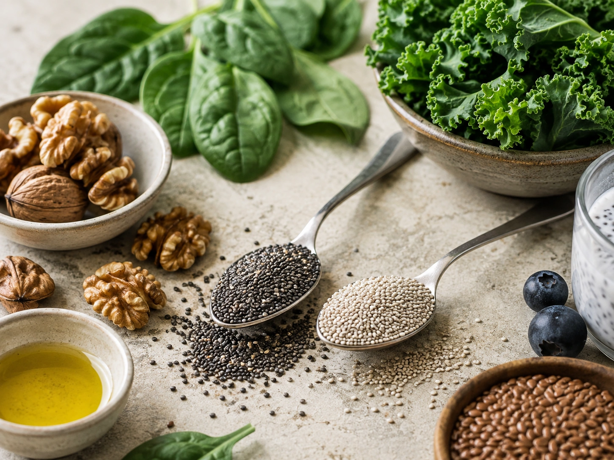
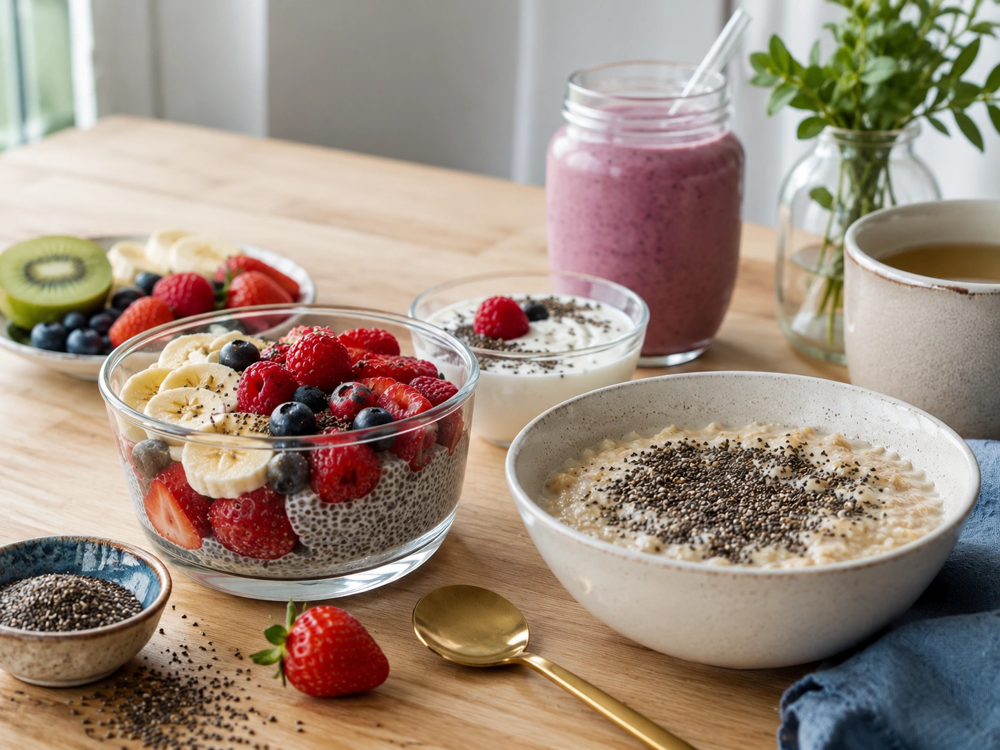
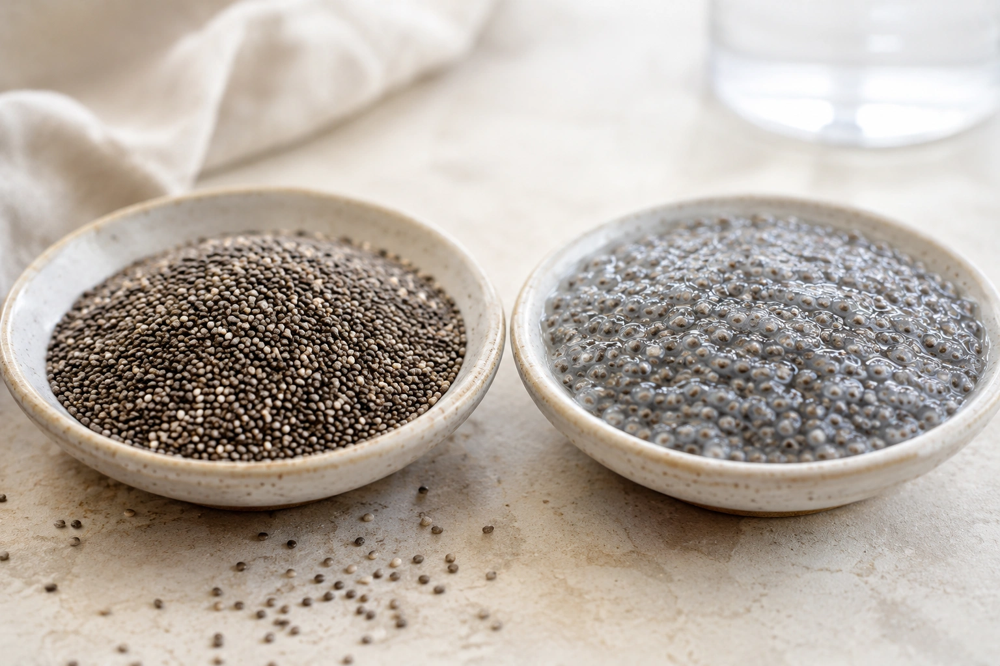

Pequena no tamanho, a chia concentra uma quantidade relevante de fibras, gorduras insaturadas, proteína e minerais. Uma porção de aproximadamente duas colheres de sopa — 28 g — fornece cerca de 140 kcal, 4 g de proteína e 11 g de fibras, além de ser uma fonte particularmente rica de ácido alfa-linolênico, o ALA, um tipo de ômega-3 vegetal. ([Harvard T.H. Chan](https://nutritionsource.hsph.harvard.edu/food-features/chia-seeds/ 'Chia Seeds'))

Isso faz da chia um alimento interessante para complementar uma alimentação equilibrada. Mas é importante separar seus **benefícios nutricionais bem estabelecidos** das promessas de que a semente emagrece, controla o diabetes ou reduz o colesterol sozinha. Os estudos clínicos disponíveis ainda não sustentam todas essas alegações de forma consistente. ([Springer](https://link.springer.com/article/10.1186/s12986-024-00847-3 'Effects of chia seed (Salvia hispanica L.) supplementation on cardiometabolic health in overweight subjects: a systematic review and meta-analysis of RCTs | Nutrition & Metabolism | Springer Nature Link'))

## O que é a chia?

A chia é a semente da planta _Salvia hispanica L._. Apesar da popularidade recente em receitas de pudins, vitaminas e bowls, seu uso como alimento tem raízes históricas na América Central. ([Harvard T.H. Chan](https://nutritionsource.hsph.harvard.edu/food-features/chia-seeds/ 'Chia Seeds'))

Nutricionalmente, destaca-se principalmente pela combinação de **fibras, gorduras poli-insaturadas, ALA, proteína e minerais**. A chia também contém os nove aminoácidos essenciais, embora uma porção comum forneça apenas cerca de 4 g de proteína; por isso, não costuma funcionar como principal fonte proteica de uma refeição. ([Harvard T.H. Chan](https://nutritionsource.hsph.harvard.edu/food-features/chia-seeds/ 'Chia Seeds'))

## Quais são os nutrientes da chia?

Uma referência bastante utilizada é a porção de **28 g, aproximadamente duas colheres de sopa**. Segundo a Harvard T.H. Chan School of Public Health e o NIH, essa quantidade apresenta aproximadamente: ([Harvard T.H. Chan](https://nutritionsource.hsph.harvard.edu/food-features/chia-seeds/ 'Chia Seeds'))

| Nutriente             | Quantidade aproximada em 28 g |
| --------------------- | ----------------------------: |
| Energia               |                      140 kcal |
| Proteína              |                           4 g |
| Fibras                |                          11 g |
| Gorduras insaturadas  |                           7 g |
| ALA — ômega-3 vegetal |                        5,06 g |

A chia também fornece cálcio, fósforo, zinco e cobre. A composição exata pode variar de acordo com cultivar, origem e análise do alimento. ([Harvard T.H. Chan](https://nutritionsource.hsph.harvard.edu/food-features/chia-seeds/ 'Chia Seeds'))

### Chia é uma boa fonte de fibras

Os 11 g de fibras encontrados em aproximadamente 28 g de chia fazem com que uma pequena porção contribua de maneira relevante para o consumo diário de fibras. A semente contém principalmente fibra insolúvel e também mucilagem, responsável pela textura gelatinosa observada quando entra em contato com líquidos. ([Harvard T.H. Chan](https://nutritionsource.hsph.harvard.edu/food-features/chia-seeds/ 'Chia Seeds'))

Fibras insolúveis ajudam o conteúdo intestinal a se deslocar pelo sistema digestivo e estão associadas à regularidade intestinal. Ao aumentar a ingestão de fibras, também é importante manter uma ingestão adequada de líquidos. ([Harvard T.H. Chan](https://nutritionsource.hsph.harvard.edu/carbohydrates/fiber/ 'Fiber'))

### Chia contém bastante ômega-3 vegetal

Uma porção de aproximadamente 28 g fornece cerca de **5,06 g de ALA**, segundo dados apresentados pelo NIH. Para comparação, a ingestão adequada de ALA estabelecida nas referências norte-americanas é de 1,6 g por dia para homens adultos e 1,1 g para mulheres adultas, com valores específicos para gravidez e lactação. ([NIH ODS](https://ods.od.nih.gov/factsheets/Omega3FattyAcids-HealthProfessional/ 'Omega-3 Fatty Acids — Fact Sheet for Health Professionals'))

Isso não significa, porém, que 28 g de chia sejam necessários todos os dias nem que o ômega-3 da chia tenha o mesmo comportamento do encontrado nos peixes.

O ALA precisa ser convertido pelo organismo em EPA e depois em DHA. Essa conversão é limitada, com taxas reportadas abaixo de 15%. Dessa forma, chia, linhaça e nozes são boas fontes de **ALA**, enquanto peixes e algas ocupam outro papel na oferta de EPA e DHA. ([NIH ODS](https://ods.od.nih.gov/factsheets/Omega3FattyAcids-HealthProfessional/ 'Omega-3 Fatty Acids — Fact Sheet for Health Professionals'))

## Quais são os benefícios da chia?

### 1. Ajuda a aumentar o consumo de fibras

Este é um dos benefícios mais diretos e mais fáceis de justificar nutricionalmente. Acrescentar chia a uma refeição pode elevar consideravelmente seu teor de fibras sem exigir um grande volume de alimento. ([Harvard T.H. Chan](https://nutritionsource.hsph.harvard.edu/food-features/chia-seeds/ 'Chia Seeds'))

Uma alimentação rica em fibras contribui para a regularidade intestinal. Para que esse efeito seja bem tolerado, especialmente por quem antes consumia pouca fibra, a introdução gradual e a ingestão adequada de líquidos são importantes. ([Harvard T.H. Chan](https://nutritionsource.hsph.harvard.edu/carbohydrates/fiber/ 'Fiber'))

### 2. Pode aumentar a sensação de saciedade

Ao entrar em contato com líquidos, a mucilagem presente na chia forma uma estrutura semelhante a um gel. Suas fibras podem retardar a digestão e contribuir para uma sensação de saciedade após a refeição. ([Harvard T.H. Chan](https://nutritionsource.hsph.harvard.edu/food-features/chia-seeds/ 'Chia Seeds'))

Isso pode ser útil dentro de uma estratégia alimentar, mas **mais saciedade não significa automaticamente perda de peso**.

Uma meta-análise de dez ensaios clínicos randomizados em pessoas com sobrepeso não encontrou redução significativa no IMC. Outra revisão com oito estudos também não observou efeitos significativos sobre peso, IMC, percentual de gordura ou circunferência da cintura em sua análise global. ([Springer](https://link.springer.com/article/10.1186/s12986-024-00847-3 'Effects of chia seed (Salvia hispanica L.) supplementation on cardiometabolic health in overweight subjects: a systematic review and meta-analysis of RCTs | Nutrition & Metabolism | Springer Nature Link'))

### 3. É uma fonte vegetal importante de ALA

A presença de aproximadamente 5 g de ALA em uma porção de 28 g faz da chia uma das fontes alimentares concentradas desse ácido graxo essencial. ([NIH ODS](https://ods.od.nih.gov/factsheets/Omega3FattyAcids-HealthProfessional/ 'Omega-3 Fatty Acids — Fact Sheet for Health Professionals'))

O ALA participa da alimentação como um ácido graxo que o organismo não consegue produzir por conta própria. Entretanto, a maior parte das pesquisas clínicas sobre benefícios cardiovasculares dos ômega-3 concentra-se em EPA e DHA, e não em ALA. ([NIH ODS](https://ods.od.nih.gov/factsheets/Omega3FattyAcids-HealthProfessional/ 'Omega-3 Fatty Acids — Fact Sheet for Health Professionals'))

### 4. Pode ter efeitos modestos sobre alguns marcadores cardiovasculares

As evidências sobre chia e saúde cardiovascular ainda não são uniformes.

Uma meta-análise publicada em 2024, reunindo dez ensaios randomizados com 424 participantes com sobrepeso, encontrou redução média de aproximadamente 3,3 mmHg na pressão arterial sistólica, mas não uma redução estatisticamente significativa na pressão diastólica. A mesma análise não encontrou mudanças significativas em LDL, HDL, colesterol total ou triglicerídeos. ([Springer](https://link.springer.com/article/10.1186/s12986-024-00847-3 'Effects of chia seed (Salvia hispanica L.) supplementation on cardiometabolic health in overweight subjects: a systematic review and meta-analysis of RCTs | Nutrition & Metabolism | Springer Nature Link'))

Já outra meta-análise, publicada na edição de março de 2025 da _Nutrition Reviews_, encontrou reduções maiores tanto na pressão sistólica quanto na diastólica. Os próprios autores, porém, destacaram que o número de estudos era limitado e que os resultados deveriam ser interpretados com cautela. ([Nutrition Reviews](https://academic.oup.com/nutritionreviews/article-abstract/83/3/448/7748310))

Portanto, a interpretação mais equilibrada é que **há um sinal potencial de benefício para a pressão arterial, mas ainda não existe base para tratar a chia como tratamento anti-hipertensivo**.

### 5. Pode complementar uma alimentação cardioprotetora

A chia reúne componentes interessantes — fibras e gorduras insaturadas, por exemplo — mas seus efeitos devem ser vistos dentro do padrão alimentar completo.

A própria Harvard ressalta que as pesquisas são mais favoráveis a padrões alimentares que incluem diferentes alimentos vegetais e fontes de ômega-3 do que à ideia de que a chia, isoladamente, previna doenças. ([Harvard T.H. Chan](https://nutritionsource.hsph.harvard.edu/food-features/chia-seeds/ 'Chia Seeds'))

## Chia controla a glicose?

As fibras da chia podem retardar a digestão, o que explica o interesse científico em possíveis efeitos sobre a glicemia após refeições. Entretanto, resultados de curto prazo não devem ser confundidos com tratamento ou controle de diabetes. ([Harvard T.H. Chan](https://nutritionsource.hsph.harvard.edu/food-features/chia-seeds/ 'Chia Seeds'))

Na meta-análise de 2024 em pessoas com sobrepeso, não foram encontradas alterações significativas na glicemia de jejum, hemoglobina glicada ou insulina. A revisão publicada na _Nutrition Reviews_ chegou a uma conclusão semelhante para os parâmetros glicêmicos avaliados. ([Springer](https://link.springer.com/article/10.1186/s12986-024-00847-3 'Effects of chia seed (Salvia hispanica L.) supplementation on cardiometabolic health in overweight subjects: a systematic review and meta-analysis of RCTs | Nutrition & Metabolism | Springer Nature Link'))

Quem tem diabetes não deve substituir medicamentos, acompanhamento profissional ou mudanças alimentares recomendadas por um consumo maior de chia.

## Chia reduz o colesterol?

Não é possível afirmar que consumir chia vá reduzir o colesterol de todas as pessoas.

Embora suas fibras e gorduras insaturadas façam parte de um perfil nutricional interessante, a meta-análise de 2024 não encontrou alterações significativas em LDL, HDL, colesterol total ou triglicerídeos entre os participantes estudados. ([Springer](https://link.springer.com/article/10.1186/s12986-024-00847-3 'Effects of chia seed (Salvia hispanica L.) supplementation on cardiometabolic health in overweight subjects: a systematic review and meta-analysis of RCTs | Nutrition & Metabolism | Springer Nature Link'))

A chia pode integrar um padrão alimentar adequado para a saúde cardiovascular, mas não deve ser apresentada como um alimento que “limpa as artérias” ou substitui tratamento para dislipidemia.

## Afinal, quanto de chia consumir por dia?

**Não existe uma recomendação oficial específica determinando que adultos devam consumir determinada quantidade de chia todos os dias.** As autoridades estabelecem recomendações para nutrientes, como o ALA, e não uma dose obrigatória dessa semente. Essa conclusão é uma síntese das referências oficiais consultadas. ([NIH ODS](https://ods.od.nih.gov/factsheets/Omega3FattyAcids-HealthProfessional/ 'Omega-3 Fatty Acids — Fact Sheet for Health Professionals'))

Como referência culinária prática, **1 a 2 colheres de sopa por dia — aproximadamente 14 a 28 g — pode ser uma quantidade conveniente para muitos adultos saudáveis**.

O limite superior desse intervalo corresponde à porção de duas colheres de sopa usada pela Harvard para apresentar a composição nutricional da chia. Trata-se de uma referência prática, **não de uma prescrição ou meta obrigatória**. ([Harvard T.H. Chan](https://nutritionsource.hsph.harvard.edu/food-features/chia-seeds/ 'Chia Seeds'))

Quem não está acostumado a consumir muitos alimentos ricos em fibras pode começar com uma quantidade menor e aumentar progressivamente, avaliando a tolerância digestiva.

## Como consumir chia?

Uma das vantagens da chia é sua versatilidade. Ela possui sabor discreto e pode ser incorporada a alimentos úmidos sem alterar muito o sabor da preparação. ([Harvard T.H. Chan](https://nutritionsource.hsph.harvard.edu/food-features/chia-seeds/ 'Chia Seeds'))

Algumas possibilidades incluem:

- misturar ao iogurte;
- adicionar a aveia ou mingau;
- preparar pudim de chia;
- acrescentar a vitaminas e smoothies;
- usar em saladas;
- incorporar em massas de pães e bolos;
- preparar um gel de chia com água ou leite;
- utilizá-la como espessante em algumas receitas.

## Precisa deixar a chia de molho?

Não obrigatoriamente.

A chia inteira pode ser digerida quando é consumida junto de líquidos ou alimentos úmidos. Sua superfície se rompe facilmente quando exposta à umidade, diferentemente do que acontece com a linhaça inteira. ([Harvard T.H. Chan](https://nutritionsource.hsph.harvard.edu/food-features/chia-seeds/ 'Chia Seeds'))

Hidratá-la antes pode ser útil pela textura e pela facilidade de incorporação em receitas, mas não é necessário transformar toda chia em “gel” antes de comer.

## Existe algum cuidado ao consumir chia?

Existe um cuidado simples, mas importante: **evite engolir grandes quantidades de chia completamente seca e tomar líquido apenas depois**.

A Harvard cita um raro relato de obstrução do esôfago após a ingestão de chia seca seguida de água. Como as sementes absorvem líquido rapidamente e aumentam de volume, a instituição orienta consumi-las previamente hidratadas ou misturadas a alimentos úmidos. Pessoas com disfagia — dificuldade de deglutição — precisam de atenção especial. ([Harvard T.H. Chan](https://nutritionsource.hsph.harvard.edu/food-features/chia-seeds/ 'Chia Seeds'))

O aumento repentino de fibras também pode causar desconforto gastrointestinal em algumas pessoas. Introduzir alimentos ricos em fibras gradualmente e consumir líquidos suficientes tende a melhorar a tolerância. ([NIDDK](https://www.niddk.nih.gov/health-information/digestive-diseases/constipation/eating-diet-nutrition 'Eating, Diet, & Nutrition for Constipation'))

Pessoas com condições digestivas, dificuldade para engolir ou necessidades nutricionais específicas devem discutir mudanças relevantes na alimentação com um profissional qualificado.

## Chia preta e chia branca são diferentes?

Do ponto de vista nutricional, não há uma diferença relevante estabelecida entre as variedades preta e branca. A Harvard informa que ambas apresentam composição nutricional semelhante. ([Harvard T.H. Chan](https://nutritionsource.hsph.harvard.edu/food-features/chia-seeds/ 'Chia Seeds'))

Por isso, a escolha pode ser feita principalmente por disponibilidade, preço e preferência culinária.

## Conclusão

A chia merece espaço em uma alimentação saudável principalmente por algo menos espetacular — e mais bem sustentado — do que muitas promessas encontradas na internet: **ela é um alimento nutricionalmente denso, rico em fibras e uma fonte concentrada de ALA, o ômega-3 vegetal**. ([Harvard T.H. Chan](https://nutritionsource.hsph.harvard.edu/food-features/chia-seeds/ 'Chia Seeds'))

Uma quantidade de aproximadamente **1 a 2 colheres de sopa, ou 14 a 28 g**, pode ser uma referência prática para incorporá-la às refeições, sem que isso seja tratado como uma dose oficial.

Os estudos sugerem possíveis efeitos favoráveis sobre alguns marcadores, como pressão arterial, mas ainda não justificam apresentar a chia como solução isolada para emagrecimento, diabetes, colesterol alto ou doenças cardiovasculares. O benefício mais consistente vem de utilizá-la como parte de uma alimentação variada e equilibrada. ([Springer](https://link.springer.com/article/10.1186/s12986-024-00847-3 'Effects of chia seed (Salvia hispanica L.) supplementation on cardiometabolic health in overweight subjects: a systematic review and meta-analysis of RCTs | Nutrition & Metabolism | Springer Nature Link'))
