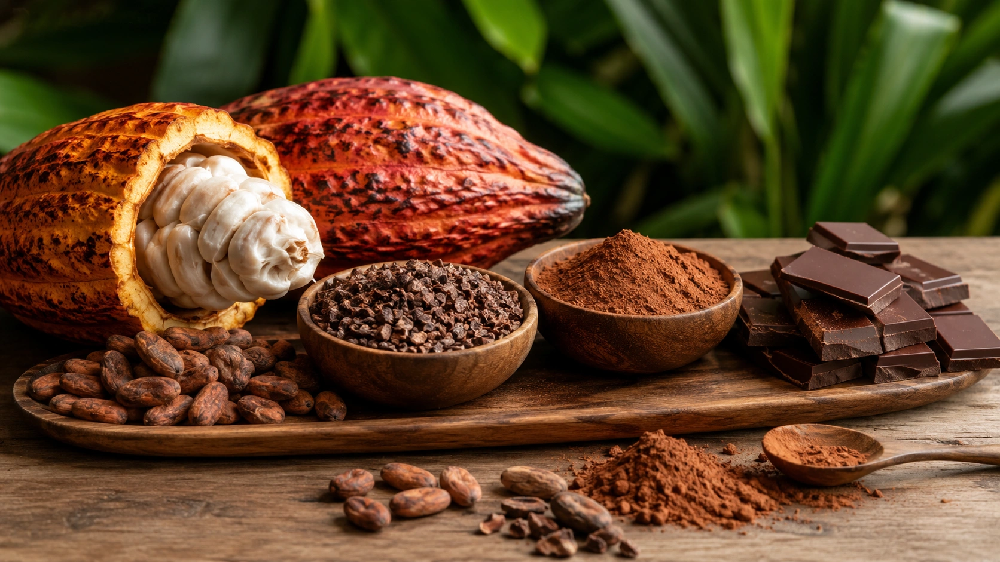
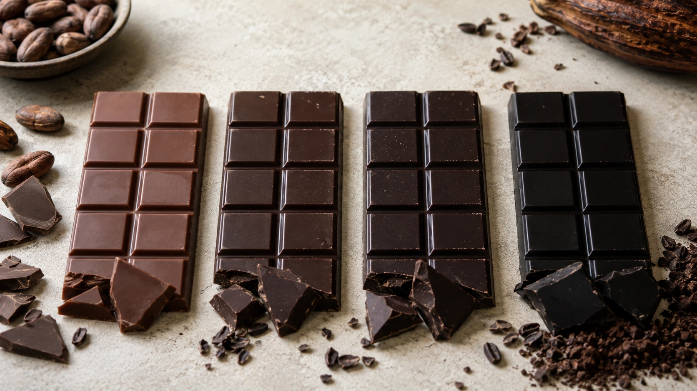

Chocolate amargo pode fazer parte de uma alimentação saudável, e existem boas razões científicas para o interesse pelo cacau. Ele fornece compostos vegetais chamados **flavanóis**, estudados principalmente por possíveis efeitos sobre vasos sanguíneos, pressão arterial e outros marcadores cardiometabólicos. ([PubMed](https://pubmed.ncbi.nlm.nih.gov/38931273/ 'Effects of Cocoa Consumption on Cardiometabolic Risk Markers: Meta-Analysis of Randomized Controlled Trials'))

Mas há uma diferença fundamental entre dizer que **flavanóis do cacau possuem efeitos biológicos interessantes** e afirmar que **comer chocolate previne doenças**.

Essa segunda conclusão vai além do que as evidências permitem. Barras de chocolate possuem concentrações variáveis de cacau e flavanóis e também fornecem energia, gordura saturada e, em muitos produtos, açúcar adicionado. ([Harvard T.H. Chan](https://nutritionsource.hsph.harvard.edu/food-features/dark-chocolate/ 'Dark Chocolate'))

Por isso, a melhor forma de encarar o chocolate amargo é como um alimento prazeroso que pode oferecer alguns componentes interessantes — e não como um remédio disfarçado de sobremesa.

## O que existe no chocolate amargo?

Chocolate amargo é produzido com derivados do cacau, incluindo sólidos de cacau e manteiga de cacau, normalmente combinados com açúcar em proporções que variam entre produtos.

Harvard descreve chocolates amargos comerciais com aproximadamente 50% a 90% de sólidos de cacau. Quanto maior essa participação, mais intenso e menos doce tende a ser o sabor. ([Harvard T.H. Chan](https://nutritionsource.hsph.harvard.edu/food-features/dark-chocolate/ 'Dark Chocolate'))

O cacau também fornece minerais como magnésio, ferro, cobre, fósforo e zinco, além dos flavanóis que atraem grande parte da atenção científica. ([Harvard T.H. Chan](https://nutritionsource.hsph.harvard.edu/food-features/dark-chocolate/ 'Dark Chocolate'))

Isso não significa, porém, que chocolate seja a maneira mais eficiente de obter esses nutrientes. Outros alimentos podem fornecer vitaminas, minerais e compostos vegetais com menor densidade energética.

## O que são os flavanóis do cacau?

Flavanóis são compostos pertencentes à família dos flavonoides.

No sistema vascular, eles têm sido estudados principalmente por sua relação com a produção de óxido nítrico e com a função do endotélio — a camada de células que reveste internamente os vasos sanguíneos. Uma melhor disponibilidade de óxido nítrico favorece o relaxamento dos vasos e pode contribuir para alterações discretas na pressão arterial. ([Harvard T.H. Chan](https://nutritionsource.hsph.harvard.edu/food-features/dark-chocolate/ 'Dark Chocolate'))

Ensaios clínicos e meta-análises encontraram efeitos favoráveis do cacau sobre alguns marcadores cardiometabólicos. Uma meta-análise publicada em 2024, por exemplo, reuniu ensaios randomizados e observou alterações favoráveis em alguns indicadores, incluindo pressão arterial. ([PubMed](https://pubmed.ncbi.nlm.nih.gov/38931273/ 'Effects of Cocoa Consumption on Cardiometabolic Risk Markers: Meta-Analysis of Randomized Controlled Trials'))

O tamanho desses efeitos, entretanto, costuma ser relativamente pequeno e os estudos apresentam grande variação de produtos, doses e duração.

## Então chocolate amargo faz bem para o coração?

A resposta mais adequada é: **pode contribuir com compostos potencialmente benéficos, mas não deve ser usado para prevenir ou tratar doença cardiovascular**.

Essa distinção ficou especialmente clara na decisão da FDA sobre uma alegação de saúde relacionada aos flavanóis.

Em 2023, após revisar as evidências, a agência norte-americana aceitou apenas uma **alegação qualificada**, isto é, acompanhada da informação de que a evidência científica é muito limitada. E a autorização se aplica especificamente a cacau em pó com alto teor e preservação de flavanóis — não a barras de chocolate. ([U.S. Food and Drug Administration](https://www.fda.gov/food/hfp-constituent-updates/fda-announces-qualified-health-claim-cocoa-flavanols-high-flavanol-cocoa-powder-and-reduced-risk 'FDA Announces Qualified Health Claim for Cocoa Flavanols in High Flavanol Cocoa Powder and Reduced Risk of Cardiovascular Disease'))

Esse detalhe é importante porque frequentemente os resultados obtidos com extratos ou produtos padronizados são apresentados na internet como se fossem resultados de “comer chocolate”.

Não são a mesma coisa.

## O que o estudo COSMOS descobriu?

O COSMOS é especialmente relevante porque foi um grande ensaio randomizado de longo prazo com mais de 20 mil adultos mais velhos.

Os participantes receberam extrato de cacau padronizado em flavanóis ou placebo. O estudo não encontrou redução estatisticamente significativa no conjunto total de eventos cardiovasculares definido como desfecho primário. Alguns resultados secundários, incluindo mortalidade cardiovascular, foram favoráveis e justificaram novas pesquisas. ([PubMed](https://pubmed.ncbi.nlm.nih.gov/35294962/ 'Effect of cocoa flavanol supplementation for the prevention of cardiovascular disease events: the COcoa Supplement and Multivitamin Outcomes Study (COSMOS) randomized clinical trial'))

Mas o produto utilizado era **extrato de cacau**, não chocolate amargo comum.

Harvard destaca esse problema ao observar que seria necessário consumir uma quantidade muito grande de chocolate para alcançar os flavanóis utilizados no suplemento do COSMOS, junto com uma carga calórica incompatível com a ideia de simplesmente “comer mais chocolate para proteger o coração”. ([Harvard T.H. Chan](https://hsph.harvard.edu/news/dark-chocolate-health-flavonoids/ 'Dark chocolate is best choice for health—but don’t turn it into medicine | Harvard T.H. Chan School of Public Health'))

## Quanto maior o percentual de cacau, melhor?

Depende do que significa “melhor”.

Se o objetivo é escolher um produto com **maior presença de cacau e sabor menos doce**, percentuais mais altos são úteis. Harvard recomenda procurar aproximadamente **70% de cacau ou mais** quando a intenção é priorizar sólidos de cacau e flavanóis. ([Harvard T.H. Chan](https://nutritionsource.hsph.harvard.edu/food-features/dark-chocolate/ 'Dark Chocolate'))

Mas há uma ressalva importante:

**70% de cacau não significa determinada quantidade de flavanóis.**

O percentual informa a participação de componentes do cacau na formulação, enquanto os flavanóis podem ser reduzidos durante fermentação, torra, processamento e alcalinização. Harvard destaca que o tratamento alcalino, também conhecido como _Dutch processing_, reduz significativamente esses compostos. ([Harvard T.H. Chan](https://nutritionsource.hsph.harvard.edu/food-features/dark-chocolate/ 'Dark Chocolate'))

Portanto, um chocolate 85% não pode ser considerado automaticamente “21% mais saudável” que um 70%.

## Chocolate 70%, 85% ou 100%: qual escolher?

Uma comparação prática pode ajudar:

| Teor de cacau | Característica geral                                                 | Para quem pode fazer sentido                                                |
| ------------- | -------------------------------------------------------------------- | --------------------------------------------------------------------------- |
| 50%–69%       | Sabor geralmente mais doce e menor proporção de cacau                | Quem está começando a experimentar chocolates mais intensos                 |
| 70%–84%       | Bom equilíbrio entre intensidade, cacau e palatabilidade             | Referência prática para quem deseja priorizar sólidos de cacau              |
| 85%–99%       | Mais intenso e normalmente menos doce                                | Quem aprecia sabor amargo e deseja maior proporção de cacau                 |
| 100%          | Sem necessidade de açúcar adicionado quando composto apenas de cacau | Uso culinário ou pessoas que realmente gostam do sabor extremamente intenso |

Essas faixas são uma orientação prática de comparação, e não uma classificação terapêutica ou uma regra nutricional oficial. O percentual de cacau também não permite calcular diretamente o teor de flavanóis. ([Harvard T.H. Chan](https://nutritionsource.hsph.harvard.edu/food-features/dark-chocolate/ 'Dark Chocolate'))

## Como escolher um bom chocolate amargo?

### 1. Use o percentual de cacau como primeiro filtro

Se a intenção é priorizar cacau, uma barra com cerca de **70% ou mais** é um ponto de partida prático. ([Harvard T.H. Chan](https://nutritionsource.hsph.harvard.edu/food-features/dark-chocolate/ 'Dark Chocolate'))

Isso não significa que chocolates com 60% sejam proibidos ou que 90% sejam obrigatoriamente superiores. O percentual deve ajudar na comparação, não funcionar como selo de alimento medicinal.

### 2. Compare os açúcares adicionados

Dois chocolates com teor de cacau semelhante podem ter composições diferentes.

No Brasil, a tabela nutricional deve informar açúcares totais e adicionados e permite comparação por 100 g. Alimentos sólidos com pelo menos **15 g de açúcares adicionados por 100 g** entram no critério da rotulagem frontal de “alto em açúcares adicionados”. ([Ministério da Saúde](https://www.gov.br/anvisa/pt-br/assuntos/alimentos/rotulagem/rotulagem-nutricional 'Rotulagem nutricional'))

Por isso, vale comparar duas barras semelhantes em vez de avaliar apenas o número grande de “70%” ou “80%” na frente da embalagem.

### 3. Observe também a gordura saturada

A manteiga de cacau é naturalmente rica em gordura, e chocolate amargo pode fornecer quantidade relevante de gordura saturada.

Segundo a regra brasileira de rotulagem frontal, alimentos sólidos atingem o critério de “alto em gordura saturada” a partir de **6 g por 100 g**. ([Ministério da Saúde](https://www.gov.br/anvisa/pt-br/assuntos/alimentos/rotulagem/rotulagem-nutricional 'Rotulagem nutricional'))

Isso não significa que uma pequena porção precise ser eliminada. Significa que o alimento deve entrar no contexto da alimentação inteira, especialmente se outras fontes de gordura saturada estiverem presentes em grande quantidade.

A OMS recomenda manter gordura saturada abaixo de 10% da energia diária e priorizar fontes de gorduras insaturadas. ([OMS](https://www.who.int/news-room/fact-sheets/detail/healthy-diet 'Healthy diet'))

### 4. Não considere “sem açúcar” automaticamente melhor

Um chocolate sem açúcar pode utilizar edulcorantes e continuar oferecendo quantidade elevada de gordura e energia.

Da mesma forma, “orgânico”, “artesanal”, “premium” ou outras expressões de marketing não garantem maior quantidade de flavanóis ou uma composição nutricional automaticamente superior.

O mais útil é comparar dados concretos do rótulo: percentual de cacau, açúcares adicionados, energia, gordura saturada e tamanho da porção. ([Ministério da Saúde](https://www.gov.br/anvisa/pt-br/assuntos/alimentos/rotulagem/rotulagem-nutricional 'Rotulagem nutricional'))

## A nova Lei do Chocolate muda os rótulos no Brasil

Esse artigo está sendo publicado em agosto de 2026, justamente durante um período de transição regulatória.

A **Lei nº 15.404/2026** estabeleceu novas definições e requisitos para chocolate e derivados de cacau. Entre outras mudanças, determina que os rótulos abrangidos informem de maneira explícita o percentual de cacau por meio da declaração “Contém X% de cacau”. ([Presidência da República](https://www.planalto.gov.br/ccivil_03/_ato2023-2026/2026/lei/l15404.htm 'Lei nº 15.404, de 8 de maio de 2026'))

A lei entra em vigor em **6 de maio de 2027**. Em agosto de 2026, a Anvisa ainda discute detalhes técnicos de implementação, incluindo cálculo dos sólidos de cacau e apresentação da informação nas embalagens. ([Ministério da Saúde](https://www.gov.br/anvisa/pt-br/assuntos/noticias-anvisa/ja-estao-disponiveis-materiais-do-dialogo-setorial-sobre-regulamentacao-da-lei-no-15-404-2026 'Já estão disponíveis materiais do diálogo setorial sobre regulamentação da Lei nº 15.404/2026'))

## Quanto chocolate amargo consumir por dia?

Aqui está uma das respostas mais importantes do artigo:

**não existe uma dose diária oficial de chocolate amargo necessária para melhorar a saúde.**

Os estudos científicos utilizam diferentes produtos e quantidades de flavanóis, e algumas das pesquisas mais importantes sequer utilizaram chocolate comercial. Portanto, não é cientificamente correto transformar um número como 20 g, 30 g ou 40 g em uma “dose cardiovascular”. ([PubMed](https://pubmed.ncbi.nlm.nih.gov/35294962/ 'Effect of cocoa flavanol supplementation for the prevention of cardiovascular disease events: the COcoa Supplement and Multivitamin Outcomes Study (COSMOS) randomized clinical trial'))

Como orientação prática de moderação, Harvard recomenda limitar chocolate amargo a aproximadamente **1 oz por dia, cerca de 28 g**, inclusive ao discutir equilíbrio entre possíveis benefícios e exposição a componentes como metais presentes em alguns produtos. ([Harvard T.H. Chan](https://nutritionsource.hsph.harvard.edu/food-features/dark-chocolate/ 'Dark Chocolate'))

Isso deve ser entendido como **um limite prático**, e não como uma quantidade que todas as pessoas deveriam comer.

Se uma pequena porção já satisfaz a vontade de chocolate, não existe razão nutricional para aumentá-la com o objetivo de “atingir a dose ideal”.

## Por que porções pequenas fazem sentido?

Chocolate amargo é concentrado em energia.

Harvard estima aproximadamente **150 a 170 kcal em cerca de 28 g**, dependendo da composição. Uma barra de 80 ou 100 g, portanto, pode acrescentar rapidamente uma quantidade considerável de energia à alimentação. ([Harvard T.H. Chan](https://nutritionsource.hsph.harvard.edu/food-features/dark-chocolate/ 'Dark Chocolate'))

Isso não torna o chocolate um alimento proibido.

O problema aparece quando o argumento “faz bem para o coração” é utilizado para justificar grandes quantidades diárias. A OMS coloca moderação e equilíbrio energético entre os princípios básicos de uma alimentação saudável. ([OMS](https://www.who.int/news-room/fact-sheets/detail/healthy-diet 'Healthy diet'))

Na prática, saborear alguns pedaços lentamente costuma fazer mais sentido do que consumir uma barra inteira tentando obter mais antioxidantes.

## Chocolate amargo pode substituir frutas e outros alimentos ricos em antioxidantes?

Não há motivo para fazer essa substituição.

O cacau oferece flavanóis, mas uma alimentação saudável deve conter uma grande variedade de alimentos vegetais. A OMS recomenda priorizar frutas, verduras, leguminosas, grãos integrais e outras fontes nutricionalmente densas. ([OMS](https://www.who.int/news-room/fact-sheets/detail/healthy-diet 'Healthy diet'))

Chocolate pode entrar como complemento prazeroso, não como atalho capaz de compensar uma alimentação pobre em vegetais.

## Chocolate amargo tem muito açúcar?

Depende da formulação.

Em geral, aumentar o percentual de cacau reduz o espaço disponível para outros ingredientes, e chocolates mais escuros tendem a ser menos doces. Entretanto, o percentual de cacau sozinho não substitui a leitura da tabela nutricional. ([Harvard T.H. Chan](https://nutritionsource.hsph.harvard.edu/food-features/dark-chocolate/ 'Dark Chocolate'))

A melhor estratégia é comparar os **açúcares adicionados por 100 g** entre produtos.

A OMS recomenda limitar açúcares livres a menos de 10% das calorias diárias, com possível benefício adicional ao reduzir para 5% ou menos. ([OMS](https://www.who.int/news-room/fact-sheets/detail/healthy-diet 'Healthy diet'))

## E a gordura saturada?

Chocolate amargo contém manteiga de cacau e, portanto, também fornece gordura saturada.

Isso cria uma situação interessante: o mesmo alimento pode fornecer flavanóis potencialmente benéficos e, ao mesmo tempo, contribuir com um nutriente que deve ser consumido com moderação. ([Harvard T.H. Chan](https://nutritionsource.hsph.harvard.edu/food-features/dark-chocolate/ 'Dark Chocolate'))

Mais uma vez, isso mostra por que não faz sentido analisar chocolate como medicamento.

O efeito nutricional depende da **quantidade e do padrão alimentar completo**.

## Chocolate amargo tem cafeína?

Sim.

O cacau contém cafeína naturalmente. Harvard estima que aproximadamente **57 g de chocolate 70%** forneçam cerca de **50 a 60 mg de cafeína**, embora a quantidade varie entre produtos. ([Harvard T.H. Chan](https://nutritionsource.hsph.harvard.edu/food-features/dark-chocolate/ 'Dark Chocolate'))

Para a maioria das pessoas, uma pequena porção representa uma quantidade relativamente modesta. Pessoas muito sensíveis, porém, podem perceber estimulação mesmo com doses menores.

Se você costuma comer chocolate à noite e percebe dificuldade para dormir, antecipar o consumo ou reduzir a quantidade pode ser uma estratégia simples.

## E os metais pesados no chocolate?

Cacau e chocolate podem conter pequenas quantidades de **cádmio e chumbo**.

A quantidade varia de acordo com região de cultivo e processos de produção. O cádmio pode estar presente naturalmente no solo, enquanto chumbo também pode contaminar o produto durante etapas posteriores da cadeia. ([Harvard T.H. Chan](https://nutritionsource.hsph.harvard.edu/food-features/dark-chocolate/ 'Dark Chocolate'))

Isso chamou atenção especialmente porque chocolates mais escuros possuem maior participação de sólidos de cacau.

Ao mesmo tempo, avaliações citadas por Harvard indicam que cacau e chocolate não constituem as principais fontes dietéticas desses metais para a população em geral. Portanto, a questão não justifica pânico ou abandono completo do alimento. ([Harvard T.H. Chan](https://nutritionsource.hsph.harvard.edu/food-features/dark-chocolate/ 'Dark Chocolate'))

Ela reforça, mais uma vez, a importância de **não consumir quantidades muito grandes diariamente**.

## Chocolate amargo ajuda a emagrecer?

Não há justificativa para indicar chocolate amargo como alimento para emagrecimento.

Ele pode ser satisfatório e uma pequena quantidade pode facilitar a inclusão consciente de uma sobremesa, mas continua sendo energeticamente concentrado. Harvard destaca que os efeitos de chocolate sobre controle de peso no longo prazo permanecem incertos. ([Harvard T.H. Chan](https://nutritionsource.hsph.harvard.edu/food-features/dark-chocolate/ 'Dark Chocolate'))

O emagrecimento depende de fatores como consumo energético total, qualidade da alimentação, atividade física, sono, comportamento alimentar e capacidade de manter o padrão ao longo do tempo.

Trocar um chocolate ao leite por uma pequena porção de chocolate amargo pode fazer sentido para algumas pessoas, mas isso não transforma o alimento em agente de perda de gordura.

## Existe um “melhor horário” para comer chocolate?

Não há horário obrigatório para obter supostos benefícios dos flavanóis.

A escolha pode considerar preferência e rotina. Pessoas sensíveis à cafeína podem evitar consumo próximo ao sono, enquanto outras não percebem qualquer interferência relevante. ([Harvard T.H. Chan](https://nutritionsource.hsph.harvard.edu/food-features/dark-chocolate/ 'Dark Chocolate'))

Para controle de porção, algumas pessoas também acham mais fácil consumir uma pequena quantidade após uma refeição, mas isso é uma estratégia comportamental, não uma exigência fisiológica.

## Então vale a pena comer chocolate amargo?

Se você gosta, pode ser uma excelente forma de incluir chocolate na alimentação.

Uma estratégia simples é:

1. escolher aproximadamente **70% de cacau ou mais**, se o sabor agradar;
2. comparar açúcares adicionados entre produtos;
3. observar gordura saturada e valor energético;
4. consumir uma porção pequena;
5. não usar o alimento como tratamento para pressão alta, colesterol ou doença cardiovascular;
6. lembrar que não há obrigação de comer chocolate todos os dias. ([Harvard T.H. Chan](https://nutritionsource.hsph.harvard.edu/food-features/dark-chocolate/ 'Dark Chocolate'))

## Conclusão

Chocolate amargo pode fazer parte de uma alimentação saudável e é uma fonte de flavanóis do cacau, compostos que apresentam efeitos interessantes sobre função vascular e alguns marcadores cardiometabólicos em estudos clínicos. ([PubMed](https://pubmed.ncbi.nlm.nih.gov/38931273/ 'Effects of Cocoa Consumption on Cardiometabolic Risk Markers: Meta-Analysis of Randomized Controlled Trials'))

Mas isso não transforma barras de chocolate em medicamento. A FDA considera muito limitada a evidência até mesmo para uma alegação cardiovascular envolvendo cacau em pó especificamente padronizado em flavanóis e deixa claro que essa alegação **não se aplica ao chocolate comum**. ([U.S. Food and Drug Administration](https://www.fda.gov/food/hfp-constituent-updates/fda-announces-qualified-health-claim-cocoa-flavanols-high-flavanol-cocoa-powder-and-reduced-risk 'FDA Announces Qualified Health Claim for Cocoa Flavanols in High Flavanol Cocoa Powder and Reduced Risk of Cardiovascular Disease'))

Para escolher, **70% ou mais de cacau** é uma referência prática quando se deseja priorizar sólidos de cacau, mas vale comparar também açúcar adicionado, gordura saturada e valor energético. ([Harvard T.H. Chan](https://nutritionsource.hsph.harvard.edu/food-features/dark-chocolate/ 'Dark Chocolate'))

Quanto à quantidade, não existe uma dose terapêutica diária. Para quem aprecia o alimento, **uma porção pequena, sem ultrapassar aproximadamente 28 g por dia como referência prática**, pode ser compatível com uma alimentação equilibrada — e não é necessário consumir essa quantidade todos os dias. ([Harvard T.H. Chan](https://nutritionsource.hsph.harvard.edu/food-features/dark-chocolate/ 'Dark Chocolate'))

A melhor razão para comer chocolate amargo continua sendo gostar dele. Os possíveis benefícios do cacau podem ser um bônus, não uma justificativa para transformar sobremesa em prescrição.
