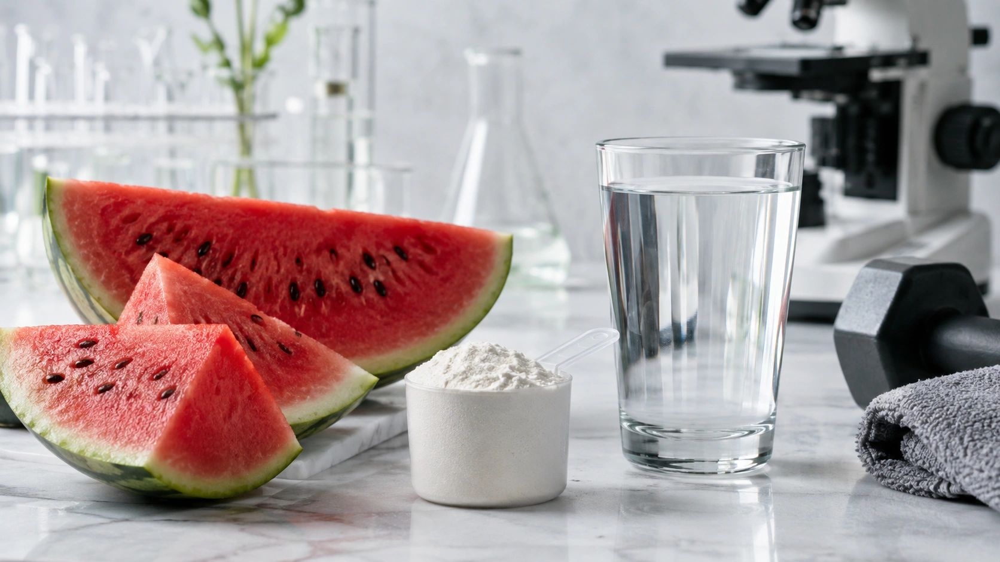
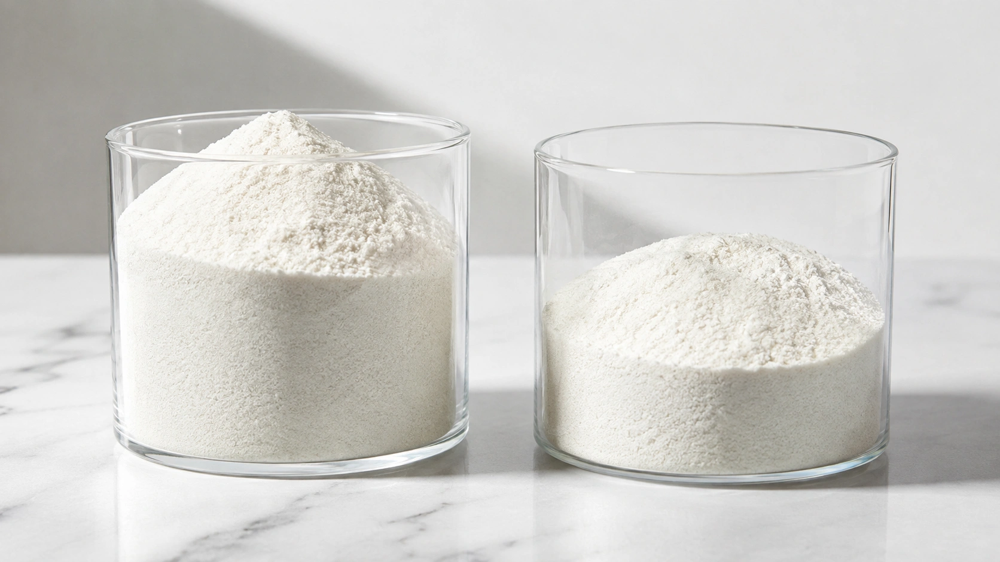

A citrulina malato aparece com frequência em fórmulas pré-treino acompanhada de promessas de mais força, melhor “pump”, maior resistência e menos fadiga. A ciência, porém, apresenta um quadro mais moderado: **o suplemento pode proporcionar um pequeno ganho de desempenho em determinadas situações, especialmente em exercícios resistidos com séries repetidas, mas os resultados não são consistentes para todos os tipos de exercício**. ([MDPI](https://www.mdpi.com/2072-6643/18/12/1881 'Effects of Citrulline Malate Supplementation on Exercise Performance: A Systematic Review and Three-Level Meta-Analysis'))

A meta-análise mais abrangente publicada até o momento, em 2026, reuniu 30 ensaios clínicos randomizados, 138 tamanhos de efeito e 644 participantes. Os pesquisadores encontraram um pequeno efeito positivo global da citrulina malato sobre o desempenho (`g = 0,16`), acompanhado, porém, de grande variação entre os possíveis resultados. ([MDPI](https://www.mdpi.com/2072-6643/18/12/1881 'Effects of Citrulline Malate Supplementation on Exercise Performance: A Systematic Review and Three-Level Meta-Analysis'))

Na prática, isso significa que existe algum potencial ergogênico, mas provavelmente bem menor do que muitas alegações comerciais fazem parecer.

## O que é citrulina malato?

A citrulina é um aminoácido que participa de processos metabólicos do organismo. Quando ingerida, pode aumentar a disponibilidade de arginina no sangue, aminoácido utilizado na produção de óxido nítrico. A suplementação oral de citrulina demonstrou elevar as concentrações circulantes de citrulina e arginina. ([PubMed](https://pubmed.ncbi.nlm.nih.gov/17901164/ 'Manipulation of citrulline availability in humans'))

O óxido nítrico está envolvido na regulação dos vasos sanguíneos, motivo pelo qual se propõe que uma maior disponibilidade possa favorecer o fluxo de sangue durante o exercício. Entretanto, apesar de esse mecanismo ser biologicamente plausível, evidências de que a citrulina produza um aumento agudo e consistente da perfusão do músculo durante o treino ainda são limitadas. ([PubMed](https://pubmed.ncbi.nlm.nih.gov/31977835/ 'Effects of Citrulline Supplementation on Exercise Performance in Humans: A Review of the Current Literature'))

Na **citrulina malato**, o aminoácido é combinado com malato, molécula envolvida no metabolismo energético. Já foram propostas hipóteses de que o malato poderia contribuir para a produção de ATP e que a citrulina ajudaria na homeostase da amônia. Contudo, a importância prática desses mecanismos para o desempenho humano ainda não está totalmente esclarecida. ([PubMed](https://pubmed.ncbi.nlm.nih.gov/34417881/ 'A Critical Review of Citrulline Malate Supplementation and Exercise Performance'))

## A citrulina malato realmente melhora o treino?

A resposta depende do que chamamos de “melhorar o desempenho”.

Os resultados mais interessantes aparecem em exercícios de força realizados por várias séries até próximo da fadiga. Uma meta-análise de 2021 avaliou estudos duplo-cegos e controlados por placebo e encontrou que **6–8 g de citrulina malato consumidos 40–60 minutos antes do exercício aumentaram o número total de repetições em aproximadamente 3 repetições, ou 6,4%, em média**. O tamanho do efeito, entretanto, foi pequeno. ([PubMed](https://pubmed.ncbi.nlm.nih.gov/34010809/ 'Acute Effect of Citrulline Malate on Repetition Performance During Strength Training: A Systematic Review and Meta-Analysis'))

Isso pode ser relevante para alguém tentando aumentar ligeiramente o volume realizado em uma sessão. Não significa, porém, que todos conseguirão fazer três repetições extras em cada série. O valor representa uma média obtida a partir dos protocolos incluídos na análise.

### O panorama ficou mais claro em 2026?

Em parte.

A meta-análise de 2026 encontrou um **pequeno benefício global** da citrulina malato. Quando os pesquisadores separaram os estudos de suplementação aguda, também observaram um pequeno efeito estatisticamente significativo. Por outro lado, os resultados relacionados especificamente a força e potência permaneceram triviais. ([MDPI](https://www.mdpi.com/2072-6643/18/12/1881 'Effects of Citrulline Malate Supplementation on Exercise Performance: A Systematic Review and Three-Level Meta-Analysis'))

Análises exploratórias também levantaram a possibilidade de benefícios em determinadas tarefas de resistência aeróbica e esforços anaeróbicos curtos, mas essas conclusões se mostraram menos robustas em análises de sensibilidade. ([MDPI](https://www.mdpi.com/2072-6643/18/12/1881 'Effects of Citrulline Malate Supplementation on Exercise Performance: A Systematic Review and Three-Level Meta-Analysis'))

Assim, o cenário atual não sustenta a afirmação de que a citrulina malato seja um potente melhorador universal do desempenho.

## Citrulina malato aumenta força?

Aqui é importante diferenciar **força máxima** de **resistência muscular**.

Força máxima está relacionada, por exemplo, à maior carga que uma pessoa consegue levantar. Resistência muscular envolve manter o trabalho por mais tempo ou completar mais repetições antes da fadiga.

Uma revisão sistemática e meta-análise de estudos com adultos treinados encontrou quatro estudos e 138 avaliações. O efeito global sobre força não foi significativo (`SMD = 0,13`, IC 95% de -0,21 a 0,46). Os autores concluíram que a citrulina malato não melhorou significativamente a força muscular nessa população. ([PubMed](https://pubmed.ncbi.nlm.nih.gov/34176406/ 'Effects of Citrulline Malate Supplementation on Muscle Strength in Resistance-Trained Adults: A Systematic Review and Meta-Analysis of Randomized Controlled Trials'))

| Objetivo                     | O que as evidências indicam                         |
| ---------------------------- | --------------------------------------------------- |
| Fazer mais repetições        | Possível pequeno benefício                          |
| Aumentar força máxima        | Benefício não demonstrado de forma consistente      |
| Aumentar potência            | Evidência fraca/inconsistente                       |
| Melhorar exercício aeróbico  | Sem benefício global consistente                    |
| Reduzir percepção de esforço | Possível pequeno benefício                          |
| Reduzir dor muscular         | Possível benefício em alguns momentos pós-exercício |

Essa diferença ajuda a explicar por que alguém pode perceber melhora no rendimento durante várias séries sem necessariamente apresentar aumento imediato no peso máximo levantado.

## E para corrida, ciclismo e outros exercícios aeróbicos?

As evidências são menos favoráveis.

Uma revisão sistemática e meta-análise publicada em 2022 reuniu dez estudos sobre diferentes formas de exercício aeróbico. No conjunto, a suplementação não produziu benefício significativo no desempenho aeróbico nem em desfechos relacionados, incluindo lactato, consumo de oxigênio e percepção subjetiva de esforço. ([PubMed](https://pubmed.ncbi.nlm.nih.gov/36079738/ 'Effects of Citrulline Supplementation on Different Aerobic Exercise Performance Outcomes: A Systematic Review and Meta-Analysis'))

Isso não significa que nenhum indivíduo ou protocolo possa apresentar alguma resposta. Significa que, quando os estudos são analisados em conjunto, **não existe evidência suficientemente consistente para tratar a citrulina como um suplemento comprovado para endurance**.

## Ela ajuda a diminuir a fadiga e a dor muscular?

Existe algum sinal positivo, mas com ressalvas.

Uma meta-análise com 13 estudos e 206 participantes encontrou redução da percepção de esforço e algum benefício sobre dor muscular pós-exercício, enquanto os níveis de lactato sanguíneo não foram significativamente reduzidos. A dose mais frequente nos estudos avaliados foi 8 g de citrulina malato. ([PubMed](https://pubmed.ncbi.nlm.nih.gov/33308806/ 'Effect of Citrulline on Post-Exercise Rating of Perceived Exertion, Muscle Soreness, and Blood Lactate Levels: A Systematic Review and Meta-Analysis'))

Portanto, sentir o treino um pouco menos desgastante ou apresentar menor desconforto posteriormente é uma possibilidade, não uma garantia.

## Qual quantidade foi estudada?

Para musculação, um dos protocolos mais investigados é:

- **6–8 g de citrulina malato**;
- aproximadamente **40–60 minutos antes do treino**;
- geralmente em dose única. ([PubMed](https://pubmed.ncbi.nlm.nih.gov/34010809/ 'Acute Effect of Citrulline Malate on Repetition Performance During Strength Training: A Systematic Review and Meta-Analysis'))

Esses números descrevem os protocolos de estudos e **não representam uma recomendação individual de suplementação**.

Existe ainda um problema importante: citrulina malato não é sinônimo de L-citrulina pura. A quantidade efetiva de citrulina depende da composição do produto, e revisões científicas identificaram dificuldades relacionadas às proporções declaradas entre citrulina e malato em algumas formulações. ([PubMed](https://pubmed.ncbi.nlm.nih.gov/34417881/ 'A Critical Review of Citrulline Malate Supplementation and Exercise Performance'))

Consequentemente, comparar apenas o número de gramas escrito na frente de duas embalagens pode ser enganoso.

## Quanto tempo antes do treino?

A janela de **40 a 60 minutos antes do exercício** é comum nos trabalhos que investigaram desempenho em musculação e repetições até a fadiga. ([PubMed](https://pubmed.ncbi.nlm.nih.gov/34010809/ 'Acute Effect of Citrulline Malate on Repetition Performance During Strength Training: A Systematic Review and Meta-Analysis'))

Isso não prova que 40 ou 60 minutos sejam horários biologicamente ideais para todas as pessoas. A própria literatura ainda apresenta incerteza sobre dose, tempo de ingestão e formulação ideais. ([PubMed](https://pubmed.ncbi.nlm.nih.gov/34417881/ 'A Critical Review of Citrulline Malate Supplementation and Exercise Performance'))

## Citrulina malato ou L-citrulina?

As duas formas não devem ser tratadas como equivalentes.

A L-citrulina contém somente o aminoácido. A citrulina malato combina citrulina e malato, reduzindo a quantidade de citrulina presente por grama do produto em comparação com L-citrulina pura.

Além disso, estudos utilizam formulações e proporções diferentes. Isso torna inadequado converter automaticamente um protocolo com citrulina malato em uma dose equivalente de L-citrulina sem conhecer a composição exata. ([NIH ODS](https://ods.od.nih.gov/factsheets/ExerciseAndAthleticPerformance-HealthProfessional/ 'Dietary Supplements for Exercise and Athletic Performance — Health Professional Fact Sheet'))

## Citrulina malato é segura?

Os estudos de curto prazo geralmente não apontam grande frequência de efeitos adversos graves, mas a segurança do uso suplementar prolongado não foi suficientemente estudada. O NIH destaca que as evidências de segurança por períodos de vários meses são insuficientes. Em um estudo com 41 praticantes de musculação que utilizaram 8 g de citrulina malato, seis participantes relataram desconforto estomacal. ([NIH ODS](https://ods.od.nih.gov/factsheets/ExerciseAndAthleticPerformance-HealthProfessional/ 'Dietary Supplements for Exercise and Athletic Performance — Health Professional Fact Sheet'))

Pessoas com condições clínicas, que utilizam medicamentos regularmente, gestantes, lactantes ou indivíduos que pretendem utilizar suplementos de forma contínua devem discutir a decisão com médico ou nutricionista qualificado.

## Então, vale a pena usar citrulina malato?

Depende do objetivo.

Para quem pratica musculação e já possui alimentação, treinamento, recuperação e sono bem estruturados, a citrulina malato pode ser considerada um recurso secundário com possibilidade de **pequeno aumento da resistência muscular ou do volume realizado em determinadas sessões**. ([PubMed](https://pubmed.ncbi.nlm.nih.gov/34010809/ 'Acute Effect of Citrulline Malate on Repetition Performance During Strength Training: A Systematic Review and Meta-Analysis'))

Ela não deve, entretanto, ser apresentada como suplemento capaz de aumentar substancialmente força, potência, massa muscular ou desempenho aeróbico.

Também é importante colocar o tamanho do efeito em perspectiva. Um resultado estatisticamente significativo pode ser real e, ainda assim, pequeno do ponto de vista prático. É exatamente esse tipo de cenário que aparece na literatura atual sobre citrulina malato. ([MDPI](https://www.mdpi.com/2072-6643/18/12/1881 'Effects of Citrulline Malate Supplementation on Exercise Performance: A Systematic Review and Three-Level Meta-Analysis'))

## Conclusão

**A citrulina malato pode melhorar modestamente alguns aspectos do desempenho físico, principalmente a capacidade de realizar repetições durante exercícios resistidos, mas o efeito esperado é pequeno.**

Até o momento, não existe evidência consistente de aumento da força máxima, e os resultados para potência e exercício aeróbico permanecem incertos ou pouco convincentes. A meta-análise mais recente, de 2026, encontrou um pequeno benefício global, reforçando que o suplemento pode funcionar em determinados contextos sem justificar promessas de grandes aumentos de desempenho. ([MDPI](https://www.mdpi.com/2072-6643/18/12/1881 'Effects of Citrulline Malate Supplementation on Exercise Performance: A Systematic Review and Three-Level Meta-Analysis'))

Para quem pensa em utilizá-la, composição do produto, dose real de citrulina, tolerância individual e objetivo esportivo são mais importantes do que simplesmente procurar o maior número de gramas no rótulo.
