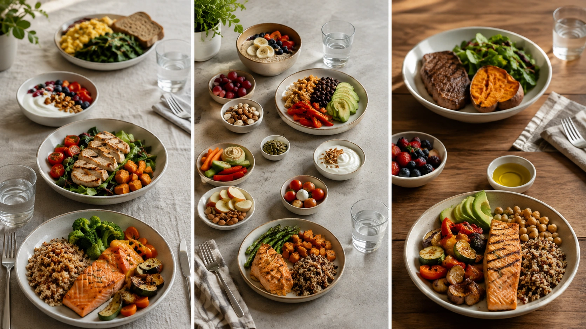

Durante anos, uma recomendação foi repetida com aparência de regra metabólica: **“coma de três em três horas para manter o metabolismo acelerado”**.

A explicação parece intuitiva. Como o organismo gasta energia para digerir alimentos, fazer mais refeições supostamente faria o corpo “trabalhar” mais vezes e, consequentemente, gastar mais calorias ao longo do dia.

O problema é que essa conta não funciona dessa maneira.

Quando a quantidade total de alimentos e energia é semelhante, **simplesmente aumentar o número de refeições não demonstrou produzir um aumento relevante no gasto energético diário**. Estudos controlados e revisões científicas não sustentam a necessidade de fazer cinco, seis ou mais refeições apenas para acelerar o metabolismo. ([PubMed](https://pubmed.ncbi.nlm.nih.gov/18053311/ 'Acute effects on metabolism and appetite profile of one meal difference in the lower range of meal frequency'))

## De onde surgiu a ideia de comer de três em três horas?

Parte desse raciocínio vem de um fenômeno real: comer aumenta temporariamente o gasto energético.

Depois de uma refeição, o organismo utiliza energia para digerir, absorver, transportar e metabolizar nutrientes. Esse processo é chamado de **efeito térmico dos alimentos**, também conhecido como termogênese induzida pela dieta. ([PubMed](https://pubmed.ncbi.nlm.nih.gov/31021710/ 'The Thermic Effect of Food: A Review'))

A conclusão equivocada aparece quando se assume que provocar esse efeito seis vezes em vez de três produziria obrigatoriamente um gasto energético diário muito maior.

Se a quantidade total de comida permanece semelhante, porém, refeições menores também provocam respostas térmicas menores. Na prática, dividir determinada ingestão energética em vários momentos não cria calorias extras para o organismo gastar simplesmente porque houve mais ocasiões alimentares. Estudos metabólicos controlados não mostram uma vantagem consistente da maior frequência nesse aspecto. ([PubMed](https://pubmed.ncbi.nlm.nih.gov/18053311/ 'Acute effects on metabolism and appetite profile of one meal difference in the lower range of meal frequency'))

## O que é o efeito térmico dos alimentos?

O gasto energético diário não é formado apenas pelo exercício físico.

O organismo utiliza energia para manter funções vitais, realizar movimentos e atividades e processar os alimentos consumidos. Essa última parcela é o efeito térmico dos alimentos.

A magnitude desse efeito varia conforme diferentes características da refeição, incluindo quantidade e composição de macronutrientes. Uma revisão científica sobre termogênese alimentar também identificou que refeições maiores podem provocar respostas térmicas maiores do que pequenas refeições muito frequentes. ([PubMed](https://pubmed.ncbi.nlm.nih.gov/31021710/ 'The Thermic Effect of Food: A Review'))

Portanto, não é correto imaginar cada refeição como um botão que liga o metabolismo com a mesma intensidade independentemente de seu tamanho.

## Se eu fizer seis refeições, meu corpo não gastará energia seis vezes?

Sim, haverá processamento dos alimentos seis vezes. O detalhe importante é que **cada evento será menor se a mesma quantidade diária de comida tiver sido simplesmente dividida em seis porções**.

Imagine dois cenários:

| Padrão alimentar        | Energia diária hipotética |
| ----------------------- | ------------------------: |
| 3 refeições de 600 kcal |                1.800 kcal |
| 6 refeições de 300 kcal |                1.800 kcal |

O segundo padrão possui mais ocasiões alimentares, mas não possui mais energia total apenas por isso.

Essa lógica foi testada experimentalmente. Em um ensaio randomizado realizado com mulheres saudáveis e peso normal, distribuir uma ingestão equivalente em duas ou três refeições não alterou significativamente o gasto energético de 24 horas, a termogênese induzida pela dieta, o gasto relacionado à atividade ou o metabolismo durante o sono. ([PubMed](https://pubmed.ncbi.nlm.nih.gov/18053311/ 'Acute effects on metabolism and appetite profile of one meal difference in the lower range of meal frequency'))

## E três refeições versus seis?

Outro estudo controlado comparou três e seis refeições diárias e avaliou, entre outros desfechos, a oxidação de gordura ao longo de 24 horas.

Os pesquisadores não encontraram diferença significativa na oxidação de gordura diária entre os dois padrões. O estudo também não sustentou a ideia de que aumentar a frequência alimentar produziria automaticamente uma vantagem metabólica. ([PMC](https://pmc.ncbi.nlm.nih.gov/articles/PMC4391809/ 'Effects of increased meal frequency on fat oxidation and perceived hunger'))

É importante não transformar um único experimento em regra universal. Entretanto, seu resultado é compatível com o conjunto mais amplo de evidências que questiona o suposto “aumento do metabolismo” provocado por refeições muito frequentes. ([Springer](https://link.springer.com/article/10.1186/s12966-023-01532-z 'The effects of eating frequency on changes in body composition and cardiometabolic health in adults: a systematic review with meta-analysis of randomized trials'))

## Comer mais vezes ajuda a emagrecer?

Também não há evidência sólida para afirmar que uma frequência maior, isoladamente, facilite a perda de peso.

Uma revisão sistemática com meta-análise de ensaios randomizados publicada em 2023 concluiu que não havia vantagem discernível de padrões de alta ou baixa frequência alimentar para os marcadores cardiometabólicos avaliados em adultos jovens e de meia-idade. ([Springer](https://link.springer.com/article/10.1186/s12966-023-01532-z 'The effects of eating frequency on changes in body composition and cardiometabolic health in adults: a systematic review with meta-analysis of randomized trials'))

Curiosamente, uma meta-análise posterior, publicada em 2024 no _JAMA Network Open_, encontrou uma pequena vantagem de **menor**, e não maior, frequência alimentar para redução de peso.

A diferença média observada foi de aproximadamente 1,8 kg. Contudo, a evidência foi classificada como de baixa certeza, apresentou alta heterogeneidade entre os estudos e os autores ressaltaram que o tamanho do efeito era pequeno e de importância clínica incerta. ([JAMA Network Open](https://jamanetwork.com/journals/jamanetworkopen/fullarticle/2825747 'Meal Timing and Anthropometric and Metabolic Outcomes: A Systematic Review and Meta-Analysis'))

Isso não significa que comer poucas vezes seja uma nova regra. Significa principalmente que a ideia oposta — quanto mais refeições, maior o emagrecimento — não encontra respaldo consistente.

## Mais refeições fazem a pessoa comer menos?

Não necessariamente.

Uma revisão sistemática conduzida pelo USDA como parte do processo científico relacionado às Dietary Guidelines for Americans 2025–2030 avaliou frequência de refeições, lanches e ingestão energética.

Para adultos, os autores concluíram que não era possível estabelecer uma conclusão firme sobre a relação entre número de ocasiões alimentares e ingestão energética, devido ao pequeno corpo de evidências e à limitada generalização dos estudos disponíveis. ([PubMed](https://pubmed.ncbi.nlm.nih.gov/39812565/ 'Frequency of Meals and/or Snacking and Energy Intake: A Systematic Review'))

Em outras palavras, algumas pessoas podem controlar melhor a alimentação com refeições menores e mais frequentes. Outras podem acabar acrescentando lanches sem compensar essas calorias nas refeições principais.

## E a fome?

Aqui a resposta é mais individual.

Em um pequeno ensaio metabólico, consumir três refeições em vez de duas aumentou a sensação de saciedade ao longo de 24 horas, apesar de não alterar o gasto energético diário. ([PubMed](https://pubmed.ncbi.nlm.nih.gov/18053311/ 'Acute effects on metabolism and appetite profile of one meal difference in the lower range of meal frequency'))

Mas aumentar ainda mais a frequência não garante progressivamente mais saciedade. Uma revisão sobre controle do apetite concluiu que aumentar a frequência acima de três ocasiões alimentares apresentava impacto mínimo, quando existente, sobre controle do apetite e ingestão alimentar nos estudos examinados. ([PubMed](https://pubmed.ncbi.nlm.nih.gov/21123467/ 'The effect of eating frequency on appetite control and food …'))

Além do número de refeições, saciedade depende da composição alimentar, quantidade ingerida, proteínas, fibras, densidade energética e fatores comportamentais.

## Ficar sem comer por algumas horas “desliga” o metabolismo?

Não.

O organismo não depende da chegada de uma refeição a cada três horas para continuar gastando energia.

Mesmo entre refeições e durante o sono, há gasto energético para respiração, circulação, funcionamento cerebral, manutenção da temperatura corporal e inúmeros outros processos.

No ensaio que comparou duas com três refeições, por exemplo, não houve diferença no metabolismo durante o sono ou no gasto energético diário simplesmente porque um grupo passou por intervalos maiores sem comer. ([PubMed](https://pubmed.ncbi.nlm.nih.gov/18053311/ 'Acute effects on metabolism and appetite profile of one meal difference in the lower range of meal frequency'))

Isso é muito diferente de situações prolongadas de restrição energética severa, nas quais adaptações metabólicas podem ocorrer. Não é adequado usar esses fenômenos para afirmar que passar quatro ou cinco horas sem comer fará o metabolismo “parar”.

## Frequência e horário das refeições são a mesma coisa?

Não.

Esse é um ponto importante porque estudos recentes de crononutrição analisam diferentes estratégias:

- quantidade de refeições;
- horário em que se come;
- distribuição das calorias ao longo do dia;
- duração da janela diária de alimentação.

Uma meta-análise de 2024 avaliou essas estratégias separadamente e encontrou pequenos efeitos sobre peso para alimentação com horário restrito, menor frequência e maior concentração de calorias no início do dia. Entretanto, os estudos apresentaram heterogeneidade e problemas de risco de viés, reduzindo a certeza das conclusões. ([JAMA Network Open](https://jamanetwork.com/journals/jamanetworkopen/fullarticle/2825747 'Meal Timing and Anthropometric and Metabolic Outcomes: A Systematic Review and Meta-Analysis'))

Portanto, resultados de jejum intermitente ou de jantar mais cedo não provam que seis refeições sejam melhores ou piores do que três.

## Então comer seis vezes por dia é errado?

Não.

O mito não é que seis refeições sejam prejudiciais.

O mito é afirmar que **todas as pessoas precisam comer seis vezes, ou a cada três horas, para acelerar o metabolismo**.

Para alguém que sente muita fome entre refeições, prefere porções menores ou precisa distribuir a alimentação por causa da rotina ou de objetivos específicos, mais refeições podem funcionar bem.

Para outra pessoa, três refeições satisfatórias podem ser mais simples e igualmente compatíveis com uma alimentação adequada.

A revisão de 2023 não encontrou evidência suficiente para recomendar universalmente alta ou baixa frequência como superior para saúde cardiometabólica. ([Springer](https://link.springer.com/article/10.1186/s12966-023-01532-z 'The effects of eating frequency on changes in body composition and cardiometabolic health in adults: a systematic review with meta-analysis of randomized trials'))

## O que importa mais do que comer de três em três horas?

Para a maioria das pessoas, vale prestar mais atenção à qualidade e à quantidade da alimentação do que tentar cumprir um relógio rígido apenas por medo de desacelerar o metabolismo.

Aspectos práticos incluem:

- escolher alimentos nutricionalmente adequados;
- consumir quantidade de energia compatível com as necessidades e objetivos;
- incluir fontes de proteínas e fibras;
- observar fome e saciedade;
- evitar transformar lanches automáticos em calorias adicionais desnecessárias;
- manter um padrão que seja sustentável na rotina.

A frequência pode ser ajustada para facilitar esses objetivos — não precisa ser tratada como o mecanismo que controla o metabolismo.

## Existe um número ideal de refeições?

As evidências atuais não estabelecem um número universal.

A revisão do USDA encontrou limitações suficientes para não formular uma conclusão sobre o número de ocasiões alimentares e ingestão energética em adultos. ([PubMed](https://pubmed.ncbi.nlm.nih.gov/39812565/ 'Frequency of Meals and/or Snacking and Energy Intake: A Systematic Review'))

Da mesma forma, revisões de ensaios randomizados não permitem afirmar que alta frequência seja superior à baixa frequência de forma geral. ([Springer](https://link.springer.com/article/10.1186/s12966-023-01532-z 'The effects of eating frequency on changes in body composition and cardiometabolic health in adults: a systematic review with meta-analysis of randomized trials'))

Para algumas pessoas, três refeições funcionam. Para outras, três refeições acompanhadas de um ou dois lanches são mais confortáveis. Outras preferem padrões diferentes.

O melhor número é aquele que contribui para uma dieta adequada, ajuda no controle da fome e consegue ser mantido sem transformar a alimentação em uma obrigação constante.

## Conclusão

**Comer várias vezes ao dia não parece acelerar significativamente o metabolismo apenas porque há mais refeições.**

O efeito térmico dos alimentos existe, mas dividir a mesma quantidade de alimento em porções menores e mais frequentes não demonstrou criar uma vantagem consistente no gasto energético diário. ([PubMed](https://pubmed.ncbi.nlm.nih.gov/31021710/ 'The Thermic Effect of Food: A Review'))

Também não existe evidência suficiente para transformar seis refeições, três refeições ou qualquer outro número em regra universal. Revisões recentes mostram resultados pequenos, heterogêneos ou inconclusivos quando diferentes frequências são comparadas. ([JAMA Network Open](https://jamanetwork.com/journals/jamanetworkopen/fullarticle/2825747 'Meal Timing and Anthropometric and Metabolic Outcomes: A Systematic Review and Meta-Analysis'))

Portanto, não é necessário comer de três em três horas por medo de o metabolismo “desacelerar”. A frequência alimentar pode ser escolhida de acordo com fome, rotina, qualidade da dieta, objetivos e necessidades individuais.
