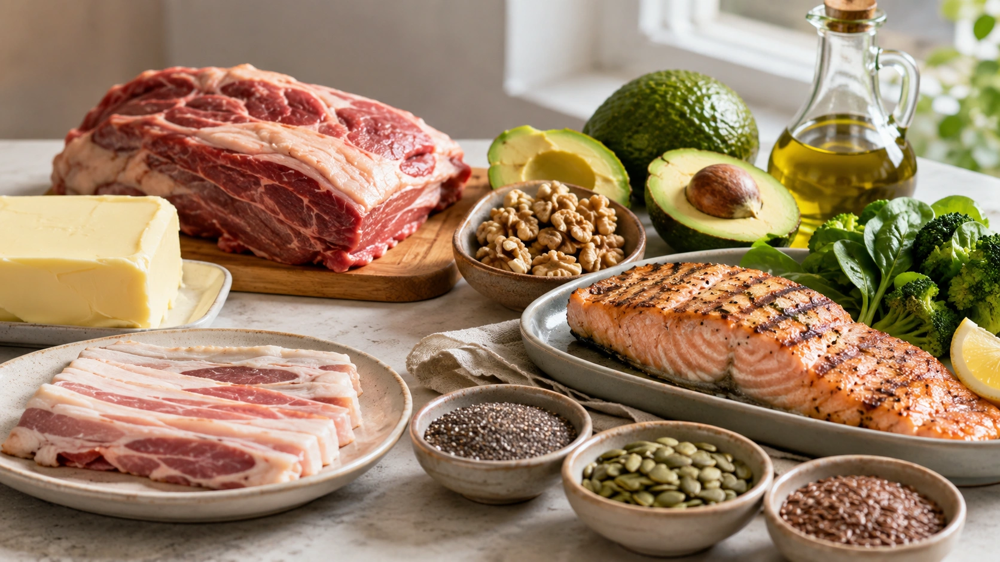
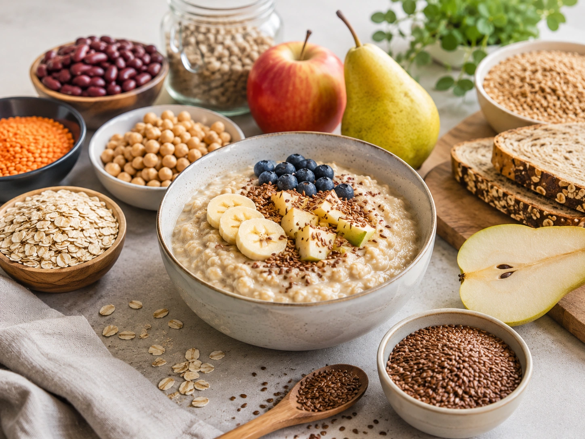
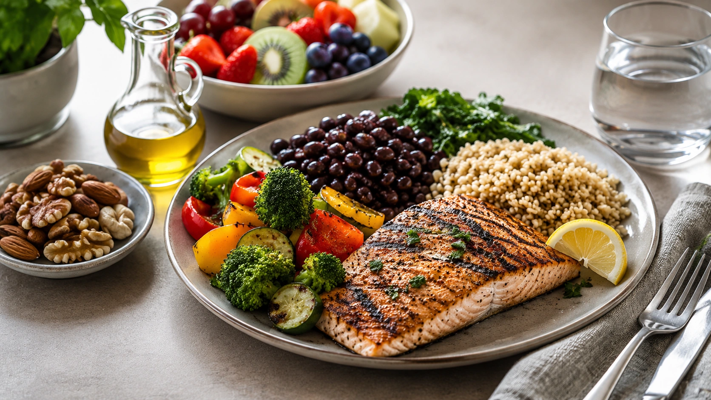

A alimentação pode alterar significativamente o colesterol LDL, mas não por causa de um único alimento. O efeito depende principalmente do **tipo de gordura consumida, da quantidade de fibras, da qualidade dos carboidratos e do padrão alimentar mantido ao longo do tempo**.

Na prática, uma das mudanças mais bem sustentadas pelas evidências é **trocar parte das fontes de gordura saturada por fontes de gordura insaturada**. Aumentar o consumo de fibras, especialmente as solúveis, também pode contribuir para a redução do LDL.

Isso não significa, porém, que toda pessoa com LDL elevado conseguirá normalizar seus exames apenas mudando a alimentação. Genética, idade, condições metabólicas, doenças associadas e risco cardiovascular também interferem no resultado. ([Ministério da Saúde](https://www.gov.br/hubrasil/pt-br/comunicacao/noticias/colesterol-vai-alem-do-prato-e-requer-avaliacao-individual 'Colesterol vai além do prato e requer avaliação individual'))

## Por que o colesterol LDL merece atenção?

O LDL é uma das lipoproteínas que transportam colesterol pelo sangue. Quando suas concentrações permanecem elevadas, especialmente por longos períodos, aumenta a exposição das artérias a partículas envolvidas na formação e progressão da aterosclerose. Esse processo está associado ao desenvolvimento de doença cardiovascular, infarto e acidente vascular cerebral. ([Ministério da Saúde](https://www.gov.br/hubrasil/pt-br/comunicacao/noticias/colesterol-vai-alem-do-prato-e-requer-avaliacao-individual 'Colesterol vai além do prato e requer avaliação individual'))

Por isso, o objetivo não é simplesmente classificar o colesterol como “bom” ou “ruim”, mas compreender o risco cardiovascular de cada pessoa.

As metas de LDL também não são iguais para todos. Pessoas com doença cardiovascular ou outros fatores importantes de risco podem precisar alcançar níveis muito mais baixos do que indivíduos de menor risco. ([Ministério da Saúde](https://www.gov.br/hubrasil/pt-br/comunicacao/noticias/colesterol-vai-alem-do-prato-e-requer-avaliacao-individual 'Colesterol vai além do prato e requer avaliação individual'))

## Gordura saturada é um dos principais pontos da dieta

Entre os fatores alimentares, a gordura saturada merece atenção especial porque seu consumo elevado pode aumentar o LDL. Ela está presente em diferentes proporções em alimentos como:

- manteiga;
- creme de leite;
- queijos;
- carnes mais gordurosas;
- pele de aves;
- alguns produtos de confeitaria e panificação;
- óleo de coco;
- óleo de palma.

A American Heart Association destaca que dietas ricas em gordura saturada podem elevar o LDL e recomenda substituí-la por fontes de gorduras mono e poli-insaturadas. ([American Heart Association](https://www.heart.org/en/healthy-living/healthy-eating/eat-smart/fats/saturated-fats 'Saturated Fats | American Heart Association'))

No Brasil, a Diretriz Brasileira de Dislipidemias de 2025 recomenda, para o tratamento das dislipidemias, que as gorduras saturadas representem **menos de 7% do valor calórico total da dieta**. A recomendação possui força alta no documento.

A OMS utiliza um limite populacional mais amplo: **menos de 10% da energia proveniente de gordura saturada**, com a recomendação de que a maior parte das gorduras ingeridas seja insaturada. ([OMS](https://www.who.int/news/item/17-07-2023-who-updates-guidelines-on-fats-and-carbohydrates 'WHO updates guidelines on fats and carbohydrates'))

## O que importa é também o alimento que entra no lugar

Reduzir gordura saturada sem observar a substituição pode produzir um resultado diferente do esperado.

A Diretriz Brasileira de 2025 destaca que substituir gorduras saturadas por gorduras mono e poli-insaturadas está associado à redução do LDL. Por outro lado, substituí-las por carboidratos refinados pode aumentar triglicerídeos e reduzir HDL, não representando uma troca nutricional equivalente.

Na prática, algumas substituições possíveis são:

| Em vez de usar com frequência                | Considere substituir por                                                 |
| -------------------------------------------- | ------------------------------------------------------------------------ |
| Manteiga como principal gordura culinária    | Azeite ou outros óleos vegetais líquidos não tropicais                   |
| Carnes muito gordurosas                      | Peixes, leguminosas, aves sem pele ou cortes mais magros                 |
| Laticínios integrais em grande frequência    | Versões com menor teor de gordura, quando adequadas ao restante da dieta |
| Lanches ricos em gorduras saturadas          | Frutas, castanhas ou sementes                                            |
| Óleo de coco como principal fonte de gordura | Azeite, canola, soja ou outros óleos predominantemente insaturados       |

A lógica é **substituição**, e não simplesmente acrescentar azeite, castanhas ou abacate a uma alimentação que continua muito rica em gordura saturada. ([American Heart Association](https://www.heart.org/en/healthy-living/healthy-eating/eat-smart/fats/fats-in-foods 'Fats in Foods'))

## Gorduras trans são especialmente desfavoráveis

As gorduras trans afetam negativamente o perfil lipídico. A OMS recomenda manter sua ingestão abaixo de 1% do valor energético e considera que as gorduras trans produzidas industrialmente não fazem parte de uma alimentação saudável. ([OMS](https://www.who.int/news-room/fact-sheets/detail/trans-fat 'Trans fat'))

Elas estiveram historicamente presentes em produtos feitos com óleos parcialmente hidrogenados, além de certos alimentos fritos e produtos de panificação industrial.

A prioridade prática é favorecer alimentos in natura ou minimamente processados e conferir a lista de ingredientes de produtos industrializados quando necessário. ([OMS](https://www.who.int/news-room/fact-sheets/detail/trans-fat 'Trans fat'))

## Fibras solúveis podem contribuir para reduzir o LDL

Nem todas as fibras têm exatamente os mesmos efeitos metabólicos.

As **fibras solúveis e viscosas** absorvem água no trato gastrointestinal. Entre outros mecanismos, podem diminuir a absorção intestinal de colesterol e favorecer a excreção de ácidos biliares.

Fontes alimentares que ajudam a aumentar a ingestão de fibras incluem:

- aveia;
- leguminosas, como feijão, lentilha, ervilha e grão-de-bico;
- frutas;
- vegetais;
- cereais integrais;
- sementes.

A Diretriz Brasileira de Dislipidemias de 2025 recomenda **pelo menos 25 g de fibras totais por dia** e destaca beta-glucana da aveia, psyllium, leguminosas e frutas com casca entre as opções relevantes.

Uma meta-análise de ensaios randomizados publicada em 2023 observou que cada aumento de 5 g por dia de fibra solúvel suplementar foi associado, em média, a uma redução de aproximadamente **5,57 mg/dL no LDL**. O resultado descreve a média dos estudos e não permite prever exatamente quanto o LDL de uma pessoa cairá ao modificar sua dieta. ([PubMed](https://pubmed.ncbi.nlm.nih.gov/36796439/ 'Soluble Fiber Supplementation and Serum Lipid Profile: A Systematic Review and Dose-Response Meta-Analysis of Randomized Controlled Trials'))

## Gorduras insaturadas: por que a substituição funciona

Gorduras mono e poli-insaturadas aparecem em alimentos como azeite, alguns óleos vegetais, castanhas, sementes, abacate e peixes.

Seu principal papel nesse contexto não é “limpar as artérias”. A vantagem está em construir um padrão alimentar no qual essas fontes **ocupem o lugar de alimentos ricos em gordura saturada**.

A OMS também recomenda que gorduras saturadas e trans sejam substituídas preferencialmente por gorduras poli-insaturadas, gorduras monoinsaturadas de fontes vegetais ou carboidratos provenientes de alimentos naturalmente ricos em fibras. ([OMS](https://www.who.int/news/item/17-07-2023-who-updates-guidelines-on-fats-and-carbohydrates 'WHO updates guidelines on fats and carbohydrates'))

## Carboidratos também entram nessa equação

Falar sobre LDL não significa olhar somente para gorduras.

A qualidade dos carboidratos é importante para o perfil metabólico geral. Grãos integrais, frutas, hortaliças e leguminosas fornecem fibras e outros nutrientes, enquanto dietas com grande participação de açúcares adicionados e farinhas refinadas não representam uma boa estratégia de substituição para gorduras saturadas.

Portanto, trocar manteiga e carnes muito gordurosas por biscoitos, pães refinados e sobremesas com pouca fibra não é a mudança que as recomendações cardiovasculares propõem.

## E o colesterol presente nos alimentos?

Colesterol alimentar e colesterol LDL no exame de sangue não são a mesma coisa.

O colesterol presente nos alimentos pode influenciar os lipídios sanguíneos, mas a resposta varia entre indivíduos e é difícil separar seu efeito do restante da composição da dieta em estudos de vida real. Por isso, a American Heart Association enfatiza um padrão alimentar saudável em vez de concentrar toda a recomendação em um único alimento contendo colesterol. ([PubMed](https://pubmed.ncbi.nlm.nih.gov/31838890/ 'Dietary Cholesterol and Cardiovascular Risk: A Science Advisory From the American Heart Association'))

Essa distinção é especialmente importante nas discussões sobre ovos. Avaliar apenas quantos miligramas de colesterol um alimento contém pode ignorar o que acompanha esse alimento, o que ele substitui e como é o restante da dieta.

## Existe um alimento capaz de baixar o colesterol sozinho?

Não.

Aveia, azeite, castanhas, sementes, leguminosas e outros alimentos podem contribuir para um padrão favorável ao controle do LDL, mas nenhum deles funciona como uma espécie de “antídoto” para uma alimentação globalmente inadequada.

Uma revisão sistemática que reuniu evidências de meta-análises de ensaios randomizados mostrou que diferentes alimentos podem modificar o LDL em graus distintos, reforçando o valor das escolhas alimentares combinadas. ([PubMed](https://pubmed.ncbi.nlm.nih.gov/33762150/ 'The effects of foods on LDL cholesterol levels: A systematic review of the accumulated evidence from systematic reviews and meta-analyses of randomized controlled trials'))

O que conta é o padrão mantido ao longo do tempo.

## Como montar um padrão alimentar mais favorável ao LDL

Uma estratégia prática pode ser organizada em cinco pontos:

1. **Troque parte das gorduras saturadas por insaturadas.** Use com mais frequência fontes como azeite, castanhas, sementes e outros óleos vegetais predominantemente insaturados. ([American Heart Association](https://www.heart.org/en/healthy-living/healthy-eating/eat-smart/fats/fats-in-foods 'Fats in Foods'))
2. **Aumente gradualmente alimentos ricos em fibras.** Feijão, lentilha, aveia, frutas, vegetais e grãos integrais ajudam a elevar a ingestão diária.
3. **Prefira proteínas menos associadas a grandes quantidades de gordura saturada.** Leguminosas, peixes e opções mais magras podem substituir parte das carnes gordurosas e processadas. ([American Heart Association](https://www.heart.org/en/healthy-living/healthy-eating/eat-smart/nutrition-basics/aha-diet-and-lifestyle-recommendations 'The American Heart Association Diet and Lifestyle Recommendations | American Heart Association'))
4. **Evite transformar a redução da gordura saturada em aumento de carboidratos refinados.** A qualidade da substituição importa.
5. **Pense no padrão alimentar, não em alimentos proibidos.** Consistência e substituições sustentáveis tendem a ser mais úteis do que listas rígidas. ([Ministério da Saúde](https://www.gov.br/hubrasil/pt-br/comunicacao/noticias/colesterol-vai-alem-do-prato-e-requer-avaliacao-individual 'Colesterol vai além do prato e requer avaliação individual'))

## Quando a alimentação não é suficiente

Duas pessoas podem seguir dietas semelhantes e apresentar valores bastante diferentes de LDL.

Parte dessa diferença pode decorrer de genética, metabolismo, idade, doenças associadas e outros fatores. A hipercolesterolemia familiar é um exemplo importante: nela, níveis elevados de LDL podem aparecer desde cedo e exigir acompanhamento e tratamento específicos. ([Ministério da Saúde](https://www.gov.br/hubrasil/pt-br/comunicacao/noticias/colesterol-vai-alem-do-prato-e-requer-avaliacao-individual 'Colesterol vai além do prato e requer avaliação individual'))

Além disso, a decisão de utilizar medicamentos não depende apenas do número de LDL. O risco cardiovascular global, o histórico de infarto ou AVC, diabetes e outras condições ajudam a definir a estratégia terapêutica. ([Ministério da Saúde](https://www.gov.br/hubrasil/pt-br/comunicacao/noticias/colesterol-vai-alem-do-prato-e-requer-avaliacao-individual 'Colesterol vai além do prato e requer avaliação individual'))

## Conclusão

A alimentação influencia o colesterol LDL principalmente pela **qualidade das gorduras, quantidade e tipo de fibras e qualidade global dos alimentos escolhidos**.

As mudanças com melhor respaldo incluem reduzir fontes frequentes de gordura saturada e trans, substituí-las por gorduras insaturadas e aumentar alimentos naturalmente ricos em fibras, como leguminosas, frutas, vegetais, aveia e outros grãos integrais.

Mais importante do que buscar um alimento capaz de “baixar o colesterol” é melhorar o conjunto da alimentação de forma sustentável. E quando o LDL permanece elevado, uma avaliação individual é necessária para definir se estilo de vida é suficiente ou se outras medidas também são indicadas. ([Ministério da Saúde](https://www.gov.br/hubrasil/pt-br/comunicacao/noticias/colesterol-vai-alem-do-prato-e-requer-avaliacao-individual 'Colesterol vai além do prato e requer avaliação individual'))
