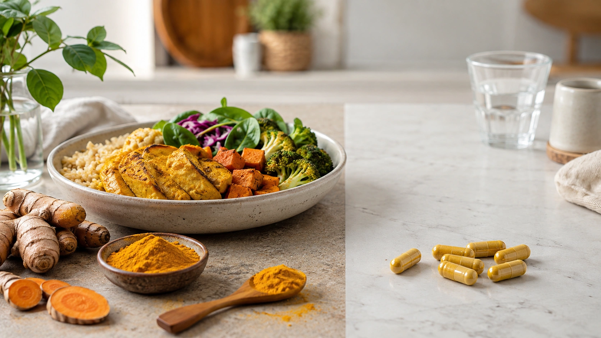
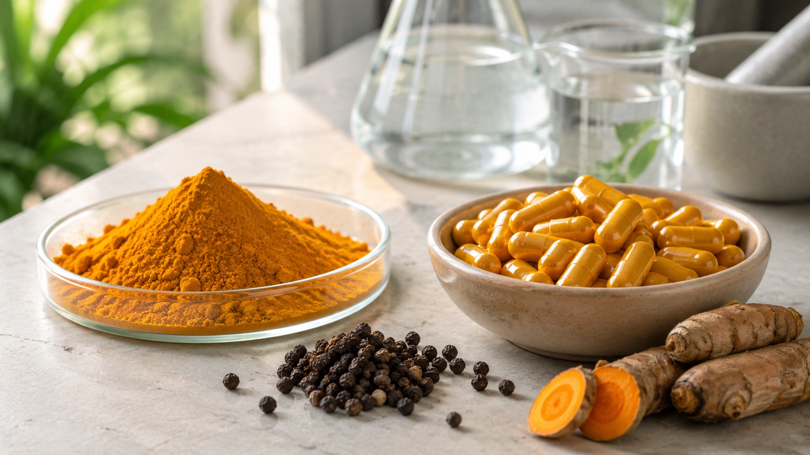

Poucos ingredientes ganharam tantas promessas de saúde nos últimos anos quanto a cúrcuma. O tempero amarelo aparece associado a inflamação, dores articulares, imunidade, emagrecimento, saúde cardiovascular, fígado e até prevenção de câncer.

A ciência, porém, exige uma primeira distinção: **comer cúrcuma não é a mesma coisa que tomar um suplemento concentrado de curcumina**.

A cúrcuma vem do rizoma da _Curcuma longa_. Entre seus constituintes estão os curcuminoides, grupo no qual se encontra a curcumina, substância relacionada à cor amarela característica da especiaria. Suplementos podem concentrar esses compostos e usar estratégias para aumentar drasticamente sua absorção. ([NCCIH](https://www.nccih.nih.gov/health/turmeric 'Turmeric'))

Essa diferença ajuda a explicar por que pesquisas sobre “cúrcuma” aparentemente chegam a conclusões tão diferentes.

## Cúrcuma e curcumina não são sinônimos

Na cozinha, cúrcuma é utilizada como tempero.

Nos estudos clínicos, por outro lado, os pesquisadores podem utilizar:

- pó de cúrcuma;
- extratos de _Curcuma longa_;
- curcuminoides concentrados;
- curcumina isolada;
- curcumina com piperina;
- complexos lipídicos;
- micelas;
- nanopartículas;
- outras formulações desenvolvidas para aumentar a biodisponibilidade.

O NCCIH destaca justamente essa heterogeneidade como uma das maiores dificuldades para interpretar a literatura científica. Dois suplementos que trazem “curcumina” na embalagem podem resultar em exposições bastante diferentes no organismo. ([NCCIH](https://www.nccih.nih.gov/health/turmeric 'Turmeric'))

## A curcumina realmente tem ação anti-inflamatória?

Existe uma base científica para essa associação.

Uma meta-análise de meta-análises publicada em 2024 encontrou alterações favoráveis em vários biomarcadores relacionados à inflamação, estresse oxidativo e função endotelial. Entre os marcadores com resultados favoráveis estavam proteína C-reativa, IL-6 e TNF-α. ([PubMed](https://pubmed.ncbi.nlm.nih.gov/38945354/ 'The effects of curcumin supplementation on biomarkers of inflammation, oxidative stress, and endothelial function: A meta-analysis of meta-analyses'))

Isso, no entanto, precisa ser interpretado corretamente.

### Reduzir um marcador não é o mesmo que tratar uma doença

Um estudo pode mostrar redução de uma molécula inflamatória no sangue sem demonstrar que os participantes:

- sentiram menos dor;
- tiveram menos infartos;
- desenvolveram menos câncer;
- viveram mais;
- necessitaram de menos medicamentos;
- apresentaram melhora relevante na qualidade de vida.

Por isso, a evidência de um efeito sobre biomarcadores é interessante, mas não permite afirmar que a curcumina “combate a inflamação do corpo” de maneira clinicamente significativa para todos. Os estudos reunidos também variam bastante em população, dose e formulação. ([PubMed](https://pubmed.ncbi.nlm.nih.gov/38945354/ 'The effects of curcumin supplementation on biomarkers of inflammation, oxidative stress, and endothelial function: A meta-analysis of meta-analyses'))

## Onde existe a melhor evidência clínica? Osteoartrite

Dor e função articular estão entre os desfechos mais estudados em seres humanos.

Uma revisão sistemática e meta-análise em rede publicada em 2025 avaliou diferentes produtos de cúrcuma para osteoartrite do joelho. As preparações analisadas apresentaram redução de dor em comparação ao placebo. ([PubMed](https://pubmed.ncbi.nlm.nih.gov/40731001/ 'Effect of turmeric products on knee osteoarthritis: a systematic review and network meta-analysis'))

A parte mais importante da conclusão, entretanto, vem logo depois: **a certeza da evidência foi considerada baixa**. ([PubMed](https://pubmed.ncbi.nlm.nih.gov/40731001/ 'Effect of turmeric products on knee osteoarthritis: a systematic review and network meta-analysis'))

### Por que a certeza ainda é baixa?

Há vários problemas:

- formulações diferentes;
- doses diferentes;
- estudos relativamente pequenos;
- duração limitada;
- qualidade metodológica variável;
- comparação difícil entre produtos com biodisponibilidades distintas.

Por isso, dizer que “curcumina cura artrose” seria um exagero. O máximo que os dados permitem afirmar atualmente é que algumas preparações **podem ajudar a reduzir sintomas da osteoartrite do joelho**, enquanto ainda faltam estudos de maior qualidade para definir o tamanho real do benefício e quais produtos funcionam melhor. ([NCCIH](https://www.nccih.nih.gov/health/turmeric 'Turmeric'))

## E para colesterol, glicemia e fígado gorduroso?

Há muitos estudos nessas áreas, mas os resultados são menos simples do que algumas propagandas sugerem.

O NCCIH considera que pesquisas iniciais sobre doença hepática gordurosa associada a alterações metabólicas encontraram melhora de alguns parâmetros, porém ainda não está claro quais resultados são consistentes entre os estudos. A instituição também afirma que não existem dados suficientes para concluir definitivamente que cúrcuma ou curcumina sejam benéficas para uma finalidade de saúde específica. ([NCCIH](https://www.nccih.nih.gov/health/turmeric 'Turmeric'))

Isso é importante porque uma mudança estatística em colesterol, enzimas hepáticas ou glicemia não transforma automaticamente a curcumina em tratamento para dislipidemia, diabetes ou doença hepática.

Pessoas com essas condições não devem substituir tratamento médico por suplementos.

## Curcumina ajuda a emagrecer?

A resposta também depende de como a pergunta é feita.

Uma revisão sistemática e meta-análise publicada em 2025 avaliou adultos com **diabetes tipo 2**, não a população geral. Em nove ensaios randomizados com 699 participantes, os autores encontraram redução média de aproximadamente 1,65 kg no peso, 0,69 kg/m² no IMC e 0,93 cm na cintura. ([PubMed](https://pubmed.ncbi.nlm.nih.gov/41211694/ 'The Effects of Curcumin Supplementation on Body Weight, Body Mass Index, and Waist Circumference in Patients With Type 2 Diabetes: A Systematic Review and Meta-Analysis of Randomized Controlled Trials'))

Os efeitos são modestos, ocorreram em uma população clínica específica e os próprios autores destacaram a necessidade de estudos melhores para confirmar o significado de longo prazo. ([PubMed](https://pubmed.ncbi.nlm.nih.gov/41211694/ 'The Effects of Curcumin Supplementation on Body Weight, Body Mass Index, and Waist Circumference in Patients With Type 2 Diabetes: A Systematic Review and Meta-Analysis of Randomized Controlled Trials'))

Portanto, usar esse resultado para anunciar que “curcumina emagrece” pessoas saudáveis seria extrapolar a evidência.

## Curcumina protege contra câncer?

Estudos de laboratório criaram grande interesse nessa área, mas resultados experimentais não podem ser tratados como prova de eficácia em pacientes.

Uma revisão sistemática recente avaliou ensaios randomizados de curcumina utilizada de forma complementar em oncologia. Foram encontradas pesquisas em diferentes tumores e situações terapêuticas, porém a heterogeneidade de doses, formulações, tratamentos e desfechos dificultou conclusões firmes. ([PubMed](https://pubmed.ncbi.nlm.nih.gov/39425780/ 'Curcumin as a complementary treatment in oncological therapy: a systematic review'))

O NCCIH também afirma que não existe evidência suficiente para recomendar produtos contendo curcumina no tratamento de pessoas com câncer. ([NCCIH](https://www.nccih.nih.gov/health/turmeric 'Turmeric'))

Isso significa que alegações como “cúrcuma combate câncer” confundem resultados pré-clínicos e hipóteses científicas com eficácia terapêutica comprovada.

## Por que a absorção da curcumina é um problema?

A curcumina convencional apresenta biodisponibilidade oral limitada.

Em termos simples, uma parcela relativamente pequena do que é ingerido chega à circulação de forma disponível. Por isso, fabricantes e pesquisadores desenvolveram diferentes estratégias para aumentar sua exposição no organismo. ([NCCIH](https://www.nccih.nih.gov/health/turmeric 'Turmeric'))

Uma delas é associar curcumina à **piperina**, substância encontrada na pimenta-preta. Um estudo farmacocinético clássico demonstrou aumento importante da biodisponibilidade da curcumina quando as duas substâncias foram administradas juntas. ([PubMed](https://pubmed.ncbi.nlm.nih.gov/9619120/ 'Influence of piperine on the pharmacokinetics of curcumin in animals and human volunteers'))

Hoje existem várias outras tecnologias de absorção.

### Mais absorção não significa automaticamente mais benefício

Esse ponto costuma desaparecer na publicidade.

Se um produto aumenta a exposição à curcumina, ele pode potencialmente alterar tanto a eficácia quanto os riscos. Além disso, resultados obtidos com uma formulação altamente biodisponível não devem ser transferidos automaticamente para qualquer cápsula de curcumina disponível no mercado. ([NCCIH](https://www.nccih.nih.gov/health/turmeric 'Turmeric'))

## Curcumina com pimenta-preta é sempre melhor?

Não é possível afirmar isso.

A associação com piperina pode aumentar a absorção, mas o objetivo clínico não é simplesmente colocar mais curcumina no sangue. O importante é demonstrar que determinada formulação melhora um desfecho relevante com segurança.

O NCCIH destaca que produtos de curcumina variam amplamente e que ainda são necessárias pesquisas para entender como diferenças na biodisponibilidade afetam seus resultados clínicos. ([NCCIH](https://www.nccih.nih.gov/health/turmeric 'Turmeric'))

Portanto, “absorve mais” não deveria ser interpretado automaticamente como “funciona melhor”.

## Curcumina pode causar lesão no fígado?

Esse é um dos pontos mais importantes para quem considera um suplemento concentrado.

O NCCIH informa que lesão hepática foi relatada em pessoas que utilizaram algumas formulações de curcumina com biodisponibilidade aumentada. ([NCCIH](https://www.nccih.nih.gov/health/turmeric 'Turmeric'))

Uma investigação do Drug-Induced Liver Injury Network descreveu dez casos de lesão hepática atribuída à cúrcuma. O padrão mais comum foi hepatocelular, e alguns quadros foram graves. ([PubMed](https://pubmed.ncbi.nlm.nih.gov/36252717/ 'Liver Injury Associated with Turmeric — A Growing Problem: Ten Cases from the Drug-Induced Liver Injury Network [DILIN]'))

Isso não significa que toda pessoa que usa curcumina desenvolverá problemas no fígado. O evento parece ser incomum.

Mas significa que a ideia de que “natural é sempre seguro” está errada.

### Sinais que merecem atenção

Durante o uso de um suplemento de cúrcuma ou curcumina, sintomas como:

- pele ou olhos amarelados;
- urina escura;
- falta de apetite;
- náusea persistente;
- fadiga incomum;

justificam interromper o produto e procurar avaliação profissional. ([NCCIH](https://www.nccih.nih.gov/health/turmeric 'Turmeric'))

## Outros efeitos adversos

Formulações orais convencionais podem causar efeitos como desconforto estomacal, refluxo, náuseas, vômitos, diarreia ou constipação. ([NCCIH](https://www.nccih.nih.gov/health/turmeric 'Turmeric'))

O NCCIH considera que produtos convencionais de cúrcuma ou curcumina, quando utilizados nas quantidades recomendadas, parecem ser seguros por períodos de aproximadamente dois a três meses. A segurança de diferentes formulações e do uso prolongado não deve ser presumida como equivalente. ([NCCIH](https://www.nccih.nih.gov/health/turmeric 'Turmeric'))

## E durante gravidez ou uso de medicamentos?

O NCCIH alerta que suplementos de cúrcuma durante a gravidez podem não ser seguros. Também existem poucos dados sobre o uso de quantidades superiores às alimentares durante a amamentação. ([NCCIH](https://www.nccih.nih.gov/health/turmeric 'Turmeric'))

Pessoas que utilizam medicamentos devem informar o uso de produtos herbais ao profissional que acompanha seu tratamento, já que suplementos podem interferir com medicamentos dependendo da composição e do contexto clínico. ([NCCIH](https://www.nccih.nih.gov/health/turmeric 'Turmeric'))

## Quanto de curcumina devo tomar?

Não existe uma dose universal que possa ser recomendada para “reduzir inflamação” ou “melhorar a saúde”.

Essa ausência de dose única não acontece por falta de tentativas de pesquisa, mas porque produtos diferentes oferecem biodisponibilidades diferentes e foram estudados em populações e doenças distintas. ([NCCIH](https://www.nccih.nih.gov/health/turmeric 'Turmeric'))

Uma quantidade utilizada em um ensaio sobre osteoartrite não deve automaticamente ser aplicada a uma pessoa saudável que deseja prevenção cardiovascular, e uma formulação com piperina não é farmacocineticamente equivalente a uma formulação convencional.

Por isso, comparar suplementos apenas pelo número de miligramas impresso no rótulo pode ser enganoso.

## Vale a pena usar cúrcuma na alimentação?

Usar cúrcuma como tempero é uma questão bem diferente da suplementação terapêutica.

Ela pode acrescentar cor e sabor a preparações como:

- arroz;
- legumes;
- sopas;
- lentilhas;
- grão-de-bico;
- molhos;
- carnes;
- ovos;
- ensopados.

Não é necessário acreditar que uma pitada de cúrcuma “desinflama o organismo” para incluir o ingrediente em uma alimentação saudável.

O benefício da alimentação vem do padrão alimentar como um todo, não da tentativa de transformar um único tempero em medicamento.

## Então quais benefícios podem ser considerados reais?

Uma forma mais equilibrada de resumir as evidências é:

| Alegação                       | O que a evidência permite dizer                                                                                                                                                                                                                                                                                                                                                      |
| ------------------------------ | ------------------------------------------------------------------------------------------------------------------------------------------------------------------------------------------------------------------------------------------------------------------------------------------------------------------------------------------------------------------------------------ |
| “É anti-inflamatória”          | Pode reduzir alguns biomarcadores inflamatórios, mas isso não comprova tratamento universal de inflamação. ([PubMed](https://pubmed.ncbi.nlm.nih.gov/38945354/ 'The effects of curcumin supplementation on biomarkers of inflammation, oxidative stress, and endothelial function: A meta-analysis of meta-analyses'))                                                               |
| “Ajuda na artrose”             | Algumas preparações podem reduzir dor da osteoartrite do joelho; certeza da evidência ainda é baixa. ([PubMed](https://pubmed.ncbi.nlm.nih.gov/40731001/ 'Effect of turmeric products on knee osteoarthritis: a systematic review and network meta-analysis'))                                                                                                                       |
| “Emagrece”                     | Pequenos efeitos foram encontrados em populações específicas; não é tratamento comprovado para emagrecimento geral. ([PubMed](https://pubmed.ncbi.nlm.nih.gov/41211694/ 'The Effects of Curcumin Supplementation on Body Weight, Body Mass Index, and Waist Circumference in Patients With Type 2 Diabetes: A Systematic Review and Meta-Analysis of Randomized Controlled Trials')) |
| “Previne câncer”               | Não há evidência clínica suficiente para recomendar com essa finalidade. ([PubMed](https://pubmed.ncbi.nlm.nih.gov/39425780/ 'Curcumin as a complementary treatment in oncological therapy: a systematic review'))                                                                                                                                                                   |
| “É boa para o fígado”          | Alguns estudos metabólicos são promissores, mas resultados ainda não são suficientemente consistentes para recomendação geral. ([NCCIH](https://www.nccih.nih.gov/health/turmeric 'Turmeric'))                                                                                                                                                                                       |
| “Quanto mais absorção, melhor” | Não. Biodisponibilidade maior muda exposição e pode mudar riscos; benefício clínico precisa ser demonstrado. ([NCCIH](https://www.nccih.nih.gov/health/turmeric 'Turmeric'))                                                                                                                                                                                                         |
| “Por ser natural, não faz mal” | Incorreto. Efeitos gastrointestinais e casos raros de lesão hepática estão documentados. ([NCCIH](https://www.nccih.nih.gov/health/turmeric 'Turmeric'))                                                                                                                                                                                                                             |

## Conclusão

Cúrcuma e curcumina não são apenas modismos sem qualquer fundamento científico. A curcumina possui atividade biológica mensurável, e estudos em humanos encontram efeitos sobre determinados marcadores inflamatórios. Para **osteoartrite do joelho**, existe também um sinal clínico promissor de redução da dor. ([PubMed](https://pubmed.ncbi.nlm.nih.gov/40731001/ 'Effect of turmeric products on knee osteoarthritis: a systematic review and network meta-analysis'))

O problema aparece quando esses resultados são transformados em promessas muito maiores do que os estudos permitem.

Ainda não há evidência suficiente para afirmar que suplementos de curcumina previnem câncer, doenças cardiovasculares ou outras doenças crônicas, nem para considerá-los uma solução geral contra inflamação ou excesso de peso. ([NCCIH](https://www.nccih.nih.gov/health/turmeric 'Turmeric'))

Também é importante separar o uso culinário da cúrcuma dos extratos concentrados. Suplementos apresentam doses, composições e biodisponibilidades muito diferentes e, embora efeitos adversos graves sejam incomuns, há casos documentados de lesão hepática. ([NCCIH](https://www.nccih.nih.gov/health/turmeric 'Turmeric'))

A melhor interpretação das evidências, portanto, não é “curcumina funciona” nem “curcumina não funciona”. A resposta depende do **objetivo, da formulação, da população estudada e do desfecho que realmente foi medido**.
